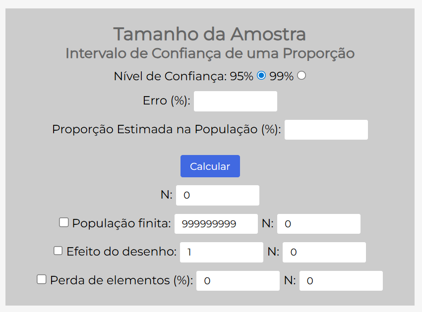

---
output:
  html_document: default
  pdf_document: default
---
# Introdução 

Ao longo de algum tempo ministrando aulas de estatística, concluí que estudar estatística com auxílio de recursos computacionais é bem mais eficaz.  Quero dizer, é mais fácil entender os conceitos teóricos, lidar com recursos visuais (gráficos) e, de fato, transformar o conteúdo estudado na disciplina em uma ferramenta para pesquisas científicas, quando se trata de analisar dados.

## 💥 Desconstruindo Mitos

Ministrando aulas para os cursos da área de **saúde**, **esporte** e **psicologia**, sempre ouvi dos discentes que "estatística é matemática", e sempre digo que **estatística é estatística!** 

É normal alguns discentes não assimilarem, em princípio, a importância da disciplina na grade do seu curso.  Alguns acham até que é um assunto que deveria ficar restrito aos cursos das exatas.  Assim, a primeira tarefa é sempre desconstruir essa ideia. 

### A Estatística é MULTIDISCIPLINAR

A estatística está em tudo na verdade... e para dizer uma coisa "bem chique":  **a estatística é a base da Inteligência Artificial**. 

Advinha quem está por trás: 

- 🤖 dos famosos algoritmos das redes sociais

- 🎬 das sugestões de filmes e músicas que aparecem no seu *streaming* favorito

- 🔍 do ranqueamento de busca realizado por meio do *Google*?

- 💬 dos agentes de IA

---

## 🔧 Aplicações Práticas da Estatística

E sendo um pouco mais "acadêmica", dentro do nosso propósito:

### 🏃 No Esporte

Qualquer competição ou treinamento esportivo está recheado de estatística.  Como medir o desempenho de um time ou atleta? 

**Exemplo:**

> **Uso de suplementos alimentares e acompanhamento nutricional por frequentadores de academias**  
> 📄 <https://www.rbne.com.br/index.php/rbne/article/view/2440>

### 🏥 Na Medicina

Estudos epidemiológicos e, claro, da medicina baseada em evidências têm o suporte da estatística. 

**Exemplo:**

> **Síndrome Coronariana Aguda no Brasil: Registro dos Fatores Predisponentes e Perfil Populacional em um Instituto Cardiológico Público de Referência Nacional**  
> 📄 <https://www.scielo.br/j/abc/a/gPrBrwLpGxWgzjFCgLkJJLN/?format=html&lang=pt>

### 🧠 Na Psicologia

Na psicologia, a estatística é a ferramenta utilizada na psicometria. 

**Exemplo:**

> **Avaliação do sofrimento psíquico em estudantes do internato médico**  
> 📄 <https://acervomais.com.br/index.php/cientifico/article/view/21295>

---

## 💡 Desafio para Você

Basta realizar uma busca com os termos **"estatística"** + **um campo do seu curso que você se interessa**, que você encontrará um artigo científico. 

> **E se você não encontrar, comece a escrever sobre o tema! ** 🚀

---

### 📚 Periódicos Recomendados por Área

Para facilitar sua pesquisa, aqui estão alguns periódicos científicos organizados por área de conhecimento:

#### 🏃‍♂️ Ciência dos Esportes

| Periódico | Link |
|-----------|------|
| **RBFF** - Revista Brasileira de Futsal e Futebol | <http://www.rbff.com.br> |
| **RBME** - Revista Brasileira de Medicina do Esporte | <https://www.scielo.br/j/rbme> |
| **RBPE** - Revista Brasileira de Psicologia do Esporte | <http://pepsic.bvsalud.org> |

#### 🏥 Medicina e Saúde

| Periódico | Link |
|-----------|------|
| **RBC** - Revista Brasileira de Cancerologia | <https://rbc.inca.gov.br/index.php/revista> |
| **RBCMS** - Revista Brasileira de Ciências Médicas e da Saúde | <http://www.rbcms.com.br> |
| **ABRASCO** - Revista da Associação Brasileira de Saúde Coletiva | <https://cienciaesaudecoletiva.com.br> |

#### 🧠 Psicologia

| Periódico | Link |
|-----------|------|
| **Psicologia Argumento** | <https://periodicos.pucpr.br/psicologiaargumento> |
| **Estudos de Psicologia** (Campinas) | <https://www.scielo.br/j/estpsi/> |
| **Psicologia em Foco** | <https://revistas.fw.uri.br/index.php/psicologiaemfoco> |

---

### 🔎 Outras Ferramentas de Busca Acadêmica

Expanda sua pesquisa utilizando estas bases de dados e ferramentas especializadas:

- 📚 **[Mendeley](https://www.mendeley.com)** - Gerenciador de referências e descoberta de artigos científicos
- 🌎 **[SciELO](https://scielo.org)** - Scientific Electronic Library Online (foco em América Latina)
- 🔍 **[Google Scholar](https://scholar.google.com)** - Busca abrangente em literatura acadêmica
- 🏥 **[PubMed](https://pubmed.ncbi.nlm.nih.gov)** - Especializada em ciências biomédicas e da saúde

**💡 Dica de busca avançada:**
- Use `"aspas"` para termos exatos: `"análise estatística"`
- Combine com operadores:  `estatística AND psicologia`
- Filtre por período: adicione ano nas opções de busca

---

## 📊 Tipos de Análise Estatística

Quando olhamos os artigos acima, podemos ver que todos eles têm resultados **descritivos** e **inferenciais**: 

| Tipo | Descrição |
|------|-----------|
| **📈 Estatística Descritiva** | Descrever os dados amostrados para uma dada análise |
| **🔬 Estatística Inferencial** | Inferir - tirar conclusões a partir dos dados amostrados |

Discutiremos sobre ambas ao longo do curso! 

---

## 🎯 Conclusão

A estatística não é apenas matemática abstrata - é uma **ferramenta essencial** para transformar dados em conhecimento, independentemente da sua área de atuação! 

---

<center>

```{=html}
<script src="https://unpkg.com/@lottiefiles/dotlottie-wc@0.8.11/dist/dotlottie-wc.js" type="module"></script>
```

<dotlottie-wc src="https://lottie.host/74a90344-947f-476a-a118-7d9d5c6cd810/z76UXstist.lottie" style="width: 300px;height: 300px" autoplay loop></dotlottie-wc>
</center>

## 📋 Atividade 1: Explorando a Estatística na Pesquisa Científica

A metodologia científica é composta por etapas estruturadas que guiam o processo de investigação.   **A estatística está presente em várias dessas etapas**, desde o planejamento da coleta de dados até a análise e interpretação dos resultados.  Nesta atividade, você irá identificar como a estatística é aplicada em um estudo real da sua área de interesse.

---

### 🎯 Objetivo da Atividade

**Busque um artigo científico do campo de seu interesse que utiliza a estatística.**

Ao analisar o artigo, você irá mapear as principais etapas da metodologia científica e identificar onde e como a estatística foi aplicada. 

---

### 📝 Roteiro de Análise

 **1️⃣ PROBLEMA DE PESQUISA - Qual é o principal objetivo da pesquisa?**

> *Na metodologia científica, toda pesquisa começa com uma pergunta ou problema a ser investigado.*

**Reflita:**

- ❓ Qual é a questão central que a pesquisa busca responder?

- 🎯 Os autores apresentam claramente os objetivos do estudo? 

- 📊 O que se espera alcançar com os resultados? 

- 💡 Existem hipóteses formuladas?  Se sim, quais são?

---

 **2️⃣ METODOLOGIA - Como a pesquisa foi conduzida?**

> *A metodologia descreve o "caminho" percorrido pelo pesquisador.   É aqui que a estatística começa a aparecer no planejamento da pesquisa.*

**Analise os seguintes aspectos:**

| Aspecto | O que observar no artigo |
|---------|--------------------------|
| **🔬 Tipo de pesquisa** | A pesquisa é qualitativa, quantitativa ou mista? |
| **👥 População e Amostra** | Qual é a população-alvo? Quantos participantes compõem a amostra? |
| **🧮 Cálculo Amostral** | Os autores justificam o tamanho da amostra? Foi realizado cálculo amostral? |
| **📊 Técnica de Amostragem** | Como os participantes foram selecionados? (aleatória, por conveniência, estratificada, etc.) |
| **📋 Instrumentos de Coleta** | Quais instrumentos foram utilizados? (questionários, testes, medições, observações, etc.) |
| **📈 Análise Estatística** | Quais técnicas estatísticas foram aplicadas para analisar os dados? |
| **💻 Software Utilizado** | Qual programa foi usado para as análises? (SPSS, R, Python, Excel, etc.) |

**💭 Reflita:** *Por que essas escolhas metodológicas são importantes para a validade da pesquisa?*

---

 **3️⃣ RESULTADOS - O que é apresentado por meio de tabelas ou gráficos?**

> *A estatística descritiva organiza e resume os dados coletados, facilitando a visualização e interpretação dos resultados.*

**Observe:**

- 📊 Quais informações estão sendo representadas visualmente?

- ✅ Os gráficos e tabelas são claros e bem organizados? 

- 🔍 Que tipo de gráficos foram utilizados?  (barras, dispersão, boxplot, histograma, pizza, etc.)

- 📉 Os dados apresentados respondem aos objetivos da pesquisa? 

- 💬 Como os autores interpretam os resultados a partir dessas representações?

**💡 Dica:** *Preste atenção nas legendas, títulos e notas de rodapé das tabelas e gráficos - eles contêm informações importantes! *

---

**4️⃣ GLOSSÁRIO ESTATÍSTICO - Termos encontrados no artigo**

> *Familiarizar-se com a terminologia estatística é essencial para compreender e aplicar essas técnicas em suas próprias pesquisas.*

**Crie uma lista dos termos e conceitos estatísticos mencionados no artigo.**

**Exemplos do que você pode encontrar:**

| Categoria | Exemplos de Termos |
|-----------|-------------------|
| **📏 Medidas Descritivas** | Média, mediana, moda, desvio-padrão, variância, percentis |
| **📊 Tipos de Variáveis** | Variável dependente, independente, qualitativa, quantitativa |
| **🔬 Testes de Hipótese** | Teste t, ANOVA, qui-quadrado, Mann-Whitney, Kruskal-Wallis |
| **📈 Análises de Relação** | Correlação de Pearson, Spearman, regressão linear, regressão logística |
| **🎯 Conceitos Inferenciais** | Intervalo de confiança, nível de significância, p-valor, poder do teste, tamanho do efeito |
| **📐 Outros** | Normalidade, homocedasticidade, distribuição, outliers |

**✍️ Para cada termo identificado:**

- Anote a página onde aparece

- Tente definir com suas próprias palavras

- Pesquise o significado caso não conheça

---

### 🎓 Reflexão Final

Após completar esta análise, você será capaz de: 

✅ Reconhecer como a estatística se integra às etapas da metodologia científica  
✅ Identificar as principais técnicas estatísticas aplicadas na sua área  
✅ Compreender a importância do planejamento estatístico para a qualidade da pesquisa  
✅ Desenvolver um olhar crítico sobre a apresentação e interpretação de dados  

**💬 Questão Bônus:** *Com base no artigo analisado, que decisões metodológicas você faria diferente se fosse conduzir uma pesquisa semelhante?*

---


# Conceitos Fundamentais

Antes de mergulharmos nas análises estatísticas, é fundamental compreender dois conceitos essenciais que formam a base de qualquer estudo quantitativo:  **Estatística Descritiva** e **Estatística Inferencial**. 

Pense assim: a Estatística Descritiva **organiza e resume** os dados que você coletou, enquanto a Estatística Inferencial **tira conclusões** sobre uma população maior a partir da amostra. 

Vamos entender cada uma com exemplos práticos! 

---

## 📊 Estatística Descritiva

> **O que é? **  
> A Estatística Descritiva organiza, resume e apresenta dados de forma clara e compreensível, usando tabelas, gráficos e medidas numéricas.

### 💭 Exemplo 1: Saúde Mental dos Estudantes

Imagine que você deseja avaliar a **saúde mental dos estudantes da UFTM**, coletando informações sobre: 

- Níveis de **estresse**

- Níveis de **ansiedade**  

- Presença de **depressão**

- **Bem-estar geral**

> **Como esses dados são coletados? **  
> Essas informações são obtidas por meio de **instrumentos psicométricos** - questionários e escalas científicas padronizadas que medem características psicológicas de forma objetiva e confiável.  Esses instrumentos passam por rigorosos processos de validação estatística para garantir que realmente medem o que se propõem a medir.

**Exemplos de instrumentos que podem ser aplicados:**

| Aspecto Avaliado | Instrumento | Descrição |
|------------------|-------------|-----------|
| **Estresse** | **PSS-10** (Escala de Estresse Percebido) | Avalia o quanto situações da vida são percebidas como estressantes |
| **Ansiedade** | **BAI** (Inventário de Ansiedade de Beck) ou **GAD-7** | Medem sintomas de ansiedade em diferentes intensidades |
| **Depressão** | **BDI-II** (Inventário de Depressão de Beck) ou **PHQ-9** | Avaliam presença e gravidade de sintomas depressivos |
| **Bem-estar** | **Escala de Bem-Estar Subjetivo** ou **WHO-5** | Medem qualidade de vida e satisfação geral |

💡 **Importante:** Embora muitos desses instrumentos possam ser aplicados por pesquisadores de diferentes áreas (não apenas psicólogos), a **interpretação clínica** e o **diagnóstico** devem ser realizados exclusivamente por profissionais habilitados em psicologia ou psiquiatria. 


#### 🔧 O que a Estatística Descritiva faz com esses dados? 

| Ação | Como ajuda?  | Exemplo prático |
|------|-------------|-----------------|
| **1. Organizar dados** | Cria tabelas sistemáticas | Agrupar respostas por curso, período, faixa etária |
| **2. Calcular médias** | Resume os dados em um número | Média de estresse = 6,5 (escala 0-10) |
| **3. Criar gráficos** | Facilita a visualização | Gráfico de barras mostrando % de alunos com ansiedade baixa/média/alta |
| **4. Medir variabilidade** | Mostra o quanto os dados variam | Desvio padrão alto = muita diferença entre os alunos |
| **5. Identificar padrões** | Encontra relações entre variáveis | Alunos que dormem menos têm mais estresse?  |

#### 💡 Por que isso é importante? 

Essas análises criam um **panorama claro** da saúde mental dos estudantes, fornecendo base para:

- ✅ Programas de apoio psicológico

- ✅ Políticas institucionais de bem-estar

- ✅ Identificação de grupos que precisam de mais atenção

---

### 🏃‍♂️ Exemplo 2: Prática de Atividades Físicas

Agora, suponha que você quer entender **como os estudantes se exercitam**. 

#### 📋 Dados que você pode coletar:

1. **Frequência semanal**
   - Quantos alunos praticam atividades **mais de 3x por semana**?
   - Resultado: 45% dos estudantes

2. **Tipos de atividade**
   - Use um **gráfico ou tabela** para mostrar a distribuição: 
     - 🏃 Corrida: 30%
     - 💪 Musculação: 25%
     - ⚽ Futebol: 20%
     - 💃 Dança: 15%
     - 🧘 Yoga: 10%

3. **Intensidade da prática**
   - Crie categorias:  leve, moderada, intensa
   - Use um **gráfico ou tabela** para comparar

#### 🎯 Aplicação prática:

Com essas informações, a universidade pode:

- ✅ Criar campanhas direcionadas

- ✅ Oferecer novas modalidades esportivas

- ✅ Melhorar a infraestrutura de acordo com as preferências

---

## 🔬 Estatística Inferencial

> **O que é?**  
> A Estatística Inferencial usa dados de uma **amostra** (grupo menor) para tirar conclusões sobre a **população inteira**, com margem de confiança conhecida.

### 💭 Exemplo 1: Saúde Mental dos Estudantes

Você pesquisou **200 estudantes** (amostra) e quer saber sobre **todos os 6.900 estudantes** da UFTM (população).

#### 🎯 O que a Estatística Inferencial permite fazer?

**Situação 1: Estimar a média populacional**

| Da amostra...  | Para a população... |
|---------------|---------------------|
| Média de ansiedade = 7,0 (escala 0-10) | Estimativa:  ansiedade média de todos os estudantes está entre **6,5 e 7,5** |
| Baseado em 200 alunos | Com **95% de confiança** |

**Situação 2: Comparar grupos diferentes**

Pergunta: *"Estudantes de Medicina têm mais ansiedade que estudantes de Engenharia?"*


📊 **Teste de Hipótese:**

- Média Medicina: 7,8

- Média Engenharia: 6,2

- Diferença: 1,6 pontos

- Resultado do teste:  Diferença é estatisticamente significativa (p < 0,05)

- Conclusão: Sim, estudantes de Medicina apresentam níveis significativamente maiores de ansiedade


#### ✅ Vantagem: 

Você **não precisa pesquisar todos os 6.900 alunos** - com uma amostra bem planejada, pode fazer afirmações confiáveis sobre toda a universidade! 

---

### 🏃‍♂️ Exemplo 2: Prática de Atividades Físicas

Você pesquisou **300 estudantes** de diferentes cursos. 

#### 🎯 Perguntas que a Estatística Inferencial responde:

**1. Qual a proporção real de estudantes ativos? **

- 📊 Na amostra:  60% praticam exercícios regularmente

- 📈 Estimativa para toda UFTM: entre 55% e 65%

- 🎯 Confiança: 95%


**2. Educação Física vs. Medicina: quem se exercita mais?**

- 🎓 Educação Física: 85% ativos

- 🏥 Medicina: 42% ativos

- 📊 Teste estatístico: Diferença é significativa

- 💡 Conclusão: Estudantes de Educação Física são mais ativos fisicamente


---

## 🎲 Conexão com a Probabilidade

A **Teoria de Probabilidade** é a ponte entre Estatística Descritiva e Inferencial! 

### 🔗 Como funciona? 

```
Estatística Descritiva
        ↓
   (Probabilidade)
        ↓
Estatística Inferencial
```

**Exemplo prático:**

Com base nos dados descritivos, podemos calcular a **probabilidade** de: 

- Um estudante desenvolver sintomas de estresse durante o semestre

- Um aluno que dorme menos de 6h ter ansiedade alta

- Estudantes que praticam exercícios terem melhor bem-estar mental

Isso permite **prever** e **prevenir**, não apenas descrever!

---

## 👥 População vs. Amostra

Entender essa diferença é **FUNDAMENTAL** para qualquer pesquisa!

### 🌍 População

> É o **conjunto completo** de todos os indivíduos que você quer estudar.

**Exemplo UFTM:**

- 👨‍🎓 **6.900 estudantes** (dado:  DRCA, dezembro/2024 - Incluindo:  graduação, cursos técnicos e pós-graduação)

### 🎯 Amostra

> É um **grupo menor e representativo** selecionado da população.

**Exemplo UFTM:**

- 👥 **364 estudantes** selecionados aleatoriamente

- Representa toda a população com **95% de confiança**

- Erro máximo de **5%**

---

### 📐 Exemplo Aplicado Completo

Vamos juntar tudo em um exemplo real:

#### 🎯 Objetivo da Pesquisa
Avaliar o **bem-estar emocional** dos estudantes da UFTM. 

#### 📊 Etapa 1: Coleta de Dados (Estatística Descritiva)
- **População:** 6.900 estudantes
- **Amostra:** 364 estudantes (seleção aleatória)
- **Instrumento:** Questionário padronizado (escala 0-10)

#### 📈 Etapa 2: Análise Descritiva

Resultados da amostra (364 estudantes):

- Média de bem-estar:  6,8

- Desvio padrão: 1,5

- Mínimo: 2,0

- Máximo: 10,0


#### 🔬 Etapa 3: Inferência Estatística

Generalização para TODA a UFTM (6.900 estudantes):

-✅ Média estimada: 6,8

-📏 Intervalo de confiança (IC95%): 6,46 a 7,14

-⚠️ Margem de erro: ±5%

-🎯 **Interpretação:** 
Temos 95% de confiança de que o bem-estar emocional médio de TODOS os estudantes da UFTM está entre 6,46 e 7,14.


#### 💡 O que é IC95%?

Se você repetisse essa pesquisa **100 vezes** com diferentes amostras aleatórias de 364 estudantes: 

- ✅ Em **95 vezes**, a média estaria entre 6,46 e 7,14

- ❌ Em **5 vezes**, poderia estar fora desse intervalo (erro amostral)

---

### ✨ Resumo Visual

```
POPULAÇÃO (6.900 estudantes)
        ↓
   Seleção aleatória
        ↓
AMOSTRA (364 estudantes)
        ↓
   Estatística Descritiva
   (organizar, calcular, visualizar)
        ↓
   Estatística Inferencial
   (estimar, comparar, concluir)
        ↓
CONCLUSÕES sobre a POPULAÇÃO INTEIRA
   (com margem de erro conhecida)
```

---

## 🎓 Recapitulando

| Conceito | O que faz?  | Quando usar? |
|----------|------------|--------------|
| **Estatística Descritiva** | Organiza e resume os dados | Quando você quer **descrever** o que coletou |
| **Estatística Inferencial** | Tira conclusões sobre a população | Quando você quer **generalizar** da amostra para todos |
| **População** | Todos que você quer estudar | Define o **alcance** da sua pesquisa |
| **Amostra** | Grupo menor representativo | Torna a pesquisa **viável** |
| **Probabilidade** | Calcula chances e incertezas | **Conecta** descritiva e inferencial |

---


<center>

```{=html}
<script src="https://unpkg.com/@lottiefiles/dotlottie-wc@0.8.11/dist/dotlottie-wc.js" type="module"></script>
```

<dotlottie-wc src="https://lottie.host/74a90344-947f-476a-a118-7d9d5c6cd810/z76UXstist.lottie" style="width: 300px;height: 300px" autoplay loop></dotlottie-wc>
</center>

**💭 Agora reflita:** *Em uma pesquisa sobre hábitos alimentares dos estudantes, como você aplicaria esses conceitos?*


# Tamanho da Amostra

## 🎯 Por Que Calcular o Tamanho da Amostra?

O cálculo do **tamanho da amostra** é uma etapa **fundamental** no planejamento de qualquer pesquisa científica. Ele determina quantos participantes precisamos incluir no estudo para que os resultados sejam:

- ✅ **Representativos** da população estudada
- ✅ **Estatisticamente confiáveis** 
- ✅ **Precisos** o suficiente para responder à pergunta de pesquisa
- ✅ **Viáveis** em termos de tempo e recursos

### 💡 O Que Acontece se Erramos no Tamanho da Amostra?

| Amostra Muito Pequena | Amostra Muito Grande |
|----------------------|---------------------|
| ❌ Resultados não confiáveis | ⚠️ Desperdício de recursos |
| ❌ Conclusões equivocadas | ⚠️ Tempo excessivo de coleta |
| ❌ Baixo poder estatístico | ⚠️ Custos desnecessários |
| ❌ Pesquisa pode ser invalidada | ⚠️ Questões éticas (expor mais pessoas que o necessário) |

> **Em resumo:** Calcular corretamente o tamanho da amostra garante que sua pesquisa seja **cientificamente válida** e **eticamente responsável**.

---

## 🔢 Tipos de Cálculo Amostral Segundo o Objetivo Estatístico

O método de cálculo amostral varia conforme o que você deseja estimar ou testar:

| Objetivo da Pesquisa | Tipo de Cálculo | Quando Usar | Informações Necessárias |
|---------------------|----------------|-------------|------------------------|
| **Estimar uma proporção** | Cálculo para proporção | Percentual de alunos com ansiedade | Margem de erro, nível de confiança, proporção estimada |
| **Estimar uma média** | Cálculo para média | Média de horas de estudo por dia | Desvio padrão, margem de erro, nível de confiança |
| **Comparar dois grupos** | Teste t ou ANOVA | Comparar estresse entre cursos | Tamanho do efeito, poder estatístico, nível de significância |
| **Testar correlação** | Cálculo para correlação | Relação entre sono e desempenho | Tamanho do efeito esperado, poder estatístico |
| **Estudos experimentais** | Ensaio clínico/experimento | Efeito de uma intervenção | Grupos controle/experimental, poder, efeito esperado |

💭 **Importante:** Cada tipo de análise estatística requer uma fórmula específica para cálculo amostral!

---

## 📊 Cálculo Para Estimar uma Proporção: Passo a Passo

Quando o **objetivo é estimar uma proporção** (por exemplo, "Qual percentual de estudantes tem ansiedade?"), precisamos de algumas informações:

### 🔑 Informações Necessárias

| Parâmetro | O que é? | Exemplo UFTM |
|-----------|----------|--------------|
| **1. Tamanho da População (N)** | Total de indivíduos que você quer estudar | 6.900 estudantes |
| **2. Margem de Erro (E)** | Quanto você aceita "errar" na estimativa | 5% (0,05) |
| **3. Nível de Confiança** | Quão confiante você quer estar | 95% (padrão) |
| **4. Proporção Estimada (p)** | Estimativa inicial do fenômeno | 50% (0,5) = pior cenário |

---

### 📐 A Fórmula

Para população **infinita** ou **muito grande**:

$$
n = \frac{Z^2 \cdot p \cdot (1 - p)}{E^2}
$$

**Onde:**

- $n$ = tamanho da amostra necessário

- $Z$ = valor da distribuição normal padrão

  - Para 95% de confiança: **Z = 1,96**

  - Para 99% de confiança: **Z = 2,58**

- $p$ = proporção estimada (use 0,5 quando não souber)

- $E$ = margem de erro (em decimal: 5% = 0,05)

---

### 🧮 Exemplo Prático: Pesquisa na UFTM

**Situação:** Queremos estimar a proporção de estudantes com sintomas de ansiedade.

**Dados:**

- População: **6.900 estudantes**

- Margem de erro: **5%** (queremos estar "corretos" com ±5%)

- Nível de confiança: **95%**

- Proporção estimada: **50%** (não sabemos, então usamos o pior cenário)

**Cálculo:**

$$
n = \frac{1,96^2 \cdot 0,5 \cdot (1 - 0,5)}{0,05^2}
$$

$$
n = \frac{3,8416 \cdot 0,5 \cdot 0,5}{0,0025}
$$

$$
n = \frac{0,9604}{0,0025} = 384,16
$$

**Resultado:** Precisamos de **384 estudantes** na amostra.

---

### 🔄 Ajuste Para População Finita

Quando a população é "pequena" (geralmente N < 10.000), aplicamos uma **correção**:

$$
n_{ajustado} = \frac{n}{1 + \frac{n-1}{N}}
$$

**Para nosso exemplo:**

$$
n_{ajustado} = \frac{384}{1 + \frac{384-1}{6900}} = \frac{384}{1 + 0,0555} = \frac{384}{1,0555} = 364
$$

**Resultado final:** Com a correção, precisamos de **364 estudantes**.

---

### 💭 Interpretando os Resultados

```
Com uma amostra de 364 estudantes:

✅ Temos 95% de confiança nos resultados
✅ Nossa margem de erro é de ±5%
✅ Os resultados representam bem toda a população (6.900 alunos)

Exemplo prático:
Se 60% da amostra relata ansiedade, podemos dizer que:
"Entre 55% e 65% de TODOS os estudantes da UFTM têm ansiedade"
(com 95% de confiança)
```

---

## ⚠️ Atenção: Diferentes Objetivos = Diferentes Cálculos!

Até agora, calculamos amostra apenas para **estimar proporção** (exemplo: "Qual % de alunos tem ansiedade?").

Mas o cálculo **muda conforme seu objetivo**. Veja:

---

### 🎯 Tipos de Cálculo Amostral

| Seu Objetivo | Quando Usar | Exemplo Prático | O Que Muda no Cálculo |
|--------------|-------------|-----------------|----------------------|
| **Estimar PROPORÇÃO** | Quer saber **quantos %** | "Qual % pratica exercícios?" | Usa margem de erro e proporção estimada |
| **Estimar MÉDIA** | Quer saber **valor médio** | "Quantas horas de sono em média?" | Precisa do **desvio padrão** (variabilidade) |
| **Comparar GRUPOS** | Quer ver se há **diferença** | "Medicina tem mais estresse que Ed. Física?" | Precisa do **tamanho do efeito** esperado |
| **Testar CORRELAÇÃO** | Quer ver se há **relação** | "Sono afeta o desempenho?" | Precisa da **força da correlação** esperada |

---

## 🤔 E Quando Tenho VÁRIOS Objetivos?

### Regra Simples:

> **Calcule CADA objetivo separadamente e use a MAIOR amostra!**

### Exemplo Prático:

Sua pesquisa tem 4 objetivos:

```
✓ Estimar % com ansiedade        → precisa de 364 alunos
✓ Calcular média de bem-estar    → precisa de 280 alunos  
✓ Comparar 3 cursos              → precisa de 120 alunos
✓ Testar correlação sono×stress  → precisa de 85 alunos

DECISÃO: Use 364 alunos (o maior número)
```

**Por quê?** Porque 364 alunos são suficientes para **todos** os objetivos!

---

### 💡 Dica Extra: Ajuste para Perdas

Nem todos vão participar ou responder. Adicione uma margem de segurança:

```
Amostra final = Amostra calculada / (1 - % de perda esperada)

Exemplo:
364 / (1 - 0,20) = 364 / 0,80 = 455 alunos

Alcance 455 amostras para garantir 364 respostas válidas
```

---


## 🛠️ Ferramentas Para Cálculo de Amostra

Nosso foco aqui **não é fazer cálculos manualmente**, mas sim **compreender os conceitos** e saber **onde buscar ajuda**. 

Hoje existem ferramentas gratuitas que fazem todo o trabalho para você!

---

### 💻 Calculadoras Online (Gratuitas)

| Ferramenta | Melhor Para | Vantagens | Link |
|------------|-------------|-----------|------|
| **Calculadora USP Bauru** | Proporções e médias simples | ✅ Rápida e intuitiva<br>✅ Em português<br>✅ Não precisa instalar | [Acessar](http://estatistica.bauru.usp.br/calculoamostral/) |
| **OpenEpi** | Estudos em saúde e epidemiologia | ✅ Diversos tipos de cálculo<br>✅ Estudos caso-controle, coorte<br>✅ Interface simples | [Acessar](https://www.openepi.com/SampleSize/SSMean.htm) |
| **G\*Power** | Comparações e testes complexos | ✅ Muito completo<br>✅ Padrão em pesquisas<br>✅ Calcula poder estatístico | [Download](https://www.gpower.hhu.de/en.html) |

---

### 📊 No Software R (Para Quem Já Usa)

**A ideia aqui é simples:** em vez de calcular manualmente usando fórmulas matemáticas, usamos **funções prontas** que fazem tudo para nós!

---

#### **Pacote `samplingbook`** - Cálculo de Amostra para Proporção

```{r echo=TRUE, message=FALSE, warning=FALSE}
# Instalar o pacote (se ainda não tiver)
# install.packages("samplingbook")

# Carregar
library(samplingbook)

# Calcular amostra para proporção (considerando a população infinita)
sample.size.prop(
  e = 0.05,          # Margem de erro (5%)
  P = 0.5,           # Proporção estimada (50%)
  N = Inf,           # Tamanho da população: infinita
  level = 0.95       # Nível de confiança (95%)
  )

# Calcular amostra para proporção (considerando a população finita)
sample.size.prop(
  e = 0.05, 
  P = 0.5, 
  N = 6900,           # Tamanho da população: finita 
  level = 0.95
  )

```

**Pronto!** Você precisa de **364 estudantes**

> (Sample = amostra; size = tamanho; needed = necessário → tamanho de amostra necessário)

---

#### **Alternativa: Fórmula Direto no R**

```{r echo=TRUE}
# Cálculo direto
N <- 6900
Z <- 1.96
p <- 0.5
E <- 0.05

n <- (Z^2 * p * (1-p)) / E^2
n_final <- ceiling(n / (1 + (n-1) / N))
n_final
```

---

#### ✅ **Vantagens**

- ⚡ Rápido e sem erros
- 📝 Reprodutível (qualquer um pode rodar)
- 🔄 Fácil testar diferentes cenários

---

### 🤖 Usando Inteligência Artificial

Você também pode pedir ajuda a **ChatGPT**, **Copilot** ou outras IAs!

**💬 Exemplo de prompt:**

```
"Preciso calcular o tamanho da amostra para uma pesquisa 
com estudantes universitários (população de 6.900). 
Quero estimar a proporção de alunos com ansiedade, 
com 95% de confiança e margem de erro de 5%. 
Como faço e qual o resultado?"
```

**⚠️ Importante:** Sempre **valide** os resultados da IA usando uma das calculadoras acima!

---

### 🎯 Qual Ferramenta Escolher?

```
Você é iniciante?
    → Calculadora USP Bauru

Pesquisa na área da saúde?
    → OpenEpi

Precisa comparar grupos ou correlações?
    → G*Power

Já usa R para análises?
    → Pacote pwr, samplingbook

Quer entender o conceito rapidamente?
    → IA + validação em calculadora
```

---

### 💡 Dica Prática

**Não sabe qual usar?** Faça o seguinte:

1️⃣ Use uma **IA** para entender o cálculo  
2️⃣ Valide em uma **calculadora online**  
3️⃣ Documente qual ferramenta usou no seu projeto  

**Exemplo de como citar:**

> *"O tamanho amostral foi calculado utilizando a Calculadora Amostral da USP Bauru (http://estatistica.bauru.usp.br/calculoamostral/), considerando população de 6.900 estudantes, margem de erro de 5% e nível de confiança de 95%."*

---

## 🎓 Conclusão

O cálculo do **tamanho da amostra** é essencial para garantir pesquisas **precisas e confiáveis**. 

A boa notícia? **Você não precisa ser expert em matemática!** 

Com as ferramentas certas, esse processo se torna simples e rápido, permitindo que você foque no que realmente importa: **planejar e executar uma pesquisa de qualidade**.

---

<center>

```{=html}
<script src="https://unpkg.com/@lottiefiles/dotlottie-wc@0.8.11/dist/dotlottie-wc.js" type="module"></script>
```

<dotlottie-wc src="https://lottie.host/74a90344-947f-476a-a118-7d9d5c6cd810/z76UXstist.lottie" style="width: 300px;height: 300px" autoplay loop></dotlottie-wc>
</center>


## 📝 Atividade 2: Análise Crítica do Artigo

**Com base no artigo que você buscou na Atividade 1, responda:**

---

### 🔍 Análise Metodológica

**1. Os autores discutem o cálculo do tamanho da amostra?**

Investigue:

- ✅ Há explicação sobre **como** o tamanho foi determinado?

- ✅ Mencionam **fórmula**, **software** ou **ferramenta** utilizada?

- ✅ Apresentam os **parâmetros** (margem de erro, confiança)?

💭 *Se não houver essa informação, isso é uma limitação do estudo?*

---

**2. A população da pesquisa foi claramente definida?**

Verifique:

- 👥 Quem compõe a população-alvo?

- 📋 Há critérios de **inclusão e exclusão**?

- 🌍 O contexto está bem delimitado (local, período)?

💭 *Uma população mal definida compromete a validade dos resultados.*

---

**3. O tamanho da amostra utilizado foi adequado?**

Avalie criticamente:

- ✅ A amostra parece **grande o suficiente**?

- ⚖️ É **representativa** da população?

- ⚠️ Os autores discutem **limitações** relacionadas ao tamanho da amostra?

---

### 🧮 Cálculo Prático

**4. Refaça o cálculo do tamanho de amostra**

Use uma das ferramentas indicadas e preencha:

| Item | Informação do Artigo | Seu Cálculo |
|------|---------------------|-------------|
| Tamanho da população (N) | | |
| Margem de erro | | |
| Nível de confiança | | |
| Tipo de cálculo necessário | | |
| **Tamanho no artigo** | | |
| **Seu resultado** | | |
| **Coincidem?** | | ☐ Sim  ☐ Não |

💭 *Se não coincidem, quais podem ser as razões?*

---

### ⚖️ Aspectos Éticos

**5. A pesquisa foi aprovada pelo Comitê de Ética?**

Procure no artigo:

- ✅ Há menção à aprovação do **CEP**?

- 📋 O **número do parecer** está informado?

- 📝 Há referência ao **TCLE** (Termo de Consentimento)?

---

**6. Qual a importância de submeter ao Comitê de Ética?**

Reflita sobre:

| Aspecto | Por Que É Importante? |
|---------|----------------------|
| **Proteção dos participantes** | Garante que os direitos sejam respeitados |
| **Consentimento informado** | Participação voluntária e esclarecida |
| **Confidencialidade** | Proteção dos dados pessoais |
| **Riscos e benefícios** | Avaliação ética da relação custo-benefício |
| **Integridade científica** | Credibilidade da pesquisa |

**⚠️ Consequências de NÃO submeter:**

- Violação de direitos dos participantes

- Infração às Resoluções CNS 466/2012 e 510/2016

- Artigo pode ser rejeitado ou retratado

- Sanções ao pesquisador

---

### 📚 Para Saber Mais

> **Conheça o Comitê de Ética em Pesquisa (CEP) da UFTM**
> 
> 🔗 <https://www.uftm.edu.br/comitesecomissoes/cep>

 **Você encontrará:**

 - Como submeter projetos

 - Documentos necessários

 - Prazos e tramitação

 - Regulamentações vigentes

---

**💬 Questão bônus:** *Se você fosse revisor deste artigo, aprovaria a metodologia amostral? Justifique.*

---


## 🧮 Exercício Prático: Calculadora USP Bauru

### 🎯 Situação-Problema

Você é pesquisador(a) e quer investigar a **adesão ao uso de equipamentos de proteção individual (EPIs)** entre profissionais de enfermagem de um hospital universitário.

**Dados da instituição:**

- **População:** 450 profissionais de enfermagem (enfermeiros, técnicos e auxiliares)

- **Estimativa inicial:** Estudos semelhantes mostram que cerca de **70%** dos profissionais utilizam EPIs corretamente

- **Parâmetros desejados:** 95% de confiança e margem de erro de 5%

**Pergunta:** Quantos profissionais você precisa incluir na sua amostra?

---

### 📝 Passo a Passo na Calculadora

**1. Acesse a calculadora:**

- 🔗 http://estatistica.bauru.usp.br/calculoamostral/

- Clique em **"Cálculos"** no menu

- Selecione **"1 - Intervalo de Confiança de uma Proporção"**

**2. Preencha os campos conforme a imagem:**

<center>

</center>

| Campo | O que colocar | Valor |
|-------|---------------|:-------:|
| **Nível de Confiança** | Deixe marcado 95% | 🔵 95% |
| **Erro (%)** | Margem de erro desejada | **5** |
| **Proporção Estimada na População (%)** | Uso correto de EPIs | **70** |
| **☑️ População finita** | ✅ Marque a caixa | **450** |

**3. Clique em "Calcular"**

---

### ✅ Anote Seus Resultados

**a) Quantos profissionais você precisa pesquisar?**  

> **R:** _______ profissionais

**b) Qual a diferença do tamano da amostra considerando população finita e infinita?**  

> **R: sem considerar população finita (infinita):** _______ profissionais  

> **R: considerando população finita (450):** _______ profissionais  

> **Diferença:** _______ profissionais

**c) Volte às configurações originais. Agora aumente o nível de confiança para 99%. O que acontece?**  

> **R: com 99% de confiança:** _______ profissionais

**d) Retorne para 95% de confiança. Agora diminua a margem de erro para 3%. Qual o impacto?**  

> **R: com erro de 3%:** _______ profissionais

**e) Use o campo "Perda de elementos (%)" e considere 20% de perdas (profissionais de férias, licença, recusa). Quantas amostras você deveria ter?**  

>**R: ajustado para perdas:** _______ profissionais

---

### 🎓 Questões Para Reflexão

**1. Viabilidade prática:**  
Considerando que você precisa pesquisar _____ profissionais de um total de 450, isso representa aproximadamente _____% da população. Isso é viável? Por quê?

**2. Comparação:**  
Por que o tamanho da amostra é MENOR quando consideramos população finita (450) em vez de infinita?

**3. Decisões metodológicas:**  
Se você tivesse que escolher entre:

- Opção A: Erro 5% e confiança 95%

- Opção B: Erro 3% e confiança 95%

Qual você escolheria considerando tempo e recursos limitados? Justifique.

---

### 💡 Desafio Extra: Mude o Contexto

Agora imagine um cenário diferente:

**Situação:** Você não tem ideia de qual a proporção de profissionais que usam EPIs corretamente.

**O que fazer?** Quando não temos estimativa prévia, usamos **50%** (pior cenário, que gera maior amostra).

**Teste:** Volte à calculadora e mude a "Proporção Estimada" para **50%**. Recalcule.

**Qual o novo tamanho da amostra?** _______ profissionais

**Por que mudou?** _______________________________________

---

### ✅ Gabarito

<details>
<summary>👁️ Clique para ver as respostas</summary>

**População finita: 450 profissionais | Proporção: 70%**

**a) Amostra necessária (erro 5%, conf 95%):** 189 profissionais

**b) Comparação:**

- Sem população finita (infinita): 323 profissionais

- Com população finita (450): 189 profissionais

- Diferença: 134 profissionais (a correção reduz bastante!)

**c) Com 99% de confiança:** 

- pop. finita: 250 profissionais (aumenta!) 

- pop. infinita: 560 profissionais (nem faz sentido, por ser maior que a população)

**d) Com erro de 3%:** 

- pop. finita: 300 profissionais (pop finita)

- pop. infinita: 897 profissionais (nem faz sentido)

**e) Ajustado para 20% de perdas:** 

- pop. finita: 312 profissionais (250 ÷ 0,80)

**Desafio Extra (proporção 50%):** 

- pop. finita: 269 profissionais
- Mudou porque 50% é o cenário mais conservador (gera maior variabilidade)

🤔 Entendendo a Variabilidade

Pense assim: quando calculamos o tamanho da amostra para proporção, usamos a fórmula que inclui **p × (1 - p)**, onde **p** é a proporção estimada.

Veja o que acontece com diferentes proporções:

| Proporção (p) | Cálculo p × (1-p) | Variabilidade |
|---------------|-------------------|---------------|
| 10% (0,10) | 0,10 × 0,90 = **0,09** | Baixa |
| 30% (0,30) | 0,30 × 0,70 = **0,21** | Média |
| **50% (0,50)** | **0,50 × 0,50 = 0,25** | **MÁXIMA** ✅ |
| 70% (0,70) | 0,70 × 0,30 = **0,21** | Média |
| 90% (0,90) | 0,90 × 0,10 = **0,09** | Baixa |

**📊 Observe:** O valor **0,25 (quando p = 50%)** é o **MAIOR POSSÍVEL!**


**Reflexão 1:** 189/450 = 42% da população - é uma amostra grande, mas viável em um hospital.

**Reflexão 2:** A correção para população finita considera que estamos pegando uma fração significativa do total (42%), então precisamos de menos pessoas para ter precisão.

</details>

---

### 🎯 O Que Você Aprendeu

✅ Como usar a Calculadora USP Bauru passo a passo  
✅ A importância da correção para população finita  
✅ Como confiança e erro afetam o tamanho da amostra  
✅ Por que usar 50% quando não temos estimativa  
✅ Como ajustar para perdas esperadas  

**💬 Próximo passo:** Use esses conhecimentos para calcular a amostra da SUA pesquisa!

---


# Técnicas de Amostragem

Em pesquisas, uma das etapas mais importantes é o **cálculo amostral**, que determina quantos participantes serão necessários para garantir que os resultados sejam confiáveis. Depois, é preciso escolher uma **técnica de amostragem**, ou seja, como vamos selecionar as pessoas ou unidades que farão parte da pesquisa. Uma parte essencial disso é garantir que o processo de amostragem evite **viés**, que ocorre quando a amostra não representa adequadamente a população.

Existem várias técnicas de amostragem, cada uma com suas características, vantagens e desvantagens.

---

## Amostragem Aleatória Simples

Nesta técnica, cada elemento da população tem a mesma chance de ser selecionado.

> **Exemplo:** Se quisermos estudar a saúde mental dos estudantes da UFTM, podemos utilizar uma lista completa dos alunos e, de maneira aleatória (sorteio), selecionar os estudantes que farão parte da amostra, conforme o número determinado pelo cálculo amostral.

- **Vantagens:** É simples de aplicar e garante que todos têm a mesma chance de ser escolhidos, minimizando o viés.
- **Desvantagens:** Pode ser difícil de implementar se a população for muito grande ou se não tivermos uma lista completa de todos os membros da população. 
- **Como evitar viés:** Garantir que a lista de onde serão sorteados os participantes seja completa e atualizada.

---

## Amostragem Estratificada

Aqui, a população é dividida em grupos ou "estratos" (por exemplo, cursos ou faixas etárias) e, em seguida, amostras são selecionadas dentro de cada estrato.

> **Exemplo:** Suponha que queremos estudar a prática de atividade física entre os estudantes da UFTM. Podemos usar amostragem estratificada, dividindo os alunos por curso (estratos). Dentro de cada curso, selecionamos aleatoriamente um número proporcional de alunos, garantindo que todos os cursos estejam representados de forma adequada na amostra, refletindo a diversidade da universidade.

- **Vantagens:** Melhora a representatividade da amostra, especialmente quando diferentes subgrupos podem ter comportamentos ou características distintas. Ajuda a evitar viés ao garantir que todos os grupos da população estejam representados.
- **Desvantagens:** É necessário conhecer a população e seus estratos de antemão, o que pode ser difícil em alguns casos.
- **Como evitar viés:** A definição dos estratos deve ser precisa e relevante para a pesquisa.

---

## Amostragem Sistemática

Na amostragem sistemática, escolhemos um ponto de partida aleatório e, a partir daí, selecionamos unidades a intervalos regulares de "n" unidades.

> **Exemplo:** Se quisermos estudar a prática de atividade esportiva entre os estudantes da UFTM e temos uma lista de todos os alunos, podemos selecionar a cada 10º aluno da lista para participar da pesquisa.

- **Vantagens:** Fácil de implementar, especialmente em populações grandes, e garante uma distribuição uniforme dos selecionados ao longo da lista.
- **Desvantagens:** Pode ocorrer viés caso haja algum padrão na ordem da lista (por exemplo, se alunos de cursos específicos forem listados consecutivamente, a amostra pode não ser representativa).
- **Como evitar viés:** A lista de seleção deve ser aleatória e não seguir um padrão que favoreça um grupo específico.

---

## Amostragem por Conglomerados

Nessa técnica, a população é dividida em grupos (chamados de conglomerados) e, em seguida, seleciona-se aleatoriamente alguns desses grupos para fazer parte da amostra.

> **Exemplo:** Em vez de selecionar alunos aleatoriamente, selecionar alguns cursos específicos da UFTM e estudar todos os alunos desses cursos. Essa técnica é útil quando a população é muito grande e difícil de acessar como um todo.

- **Vantagens:** Mais fácil de administrar em populações grandes, quando não se tem acesso a uma lista completa de todos os indivíduos.
- **Desvantagens:** Pode não ser tão representativa, pois estamos escolhendo grupos inteiros e não indivíduos aleatórios.
- **Como evitar viés:** Os conglomerados escolhidos devem representar adequadamente a diversidade da população.

---

## Amostragem por Conveniência

Na **amostragem por conveniência**, os participantes são selecionados por serem mais fáceis de acessar pelo pesquisador.

> **Exemplo:** O uso de formulários online, como o Google Forms, é uma forma comum de amostragem por conveniência. O pesquisador compartilha o formulário em redes sociais, grupos de WhatsApp ou por e-mail, e os primeiros que responderem entram para a amostra.

- **Vantagens:** Rápida, prática, econômica e permite coletar dados de muitas pessoas em pouco tempo.
- **Desvantagens:** Forte risco de viés, pois a amostra pode não representar a população como um todo, já que depende de quem tem acesso ao link, internet e interesse em responder.
- **Como evitar viés:** Embora não seja possível eliminar totalmente o viés, recomenda-se divulgar o formulário em diferentes canais e para públicos diversos, incentivando a participação de vários grupos.

**Atenção aos Vieses no Uso de Formulários Online:**

- **Viés de acesso:** Apenas pessoas com acesso à internet podem responder.
- **Viés de auto-seleção:** Aqueles mais motivados ou interessados no tema tendem a participar mais.
- **Viés de distribuição:** Se o link for enviado apenas a determinados grupos, outros podem ser sub-representados.

Portanto, ao usar formulários online, é importante considerar essas limitações e, se possível, adotar estratégias para ampliar o alcance e a diversidade dos respondentes.

---

## Combinando Técnicas na Prática

Na prática, é comum que pesquisadores combinem diferentes técnicas de amostragem para aumentar a representatividade e reduzir o viés da amostra, adaptando o processo às características específicas da população e aos objetivos do estudo.

Por exemplo, pode-se aplicar a **amostragem estratificada** para garantir que todos os subgrupos relevantes (como cursos, faixas etárias ou regiões) estejam proporcionalmente representados na amostra. Em seguida, dentro de cada estrato, pode-se utilizar a **amostragem aleatória simples** para selecionar os participantes de forma justa e imparcial.

Além disso, em situações em que o acesso à população é limitado, pode-se recorrer à combinação de técnicas probabilísticas (como estratificada ou sistemática) com métodos não probabilísticos (como conveniência), sempre buscando estratégias para minimizar possíveis vieses e aumentar a diversidade dos participantes.

Ao combinar métodos, o pesquisador consegue contornar limitações práticas (como listas incompletas ou dificuldades de acesso) e, ao mesmo tempo, assegurar que a amostra reflita com maior fidelidade a diversidade da população, tornando os resultados mais robustos e confiáveis.

---

## Evitar Viés na Amostragem

O **viés de amostragem** ocorre quando certos grupos da população têm mais chance de ser selecionados do que outros, o que pode distorcer os resultados da pesquisa. Para evitar viés, é essencial:

- Garantir que todos os grupos da população tenham uma chance igual ou proporcional de ser selecionados.
- Utilizar técnicas que levem em consideração as características específicas da população.
- Combinar diferentes métodos de amostragem para melhorar a representatividade.

---

## Resumindo

- **Probabilística:** amostragem aleatória simples, sistemática, estratificada, por conglomerados.
- **Não probabilística:** amostragem por conveniência (incluindo Google Forms), intencional, por cotas.

> A escolha da técnica deve considerar os objetivos da pesquisa, os recursos disponíveis e a necessidade de representatividade da amostra.


