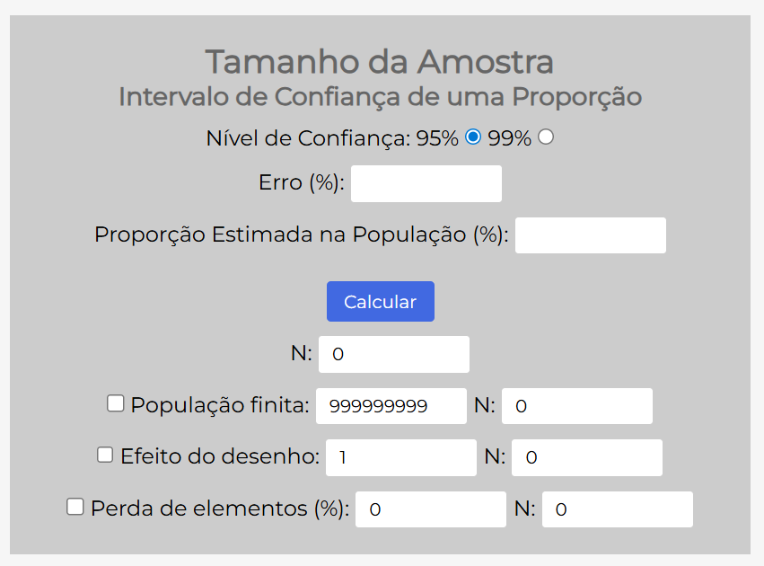

# Introdução

Ao longo de algum tempo ministrando aulas de estatística, concluí que estudar estatística com auxílio de recursos computacionais é bem mais eficaz. Quero dizer, é mais fácil entender os conceitos teóricos, lidar com recursos visuais (gráficos) e, de fato, transformar o conteúdo estudado na disciplina em uma ferramenta para pesquisas científicas, quando se trata de analisar dados.

## Desconstruindo mitos

Ministrando aulas para os cursos da área de **saúde**, **esporte** e **psicologia**, sempre ouvi dos discentes que "estatística é matemática", e sempre digo que **estatística é estatística!**

É normal alguns discentes não assimilarem, em princípio, a importância da disciplina na grade do seu curso. Alguns acham até que é um assunto que deveria ficar restrito aos cursos das exatas. Assim, a primeira tarefa é sempre desconstruir essa ideia.

### A estatística é multidisciplinar

A estatística está em tudo, na verdade. E para dizer uma coisa "bem chique": a estatística é a base da Inteligência Artificial. Adivinha quem está por trás dos famosos algoritmos das redes sociais, das sugestões de filmes e músicas que aparecem no seu *streaming* favorito, do ranqueamento de busca do *Google* e dos agentes de IA?

## Aplicações práticas da estatística

E sendo um pouco mais "acadêmica", dentro do nosso propósito, veja como ela aparece em cada uma das nossas áreas.

### No esporte

Qualquer competição ou treinamento esportivo está recheado de estatística. Como medir o desempenho de um time ou atleta?

> **Uso de suplementos alimentares e acompanhamento nutricional por frequentadores de academias**  
> <https://www.rbne.com.br/index.php/rbne/article/view/2440>

### Na medicina

Estudos epidemiológicos e, claro, da medicina baseada em evidências têm o suporte da estatística.

> **Síndrome Coronariana Aguda no Brasil: Registro dos Fatores Predisponentes e Perfil Populacional em um Instituto Cardiológico Público de Referência Nacional**  
> <https://www.scielo.br/j/abc/a/gPrBrwLpGxWgzjFCgLkJJLN/?format=html&lang=pt>

### Na psicologia

Na psicologia, a estatística é a ferramenta utilizada na psicometria.

> **Avaliação do sofrimento psíquico em estudantes do internato médico**  
> <https://acervomais.com.br/index.php/cientifico/article/view/21295>

## Um desafio para você

Faça uma busca com os termos "estatística" mais um campo do seu curso que te interessa, e você vai encontrar um artigo científico. E se não encontrar, comece a escrever sobre o tema!

### Periódicos por área

Para facilitar sua busca, separei alguns periódicos por área de conhecimento.

**Ciência dos esportes**

| Periódico | Link |
|-----------|------|
| **RBFF** - Revista Brasileira de Futsal e Futebol | <http://www.rbff.com.br> |
| **RBME** - Revista Brasileira de Medicina do Esporte | <https://www.scielo.br/j/rbme> |
| **RBPE** - Revista Brasileira de Psicologia do Esporte | <http://pepsic.bvsalud.org> |

**Medicina e saúde**

| Periódico | Link |
|-----------|------|
| **RBC** - Revista Brasileira de Cancerologia | <https://rbc.inca.gov.br/index.php/revista> |
| **RBCMS** - Revista Brasileira de Ciências Médicas e da Saúde | <http://www.rbcms.com.br> |
| **ABRASCO** - Revista da Associação Brasileira de Saúde Coletiva | <https://cienciaesaudecoletiva.com.br> |

**Psicologia**

| Periódico | Link |
|-----------|------|
| **Psicologia Argumento** | <https://periodicos.pucpr.br/psicologiaargumento> |
| **Estudos de Psicologia** (Campinas) | <https://www.scielo.br/j/estpsi/> |
| **Psicologia em Foco** | <https://revistas.fw.uri.br/index.php/psicologiaemfoco> |

### Onde mais procurar

Além dos periódicos, vale conhecer as bases de dados: o [Mendeley](https://www.mendeley.com), que é gerenciador de referências e buscador ao mesmo tempo; a [SciELO](https://scielo.org), com foco na produção da América Latina; o [Google Scholar](https://scholar.google.com), que é o mais abrangente; e o [PubMed](https://pubmed.ncbi.nlm.nih.gov), especializado em ciências biomédicas e da saúde.

> **Dica de busca:** use aspas para termos exatos (`"análise estatística"`), combine assuntos com o operador AND (`estatística AND psicologia`) e filtre por período nas opções de busca. Isso reduz muito o número de resultados irrelevantes.

## Tipos de análise estatística

Quando olhamos os artigos acima, podemos ver que todos eles têm resultados **descritivos** e **inferenciais**. A estatística descritiva descreve os dados amostrados para uma dada análise; a inferencial infere, isto é, tira conclusões a partir desses dados. Discutiremos sobre ambas ao longo do curso.

A estatística não é apenas matemática abstrata: é a ferramenta que transforma dados em conhecimento, seja qual for a sua área.

<center>

```{=html}
<script src="https://unpkg.com/@lottiefiles/dotlottie-wc@0.8.11/dist/dotlottie-wc.js" type="module"></script>
```

<dotlottie-wc src="https://lottie.host/74a90344-947f-476a-a118-7d9d5c6cd810/z76UXstist.lottie" style="width: 300px;height: 300px" autoplay loop></dotlottie-wc>
</center>

## Atividade 1: a estatística na pesquisa científica

A metodologia científica é composta por etapas que guiam o processo de investigação, e a estatística está presente em várias delas, desde o planejamento da coleta até a interpretação dos resultados. Nesta atividade você vai identificar como isso acontece em um estudo real da sua área.

**Busque um artigo científico do campo do seu interesse que utilize estatística** e percorra o roteiro abaixo.

### 1. Problema de pesquisa

Toda pesquisa começa com uma pergunta. Qual é a questão central que o artigo busca responder? Os autores apresentam os objetivos com clareza? O que se espera alcançar com os resultados? Há hipóteses formuladas e, se há, quais são?

### 2. Metodologia

A metodologia descreve o caminho percorrido pelo pesquisador, e é aqui que a estatística começa a aparecer no planejamento. Observe cada um destes aspectos:

| Aspecto | O que observar no artigo |
|---------|--------------------------|
| Tipo de pesquisa | É qualitativa, quantitativa ou mista? |
| População e amostra | Qual é a população-alvo? Quantos participantes compõem a amostra? |
| Cálculo amostral | Os autores justificam o tamanho da amostra? Foi feito o cálculo? |
| Técnica de amostragem | Como os participantes foram selecionados? Aleatória, por conveniência, estratificada? |
| Instrumentos de coleta | Questionários, testes, medições, observações? |
| Análise estatística | Quais técnicas foram aplicadas aos dados? |
| Software | Qual programa foi usado? SPSS, R, Python, Excel? |

Depois de preencher a tabela, pergunte-se por que essas escolhas metodológicas importam para a validade da pesquisa.

### 3. Resultados

A estatística descritiva organiza e resume os dados coletados, e é isso que aparece nas tabelas e nos gráficos. Quais informações estão representadas visualmente? Que tipos de gráfico foram usados (barras, dispersão, boxplot, histograma, pizza)? Eles são claros e bem organizados? Os dados apresentados respondem aos objetivos da pesquisa? E como os autores interpretam esses resultados?

> **Dica:** preste atenção nas legendas, nos títulos e nas notas de rodapé das tabelas e dos gráficos. É ali que costumam estar as informações que explicam o que você está vendo.

### 4. Glossário estatístico

Familiarizar-se com a terminologia é essencial para compreender e depois aplicar essas técnicas nas suas próprias pesquisas. Faça uma lista dos termos estatísticos que aparecem no artigo. Estes são alguns dos que você pode encontrar:

| Categoria | Exemplos de termos |
|-----------|-------------------|
| Medidas descritivas | Média, mediana, moda, desvio padrão, variância, percentis |
| Tipos de variáveis | Variável dependente, independente, qualitativa, quantitativa |
| Testes de hipótese | Teste t, ANOVA, qui-quadrado, Mann-Whitney, Kruskal-Wallis |
| Análises de relação | Correlação de Pearson, Spearman, regressão linear, regressão logística |
| Conceitos inferenciais | Intervalo de confiança, nível de significância, p-valor, poder do teste, tamanho do efeito |
| Outros | Normalidade, homocedasticidade, distribuição, outliers |

Para cada termo, anote a página onde aparece, tente defini-lo com suas palavras e pesquise o significado dos que você não conhece.

### Para fechar

Ao terminar a análise, você deve conseguir reconhecer como a estatística se integra às etapas da metodologia científica, identificar as principais técnicas usadas na sua área, entender por que o planejamento estatístico afeta a qualidade da pesquisa e olhar com mais critério para a forma como os dados são apresentados.

E uma última pergunta, para pensar: com base no artigo que você analisou, que decisões metodológicas você tomaria de outro jeito se fosse conduzir uma pesquisa semelhante?

# Conceitos Fundamentais

Antes de mergulharmos nas análises, precisamos de dois conceitos que sustentam qualquer estudo quantitativo: a **estatística descritiva** e a **estatística inferencial**. Pense assim: a descritiva organiza e resume os dados que você coletou; a inferencial tira conclusões sobre uma população maior a partir dessa amostra. Vamos ver cada uma com exemplos.

## Estatística descritiva

A estatística descritiva organiza, resume e apresenta os dados de forma compreensível, usando tabelas, gráficos e medidas numéricas.

### Exemplo 1: saúde mental dos estudantes

Imagine que você quer avaliar a saúde mental dos estudantes da UFTM, coletando informações sobre níveis de estresse e de ansiedade, presença de depressão e bem-estar geral.

Como esses dados são coletados? Por meio de **instrumentos psicométricos**, que são questionários e escalas padronizadas para medir características psicológicas de forma objetiva. Esses instrumentos passam por processos rigorosos de validação estatística, justamente para garantir que medem o que se propõem a medir.

| Aspecto avaliado | Instrumento | O que avalia |
|------------------|-------------|--------------|
| Estresse | **PSS-10** (Escala de Estresse Percebido) | O quanto as situações da vida são percebidas como estressantes |
| Ansiedade | **BAI** (Inventário de Ansiedade de Beck) ou **GAD-7** | Sintomas de ansiedade em diferentes intensidades |
| Depressão | **BDI-II** (Inventário de Depressão de Beck) ou **PHQ-9** | Presença e gravidade de sintomas depressivos |
| Bem-estar | **Escala de Bem-Estar Subjetivo** ou **WHO-5** | Qualidade de vida e satisfação geral |

> **Atenção:** muitos desses instrumentos podem ser aplicados por pesquisadores de diferentes áreas, e não só por psicólogos. Mas a interpretação clínica e o diagnóstico são atribuição exclusiva de profissionais habilitados em psicologia ou psiquiatria.

Com esses dados em mãos, a estatística descritiva organiza as respostas em tabelas (por curso, por período, por faixa etária), calcula médias que resumem o conjunto em um número (média de estresse de 6,5 numa escala de 0 a 10), monta gráficos que facilitam a leitura (a porcentagem de alunos com ansiedade baixa, média e alta), mede a variabilidade — um desvio padrão alto avisa que os alunos são muito diferentes entre si — e ajuda a enxergar padrões, como a relação entre horas de sono e nível de estresse.

O resultado é um panorama claro da saúde mental dos estudantes, e é sobre esse panorama que a instituição consegue montar programas de apoio psicológico, formular políticas de bem-estar e identificar os grupos que precisam de mais atenção.

### Exemplo 2: prática de atividades físicas

Agora suponha que você queira entender como os estudantes se exercitam. Você pode levantar a frequência semanal e descobrir que 45% praticam atividade mais de três vezes por semana. Pode levantar os tipos de atividade e montar um gráfico com a distribuição: corrida 30%, musculação 25%, futebol 20%, dança 15% e yoga 10%. E pode classificar a intensidade em leve, moderada e intensa, para comparar os grupos.

Com essas informações, a universidade consegue criar campanhas direcionadas, oferecer novas modalidades e ajustar a infraestrutura ao que os alunos de fato procuram.

## Estatística inferencial

A estatística inferencial usa os dados de uma **amostra** para tirar conclusões sobre a **população inteira**, com uma margem de confiança conhecida.

### Exemplo 1: saúde mental dos estudantes

Você pesquisou 200 estudantes e quer falar sobre todos os 6.900 da UFTM.

A primeira coisa que a inferência permite é **estimar a média da população**. Se a média de ansiedade na amostra foi 7,0 numa escala de 0 a 10, você pode afirmar, com 95% de confiança, que a ansiedade média de todos os estudantes está entre 6,5 e 7,5.

A segunda é **comparar grupos**. Estudantes de Medicina têm mais ansiedade que os de Engenharia? Com média de 7,8 contra 6,2, uma diferença de 1,6 ponto, o teste estatístico indicou que essa diferença é significativa (p < 0,05). A conclusão é que sim, os estudantes de Medicina apresentam níveis maiores de ansiedade.

A vantagem é evidente: você não precisou pesquisar os 6.900 alunos. Com uma amostra bem planejada, dá para fazer afirmações confiáveis sobre a universidade inteira.

### Exemplo 2: prática de atividades físicas

Agora você pesquisou 300 estudantes de diferentes cursos, e a inferência responde a duas perguntas.

Qual é a proporção real de estudantes ativos? Na amostra, 60% praticam exercícios regularmente; para toda a UFTM, a estimativa fica entre 55% e 65%, com 95% de confiança.

E quem se exercita mais, Educação Física ou Medicina? Com 85% de ativos contra 42%, o teste apontou diferença significativa: os estudantes de Educação Física são mais ativos fisicamente.

## A conexão com a probabilidade

A teoria de probabilidade é a ponte entre a descritiva e a inferencial. É ela que permite sair dos dados que você tem em mãos e chegar a afirmações sobre quem você não mediu.

A partir dos dados descritivos, podemos calcular a probabilidade de um estudante desenvolver sintomas de estresse durante o semestre, de um aluno que dorme menos de seis horas ter ansiedade alta, ou de quem pratica exercícios apresentar melhor bem-estar mental. Isso nos permite prever e prevenir, e não apenas descrever.

## População e amostra

Entender essa diferença é fundamental para qualquer pesquisa.

A **população** é o conjunto completo de todos os indivíduos que você quer estudar. No nosso exemplo, são os 6.900 estudantes da UFTM (dado do DRCA de dezembro/2024, incluindo graduação, cursos técnicos e pós-graduação).

A **amostra** é um grupo menor e representativo, selecionado dessa população. No nosso caso, 364 estudantes sorteados aleatoriamente, que representam toda a população com 95% de confiança e erro máximo de 5%.

### Um exemplo completo

Vamos juntar tudo. O objetivo é avaliar o bem-estar emocional dos estudantes da UFTM.

Na **coleta**, partimos de uma população de 6.900 estudantes, sorteamos 364 e aplicamos um questionário padronizado em escala de 0 a 10.

Na **análise descritiva**, a amostra deu média de bem-estar 6,8, desvio padrão 1,5, com mínimo de 2,0 e máximo de 10,0.

Na **inferência**, generalizamos para a UFTM inteira. A média estimada é 6,8, e o intervalo de confiança de 95% vai de 6,65 a 6,95, calculado como 6,8 ± 1,96 × 1,5/√364, ou seja, 6,8 ± 0,15. A leitura é esta: temos 95% de confiança de que o bem-estar emocional médio de todos os estudantes da UFTM está entre 6,65 e 6,95.

> **Atenção a uma confusão comum:** a margem de erro de 5% usada no cálculo do tamanho da amostra é dada em pontos percentuais de uma *proporção* — ela não é um percentual da média. O intervalo de confiança de uma *média* depende do desvio padrão da amostra, como na conta acima. São duas coisas diferentes.

E o que significa exatamente esse IC95%? Se você repetisse a pesquisa 100 vezes, com amostras aleatórias diferentes de 364 estudantes, e construísse um intervalo a cada vez, cerca de 95 desses intervalos conteriam a verdadeira média de todos os estudantes, e cerca de 5 não conteriam.

> Repare na direção da afirmação: o que varia de amostra para amostra é o **intervalo**, não a média populacional. A média de todos os estudantes é um número fixo e desconhecido, e ou ela está dentro deste intervalo específico, ou não está. Os 95% são a confiança no *procedimento* que gerou o intervalo, não a probabilidade de a média cair nele.

O caminho completo, então, é este: da população sorteamos uma amostra; sobre a amostra fazemos a estatística descritiva, organizando, calculando e visualizando; sobre esses resultados fazemos a inferência, estimando, comparando e concluindo; e chegamos a conclusões sobre a população inteira, com margem de erro conhecida.

<center>

```{=html}
<script src="https://unpkg.com/@lottiefiles/dotlottie-wc@0.8.11/dist/dotlottie-wc.js" type="module"></script>
```

<dotlottie-wc src="https://lottie.host/74a90344-947f-476a-a118-7d9d5c6cd810/z76UXstist.lottie" style="width: 300px;height: 300px" autoplay loop></dotlottie-wc>
</center>

Agora reflita: em uma pesquisa sobre hábitos alimentares dos estudantes, como você aplicaria esses conceitos?

# Tamanho da Amostra

## Por que calcular o tamanho da amostra

Calcular o tamanho da amostra é etapa obrigatória no planejamento de qualquer pesquisa. É esse cálculo que determina quantos participantes o estudo precisa para que os resultados representem a população, sejam estatisticamente confiáveis, tenham precisão suficiente para responder à pergunta e ainda caibam no tempo e nos recursos que você tem.

### Errar o tamanho da amostra

Uma amostra pequena demais não tem poder para detectar o efeito que você procura: o estudo termina sem conclusão, ou com uma conclusão equivocada, e às vezes é invalidado por isso. Uma amostra grande demais desperdiça tempo e dinheiro e, na pesquisa com pessoas, levanta uma questão ética — você expôs mais gente do que precisava para responder à mesma pergunta.

Calcular direito, portanto, não é só uma exigência técnica: é o que torna a pesquisa cientificamente válida e eticamente responsável.

## O cálculo muda conforme o objetivo

Não existe uma fórmula única. O método varia conforme o que você quer estimar ou testar, e cada análise exige informações diferentes:

| Objetivo da pesquisa | Exemplo | O que você precisa saber antes |
|---------------------|---------|--------------------------------|
| Estimar uma proporção | Percentual de alunos com ansiedade | Margem de erro, nível de confiança, proporção estimada |
| Estimar uma média | Média de horas de estudo por dia | Desvio padrão, margem de erro, nível de confiança |
| Comparar dois grupos | Estresse entre dois cursos | Tamanho do efeito, poder estatístico, nível de significância |
| Testar correlação | Relação entre sono e desempenho | Tamanho do efeito esperado, poder estatístico |
| Estudos experimentais | Efeito de uma intervenção | Grupos controle e experimental, poder, efeito esperado |

Vamos detalhar o primeiro caso, que é o mais comum nos trabalhos de graduação.

## Cálculo para estimar uma proporção

Quando o objetivo é estimar uma proporção — "qual percentual de estudantes tem ansiedade?" —, precisamos de quatro informações:

| Parâmetro | O que é | No exemplo da UFTM |
|-----------|---------|--------------------|
| Tamanho da população (N) | Total de indivíduos que você quer estudar | 6.900 estudantes |
| Margem de erro (E) | Quanto você aceita errar na estimativa | 5% (0,05) |
| Nível de confiança | Quão confiante você quer estar | 95% (o padrão) |
| Proporção estimada (p) | Estimativa inicial do fenômeno | 50% (0,5), o pior cenário |

### A fórmula

Para população infinita ou muito grande:

$$
n = \frac{Z^2 \cdot p \cdot (1 - p)}{E^2}
$$

Onde $n$ é o tamanho da amostra necessário; $Z$ é o valor da distribuição normal padrão, que vale 1,96 para 95% de confiança e 2,58 para 99%; $p$ é a proporção estimada, e usamos 0,5 quando não temos ideia; e $E$ é a margem de erro em decimal, de modo que 5% vira 0,05.

Queremos estimar a proporção de estudantes da UFTM com sintomas de ansiedade. A população é de 6.900 estudantes, aceitamos uma margem de erro de 5%, queremos 95% de confiança e, como não fazemos ideia da proporção, usamos 50%. Substituindo:

$$
n = \frac{1,96^2 \cdot 0,5 \cdot (1 - 0,5)}{0,05^2} = \frac{3,8416 \cdot 0,5 \cdot 0,5}{0,0025} = \frac{0,9604}{0,0025} = 384,16
$$

Precisamos de 384 estudantes.

### Ajuste para população finita

Quando a população é "pequena" — na prática, quando N é menor que 10.000 —, aplicamos uma correção que aproveita o fato de estarmos pegando uma fração relevante do total:

$$
n_{ajustado} = \frac{n}{1 + \frac{n-1}{N}}
$$

No nosso caso:

$$
n_{ajustado} = \frac{384}{1 + \frac{384-1}{6900}} = \frac{384}{1 + 0,0555} = \frac{384}{1,0555} = 364
$$

Com a correção, precisamos de 364 estudantes, e não mais 384.

O que isso significa na prática? Que com 364 estudantes temos 95% de confiança nos resultados, com margem de erro de ±5%, e que esses resultados representam bem os 6.900 alunos. Se 60% da amostra relatar ansiedade, podemos afirmar que entre 55% e 65% de todos os estudantes da UFTM têm ansiedade, com 95% de confiança.

## E se a pesquisa tiver vários objetivos?

A regra é simples: calcule cada objetivo separadamente e use a maior amostra.

Imagine uma pesquisa com quatro objetivos. Estimar o percentual com ansiedade pede 364 alunos; calcular a média de bem-estar pede 280; comparar três cursos pede 120; e testar a correlação entre sono e estresse pede 85. A decisão é usar 364, porque essa amostra é suficiente para todos os objetivos ao mesmo tempo.

### Ajuste para perdas

Nem todo mundo convidado vai participar ou responder, então acrescente uma margem de segurança:

$$
\text{amostra final} = \frac{\text{amostra calculada}}{1 - \text{perda esperada}}
$$

Prevendo 20% de perdas, 364 ÷ 0,80 = 455. Ou seja, você precisa alcançar 455 pessoas para terminar com as 364 respostas válidas de que precisa.

## Ferramentas para o cálculo

Nosso foco aqui não é fazer contas na mão, e sim compreender os conceitos e saber onde buscar ajuda. Existem hoje várias ferramentas gratuitas que fazem todo o trabalho.

Entre as calculadoras online, a [Calculadora USP Bauru](http://estatistica.bauru.usp.br/calculoamostral/) é a mais simples para proporções e médias: é rápida, está em português e não exige instalação. O [OpenEpi](https://www.openepi.com/SampleSize/SSMean.htm) é voltado para estudos em saúde e epidemiologia, e cobre desenhos como caso-controle e coorte. Já o [G\*Power](https://www.gpower.hhu.de/en.html) é o mais completo e virou padrão em pesquisa: ele calcula amostra e poder estatístico para comparações e testes mais complexos, mas precisa ser instalado.

### No R

A ideia é a mesma das calculadoras: em vez de aplicar a fórmula na mão, usamos uma função pronta. O pacote `samplingbook` faz o cálculo para proporção.

```{r echo=TRUE, message=FALSE, warning=FALSE}
# Instalar o pacote (se ainda não tiver)
# install.packages("samplingbook")

# Carregar
library(samplingbook)

# Calcular amostra para proporção (considerando a população infinita)
sample.size.prop(
  e = 0.05,          # Margem de erro (5%)
  P = 0.5,           # Proporção estimada (50%)
  N = Inf,           # Tamanho da população: infinita
  level = 0.95       # Nível de confiança (95%)
  )

# Calcular amostra para proporção (considerando a população finita)
sample.size.prop(
  e = 0.05, 
  P = 0.5, 
  N = 6900,           # Tamanho da população: finita 
  level = 0.95
  )

```

E chegamos aos mesmos 364 estudantes.

> Na saída, *sample size needed* quer dizer "tamanho de amostra necessário".

Se preferir, dá para escrever a fórmula diretamente:

```{r echo=TRUE}
# Cálculo direto
N <- 6900
Z <- 1.96
p <- 0.5
E <- 0.05

n <- (Z^2 * p * (1-p)) / E^2
n_final <- ceiling(n / (1 + (n-1) / N))
n_final
```

A vantagem de fazer no R é que o cálculo fica rápido, sem erro de conta, reprodutível por qualquer pessoa e fácil de repetir com outros cenários — basta trocar um número e rodar de novo.

### E a inteligência artificial?

Você também pode pedir ajuda ao ChatGPT, ao Copilot ou a outra IA. Um exemplo de pergunta:

```
"Preciso calcular o tamanho da amostra para uma pesquisa 
com estudantes universitários (população de 6.900). 
Quero estimar a proporção de alunos com ansiedade, 
com 95% de confiança e margem de erro de 5%. 
Como faço e qual o resultado?"
```

> **Atenção:** sempre valide o resultado da IA em uma das calculadoras acima. Ela erra, e erra com confiança.

### Qual ferramenta escolher

Se você está começando, use a Calculadora USP Bauru. Se a pesquisa é da área da saúde, o OpenEpi cobre mais desenhos de estudo. Se precisa comparar grupos ou testar correlações, vá de G\*Power. Se já usa R nas análises, os pacotes `samplingbook` e `pwr` resolvem. E se quer só entender o conceito rapidamente, pergunte a uma IA — mas confira o resultado em uma calculadora.

Seja qual for a escolha, documente-a no projeto. Um exemplo de como citar:

> "O tamanho amostral foi calculado utilizando a Calculadora Amostral da USP Bauru (http://estatistica.bauru.usp.br/calculoamostral/), considerando população de 6.900 estudantes, margem de erro de 5% e nível de confiança de 95%."

A boa notícia é que você não precisa ser expert em matemática para fazer isso direito. Com as ferramentas certas, o cálculo sai em minutos, e sobra tempo para o que realmente importa: planejar e executar uma pesquisa de qualidade.

<center>

```{=html}
<script src="https://unpkg.com/@lottiefiles/dotlottie-wc@0.8.11/dist/dotlottie-wc.js" type="module"></script>
```

<dotlottie-wc src="https://lottie.host/74a90344-947f-476a-a118-7d9d5c6cd810/z76UXstist.lottie" style="width: 300px;height: 300px" autoplay loop></dotlottie-wc>
</center>


## Atividade 2: análise crítica do artigo

Volte ao artigo que você buscou na Atividade 1 e responda ao que segue.

### Análise metodológica

**1. Os autores discutem o cálculo do tamanho da amostra?** Procure se há explicação sobre como o tamanho foi determinado, se mencionam a fórmula, o software ou a ferramenta usada, e se apresentam os parâmetros (margem de erro e nível de confiança). Se essa informação não aparece, pergunte-se: isso é uma limitação do estudo?

**2. A população da pesquisa foi claramente definida?** Verifique quem compõe a população-alvo, se há critérios de inclusão e exclusão, e se o contexto está delimitado quanto a local e período. Uma população mal definida compromete a validade dos resultados.

**3. O tamanho da amostra foi adequado?** Avalie criticamente se a amostra parece grande o suficiente, se é representativa da população e se os próprios autores discutem as limitações relacionadas ao tamanho dela.

### Refaça o cálculo

Use uma das ferramentas indicadas e preencha:

| Item | Informação do artigo | Seu cálculo |
|------|---------------------|-------------|
| Tamanho da população (N) | | |
| Margem de erro | | |
| Nível de confiança | | |
| Tipo de cálculo necessário | | |
| Tamanho no artigo | | |
| Seu resultado | | |
| Coincidem? | | ☐ Sim  ☐ Não |

Se os números não coincidirem, quais podem ser as razões?

### Aspectos éticos

**4. A pesquisa foi aprovada pelo Comitê de Ética?** Procure no artigo a menção à aprovação do CEP, o número do parecer e a referência ao TCLE, o Termo de Consentimento Livre e Esclarecido.

**5. Por que submeter ao Comitê de Ética importa?** A submissão protege os participantes, garantindo que seus direitos sejam respeitados; assegura o consentimento informado, isto é, uma participação voluntária e esclarecida; resguarda a confidencialidade dos dados pessoais; obriga a avaliar a relação entre riscos e benefícios; e sustenta a credibilidade da pesquisa.

Não submeter tem consequências concretas: além da violação dos direitos dos participantes, há infração às Resoluções CNS 466/2012 e 510/2016, o artigo pode ser rejeitado ou retratado depois de publicado, e o pesquisador está sujeito a sanções.

> Conheça o Comitê de Ética em Pesquisa (CEP) da UFTM em <https://www.uftm.edu.br/comitesecomissoes/cep>. Lá você encontra como submeter projetos, os documentos necessários, os prazos de tramitação e as regulamentações vigentes.

Para fechar: se você fosse revisor deste artigo, aprovaria a metodologia amostral? Justifique.

## Exercício: a Calculadora USP Bauru

Você é pesquisador(a) e quer investigar a adesão ao uso de equipamentos de proteção individual (EPIs) entre os profissionais de enfermagem de um hospital universitário.

O hospital tem 450 profissionais de enfermagem, entre enfermeiros, técnicos e auxiliares. Estudos semelhantes mostram que cerca de 70% deles usam EPIs corretamente, e você quer trabalhar com 95% de confiança e margem de erro de 5%. Quantos profissionais precisa incluir na amostra?

### Passo a passo na calculadora

Acesse <http://estatistica.bauru.usp.br/calculoamostral/>, clique em **Cálculos** no menu e selecione **1 - Intervalo de Confiança de uma Proporção**. Preencha os campos conforme a imagem:

<center>

</center>

| Campo | O que colocar | Valor |
|-------|---------------|:-------:|
| Nível de Confiança | Deixe marcado 95% | 95% |
| Erro (%) | Margem de erro desejada | 5 |
| Proporção Estimada na População (%) | Uso correto de EPIs | 70 |
| População finita | Marque a caixa e informe o total | 450 |

Depois, clique em **Calcular**.

### Anote seus resultados

**a)** Quantos profissionais você precisa pesquisar?

> _______ profissionais

**b)** Qual é a diferença no tamanho da amostra ao considerar população finita e infinita?

> Sem considerar população finita (infinita): _______ profissionais  
> Considerando população finita (450): _______ profissionais  
> Diferença: _______ profissionais

**c)** Volte às configurações originais e aumente o nível de confiança para 99%. O que acontece?

> Com 99% de confiança: _______ profissionais

**d)** Retorne para 95% de confiança e diminua a margem de erro para 3%. Qual o impacto?

> Com erro de 3%: _______ profissionais

**e)** Volte às configurações originais (95% de confiança, erro de 5%, proporção de 70%). Agora use o campo "Perda de elementos (%)" e considere 20% de perdas, por férias, licença ou recusa. Quantas pessoas você precisaria alcançar?

> Ajustado para perdas: _______ profissionais

### Questões para reflexão

**1.** Considerando que você precisa pesquisar _____ profissionais de um total de 450, isso representa cerca de _____% da população. É viável? Por quê?

**2.** Por que o tamanho da amostra é menor quando consideramos a população finita (450) em vez de infinita?

**3.** Se tivesse que escolher entre erro de 5% com 95% de confiança e erro de 3% com 95% de confiança, qual escolheria, considerando tempo e recursos limitados? Justifique.

### Desafio extra

Agora mude o cenário: suponha que você não faça ideia da proporção de profissionais que usam EPIs corretamente. Quando não temos estimativa prévia, usamos 50%, que é o pior cenário e gera a maior amostra.

Volte à calculadora, confira que os parâmetros estão nas configurações originais (95% de confiança, erro de 5%, população finita de 450) e mude apenas a proporção estimada para 50%. Recalcule.

Qual é o novo tamanho da amostra? _______ profissionais. E por que ele mudou?

### Gabarito

<details>
<summary>Clique para ver as respostas</summary>

Considerando população finita de 450 profissionais e proporção de 70%:

**a) Amostra necessária (erro de 5%, confiança de 95%):** 189 profissionais.

**b) Comparação:** sem considerar a população finita, seriam 323 profissionais; com a correção para os 450, caem para 189. A diferença é de 134 pessoas, ou seja, a correção reduz bastante.

**c) Com 99% de confiança:** 250 profissionais na população finita, contra 560 na infinita. Repare que 560 não faz sentido algum, por ser maior que a própria população do hospital.

**d) Com erro de 3%:** 300 profissionais na população finita, contra 897 na infinita — outro número sem sentido.

**e) Ajustado para 20% de perdas:** 237 profissionais, porque 189 ÷ 0,80 = 236,25, e arredondamos para cima.

**Desafio extra, com proporção de 50%:** 208 profissionais, contra os 189 obtidos com 70%. A amostra aumentou porque 50% é o cenário mais conservador, o que gera a maior variabilidade possível.

E por que 50% gera a maior variabilidade? Porque a fórmula do cálculo para proporção inclui o produto **p × (1 − p)**, e esse produto é máximo justamente quando p vale 0,5:

| Proporção (p) | p × (1 − p) | Variabilidade |
|---------------|-------------|---------------|
| 10% (0,10) | 0,10 × 0,90 = 0,09 | Baixa |
| 30% (0,30) | 0,30 × 0,70 = 0,21 | Média |
| **50% (0,50)** | **0,50 × 0,50 = 0,25** | **Máxima** |
| 70% (0,70) | 0,70 × 0,30 = 0,21 | Média |
| 90% (0,90) | 0,90 × 0,10 = 0,09 | Baixa |

É por isso que, sem nenhuma estimativa prévia, usamos 50%: é a escolha que nos protege do pior caso.

**Reflexão 1:** 189 de 450 é 42% da população. É uma amostra grande em termos proporcionais, mas perfeitamente viável dentro de um hospital.

**Reflexão 2:** a correção para população finita leva em conta que estamos pegando uma fração significativa do total — 42%, neste caso. Quanto maior essa fração, menos pessoas são necessárias para atingir a mesma precisão.

</details>

Ao final deste exercício você deve saber usar a Calculadora USP Bauru passo a passo, entender por que a correção para população finita importa, perceber como o nível de confiança e a margem de erro puxam o tamanho da amostra para cima ou para baixo, saber por que usamos 50% quando não temos estimativa e como ajustar o número para as perdas esperadas. O próximo passo é aplicar isso à sua própria pesquisa.


# Técnicas de Amostragem

Depois de calcular quantas pessoas a pesquisa precisa, falta responder à outra metade da pergunta: **como** escolher essas pessoas. É disso que trata a técnica de amostragem, e o objetivo dela é garantir que a amostra represente bem a população, evitando viés.

## O que é viés de amostragem

O viés aparece quando certos grupos têm mais chance de ser selecionados do que outros, o que distorce os resultados.

Imagine que a UFTM tenha 60% de mulheres e 40% de homens. Se a sua amostra terminar com 80% de homens e 20% de mulheres, ela não representa a população — e qualquer conclusão que você tirar dela vai carregar essa distorção. Toda a discussão a seguir é sobre técnicas que minimizam esse risco.

As técnicas se dividem em dois grupos. Nas **probabilísticas**, há sorteio, e todos têm uma chance conhecida e diferente de zero de ser selecionados. Nas **não probabilísticas**, não há sorteio: a seleção se dá por conveniência, julgamento ou cotas.

## Amostragem aleatória simples

Todos têm a mesma chance de ser escolhidos, como num sorteio de loteria.

Para fazer, você obtém uma lista completa da população, numera cada pessoa de 1 até N, sorteia aleatoriamente a quantidade calculada e monta a amostra com quem foi sorteado. O sorteio pode ser feito no R com a função `sample()`, no Excel com `=ALEATÓRIOENTRE(1;N)`, em sites como o Random.org ou em qualquer aplicativo de sorteio.

Um exemplo na UFTM: para avaliar a saúde mental dos estudantes, você solicitaria à secretaria a lista de todos os alunos matriculados, sortearia 364 deles com uma ferramenta digital e convidaria os sorteados por e-mail institucional.

A vantagem é ser simples de entender e aplicar, dar chance igual a todo mundo, minimizar o viés de seleção e servir de base para as análises inferenciais. A desvantagem é depender de uma lista completa e atualizada, o que nem sempre existe, e ficar difícil em populações muito grandes. Há ainda o risco de grupos pequenos ficarem sub-representados por puro acaso.

> **Para evitar viés:** garanta que a lista esteja completa e atualizada, use geradores aleatórios confiáveis em vez de escolher "de cabeça", e nunca substitua um sorteado por outra pessoa mais acessível.

## Amostragem estratificada

Aqui dividimos a população em grupos homogêneos, chamados estratos, e sorteamos dentro de cada grupo proporcionalmente. Use quando a população tem subgrupos importantes que precisam estar representados.

Vejamos como ficaria na UFTM, com uma amostra de 364 estudantes de graduação.

> Nos exemplos de amostragem a seguir trabalhamos apenas com a graduação, cerca de 6.750 alunos. O N de 6.900 usado no cálculo amostral incluía também a pós-graduação e os cursos técnicos. Como os dois números são próximos, a amostra de 364 continua adequada — mas, na sua pesquisa, defina uma população só e use a mesma em todas as etapas.

O primeiro passo é definir os estratos, que aqui serão os cursos:

| Curso | Estimativa de alunos* | % | Amostra por curso |
|-------|:---------------------:|:---:|:-----------------:|
| Medicina | 660 | 10% | 36 |
| Enfermagem | 400 | 6% | 22 |
| Fisioterapia | 330 | 5% | 18 |
| Terapia Ocupacional | 200 | 3% | 11 |
| Nutrição | 330 | 5% | 18 |
| Educação Física | 530 | 8% | 29 |
| Psicologia | 400 | 6% | 22 |
| Serviço Social | 330 | 5% | 18 |
| Engenharia Ambiental | 330 | 5% | 18 |
| Engenharia de Produção | 330 | 5% | 18 |
| Engenharia de Alimentos | 260 | 4% | 15 |
| Engenharia Elétrica | 330 | 5% | 18 |
| Engenharia Mecânica | 330 | 5% | 18 |
| Letras | 260 | 4% | 15 |
| História | 200 | 3% | 11 |
| Geografia | 200 | 3% | 11 |
| Ciências Biológicas | 400 | 6% | 22 |
| Química | 200 | 3% | 11 |
| Matemática | 200 | 3% | 11 |
| Biomedicina | 330 | 5% | 18 |
| **Total** | **~6.750** | **100%** | **364** |

*Valores aproximados, para efeito didático.

O segundo passo é sortear aleatoriamente, dentro de cada curso, a quantidade calculada para aquele estrato.

Essa técnica dá maior representatividade, garante que os cursos menores entrem na amostra, permite comparações entre eles e reduz a variabilidade do conjunto. Em compensação, exige conhecer a composição da população por curso e ter acesso a listas separadas por estrato, além de dar mais trabalho que a aleatória simples.

> **Para evitar viés:** os estratos precisam ser relevantes para a pesquisa e mutuamente exclusivos, isto é, cada aluno em um estrato só. E use alocação proporcional, para que a amostra reflita a distribuição real da população.

Os cursos não são a única forma de estratificar na UFTM: dá para usar o período (calouros, intermediários, formandos), o campus (Uberaba e Iturama), o turno (matutino, vespertino, noturno, integral) ou a grande área (Saúde, Exatas, Humanas).

## Amostragem sistemática

A ideia é escolher um ponto de partida aleatório e depois selecionar a cada **k** elementos da lista.

Com 6.750 alunos e uma amostra de 364, começamos calculando o intervalo:

```
k = População / Amostra
k = 6.750 / 364 = 18,5  →  arredonde PARA BAIXO:  k = 18
```

> **Atenção ao arredondamento:** aqui o k deve ser arredondado para baixo. Se usássemos k = 19, percorrendo a lista de 19 em 19 sairiam apenas 6.750 ÷ 19 = 355 pessoas, menos do que os 364 necessários. Com k = 18 saem 375, que cobre a amostra com folga.

Em seguida sorteamos o primeiro elemento, um número entre 1 e 18. Digamos que saiu o 7. A partir dele, selecionamos de 18 em 18: 7, 25, 43, 61, 79, 97, 115, 133, e assim por diante até percorrer a lista inteira. No R, a função `seq()` monta essa sequência; no Excel, uma fórmula de sequência aritmética resolve; e no papel, basta uma calculadora e a lista numerada.

Um exemplo fora da universidade: você está numa UBS pesquisando satisfação na fila de vacinação. Decide entrevistar uma a cada dez pessoas, sorteia o início e cai na terceira; daí em diante entrevista a 13ª, a 23ª, a 33ª, e por aí vai.

É uma técnica muito fácil de aplicar em campo, distribui a amostra uniformemente ao longo da lista e dispensa múltiplos sorteios. O problema aparece quando a lista tem algum padrão periódico, porque aí o salto fixo pode cair sempre no mesmo tipo de pessoa. E, por isso mesmo, ela é um pouco menos aleatória que a amostragem simples.

> **Para evitar viés:** certifique-se de que a lista não tem uma ordem sistemática e, se tiver (por curso, por exemplo), embaralhe antes. E garanta que o primeiro elemento seja sorteado de verdade.

## Amostragem por conglomerados

Aqui dividimos a população em grupos, os conglomerados, e sorteamos grupos inteiros.

Suponha que você queira pesquisar hábitos de estudo na UFTM. Uma opção é tomar as turmas como conglomerados: liste todas as turmas por curso e período, sorteie algumas e pesquise todos os alunos delas. Outra é tomar os cursos: liste os 20, sorteie 5 e pesquise todos os alunos (ou uma amostra) desses cursos. Uma terceira é tomar os campi: sorteie entre Uberaba e Iturama e pesquise uma amostra dos alunos do campus sorteado.

A vantagem fica evidente em escala nacional. Numa pesquisa sobre educação no Brasil é impossível listar todos os estudantes do país; então sorteamos 50 cidades, dentro delas sorteamos 5 escolas cada, e pesquisamos os alunos dessas escolas.

É a técnica mais prática para populações grandes e dispersas, economiza tempo e custo porque concentra a coleta, e dispensa a lista completa de indivíduos. O preço é ser menos precisa que as outras: conglomerados podem ser muito diferentes entre si, e isso aumenta o erro amostral.

> **Para evitar viés:** os conglomerados devem ser internamente diversos e parecidos entre si — o oposto do que se espera dos estratos. E sorteie um número suficiente deles.

Essa é justamente a diferença que costuma confundir:

| Aspecto | Estratificada | Conglomerados |
|---------|--------------|---------------|
| Divisão | Grupos homogêneos | Grupos heterogêneos |
| Seleção | Amostra de **cada** grupo | **Alguns** grupos inteiros |
| Objetivo | Representar subgrupos | Facilitar a coleta |
| Na UFTM | Sortear alunos de cada curso | Sortear turmas inteiras |

## Amostragem por conveniência

Aqui selecionamos quem está mais acessível ao pesquisador. É uma técnica não probabilística, sem sorteio, com alto risco de viés — e, ao mesmo tempo, rápida, prática e barata. É a mais usada nos trabalhos de graduação, e por isso merece atenção redobrada.

Os exemplos mais comuns são o formulário online, em que o pesquisador compartilha um link e responde quem quiser; a abordagem em locais específicos, como entrevistar alunos na biblioteca, no restaurante universitário ou na entrada do campus; e a divulgação em redes sociais, por post no Instagram, grupo de WhatsApp do curso ou e-mail para colegas conhecidos.

Os formulários online, em especial, concentram quatro tipos de viés:

| Tipo de viés | O que é | Exemplo |
|--------------|---------|---------|
| De acesso | Só quem tem internet responde | Exclui quem não tem smartphone ou dados móveis |
| De autosseleção | Só os interessados respondem | Quem gosta do tema participa mais |
| De distribuição | Enviado só a certos grupos | Só o grupo de WhatsApp do seu curso |
| De plataforma | Cada rede tem seu perfil | O público do Instagram não é o do e-mail institucional |

O viés de distribuição é o mais fácil de cometer: se o formulário circular só no grupo da Medicina, a amostra terá um curso onde a população tem vinte.

A conveniência é aceitável em estudos exploratórios de fase inicial, em pré-testes de questionário, em pesquisas qualitativas, quando os recursos são muito limitados e em TCCs com prazo curto. Não é aceitável quando a pesquisa precisa generalizar para a população, em estudos quantitativos rigorosos, em dissertações e teses, e em publicações de alto impacto.

Se você precisa usá-la, dá para reduzir bastante o estrago. **Diversifique os canais**: não envie só em um grupo, mas também por e-mail institucional para todos os cursos, em redes sociais variadas, em murais físicos espalhados pelo campus, em avisos de sala de aula de cursos diferentes e na rádio universitária. **Descreva as limitações honestamente** no texto do trabalho. **Compare a amostra com os dados populacionais** e relate as diferenças: se 80% da amostra é de Exatas e a UFTM tem 40% de cursos dessa área, isso precisa aparecer. E, se possível, **combine com outra técnica**, somando o formulário online a uma coleta presencial estratificada.

Um exemplo de como relatar isso com honestidade em um artigo:

> "Utilizou-se amostragem por conveniência através de formulário online (Google Forms), divulgado por e-mail institucional, redes sociais e grupos de WhatsApp. Obtivemos 412 respostas de estudantes da UFTM. Reconhecemos que esta técnica apresenta limitações quanto à representatividade, especialmente viés de autosseleção e acesso digital. A amostra apresentou maior proporção de estudantes da área da Saúde (65%) comparado à distribuição real dos cursos da UFTM (aproximadamente 40%), o que deve ser considerado na interpretação dos resultados."

## Combinando técnicas

Na vida real, os pesquisadores frequentemente combinam técnicas para melhorar a representatividade dentro do que é viável.

Dá para juntar estratificada com aleatória simples, dividindo os alunos por área e sorteando dentro de cada uma. Ou conglomerados com sistemática, sorteando 8 cursos e, dentro deles, selecionando a cada quinto aluno. Ou ainda estratificada com cotas, definindo quantas respostas se quer por curso e divulgando o formulário até preencher cada cota.

Veja um caso concreto: pesquisar o bem-estar dos estudantes, com recursos limitados e dois meses de prazo. Na primeira etapa, estratifique por área — Saúde 40%, Exatas 35%, Humanas 25% — e calcule a amostra proporcional. Na segunda, faça a coleta mista, visitando turmas sorteadas para obter 60% da amostra e complementando os 40% restantes com formulário online. Na terceira, monitore as proporções durante a coleta e reforce a divulgação nos grupos que ficarem sub-representados. O resultado é uma amostra mais representativa do que a puramente online e mais viável do que a puramente presencial.

## Comparando as técnicas

| Técnica | Tipo | Complexidade | Representatividade | Custo | Quando usar |
|---------|------|--------------|-------------------|-------|-------------|
| Aleatória simples | Probabilística | Baixa | Alta | Médio | Lista completa disponível |
| Estratificada | Probabilística | Média | Muito alta | Médio-alto | Subgrupos importantes |
| Sistemática | Probabilística | Baixa | Alta* | Baixo | Lista sem padrões |
| Conglomerados | Probabilística | Média | Média | Baixo | População dispersa |
| Conveniência | Não probabilística | Muito baixa | Baixa | Muito baixo | Estudos exploratórios |

*Desde que não haja padrão periódico na lista.

Para escolher, comece perguntando se você tem a lista completa da população. Se tem, veja se existem subgrupos importantes: havendo, use estratificada; não havendo, aleatória simples resolve. Se não tem a lista, pergunte se a população está dispersa geograficamente: se estiver, vá de conglomerados. Se não estiver e os recursos forem muito limitados, resta a conveniência, com todo o cuidado que ela exige — caso contrário, vale o esforço de conseguir a lista e usar a estratificada.

Antes de fechar a decisão, confira se você:

- [ ] definiu claramente a população-alvo
- [ ] calculou o tamanho da amostra necessária
- [ ] verificou se tem a lista completa da população
- [ ] identificou os subgrupos relevantes (cursos, períodos, áreas)
- [ ] avaliou os recursos disponíveis (tempo, dinheiro, equipe)
- [ ] escolheu a técnica adequada aos objetivos
- [ ] planejou como minimizar o viés
- [ ] vai documentar todo o processo para relatar no artigo

## Um guia rápido contra o viés

Cinco fontes de viés aparecem com mais frequência, e cada uma tem um antídoto:

| Tipo de viés | O que é | Como evitar |
|--------------|---------|-------------|
| Seleção | Alguns grupos têm mais chance | Usar sorteio verdadeiramente aleatório |
| Autosseleção | Só os motivados participam | Incentivar e facilitar a participação de todos |
| Não resposta | Quem não responde é diferente de quem responde | Fazer follow-up, oferecer incentivos |
| Acesso | Parte da população não é alcançável | Combinar canais, online e presencial |
| Temporal | Coletar só em um certo período | Distribuir a coleta em momentos diferentes |

E, ao final da coleta, verifique se você usou de fato um método de sorteio em vez de escolher pessoas conhecidas; se todos os subgrupos relevantes tinham chance de ser selecionados; se o cadastro estava atualizado; se você resistiu à tentação de substituir sorteados por quem estava mais à mão; se documentou quem recusou ou não respondeu; se comparou as características da amostra com as da população; e se relatou as limitações honestamente.

## Para levar daqui

Documente tudo: como sorteou e com qual ferramenta, quantas pessoas foram convidadas, quantas aceitaram e quantas recusaram, e em que data a coleta aconteceu. Seja transparente sobre as limitações da técnica escolhida, sobre os vieses possíveis e sobre o motivo da escolha. Planeje para as perdas, acrescentando 20% a 30% ao tamanho calculado e tendo uma estratégia pronta para baixa adesão. E teste antes: um piloto com 10 a 20 pessoas revela problemas no questionário que você não veria de outro jeito.

Um exemplo de redação completa para a seção de método:

> "Utilizou-se amostragem estratificada proporcional, com estratos definidos por curso de graduação. A partir do cadastro institucional de 6.750 estudantes da UFTM, distribuídos em 20 cursos, calculou-se amostra de 364 alunos (margem de erro de 5%, nível de confiança de 95%). A distribuição amostral por curso respeitou a proporção de cada curso na população. Dentro de cada estrato, realizou-se sorteio aleatório simples utilizando gerador de números aleatórios (Random.org). Foram convidados 486 estudantes para compensar possíveis perdas estimadas em 25% (364 ÷ 0,75). A taxa de resposta foi de 77% (n = 374), superando o mínimo necessário. A amostra final apresentou distribuição por área (Saúde 38%, Exatas 36%, Humanas 26%) compatível com a população da instituição."

Em uma frase cada: a aleatória simples sorteia direto da lista completa; a estratificada divide em grupos e sorteia de cada um; a sistemática escolhe a cada k elementos; a de conglomerados sorteia grupos inteiros; e a de conveniência pega quem está acessível.

> Sempre que possível, use técnicas probabilísticas: são elas que permitem generalizar os resultados e são mais aceitas cientificamente. E se você precisar recorrer à conveniência, seja honesto sobre as limitações.
