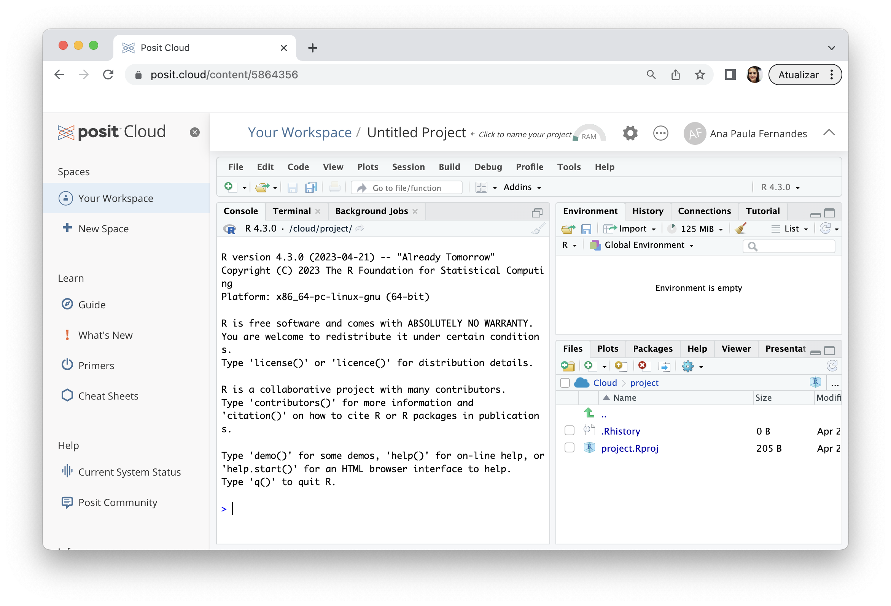

# Ambiente computacional {#ambiente-computacional}

Existem vários softwares que são dedicados a análise estatística que vão do maravilhoso SPSS (da IMB) às planilhas eletrônicas (como o Excel). Para citar alguns algumas dessas ferramentas:

**Softwares pagos**

* SPSS <https://www.ibm.com/br-pt/spss>

* Stata <https://www.stata-brasil.com/software/stata.html>

* SAS <https://www.sas.com/pt_br>

* JMP <https://www.jmp.com/>

* Prisma <https://software.com.br/p/prism>

* Minitab <https://osbsoftware.com.br/produto/minitab-statistical-software>

* Excel (Microsoft)

**Softwares livre**

* Jamovi <https://www.jamovi.org>

* OpenStat <https://openstat.info>

**Liguagens computacionais**

* R <https://www.r-project.org>

* Python <https://www.python.org/> 

Concentraremos nossas forças na utlização do R, que é uma linguagem computacional que foi desenvolvida especificamente para análise estatística. Saiba um pouco mais o motivo dessa escolha: <https://blog.curso-r.com/posts/2021-07-23-por-que-usar-r/>

Assim, vamos preparar o ambiente computacional para realizarmos nossas análises. 

> E para ficar claro:

* **R é uma linguagem computacional** (não se preocupe, não vamos programar!)

* **RStudio é um software** onde executaremos códigos R, é o que o pessoal da computação denomina de ambiente de desenvolvimento (IDE).^[Integrated Development Environment - Ambiente de Desenvolvimento Integrado]

## Plano A: Instalação R e RStudio

No laboratório de informática da UFTM o R e a IDE RStudio estão instaladas nos computadores que utilizamos nas nossas aulas práticas, no entanto, nem sempre há tempo de desenvolver todas as atividades em sala de aula, assim, fica a sugestão para que o estudante faça a instação do R e da IDE RStudio em seus computadores.

O RStudio é propriedade da empresa Posit (desde outubro de 2022), em seu site são dadas as instruções:

1. Instale o R <https://cran.rstudio.com>

2. Instale o RStudio Desktop <https://posit.co/download/rstudio-desktop>

> Ou, veja diretamente no site <https://posit.co/download/rstudio-desktop>

É importante baixar e instalar as versões do R e RStudio que sejam compatíveis com seu computador.

Essa etapa de preparação do ambiente computacional é de suma importância para o andamento da disciplina, para que as atividades sejam executadas, mas pode ser que você enfrente algum tipo dificuldade na instalação, então faça o quanto antes!

Se der tudo certo, ao clicar no ícone do RStudio, uma tela parecida como será apresentada:

Se nada der certo, temos o plano B.

## Plano B: R e RStudio online

O plano B é tão bom, mas tão bom, que poderia ser considerado plano A, no entanto, é preciso estar conectado à Intenet, o RStudo será excutado online na nuvem da Posit. 

Se você tem uma boa conexão de Internet, fica a sugestão para usar o plano B.

1. Acesse <https://posit.cloud>

2. Faça o login (eu, por exemplo, acesso com meu usuário do Google)

3. A seguinte tela será apresentada 

4. Crie um projeto RStudio, selecionando a opção _New Project_, e em seguida, escolhendo _New RStudio Project_.

{width=40%}

Se deu tudo certo, você verá a seguinte tela:

O melhor de usar a nuvem da Posit é que tudo armazenado por lá, isso quer dizer que suas análises ficam gravadas em um lugar seguro.
