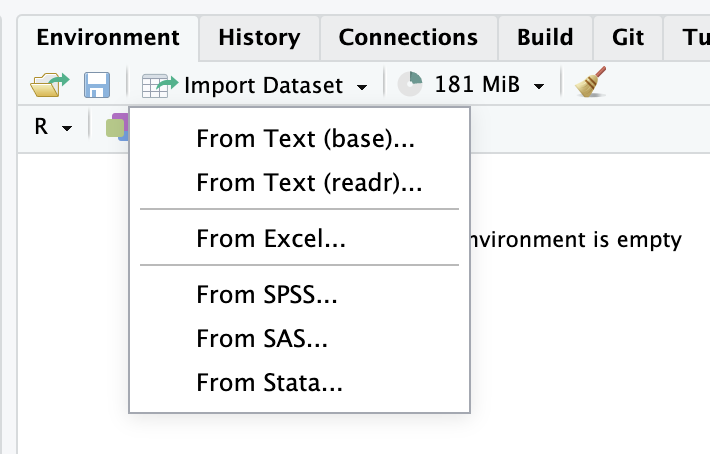
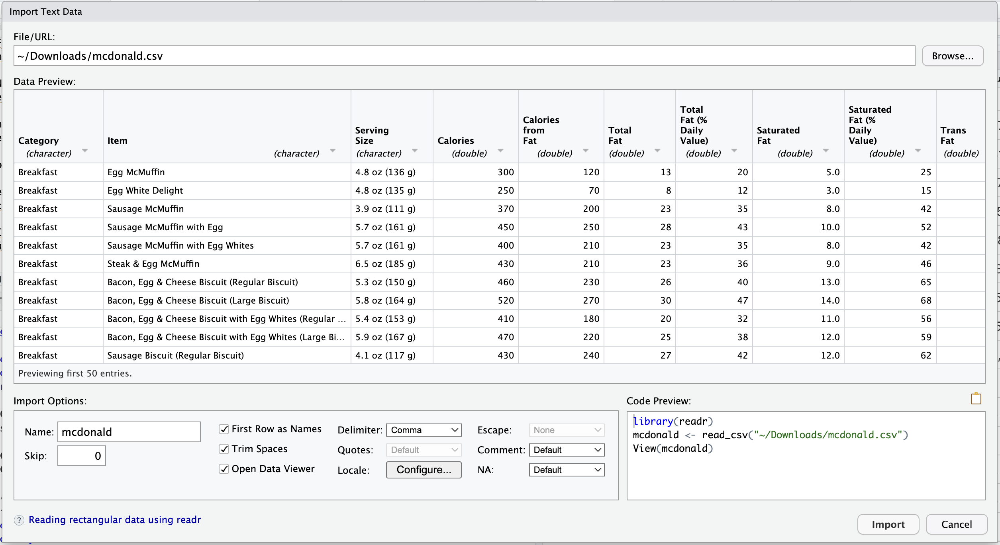
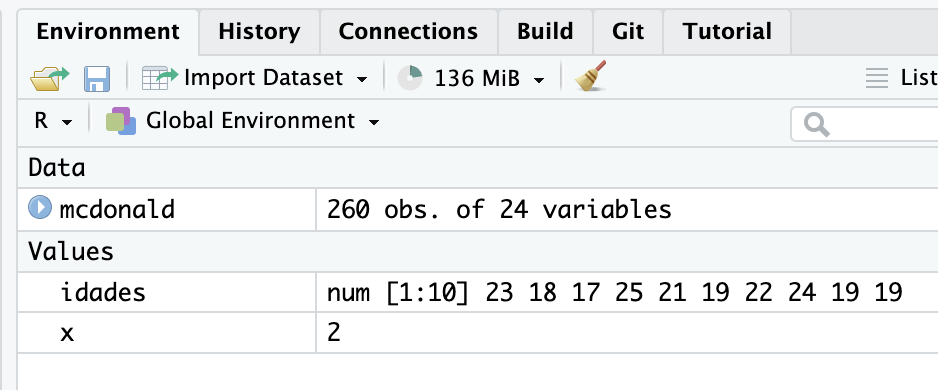
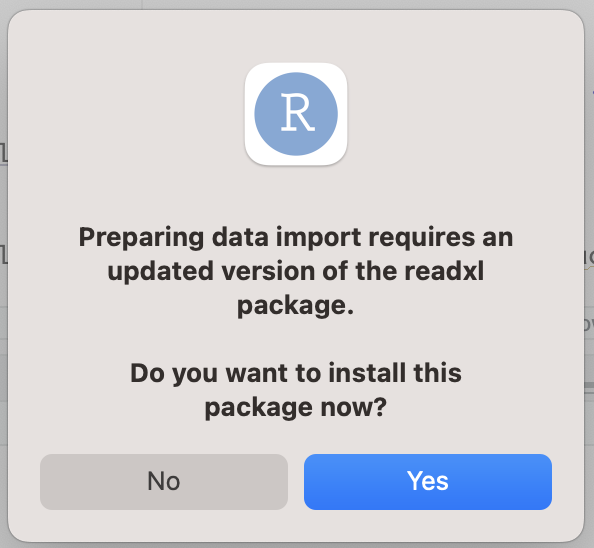

# Importando banco de dados

Até aqui, todos os dados que usamos foram digitados por nós mesmos, direto no script, como no vetor `idades` ou no `Batimentos`. Isso funciona para dez ou vinte valores. Na prática, os dados de uma pesquisa vêm em um **arquivo**, com centenas ou milhares de linhas, e o nosso trabalho passa a ser **trazer esse arquivo para dentro do R**. É disso que trata este capítulo.

Os dois tipos de arquivo mais comuns são:

+ Arquivo do tipo Excel (xls ou xlsx)

+ Arquivo de texto separado por vírgulas (csv, de *comma-separated values*)

Muitos dados de pesquisa são hoje publicados livremente, para que qualquer pessoa possa conferir os resultados de um estudo ou fazer perguntas novas com o mesmo material. Esse movimento se chama **ciência aberta**, e é graças a ele que você consegue fazer um bom trabalho sem precisar coletar dados próprios. Algumas fontes para começar:

+ DataSus: <https://datasus.saude.gov.br/transferencia-de-arquivos>

+ OMS: <https://www.who.int/data/collections>

+ Kaggle: <https://www.kaggle.com/datasets>

> O assunto é grande e rende bons trabalhos, então tem dois capítulos só para ele no fim do livro: um sobre **ciência aberta** e onde encontrar dados e artigos abertos, e outro sobre os **dados do DATASUS**, que é a principal fonte brasileira para quem é da área da saúde.

> Os bancos usados neste livro ficam reunidos em <https://ana-mat-br.github.io/dados/>. Cada capítulo apresenta o endereço do arquivo que vai usar, para você baixar ou ler direto pelo R.

## Antes de tudo: onde o arquivo mora

Esta seção parece boba, mas é onde quase todo mundo trava na primeira vez. Leia com calma.

Quando você baixa um arquivo da internet, ele **não fica solto no computador**: ele é guardado dentro de uma **pasta**. Na maioria dos computadores, essa pasta se chama **Downloads**, e é para lá que tudo vai por padrão, sem perguntar nada.

O R, por sua vez, não adivinha onde as coisas estão. Suponha que você baixou o arquivo `mcdonald.csv` e escreveu apenas isto:

```r
mcdonald <- read_csv("mcdonald.csv")
```

O R vai procurar esse arquivo em **um único lugar**: a pasta que ele considera a sua, naquele momento. Se o arquivo estiver na Downloads e essa não for a pasta em que o R está, ele não encontra e devolve um erro — mesmo que o arquivo esteja ali, a dois cliques de distância.

**Você precisa dizer onde o arquivo está**, e é só isso que aquelas linhas de código cheias de barras e aspas estão fazendo: soletrando o endereço da pasta para o R.

### Como é um caminho por extenso

Vale ver um de verdade, escrito inteiro. Em um Mac, o `mcdonald.csv` recém-baixado costuma estar aqui:

```
/Users/anafernandes/Downloads/mcdonald.csv
```

E no Windows, assim:

```
C:/Users/anafernandes/Downloads/mcdonald.csv
```

Leia da esquerda para a direita, e cada barra vira a palavra "dentro de":

| Pedaço | O que é |
|--------|---------|
| `/Users` (ou `C:/Users`) | a parte do disco onde ficam as pastas das pessoas |
| `anafernandes` | a sua pasta pessoal, com o nome do seu usuário |
| `Downloads` | a pasta para onde o navegador manda tudo |
| `mcdonald.csv` | finalmente, o arquivo |

Ou seja: *dentro de Users, dentro de anafernandes, dentro de Downloads, o arquivo mcdonald.csv*. É comprido, mas não tem mistério nenhum: é o mesmo caminho que você percorre clicando pasta por pasta, só que escrito em uma linha.

> **No Windows, cuidado com a barra.** O Explorer mostra o caminho com barra invertida (`C:\Users\...`), mas o R não aceita essa barra sozinha. Troque todas por barra normal (`C:/Users/...`), ou duplique-as (`C:\\Users\\...`). É um detalhe bobo que gera muito erro.

A boa notícia é que existem quatro formas de dizer isso ao R, e **três delas não exigem que você entenda de pastas**. Vamos ver as quatro, da mais simples para a mais técnica:

1. **Pelo botão do RStudio**, apontando o arquivo na tela.
2. **Pelo endereço da internet**, sem nem baixar o arquivo.
3. **Escolhendo o arquivo em uma janela**, que o próprio R abre para você.
4. **Escrevendo o caminho da pasta**, que é o que você vai usar quando os dados forem seus.

Comece pela primeira. As outras fazem mais sentido depois que você viu uma funcionar.

## Forma 1: pelo botão Import Dataset

Esta é a forma mais segura para começar, porque você **navega até o arquivo com o mouse**, do mesmo jeito que faz para abrir uma foto ou um documento. E tem um bônus: no fim, o RStudio **escreve o código para você**.

1. Faça o *download* do banco de dados **mcdonald.csv**, clicando aqui: <https://ana-mat-br.github.io/dados/mcdonald.csv>
(fonte original: https://www.kaggle.com/datasets/mcdonalds/nutrition-facts). Repare em qual pasta o seu navegador salvou o arquivo — quase sempre é a **Downloads**.

2. Na área de ambiente de memória, localize **Import Dataset**, ao clicar nessa opção você terá o seguinte:

<center>{width=40%}
</center>

+ Como queremos importar um arquivo csv, a melhor opção é a segunda **From Text (readr)**

+ **_readr_** é uma pacote do R que faz a leitura de arquivo csv (se o pacote ainda não estiver instalado no seu computador, o R fará a instalação, se você concordar!)

3. Clicando na opção **From Text (readr)**, no botão **browser** indique onde (no seu computador) está localizado o arquivo a ser importado. É aqui que você navega até a pasta Downloads e clica no arquivo. A seguinte tela será apresentada:

<center>
</center>

+ No quadro **Data Preview**, temos uma "prévia" com os nomes da variáveis, seus tipos computacionais e os primeiros valores que estão armazenados no banco de dados.

+ No quadro **Import Options** temos as opções de importação, fique atento ao **Name** do seu banco de dados, geralmente usamos nomes sem espaços ou caracteres especiais (', ~  ou ç), é até permitido usar alguns desses caracteres especiais, mas evite. 

+ Ainda no quadro **Import Options**, observe que a opção **Open Data Viewer** está marcada, isso significa que ao importar o banco de dados, o arquivo de banco de dados será aberto pelo RStudio. Caso esteja trabalhando com bancos com muitos dados (como os bancos do dataSUS), talvez seja melhor desmarcar essa opção para não sobrecarregar o processamento do seu computador.

+ O quadro **Code Preview** mostra como é a importação (leitura) do banco de dados via código. É interessante copiar esse trecho de código para o arquivo de script.

4. Clique no botão **Import** e observe que no ambiente de memória será criado o objeto do tipo **Data** com o nome do banco de dados que foi importado. 

<center>{width=60%}
</center>

+ Observe que esse objeto do tipo **Data** é diferente dos objetos do tipo **Values** que vimos nos exemplos iniciais.

+ Ao clicar no ícone ao lado do nome do objeto, temos acesso ao nomes e tipos computacionais das variáveis, e ao clicar sobre nome do objeto, o banco será aberto!

> **Olhe de novo para o quadro Code Preview antes de clicar em Import.** Aquele texto esquisito, cheio de barras, é o **caminho** do arquivo: é o endereço da pasta onde ele está, escrito do jeito que o computador entende. O botão fez por você exatamente o que você faria à mão. Copie esse código para o seu script: da próxima vez, basta executá-lo, sem precisar repetir os cliques.

## Forma 2: sem baixar nada

Se o arquivo está na internet e você sabe o endereço dele, o R busca sozinho. Não precisa baixar, não precisa saber de pasta nenhuma, não precisa de caminho. Você copia o endereço e coloca entre aspas, no lugar do nome do arquivo:

```{r importurl, message=FALSE, warning=FALSE}
library(readr)
nascimentos <- read_csv("https://ana-mat-br.github.io/dados/nascimentos.csv")

nrow(nascimentos)
```

Pronto: o banco está na memória do R. Esta é a forma mais rápida de todas, e é a que usaremos nos exemplos deste livro, justamente para que você possa copiar o código e executá-lo sem nenhum preparo.

> A única exigência é estar conectado à internet. Se a conexão cair, o R não encontra o arquivo.

## Forma 3: escolhendo o arquivo na tela

Existe um meio-termo entre o botão e o caminho escrito: a função `file.choose()`. Ela abre a mesma janelinha de procurar arquivo que você já conhece, e devolve o caminho para o R automaticamente.

```r
# a janela de escolher arquivo vai abrir; navegue até o arquivo e clique nele
mcdonald <- read_csv(file.choose())
```

É prática e não exige saber onde nada está. A desvantagem é que ela **pergunta toda vez**: se você fechar o RStudio e voltar amanhã, terá que procurar o arquivo de novo. Por isso ela serve para um teste rápido, mas não para um trabalho que você vai repetir.

## Forma 4: escrevendo o caminho

Esta é a forma que você vai usar quando os dados forem **seus**, porque os seus dados não vão estar em endereço nenhum da internet. E é a que exige entender a ideia de pasta — mas o RStudio tem um recurso que resolve quase todo o problema.

### O Projeto do RStudio

Um **Projeto** é simplesmente **uma pasta que o RStudio considera a sua casa**. Tudo o que estiver dentro dela, o R acha sozinho, sem você precisar escrever caminho nenhum.

Para criar um: no menu, **File → New Project → New Directory → New Project**, escolha um nome (por exemplo, `estatistica`) e um lugar para ele ficar. O RStudio cria a pasta e abre o projeto. Você vai ver o nome dele no **canto superior direito** da tela — se estiver escrito ali, você está dentro do projeto.

Agora, se você **arrastar o arquivo `mcdonald.csv` para dentro dessa pasta**, o R passa a encontrá-lo só pelo nome:

```r
mcdonald <- read_csv("mcdonald.csv")
```

Sem barras, sem endereço, sem nada. É por isso que vale a pena criar o Projeto logo no começo: ele transforma o problema de "onde está o arquivo" em "está aqui do lado".

Se você quiser organizar melhor e criar uma subpasta chamada `dados` dentro do projeto, o nome dela entra antes, separado por uma barra:

```r
mcdonald <- read_csv("dados/mcdonald.csv")
```

A barra quer dizer "dentro de". Leia como: *dentro da pasta `dados`, o arquivo `mcdonald.csv`*.

> **Se aparecer o erro `does not exist in current working directory`**, o R não achou o arquivo. Na ordem, confira: (1) o nome do projeto aparece no canto superior direito do RStudio? (2) o arquivo está mesmo dentro da pasta do projeto? (3) o nome está escrito exatamente igual, inclusive maiúsculas e a terminação `.csv`? Quase sempre é uma dessas três.

## Importando um banco xls

Na área de ambiente de memória, localize **Import Dataset**, ao clicar sobre essa opção, escolha **From Excel...**

<center>{width=40%}
</center>

+ Se for a primeira vez que você estiver importando um arquivo Excel, pode ser necessária a instalação do pacote que fornece a biblioteca que tem a função de leitura de arquivo xls (**readxl**)! O RStudio mostrará um aviso parecido com este: 

<center>{width=40%}
</center>


## Exemplo 1

Como obter a média da variável **Calories** que é uma coluna do objeto **mcdonald**, que por sua vez, é um objeto do tipo **Data**? 

```{r eval=FALSE, results='hide'}
# Usamos o operador $
# Para calcular a média precisamos informar para função: 
# mean( NOME DO BANCO $ NOME DA COLUNA ): 
mean(mcdonald$Calories)
```

## Exemplo 2

Como armazenar os valores de uma variável (coluna), em um objeto do tipo **Values** e depois calcular a média?

```{r eval=FALSE, results='hide'}
# Uso o operador <- 
# Criamos o objeto 
caloria <- mcdonald$Calories
# Agora podemos usar o objeto que criamos, por exemplo para calcular a média e o desvio padrão
mean(caloria)
sd(caloria)
```

## Exemplo 3

O que acontece se usamos a função **summary()** para o objeto **mcdonald**, sem usar o operador, isto é sem indicar uma variável?
```{r eval=FALSE, results='hide'}
# No console será mostrado o resumo de todas as variáveis do banco!
summary(mcdonald)
```

> Essa forma de obter os resultados não é a melhor forma, vamos **instalar um pacote** para obter os resultados em uma tabela bem formatada que podemos copiar e colar diretamente para um editor de texto. 

## Exemplo 4: um banco da sua área

Os exemplos anteriores usaram o `mcdonald`, que serve bem para aprender o mecanismo da importação. Agora vamos repetir os mesmos três passos — importar, olhar uma variável, resumir o banco — em um banco da **sua** área.

Repare que todos eles têm **dados faltantes**, como qualquer coleta real. Vamos aprender a lidar com isso já aqui.

### Onde estão estes bancos

| Banco | Área | Endereço |
|-------|------|----------|
| `nascimentos.csv` | Medicina | <https://ana-mat-br.github.io/dados/nascimentos.csv> |
| `saude-mental.csv` | Psicologia | <https://ana-mat-br.github.io/dados/saude-mental.csv> |
| `aptidao-fisica.csv` | Educação Física | <https://ana-mat-br.github.io/dados/aptidao-fisica.csv> |

Nos exemplos abaixo usamos a **Forma 2**, o endereço da internet, para que você possa copiar o código e executar na hora. Se preferir baixar o arquivo e usar o botão **Import Dataset**, clique no endereço da tabela e siga a **Forma 1** — o resultado é exatamente o mesmo.

### Medicina: nascidos vivos em Uberaba

O arquivo `nascimentos.csv` traz os **3.602 nascimentos registrados em Uberaba em 2022**, extraídos do SINASC, o Sistema de Informações sobre Nascidos Vivos do DATASUS. São dados reais e públicos.

```{r ex4med, message=FALSE, warning=FALSE}
library(readr)
nascimentos <- read_csv("https://ana-mat-br.github.io/dados/nascimentos.csv")

# quantas linhas e colunas?
dim(nascimentos)

# média do peso ao nascer, em gramas
mean(nascimentos$peso_g)
```

As variáveis são: `peso_g` (peso ao nascer em gramas), `idade_mae`, `sem_gestacao` (semanas de gestação), `consultas_pn` (consultas de pré-natal), `apgar5`, `sexo`, `parto` (vaginal ou cesáreo), `escol_mae` (escolaridade da mãe) e `raca_mae`.

### Psicologia: saúde mental de universitários

O arquivo `saude-mental.csv` traz escores de 320 universitários em três instrumentos que você viu no capítulo de conceitos fundamentais: **PSS-10** (estresse percebido, de 0 a 40), **GAD-7** (ansiedade, de 0 a 21) e **WHO-5** (bem-estar, de 0 a 100).

```{r ex4psi, message=FALSE, warning=FALSE}
saude <- read_csv("https://ana-mat-br.github.io/dados/saude-mental.csv")
dim(saude)

# média do escore de estresse percebido
mean(saude$pss10)
```

As variáveis são: `pss10`, `gad7`, `who5`, `horas_sono`, `curso`, `sexo`, `idade` e `ansiedade` (alta ou baixa, pelo ponto de corte do GAD-7).

> **Atenção:** este banco é **simulado**. Ele não vem de uma coleta real: foi gerado por computador com médias e desvios plausíveis para universitários brasileiros. O script que o gera está aqui: [**gera-bancos-simulados.R**](https://ana-mat-br.github.io/scripts/gera-bancos-simulados.R). Usamos simulação aqui porque bancos reais com escalas psicométricas raramente são públicos, e porque as grandes pesquisas nacionais que teriam esses dados (como a PNS) exigem técnicas de amostragem complexa que estão além do nosso escopo.

### Educação Física: aptidão física e atividade semanal

O arquivo `aptidao-fisica.csv` traz 280 participantes com minutos semanais de atividade física, IMC, percentual de gordura e VO₂ máximo estimado.

```{r ex4edf, message=FALSE, warning=FALSE}
aptidao <- read_csv("https://ana-mat-br.github.io/dados/aptidao-fisica.csv")
dim(aptidao)

# mediana de minutos de atividade física por semana
median(aptidao$min_af_semana)
```

As variáveis são: `min_af_semana`, `vo2max`, `imc`, `perc_gordura`, `modalidade`, `sexo`, `idade` e `ativo` (sim ou não, pelo critério de 150 minutos semanais da OMS).

> Assim como o banco de Psicologia, este é **simulado**, e gerado pelo mesmo script.

### E quando aparece NA?

Experimente calcular a média de uma variável que tenha dados faltantes:

```{r ex4na, message=FALSE, warning=FALSE}
# no banco de nascimentos, 135 registros não têm o número de consultas
mean(nascimentos$consultas_pn)
```

O resultado é `NA`, e não um número. O R está sendo honesto: ele não sabe quanto vale a média se alguns valores são desconhecidos. Para calcular a média apenas com quem tem informação, use o argumento `na.rm = TRUE` (de *remove NA*):

```{r ex4narm, message=FALSE, warning=FALSE}
mean(nascimentos$consultas_pn, na.rm = TRUE)

# quantos valores faltam em cada variável?
colSums(is.na(nascimentos))
```

> **Isto vale para o resto do livro.** As funções `mean()`, `median()`, `sd()`, `var()`, `min()`, `max()` e `quantile()` todas devolvem `NA` se houver um único valor faltante, e todas aceitam `na.rm = TRUE`. Antes de qualquer análise, vale rodar `colSums(is.na(seu_banco))` para saber com o que você está lidando — e **relatar quantos casos foram perdidos** quando escrever seus resultados.


<center>
<script src="https://unpkg.com/@lottiefiles/lottie-player@latest/dist/lottie-player.js"></script>
<lottie-player src="https://assets8.lottiefiles.com/packages/lf20_ynsr82zq.json"  background="transparent"  speed="2"  style="width: 200px; height: 200px;"  loop  autoplay></lottie-player>
</center>
