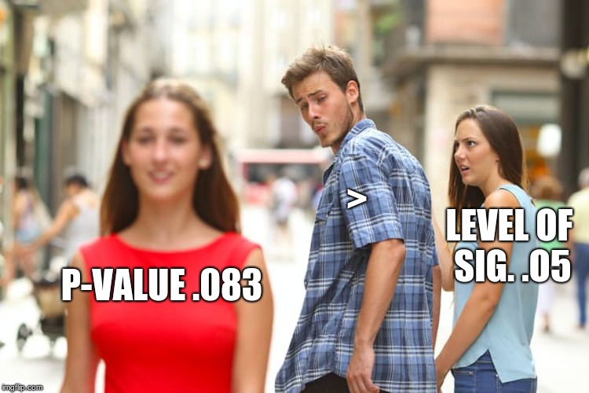
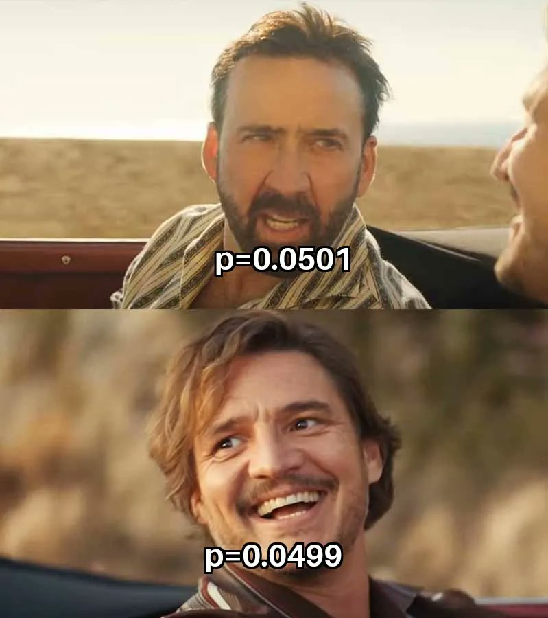

# Memes de Estatística: p-valor

O p-valor é um dos conceitos mais populares (e polêmicos) da estatística. A seguir, veja alguns memes famosos sobre p-valor, acompanhados de interpretações e tradução para o português.

Memes ajudam a ilustrar de forma divertida como o p-valor é frequentemente mal interpretado ou supervalorizado. Rejeitar H0 não é tudo: pense criticamente sobre seus resultados!

## Quando você encontra um p-valor baixo e sabe que deve rejeitar H0

**Tradução:**  
Quando você encontra um p-valor baixo e sabe que deve rejeitar a hipótese nula.

**Interpretação:**  
O meme brinca com o entusiasmo de muitos pesquisadores ao encontrar um p-valor baixo (menor que 0,05), pois sabem que isso permite rejeitar a hipótese nula (H0). No entanto, é importante lembrar que rejeitar H0 não garante que o resultado seja relevante do ponto de vista prático ou científico. O p-valor indica o quanto os resultados observados seriam inesperados caso a hipótese nula fosse verdadeira, mas não informa o tamanho ou a relevância prática dessa diferença encontrada.

---

## Homem-Aranha apontando

**Tradução:**  
P < 0,05  
Rejeitar a hipótese nula  
Estatisticamente significativo

**Interpretação:**  
Esse meme mostra como as pessoas frequentemente confundem ou usam como sinônimos as expressões "p < 0,05", "rejeitar a hipótese nula" e "significância estatística". Na prática, são conceitos relacionados, mas não exatamente iguais: um p-valor menor que o nível de significância leva à rejeição de H0, o que é chamado de resultado estatisticamente significativo. Mas lembre-se: um resultado pode ser estatisticamente significativo e, mesmo assim, não ter importância prática no mundo real.

---

## Namorado distraído

**Tradução:**  
p-valor 0,083  
>  
Nível de significância 0,05

**Interpretação:**  
O pesquisador está andando tranquilamente com sua fiel companheira, o nível de significância 0,05, mas não resiste e joga aquele olhar para o p-valor 0,083 que acabou de passar. Mesmo sabendo que, tecnicamente, 0,083 é “maior” do que 0,05 e não deveria chamar tanta atenção, ele fica tentado a inventar desculpas para dar uma chance àquele resultado quase-significativo: “ah, mas foi quase!”, “quem nunca, né?”. No fundo, esse é o típico caso do pesquisador que se empolga com resultados que chegaram perto do valor de corte, tentando transformar um “quase” em uma grande descoberta. Mas é importante lembrar: resultado quase significativo ainda não é significativo!

---

## Willy Wonka e o p-valor menor que 0,05

**Tradução:**  
Ah, você encontrou um p-valor menor que 0,05?  
Por favor, me conte tudo sobre sua grande descoberta.

**Interpretação:**  
Willy Wonka ironiza a empolgação de quem encontra um p-valor abaixo de 0,05, sugerindo que nem sempre isso significa uma grande descoberta. O meme alerta para a importância de interpretar o p-valor no contexto do estudo, considerando tamanho de efeito, relevância prática e outros fatores além da simples significância estatística. O próprio Wonka pediria: “me convença de que seu resultado importa de verdade!”

---

## Cantada Nerd

**Tradução**:  
Ei, garota, seu p deve ser maior que 0,05, porque eu falho em te rejeitar.

**Interpretação**:  
Esse meme faz uma brincadeira romântica usando a linguagem estatística: em vez de rejeitar a hipótese nula, a pessoa está dizendo que não consegue rejeitar a garota, assim como um p-valor acima de 0,05 geralmente significa que não rejeitamos H0. É o clássico “não posso te rejeitar, cientificamente falando”! Uma piada para conquistar corações e estatísticos ao mesmo tempo.

---

## P-valor não é tudo

**Tradução:**  
Cena de duas pessoas no carro, uma com expressão de frustração ao ouvir "p-values", enquanto a outra está alegre ou satisfeita.

**Interpretação:**  
A graça do meme está justamente no contraste entre frustração e alegria: enquanto uma pessoa demonstra cansaço ou desapontamento ao ouvir sobre p-values de novo, a outra parece satisfeita só com isso. O meme brinca com as diferentes expectativas na análise estatística, há quem se contente apenas com a significância estatística (p < 0,05), enquanto outros esperam uma análise completa, considerando também o tamanho do efeito, intervalos de confiança, e a real relevância dos achados. É um lembrete de que estatística vai além do p-value!

---

## Coitado do tamanho do efeito

**Tradução:**  
À esquerda, uma fila enorme se forma na barraca "p-values". À direita, a barraca "effect sizes" está vazia, quase ouvindo grilos.

**Interpretação:**  
Este meme é o retrato da triste (e hilária) realidade dos artigos científicos: todo mundo corre para saber se o valor de p é menor que 0,05, como se fosse a última coca-cola do deserto. Já o tamanho do efeito, que realmente diz se o resultado é relevante, é solenemente ignorado. Moral estatística: enquanto os p-values lotam (mesmo que tragam resultados irrelevantes), o effect size fica sozinho no canto, esperando alguém notar sua real importância. Quem entende estatística sabe: tamanho do efeito merece atenção!

---

## Senhora estatística

**Tradução:**  
Em cima: "ONE DOES NOT SIMPLY" ("SIMPLESMENTE NÃO SE...")
Embaixo: "REPORT P-VALUES WITHOUT EFFECT SIZES" ("RELATA P-VALORES SEM TAMANHOS DE EFEITO")

**Interpretação:**  
Esse meme faz referência ao clássico da cultura pop (Senhor dos Aneis) para lembrar que estatística não é terra sem lei: não basta encontrar um p < 0,05 e sair comemorando. Relatar apenas o valor de p é igual a contar só metade da fofoca: falta o contexto! O tamanho do efeito é quem diz se a diferença é daquelas que mudam a vida ou se é só uma diferença microscópica e irrelevante. Em outras palavras, estatística de verdade combina significado estatístico (p-value) com significado prático (effect size). Não faça estatística “pela metade”!

---

## Pobi do gatinho

**Tradução:**  
Primeira cena: Pessoa abraça um cachorro chamado “P-VALUES”. Atrás, um gato (effect sizes) observa, excluído.  
Demais cenas: Close no gato “effect sizes”, visivelmente triste, segurando um brinquedo, ignorado.

**Interpretação:**  
O meme mostra o drama dos tamanhos de efeito: sempre deixados de lado, enquanto os p-values recebem todo o carinho e atenção. É como se o cachorro (p-value) ganhasse petiscos só por latir, enquanto o gato (effect size), que realmente entrega o conteúdo, só observa de longe. Estatisticamente, é como celebrar um resultado significativo sem saber se ele realmente importa no mundo real. O gato chora, e o revisor do artigo também!

---

Esses memes ilustram, com bom humor, que o p-valor sozinho não conta toda a história. Um resultado estatisticamente significativo não garante relevância prática. O tamanho do efeito é fundamental para avaliar se uma diferença observada tem impacto real, e não apenas estatístico. Ao analisar dados, valorize tanto o p-valor quanto o tamanho do efeito para conclusões mais robustas e informativas.
