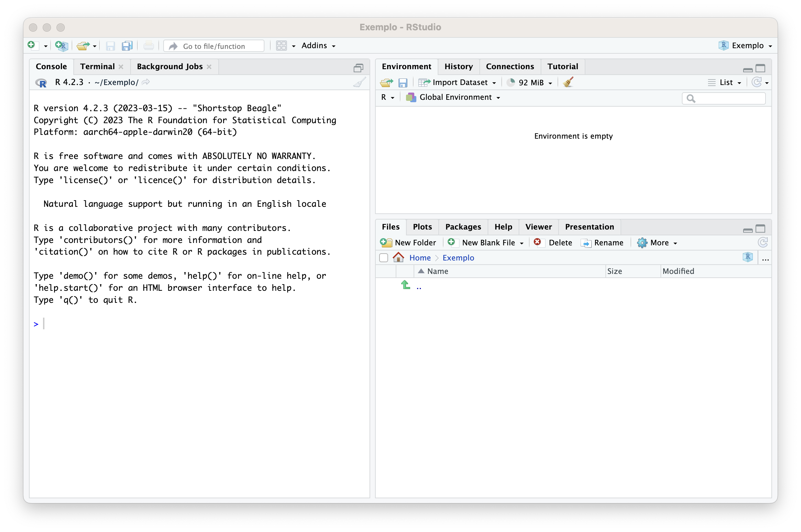
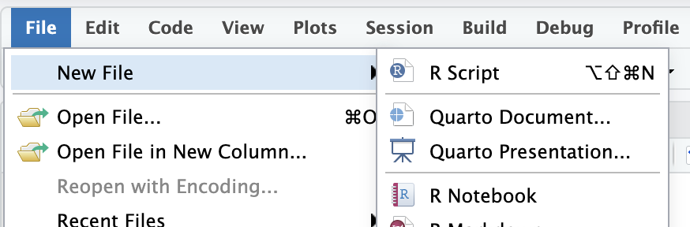
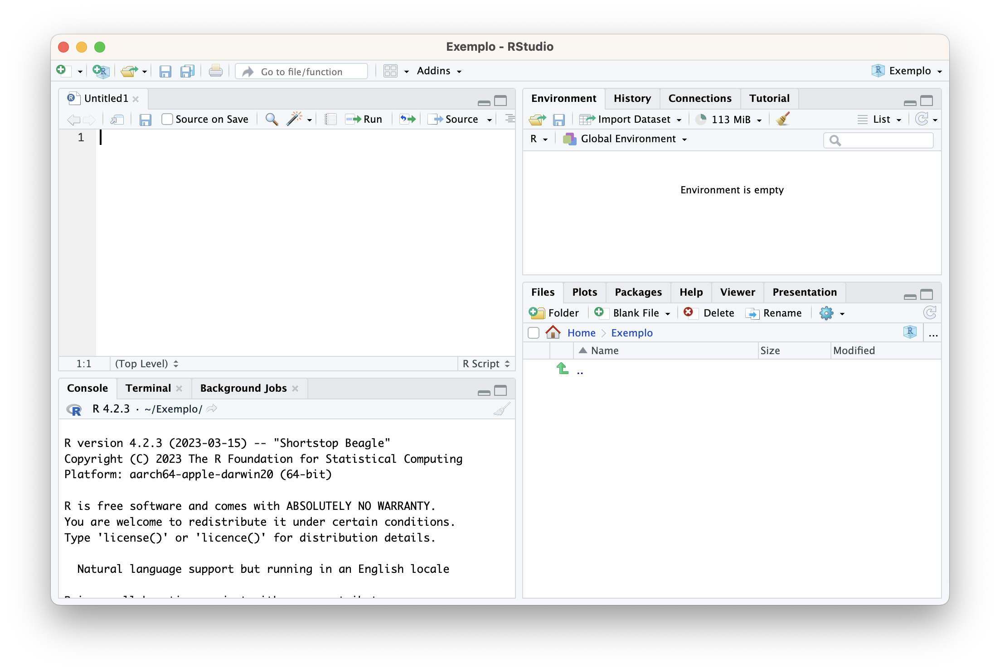
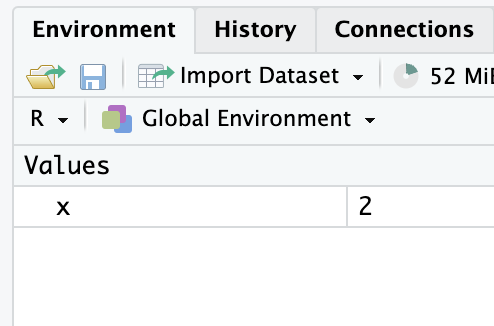
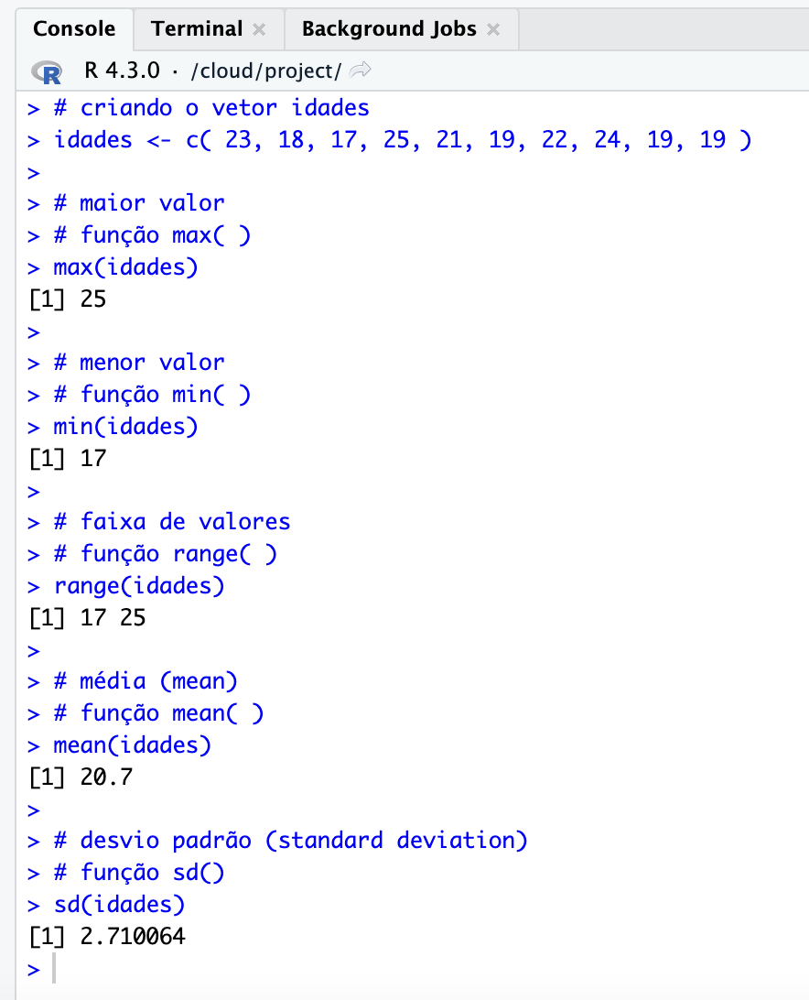
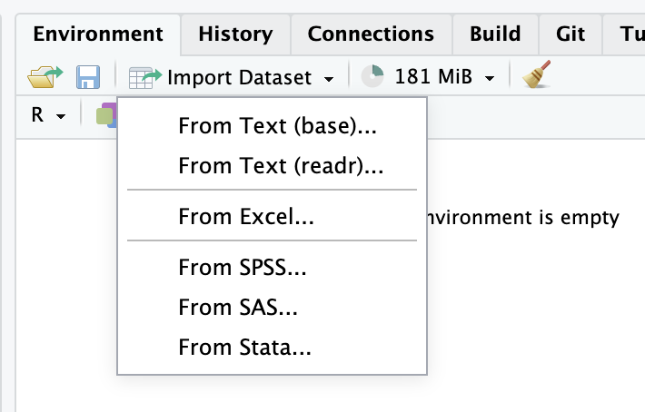
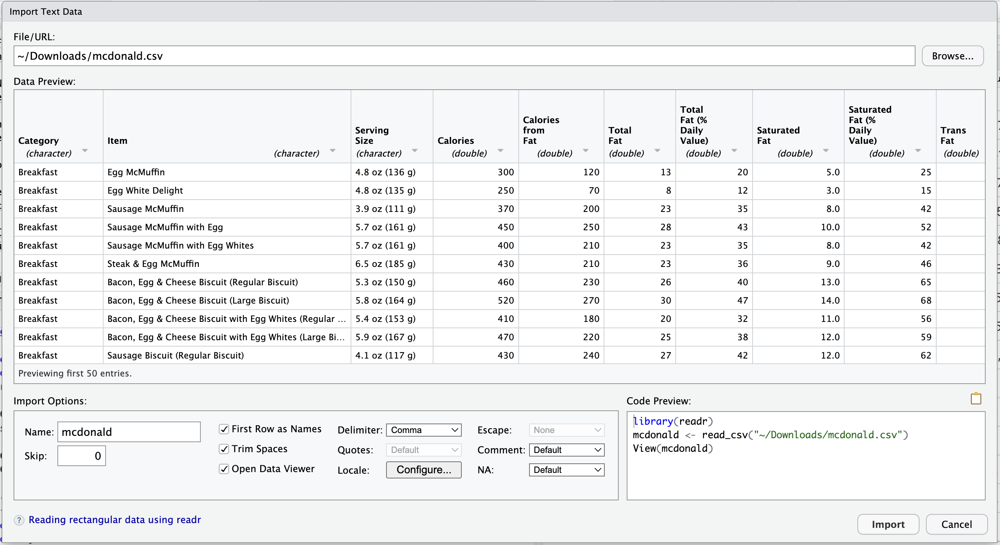
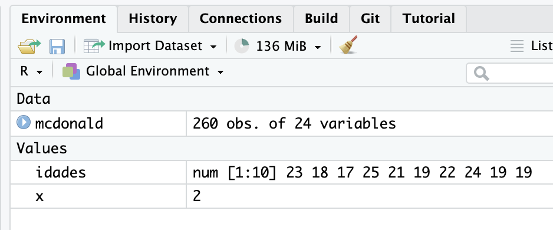
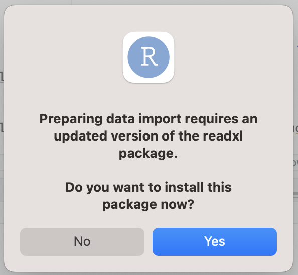

--- 
title: "Estatística + R"
author: "Ana Paula Fernandes (DESCO/UFTM)"
date: "Atualizado em: `r format(Sys.time(), '%d/%m/%Y')`"
site: bookdown::bookdown_site
output: bookdown::gitbook
documentclass: book
bibliography: [book.bib, packages.bib]
biblio-style: apalike
link-citations: yes
---

# Bem-vindos!
<center>
<script src="https://unpkg.com/@lottiefiles/lottie-player@latest/dist/lottie-player.js"></script>
<lottie-player src="https://assets1.lottiefiles.com/packages/lf20_3rqwsqnj.json"  background="transparent"  speed="1"  style="width: 300px; height: 300px;"  loop  autoplay></lottie-player>
</center>

Esse livro _online_ tem como propósito principal ser um guia para as aulas de estatística, referente as disciplinas de **Bioestatística** para os curso de Medicina e Educação Física e **Estatística Aplicada** para o curso de Psicologia da Universidade Federal do Triângulo Mineiro (UFTM) <http://www.uftm.edu.br>. E como objetivo secundário, ser uma referência de consulta para todos os discentes que passaram por essas disciplinas, bem como, para todos que estão interessados em realizar análises de dados por meio da linguagem R e o ambiente de desenvolvimento RStudio.

Sugestões, correções ou qualquer outra forma de interação são sempre bem-vindas! Então, por favor, não hesite em me escrever (anapaula.fernandes@uftm.edu.br).

E vamos lá! 


<!-- The **bookdown** package can be installed from CRAN or Github: -->

<!-- ```{r eval=FALSE} -->
<!-- install.packages("bookdown") -->
<!-- # or the development version -->
<!-- # devtools::install_github("rstudio/bookdown") -->
<!-- ``` -->

<!-- Remember each Rmd file contains one and only one chapter, and a chapter is defined by the first-level heading `#`. -->

<!-- To compile this example to PDF, you need XeLaTeX. You are recommended to install TinyTeX (which includes XeLaTeX): <https://yihui.name/tinytex/>. -->

<!-- ```{r include=FALSE} -->
<!-- # automatically create a bib database for R packages -->
<!-- knitr::write_bib(c( -->
<!--   .packages(), 'bookdown', 'knitr', 'rmarkdown' -->
<!-- ), 'packages.bib') -->
<!-- ``` -->

<!--chapter:end:index.Rmd-->

# Introdução {#intro}

Ao longo de algum tempo ministrando aulas de estatísticas conclui que estudar estatística com auxílio de recursos computacionais é bem mais eficaz, quero dizer, é mais fácil entender os conceitos téoricos, lidar com recusos visuais (gráficos) e, de fato, transformar o contéudo estudado na disciplina em uma ferramenta para pesquisas científicas, quando se trata de analisar dados.

Ministrando aulas para os cursos da área de saúde, esporte e psicologia sempre ouvi dos discentes que estatística é matemática, e sempre digo que estatística é estatística! É normal alguns discentes não assimilarem, em princípio, a importância da disciplina na grade do seu curso, e realmente, alguns acham até que é assunto que deveria ficar restrito aos curso das exatas. Assim, a primeira tarefa é sempre desconstruir essa ideia.

A estatística é **MULTIDICIPLINAR**, ela está em tudo na verdade... e para dizer uma coisa "bem chique" a estatística é a base da Inteligência Artificial. Advinha quem está por trás dos famosos algortimos das redes sociais? Ou das sugestões de filmes e músicas que aparecem no seu _streamming_ favorito? Ou no ranque de busca realzada por meio do _Google_? Ou no _Chat_ GTP?

E sendo um pouco mais "acadêmica", dentro do nosso propósito:

Qualquer competição ou treinamento esportivo está recheado de estatística, como medir o desempenho de um time ou atleta? Veja esse exemplo aqui:

> **Velocidade e resistência de velocidade de sprint em atletas de Futebol amador** <http://www.rbff.com.br/index.php/rbff/article/view/866>

Na medicina, estudos epidemiologicos, e claro, da medicina baseada em evidências, tem o suporte da estatística. Veja esse exemplo aqui:

> **Qualidade de Vida Relacionada à Saúde e Satisfação com o Tratamento Hospitalar de Adultos com Câncer: Estudo Observacional**
<https://rbc.inca.gov.br/index.php/revista/article/view/3554>

Na psicologia a estatística é a ferramenta utilizada na psicometria. Veja esse exemplo:

> **Escala de Comportamentos Antissociais: construção e estudos psicométricos** <https://periodicos.pucpr.br/psicologiaargumento/article/view/27071>

Basta realizar uma busca com os termos estatística e um campo do seu curso que você se interessa, que você encontrará um artigo científico. E se você não encontrar, comece a escreve sobre o tema!

Quando olhamos os artigos acima, podemos ver que todos eles tem resultados **descritivos** e **inferenciais**. Discutiremos sobre estatística descritiva (de descrever - os dados amostrados para uma dada análise) e inferencial (de inferir - tirar conclusões a partir dos dados amostrados) no próximo tópico.

<center>
<script src="https://unpkg.com/@lottiefiles/lottie-player@latest/dist/lottie-player.js"></script>
<lottie-player src="https://assets1.lottiefiles.com/packages/lf20_33asonmr.json"  background="transparent"  speed="1"  style="width: 300px; height: 300px;"  loop  autoplay></lottie-player>
</center>
## Atividade 1

**Busque um artigo do campo de seu interesse que utiliza a estatística.**

+ Qual é o principal objetivo da pesquisa? 

+ Como a pesquisa foi realizada? 

+ Observe o que é descrito por meio de tabelas ou gráficos.

+ Faça uma lista de termos que são relacionados à estatística.  


<script src="https://unpkg.com/@lottiefiles/lottie-player@latest/dist/lottie-player.js"></script>
<lottie-player src="https://assets6.lottiefiles.com/packages/lf20_LKXG6QRgtE.json"  background="transparent"  speed="1"  style="width: 200px; height: 200px;"  loop  autoplay></lottie-player>

> Periódicos da área da Ciência dos Esportes

* RBFF - Revista Brasileira de Futsal e Futebol <http://www.rbff.com.br>

* RBME - Revista Brasileira de Medicina do Esporte <https://www.scielo.br/j/rbme>

* RBPE - Revista Brasileira de Psicologia do Esporte <http://pepsic.bvsalud.org>

> Periódicos da área de Medicina

* RBC - Revista Brasileira de Cancerologia <https://rbc.inca.gov.br/index.php/revista>

* RBCMS - Revista Brasileira de Ciências Médicas e da Saúde <http://www.rbcms.com.br>

* Revista da Associação Brasileira de Saúde Coletiva <https://cienciaesaudecoletiva.com.br>

> Periódicos da área de Piscologia

* Psicologia argumento <https://periodicos.pucpr.br/psicologiaargumento>

* Estudos de psicologia (Campinas) <https://www.scielo.br/j/estpsi/>

* Psicologia em foco <https://revistas.fw.uri.br/index.php/psicologiaemfoco>

> Ou busque na ferramenta *Mendeley* <https://www.mendeley.com>


# Definições iniciais 

> A estatística é divida em duas partes:

* Estatística **DESCRITIVA**: é o ramo da estatística que envolve a organização, o
resumo e a representação dos dados.

* Estatística **INFERENCIAL**: é o ramo da estatística que envolve o uso de uma amostra para chegar a conclusões sobre uma população.

> Essas duas partes são conectadas pela téoria de probabilidade, especificamente pelas distribuições de probabilidade.

> População x Amostra:

* **POPULAÇÃO**: é a coleção de todos os resultados, respostas, medições ou contagens que são de interesse.

* **AMOSTRA**: é um subconjunto ou parte de uma população.

# Tamanho da amostra

O cálculo do tamanho da amostra é um procedimento simples, porém ele depende de vários conceitos da parte da estatística inferencial, e também dos objetivos das análises que serão feitas na pesquisa.

Existem várias calculadoras de tamanho de amostra, basta procurar no _Google_ por calculadora amostral, ou em inglês, por _sample size calculator_.

Um ótimo exemplo de calculadora amostral _online_: <http://estatistica.bauru.usp.br/calculoamostral/>, essa calculadora foi desenvolvida pelo pessoal da Faculdade de Odontologia da USP - Bauru, na opção cálculos podemos ver que essa ferramenta disponibiliza 15 opções de cálculo amostral! Então, já podemos perceber que: 

> A estimativa do tamanho de amostra adequado para uma pesquisa depende do objetivo da pesquisa!

O **G*Power** é um _software_ gratuito, desenvolvido pela Universidade de Düsseldorf, onde podemos claramente verificar que o tamanho da amostra depende principalmente dos objetivos da pesquisa, quais análises inferenciais serão feitas, isto é, quais testes estatísticos (testes de hipóteses) serão realizados. Veremos o conceito de **Poder do Teste**, por isso o _software_ leva esse nome.

Além disso, como nosso objetivo é usar o R, uma boa referência de cálculo amostral no R é o seguinte documento produzido por pesquisadores da DaCCoTA (Univesidade da Dakota do Norte) <https://med.und.edu/research/daccota/_files/pdfs/berdc_resource_pdfs/sample_size_r_module.pdf>

<center>
<script src="https://unpkg.com/@lottiefiles/lottie-player@latest/dist/lottie-player.js"></script>
<lottie-player src="https://assets1.lottiefiles.com/packages/lf20_33asonmr.json"  background="transparent"  speed="1"  style="width: 300px; height: 300px;"  loop  autoplay></lottie-player>
</center>
## Atividade 2

**Responda a partir do artigo buscado na atividade 1.**

+ O autores mencionaram sobre o cálculo do tamanho da amostra? 

+ A população da pesquisa foi bem delineada (bem definida)? 

+ Os autores mencionaram se a pesquisa foi submetida ao Comitê de Ética?

+ Qual a importância de submeter a pesquisa ao Comitê de Ética?


**Importante**

> Conheça o Comitê de Ética em Pesquisa (CEP) da UFTM

<https://www.uftm.edu.br/comitesecomissoes/cep>

<!-- You can label chapter and section titles using `{#label}` after them, e.g., we can reference Chapter \@ref(intro). If you do not manually label them, there will be automatic labels anyway, e.g., Chapter \@ref(methods). -->

<!-- Figures and tables with captions will be placed in `figure` and `table` environments, respectively. -->

<!-- ```{r nice-fig, fig.cap='Here is a nice figure!', out.width='80%', fig.asp=.75, fig.align='center'} -->
<!-- par(mar = c(4, 4, .1, .1)) -->
<!-- plot(pressure, type = 'b', pch = 19) -->
<!-- ``` -->

<!-- Reference a figure by its code chunk label with the `fig:` prefix, e.g., see Figure \@ref(fig:nice-fig). Similarly, you can reference tables generated from `knitr::kable()`, e.g., see Table \@ref(tab:nice-tab). -->

<!-- ```{r nice-tab, tidy=FALSE} -->
<!-- knitr::kable( -->
<!--   head(iris, 20), caption = 'Here is a nice table!', -->
<!--   booktabs = TRUE -->
<!-- ) -->
<!-- ``` -->

<!-- You can write citations, too. For example, we are using the **bookdown** package [@R-bookdown] in this sample book, which was built on top of R Markdown and **knitr** [@xie2015]. -->

<!--chapter:end:01-Introducao.Rmd-->

# Ambiente computacional {#ambiente-computacional}

Existem vários softwares que são dedicados a análise estatística que vão do maravilhoso SPSS (da IMB) às planilhas eletrônicas (como o Excel). Para citar alguns algumas dessas ferramentas:

**Softwares pagos**

* SPSS <https://www.ibm.com/br-pt/spss>

* Stata <https://www.stata-brasil.com/software/stata.html>

* SAS <https://www.sas.com/pt_br>

* JMP <https://www.jmp.com/>

* Prisma <https://software.com.br/p/prism>

* Minitab <https://osbsoftware.com.br/produto/minitab-statistical-software>

* Excel (Microsoft)

**Softwares livre**

* Jamovi <https://www.jamovi.org>

* OpenStat <https://openstat.info>

**Liguagens computacionais**

* R <https://www.r-project.org>

* Python <https://www.python.org/> 

Concentraremos nossas forças na utlização do R, que é uma linguagem computacional que foi desenvolvida especificamente para análise estatística. Saiba um pouco mais o motivo dessa escolha: <https://blog.curso-r.com/posts/2021-07-23-por-que-usar-r/>

Assim, vamos preparar o ambiente computacional para realizarmos nossas análises. 

> E para ficar claro:

* **R é uma linguagem computacional** (não se preocupe, não vamos programar!)

* **RStudio é um software** onde executaremos códigos R, é o que o pessoal da computação denomina de ambiente de desenvolvimento (IDE).^[Integrated Development Environment - Ambiente de Desenvolvimento Integrado]

## Plano A: Instalação R e RStudio

No laboratório de informática da UFTM o R e a IDE RStudio estão instaladas nos computadores que utilizamos nas nossas aulas práticas, no entanto, nem sempre há tempo de desenvolver todas as atividades em sala de aula, assim, fica a sugestão para que o estudante faça a instação do R e da IDE RStudio em seus computadores.

O RStudio é propriedade da empresa Posit (desde outubro de 2022), em seu site são dadas as instruções:

1. Instale o R <https://cran.rstudio.com>

2. Instale o RStudio Desktop <https://posit.co/download/rstudio-desktop>

> Ou, veja diretamente no site <https://posit.co/download/rstudio-desktop>

É importante baixar e instalar as versões do R e RStudio que sejam compatíveis com seu computador.

Essa etapa de preparação do ambiente computacional é de suma importância para o andamento da disciplina, para que as atividades sejam executadas, mas pode ser que você enfrente algum tipo dificuldade na instalação, então faça o quanto antes!

Se der tudo certo, ao clicar no ícone do RStudio, uma tela parecida como será apresentada:

<center>
</center>

Se nada der certo, temos o plano B.

## Plano B: R e RStudio online

O plano B é tão bom, mas tão bom, que poderia ser considerado plano A, no entanto, é preciso estar conectado à Intenet, o RStudo será excutado online na nuvem da Posit. 

Se você tem uma boa conexão de Internet, fica a sugestão para usar o plano B.

1. Acesse <https://posit.cloud>

2. Faça o login (eu, por exemplo, acesso com meu usuário do Google)

3. A seguinte tela será apresentada 

<center>
</center>

4. Crie um projeto RStudio, selecionando a opção _New Project_, e em seguida, escolhendo _New RStudio Project_.

<center>{width=40%}
</center>

Se deu tudo certo, você verá a seguinte tela:

<center>
</center>

O melhor de usar a nuvem da Posit é que tudo armazenado por lá, isso quer dizer que suas análises ficam gravadas em um lugar seguro.

<!--chapter:end:02-Ambiente-Computacional.Rmd-->

# Trabalhando no RStudio {#trabalhando-RStudio}

Seja na versão instalada no seu computador (plano A) ou na nuvem (plano B), conheça melhor as áreas do RStudio:

1. **Console:** local onde serão apresentadas as respostas para códigos execudados;

2. **Ambiente de memória (Environment):** é o cerébro do R, onde ficam registrados os objetos que ele reconhece. 

3. A área de **Arquivos (Files), Gráficos (Plots), Pacotes (Packages), Ajuda (Help), Visualização (Viewer) e Apresentação (Presentation)**: mostram respectivamente, os arquivos do diretório onde estão seus arquivos no computador, os gráficos, os pacotes, ajuda, janela de visualização e apresentação.

A figura abaixo identifica cada uma dessas áreas: 

<center>
</center>

Digitaremos os códigos da linguagem R, em um arquivo que chamamos de **script**, para abrir um arquivo do tipo script R, faça:

1. Acesse a opção **File** no menu principal do RStudio;

2. Escolha a opção **New File**

3. E depois a opção **R Script**


<center>{width=40%}
</center>

Assim, na tela da IDE RStudio aparecerá uma nova área, que é a área do arquivo script, como mostra a figura.

<center>
</center>

Observe que o arquivo está sem um nome **Untitled1** (sem titulo), salve o arquivo atribuindo-o um nome adequado. Para isso, no menu principal, escolha *File*, depois *Save*.

> Dica: O ideal seria criar um **Projeto**. Veja a opção _File > New Project_. 

<!--chapter:end:03-RStudio.Rmd-->

# Primeiros exercícios no R

Nos capítulos  \@ref(ambiente-computacional) e \@ref(trabalhando-RStudio) vimos sobre o ambiente computacional (computador ou nuvem) e identificamos as 4 áreas da tela da interface do RStudio: **console**, **ambiente de memória**, **arquivos, gráficos, etc.** e **script**, assim estamos prontos para escrever alguns códigos e executá-los a partir da área de script.

> **Atenção:** TODOS os cógigos serão digitados no arquivo de script, seguindo uma sequência lógica de passos, ou seja, escreveremos um roteiro (*script*), como se fosse uma receita de bolo, isso é o que o pessoal da computação chama de algoritmo.


## Exemplo 1

* Observe o código escrito na linha 1 do arquivo de script e o botão **Run** (primeira seta verde):

<center>
</center>

* O sequência de caracteres **<-** é o símbolo de atribuição no R.

> Pressionando as teclas ALT e - (menos) simultaneamente cria no script o sinal de atribuição.

* O código significa que criamos um objeto chamado **x** e atribuimos a esse objeto o valor 2.

* No entanto, o R ainda não sabe que o valor de x é igual a 2! 

* Para registrar essa informação na memória do R, devemos executar essa linha.

> Para executar uma linha posicione o cursor na linha, e clique no botão **Run**

<center>{width=40%}
</center>

> Observe sempre o ambiente de memória (bem como o console) quando executar uma linha.

## Exemplo 2

Execute o seguinte cógigo no R.

```{r}
idades <- c( 23, 18, 17, 25, 21, 19, 22, 24, 19, 19 )
```

* Esse código significa que foi criado um objeto chamado idade que armazena 10 valores: 23, 18, 17, 25, 21, 19, 22, 24, 19, 19, diferentemente do exemplo 1 em que x armazenava somente o valor 2. 

* Isso foi possível pois usamos a função **c( )**.

* observe que os valores foram colocado dentro dos parênteses da função **c( )**

> Com função **c( )** podemos **combinar** vários valores em um objeto, esse objeto recebe o nome de vetor ou lista.


## Exemplo 3 

Observe nesse código as funções:

* **max( )**

* **min( )**

* **range( )**

* **mean( )**

* **sd( )**

```{r echo=TRUE}
# criando o vetor idades 
idades <- c( 23, 18, 17, 25, 21, 19, 22, 24, 19, 19 )

# maior valor
# função max( )
max(idades)

# menor valor
# função min( )
min(idades)

# faixa de valores
# função range( )
range(idades)

# média (mean)
# função mean( )
mean(idades)

# desvio padrão (standard deviation)
# função sd() 
sd(idades)
```

> Copie o código e cole no seu arquivo script, selecione todo conteúdo (CRTL+A) e execute todo o cógigo de uma única vez.

* Observe que as respostas apareceram no **console**, conforme mostrado na figura abaixo:

<center>{width=40%}
</center>

> O símbolo # é o símbolo de comentário, isso significa que podemos escrever qualquer texto diferente do que o R sabe interpretar, e mesmo executando o código nenhum erro acontece! 

> **IMPORTANTE**: é uma boa prática comentar os trechos de códigos para deixar documentado qual é o objetivo do código.


<!--chapter:end:04-Primeiros-Exercicios.Rmd-->

# Tipos de variáveis

A natureza das variáveis (ou dados) são

+ **Quantitativa** - expressa quantidade 

   + Discreta - assume valores inteiros (contagem) 
 
   + Contínua - assume qualquer valor de um dado intervalo (mensuração)
  
+ **Qualitativa** - expressa qualidade (categorias, rótulos)

  + Nominal -  categorias que não podem ser ordenadas 
  
  + Ordinal -  categorias que podem ser ordenadas, existe uma graduação entre as categorias.


> Veja o vídeo do Prof. Heitor no **Canal Pesquise**: <https://youtu.be/_oc37Ea_tl8>!


O procedimento estatístico que iremos realizar depende da natureza da variável que estamos analizado, por exemplo:

+ Na estatística descritiva:

   + as variáveis qualitativas são representadas por sua frequência absoluta ou percentual;
   
   + as variáveis quantitativas são representadas por medidas resumo, como por exemplo, média e desvio padrão.

+ Na estatística inferencial:

   + o teste Qui-quadrado é o teste de hipótese que tem como objetivo verificar se existe ou não associação entre as categorias de duas variáveis, como estamos falando de categorias, esse teste é aplicado a variáveis de natureza qualitativa.

   + o teste de correlação de Pearson, mede a força da correlação linear entre duas variáveis, é aplicado à variáveis quantitativas.

<center>
<script src="https://unpkg.com/@lottiefiles/lottie-player@latest/dist/lottie-player.js"></script>
<lottie-player src="https://assets1.lottiefiles.com/packages/lf20_33asonmr.json"  background="transparent"  speed="1"  style="width: 300px; height: 300px;"  loop  autoplay></lottie-player>
</center>
## Atividade 3

**Veja o artigo _Estado  nutricional,  tempo  de  internação  e  mortalidade em  pacientes  submetidos  à  cirurgia  cardíaca  em  um hospital na cidade de Maceió_  <https://www.rasbran.com.br/rasbran/article/view/1724/443> publicado na RASBRAN, Revista da Associação Brasileira de Nutrição em 2023 (https://www.rasbran.com.br/).**

+ A **Tabela 1 - Características clínicas dos pacientes submetidos à cirurgia cardíaca**, é uma tabela descritiva para amostra que foi analisada na pesquisa. 

   + Classique as variáveis (características) em qualitativa e quantitativa e observe atentamente como elas foram resumidas (Em porcetagens? Pela média e o desvio padrão?).


+ A **Tabela  2 - Associação  entre  estado  nutricional,  sexo,  idade  e  tempo  de  internação  hospitalar  entre  os  pacientes  submetidos  à  cirurgia cardíaca** e **Tabela 3 - Associação entre evolução clínica, sexo, idade, tempo de internação hospitalar e estado nutricional entre os pacientes submetidos à cirurgia cardíaca** são tabelas que mostram o resultado de um teste de hipótese (estatística inferencial). 

    + Qual teste estatístico foi aplicado? Qual o objetivo deste teste?

<!--chapter:end:05-Tipos-Variaveis.Rmd-->

# Estatística descritiva

> Discutimos em sala de aula as medidas resumo

## Medidas de tendência central (ou posição)

  + Média
  
  + Mediana e quartis
  
  + Moda
  
  > Veja o vídeo do Canal Pesquise <https://youtu.be/ot0aDB-grDY>

## Medidas de dispersão (ou variabilidade)

  + Aplitude (maior - menor)
  
  + Variância
  
  + Desvio padrão (DP)
  
  + Distância interquartil (terceiro quartil - primeiro quartil)
  
    > Veja o vídeo do Canal Pesquise <https://youtu.be/sISPcOIcwXs>
  
    > **IMPORTANTE** Para resumir os dados quantitativos devemos usar uma medida de tendência central e uma medida de variabilidade, assim escolhemos a forma mais ADEQUADA entre: 
    > média (desvio padrão) ou 
    > mediana (primeiro quartil; terceiro quartil)
    
## Medida relativa de variabilidade
  
  + Coeficiente de variação (CV) - quociente entre o desvio padrão e a média, geralmente expressamos em porcentagem (ou seja, multiplicamos essa divisão por 100\%).
  
  + O CV é um indicador da variabilidade de um conjunto de dados. 
  
    + O CV indica em % o quanto os dados que estamos analisando são homogêneos ou heterogêneos.
    
    + Um CV é considerado baixo (indicando um conjunto de dados razoavelmente homogêneo) quando for menor ou igual a 25%. Entretanto, esse padrão varia de acordo com a aplicação. 
    
        + Por exemplo, em medidas vitais (batimento cardíaco, temperatura corporal, etc) espera-se um CV muito menor do que 25% para que os dados sejam considerados homogêneos. Fonte: <http://www.leg.ufpr.br/~silvia/CE001/node24.html>
    
    + Pode ser difícil classificar um coeficiente de variação como baixo, médio, alto ou muito alto, no entanto, o CV é útil na comparação de duas variáveis de natureza diferentes.
  
## Funções do R

Supondo que o objeto **x <- c(valor 1, valor 2, ..., valor n)** está na memória do R.

| Medida resumo           | Função básica do R|
|:----------------------- |:-----------------|
| média                   | mean(x)          |
| mediana                 | median(x)        |
| primeiro quartil        | quantile(x,0.25) |
| terceiro quartil        | quantile(x,0.75) |
| moda                    | table(x)         |
| menor valor / mínimo    | min(x)           |
| maior valor / máximo    | max(x)           |
| resumo das medidas      | summary(x)       |
| amplitude               | range(x)         |
| variância               | var(x)           |
| desvio padrão           | sd(x)            |
| amplitude interquartil  | IQR(x)           |
| coeficiente de variação | sd(x)/mean(x)    |

+ *use sort(table(x)), use a função sort() para ordenar as ocorrências da menor para a maior, a maior ocorrência é a moda!

+ use a função **summary(x)** para obter, menor valor, média, mediana, primeiro e terceiro quartil e maior valor.

> **Viu como calcular é fácil?** Então, tenha em mente que o mais **importante é interpretar** essas medidas, ou seja, descrever o que essas medidas revelam sobre a amostra em estudo. 

<center>
<script src="https://unpkg.com/@lottiefiles/lottie-player@latest/dist/lottie-player.js"></script>
<lottie-player src="https://assets1.lottiefiles.com/packages/lf20_33asonmr.json"  background="transparent"  speed="1"  style="width: 300px; height: 300px;"  loop  autoplay></lottie-player>
</center>
## Atividade 4

**Considere o objeto Batimentos, que é uma amostra de batimentos cardíacos de 20 homens.**

```{r}
Batimentos <- c(62, 55, 56, 46, 75, 67, 62, 75, 60, 54, 69, 63, 39, 57, 40, 39, 64, 71, 61, 54)
```

+ Obtenha as seguintes medidas:
   + Menor valor:
   + Maior valor:
   + Média:
   + Mediana:
   + Primeiro quartil:
   + Terceiro quartil:
   + Variância:
   + Desvio padrão:
   + Amplitude interquartil:
   + Coeficiente de varição:
   
+ Escreva sobre o conjunto media e desvio padrão: 

+ Escreva sobre conjunto mediana e quartis:

+ Escreva sobre o coeficiente de variação: 

+ Acrescente mais uma amostra com valor de batimento igual a 120, recalcule as medidas acima. Qual conjunto você consideraria mais adequado para resumir sua amostra, na presença desse valor discrepante (_outlier_)? A média (DP) ou mediana (1o.Q ; 3o.Q)? Explique.


<!--chapter:end:06-Estatistica-Descritiva.Rmd-->

# Importando banco de dados

Na prática, os dados que vamos analisar estarão armazenado em um **banco de dados**, um arquivo de banco de dados pode ser de diferentes tipos, por exemplo:

+ Arquivo do tipo Excel (xls ou xlsx)

+ Arquivo de texto separado por vírgulas (csv - _comma-separated values_)


> Existem várias fontes de dados abertas, onde podemos baixar um banco de dados para realizar analises estatísticas, aqui estão algumas delas:

+ DataSus: <https://datasus.saude.gov.br/transferencia-de-arquivos>

+ OMS: <https://www.who.int/data/collections>

+ Kaggle: <https://www.kaggle.com/datasets>


> No link (google drive) existem alguns bancos que podemos usar para compreender como importar um banco de dados para o ambiente do RStudio: <https://drive.google.com/drive/folders/1gyORbBEuKBstfSKULA58TLhawOXaY-st>

## Importando um banco csv

1. Faça _download_ do banco de dados **mcdonald.csv** 
(fonte original: https://www.kaggle.com/datasets/mcdonalds/nutrition-facts)

2. Na área de ambinete de memória, localize **Import Dataset**, ao clicar nessa opção você terá o seguinte:

<center>{width=40%}
</center>

+ Como queremos importar um arquivo csv, a melhor opção é a segunda **From Text (readr)**

+ **_readr_** é uma pacote do R que faz a leitura de arquivo csv (se o pacote ainda não estiver instalado no seu computador, o R fará a instalação, se você concordar!)

3. Clicando na opção **From Text (readr)**, no botão **browser** indidique onde (no seu computador) está localizado o arquivo a ser importado. A seguinte tela será apresentada:

<center>
</center>

+ No quadro **Data Preview**, temos uma "prévia" com os nomes da variáveis, seus tipos computacionais e os primeiros valores que estão armazenados no banco de dados.

+ No quadro **Import Options** temos as opções de importação, fique atento ao **Name** do seu banco de dados, geralmente usamos nomes sem espaços ou caracteres especiais (', ~  ou ç), é até permitido usar alguns desses caracteres especiais, mas evite. 

+ Ainda no quadro **Import Options**, observe que a opção **Open Data Viewer** está marcada, isso significa que ao importar o banco de dados, o arquivo de banco de dados será aberto pelo RStudio. Caso esteja trabalhando com bancos com muitos dados (como os bancos do dataSUS), talvez seja melhor desmarcar essa opção para não sobrecarregar o processamento do seu computador.

+ O quadro **Code Preview** mostra como é a importação (leitura) do banco de dados via código. É interessante copiar esse trecho de código para o arquivo de script.

4. Clique no botão **Import** e observe que no ambiente de memória será criado o objeto do tipo **Data** com o nome do banco de dados que foi importado. 

<center>{width=60%}
</center>

+ Observe que esse objeto do tipo **Data** é diferente dos objetos do tipo **Values** que vimos nos exemplos iniciais.

+ Ao clicar no ícone ao lado do nome do objeto, temos acesso ao nomes e tipos computacionais das variáveis, e ao clicar sobre nome do objeto, o banco será aberto!

## Importando um banco xls

Na área de ambiente de memória, localize **Import Dataset**, ao clicar sobre essa opção, escolha **From Excel...**

<center>{width=40%}
</center>

+ Se for a primeira vez que você estiver importando um arquivo Excel, pode ser necessária a instalação do pacote que fornece a biblioteca que tem a função de leitura de arquivo xls (**readxl**)! O RStudio mostrará um aviso parecido com este: 

<center>{width=40%}
</center>


## Exemplo 1

Como obter a média da variável **Calories** que é uma coluna do objeto **mcdonald**, que por sua vez, é um objeto do tipo **Data**? 

```{r eval=FALSE, results='hide'}
# Usamos o operador $
# Para calcular a média precisamos informar para função: 
# mean( NOME DO BANCO $ NOME DA COLUNA ): 
mean(mcdonald$Calories)
```

## Exemplo 2

Como armazenar os valores de uma variável (coluna), em um objeto do tipo **Values** e depois calcular a média?

```{r eval=FALSE, results='hide'}
# Uso o operador <- 
# Criamos o objeto 
caloria <- mcdonald$Calories
# Agora podemos usar o objeto que criamos, por exemplo para calcular a média e o desvio padrão
mean(caloria)
sd(caloria)
```

## Exemplo 3

O que acontece se usamos a função **summary()** para o objeto **mcdonald**, sem usar o operador, isto é sem indicar uma variável?
```{r eval=FALSE, results='hide'}
# No console será mostrado o resumo de todas as variáveis do banco!
summary(mcdonald)
```

> Essa forma de obter os resultados não é a melhor forma, vamos **instalar um pacote** para obter os resultados em uma tabela bem formatada que podemos copiar e colar diretamente para um editor de texto. 

<center>
<script src="https://unpkg.com/@lottiefiles/lottie-player@latest/dist/lottie-player.js"></script>
<lottie-player src="https://assets8.lottiefiles.com/packages/lf20_ynsr82zq.json"  background="transparent"  speed="2"  style="width: 200px; height: 200px;"  loop  autoplay></lottie-player>
</center>

<!--chapter:end:07-Importando-BD.Rmd-->

# Instalando pacotes

Quando instalamos nosso ambiente computacional R e RStudio, instalamos uma versão básica, onde apenas os recursos básicos do R estão diponíveis, o pacote básico (**base**) do R.

Os pacotes (**packages**) do R são compostos por uma biblioteca (**library**) que é um conjunto de funções. Por exemplo, do pacote **base** usamos as funções min(), max(), mean(), median(), table(), var(), sd(), summary(), etc.

Para ver a lista de funções que compõem a bilbioteca do pacote base, execute o código:
```{r}
library(help = "base")
```

Os pacotes são análogos aos aplicativos que instalamos nos nossos celulares, são módulos que agregam funcionalidades específicas. Ao longo das nossas atividades usaremos alguns desses pacotes.

Como nesse momento estamos interessados em otimizar o trabalho para realizar uma análise descritiva dos dados, então vamos instalar um pacote chamado **gtsummary** (<https://www.danieldsjoberg.com/gtsummary/>).

> O pacote **gtsummary** nos fornecerá uma tabela resumo de todo banco de dados, otimizando bastante nosso trabalho de resumir o banco de dados. 

+ IMPORTANTE 1: instalamos um pacote apenas uma vez (como um aplicativo no celular... a gente só refaz a instalação se o app _bugar_!)

+ IMPORTANTE 2: todas vez precisamos carregar o pacote com as funções que queremos usar por meio da função **library()**

Veja o código:

```{r eval=FALSE}
# comando para instalar o pacote gtsummary
install.packages("gtsummary")

# comando para carregar a biblioteca de funções do gtsummary
library(gtsummary)

# a função que vamos usar para gerar uma tabela que resume os dados é
# tbl_summary
tbl_summary(mcdonald)
```

+ Ao executar **tbl_summary(mcdonald)** a tabela de resultados será mostrada na área de arquivos, gráficos, pacotes... na aba **Viewer**, no quadrante abaixo do ambiente de memória.

+ Essa tabela pode ser copiada e colada para o editor de texto que você utiliza para escrever seus trabalhos, claro essa tabela pode ser melhorada!

+ Observe no rodapé da tabela a seguinte legenda  **n (%); Median (IQR)**, isso significa que para

    + **variáveis qualitativas:** n é a contagem (frequência absoluta) e entre parenteses (%) é mostrado a porcentagem de cada categoria.
  
    + **variveis quantitativas:** Median é a mediana e entre parenteses (IQR - de InterQuantile Range) estão o primeiro e terceiro quartil respectivamente. 

## Exemplo 1
Como mostrar o resultado com a média e desvio padrão?

```{r eval=FALSE}
# acrescente nos argumentos da função tbl_summary() a opção:
# statistic = list(all_continuous() ~ "{mean} ({sd})"
tbl_summary(
            mcdonald, 
            statistic = list(all_continuous() ~ "{mean} ({sd})")
            )
```

## Exemplo 2
Como selecionar somente algumas variáveis do banco de dados?
```{r eval=FALSE}
# Precisamos do pacote tidyverse, tire o símbolo de # se precisar instalar!
# install.packages("tidyverse")

# ative tidyverse
library(tidyverse)

# vamos usar a função select() do pacote tidyverse
dadosSelecionados <- select (mcdonald, Cholesterol, Sodium, Carbohydrates)

# faça uma tabela para o objeto dadosSelecionados
tbl_summary(dadosSelecionados)
```

## Exemplo 3
Algumas vezes é mais fácil excluir algumas variáveis, por exemplo queremos todas, menos **Item** e **Serving  Size**	
```{r eval=FALSE}
# vamos usar a função select() do pacote tidyverse e colocar o sinal de menos (-)
# antes dos nomes das variáveis que queremos excluir
# IMPORTANTE: Serving Size é um nome de variável com espaço 
# então devemos referênciá-la entre aspas: `Serving Size`
dadosSelecionados2 <- select (mcdonald, -Item, -`Serving Size`)

# faça uma tabela para o objeto dadosSelecionados2
tbl_summary(dadosSelecionados2)
```


## Exemplo 4
Como selecinar um conjunto de variáveis que estão em sequência, por exemplo, de **Carbohydrates** a **Cholesterol (% Daily Value)**
```{r eval=FALSE}
# vamos usar a função select() do pacote tidyverse e colocar o sinal de dois pontos (:)
# entre a primeira variável e a última da sequência 
# IMPORTANTE: Cholesterol (% Daily Value) é um nome de variável com espaço 
# então devemos referênciá-la entre aspas: `Cholesterol (% Daily Value)`
dadosSelecionados3 <- select (mcdonald, Carbohydrates:`Cholesterol (% Daily Value)`)

# faça uma tabela para o objeto dadosSelecionados
tbl_summary(dadosSelecionados3)
```

> Saiba mais sobre o Tidyverse <https://www.tidyverse.org/packages/>

<center>
<script src="https://unpkg.com/@lottiefiles/lottie-player@latest/dist/lottie-player.js"></script>
<lottie-player src="https://assets1.lottiefiles.com/packages/lf20_33asonmr.json"  background="transparent"  speed="1"  style="width: 300px; height: 300px;"  loop  autoplay></lottie-player>
</center>
## Atividade 5

**Escolha outro banco de dados (você pode até criar um banco fictício!), faça uma tabela descritiva dos dados e escreva sobre os dados (um ou dois parágrafos), afinal, o nosso trabalho não é só obter a tabela, é dissertar sobre o que essa tabela revela sobre a amostra em estudo!**


<!--chapter:end:08-Instalando-Pacotes.Rmd-->

# Gráficos

<center>
<script src="https://unpkg.com/@lottiefiles/lottie-player@latest/dist/lottie-player.js"></script>
<lottie-player src="https://assets8.lottiefiles.com/packages/lf20_kgyknvpj.json"  background="transparent"  speed="2"  style="width: 300px; height: 300px;"  loop  autoplay></lottie-player>
</center>

Nesse link <https://r-graph-gallery.com/> está algumas possibilidades de gráficos que podemos fazer usando o R. Para fazer gráficos mais elaborados (aparentemente mais atrativos visualmente) usamos o pacote **GGPlot2** <https://ggplot2.tidyverse.org/>.

Focaremos nossa atenção em dois gráficos específicos para variáveis quantitativas: **Histograma** e **Boxplot**, em nem faremos nada atrativo, usaremos o pacote básico do R que nos fornece as funções **hist()** e **boxplot()**, pois o nosso obtivo para esse momento é simplesmente estudar a importância desses gráficos.

O que a gente levaria um tempinho... é simplesmente assim em código R:

```{r eval=FALSE}
Batimentos <- c(62, 55, 56, 46, 75, 67, 62, 75, 60, 54, 69, 63, 39, 57, 40, 39, 64, 71, 61, 54, 120)

# Para fazer o Histograma de Batimentos
hist(Batimentos)

# Para fazer o Boxplot de Batimentos
boxplot(Batimentos)
```

Na área de gráficos (**Plots**), abaixo do ambiente de memória, serão mostrados os gráficos:

> Histograma

```{r echo=FALSE}
Batimentos <- c(62, 55, 56, 46, 75, 67, 62, 75, 60, 54, 69, 63, 39, 57, 40, 39, 64, 71, 61, 54, 120)
hist(Batimentos)
```

> Boxplot

```{r echo=FALSE}
Batimentos <- c(62, 55, 56, 46, 75, 67, 62, 75, 60, 54, 69, 63, 39, 57, 40, 39, 64, 71, 61, 54, 120)
boxplot(Batimentos)
```

> Observações

+ Os gráficos mostram a informação batimentos de duas formas diferentes, mas elas estão relacionadas!

+ Observe que eixo horizontal do histograma corresponde ao eixo vertical do boxplot

## Histograma

O histograma é um gráfico que usado para variáveis quantitativas contínua.

O histograma pode nos dar uma noção do tipo de **distribuição de probabibilidade** que os dados seguem.

A ideia desse gráfico é agrupar os dados em  **classes** (cada barra do histograma é uma classe) e no eixo vertical tem-se a contagem (frequência) de quantos valores foram alocados em cada classe.

Para fazer a **leitura do histograma**:

  + Identifique as classes no "eixo x" 
  
  + Identifique quantos elementos tem em cada classe no "eixo y"
 
Acredito que nesse exemplo, é fácil verificar:

  + A segunda classe: 40 - 50 batimentos, que tem 1 elemento (verifique no objeto Batimentos)
  
  + A terceira classe: 50 - 60 batimentos, que tem 6 elementos  
  
  + Então, a **aplitude das classes** é igual a 10. Logo, a primeira classe é de 30 - 40. 
  
  + As classes 80 - 90; 90 - 100 e 100 - 110 não tiveram ocorrências!
  
  + A classe 110-120 possui 1 elemento, que é aquele valor discrepante em relação aos demais valores.


Se não for fácil identificar as classes (eixo x) você pode usar o comando abaixo: 

```{r eval=FALSE}
# Para obter as "quebras" de cada classe 
hist(Batimentos)$breaks
```

Se não for fácil identificar as frequencias (eixo y) você pode usar o comando abaixo:  
```{r eval=FALSE}
# Para obter a frequência em cada classe
hist(Batimentos)$count
```

De fato, o que estamos lendo por meio do histograma é o que chamamos de **tabela de frequência**: 

|   Classe  | Frequência |
|:---------:|:----------:|
|  30 - 40  |      3     |
|  40 - 50  |      1     |
|  50 - 60  |      6     |
|  60 - 70  |      7     |
|  70 - 80  |      3     |
|  80 - 90  |      0     |
|  90 - 100 |      0     |
| 100 - 110 |      0     |
| 110 - 120 |      1     |
|$\sum n$  |     21     |

  + Por meio do histograma ou da tabela podemos concluir que a classe modal (moda) é a classe de 60 - 70 batimentos;
  
  + A frequência foi apresentada em termos absolutos mais pode ser transformada em frequência percentual.
  
  + Quando estamos aprendendo a fazer um histograma manualmente, primeiro construímos essa tabela de frenquência, e para construí-la é necessário calcular o número ótimo de classes, umas das regras mais usada é a Regra Sturges (essa é opção padrão do R).

Podemos usar o pacote básico R para melhorar a aparência desse gráfico.
```{r}
hisBat <- hist(Batimentos,
               main = "Histograma",
               xlab = "Batimentos cardíacos",
               sub = "por classes",
               ylab = "Frequência absoluta",
               xlim = c(20, 120),
               ylim = c(0, 8),
               col = "lightgreen")
text(hisBat$mids, hisBat$counts, labels=hisBat$counts, adj = c(0.5,-0.5))

# adicionar linha para indicar a média
abline(v = mean(Batimentos),                      
       col = "red",
       lwd = 3)
```

## Boxplot

Boxplot ou diagrama de caixa, é um gráfico que mostra as medidas: menor valor, primeiro quartil, mediana, terceiro quartil e máximo valor.

+ Valores discrepantes (_outliers_) são detectados pelo boxplot. Veja a figura:

<center>{width=50%}
</center>

Essa figura foi retirada do site da Prof. Fernanda https://fernandafperes.com.br/blog/interpretacao-boxplot/ (uma exelente referência para estudar estatística!)

> Geralmente eles são representados na vertical, mas também é comum a representação na horizontal.

```{r eval=FALSE}
# Para fazer o Boxplot de Batimentos na horizontal
boxplot(Batimentos, horizontal = TRUE)
```

> É uma forma de comparar dois grupos em relação a uma medida, por exemplo os batimentos cardiacos de grupo de homens e de mulheres
```{r}
# Geração de amostras simuladas
set.seed(1)
BatimentosMulheres <- rnorm(30, 70, 3)
BatimentosHomens <- rnorm(30, 75, 8)
# Boxplot para os dois grupos Homens e Mulheres 
boxplot(BatimentosHomens, BatimentosMulheres)
```


> O boxplot também pode nos informar se uma distribuição de probabilidade é simétrica ou não. Analise os gráficos abaixo, veja a conexão entre histograma e boxplot.

```{r echo=FALSE}
set.seed(1000)
simetrica <- rnorm(1000, 40, 5)
hist(simetrica,
     main="Distribuição SIMÉTRICA",
     xlab = "",
     ylab="")
abline(v = mean(simetrica),                      
       col = "red",
       lwd = 3)
boxplot(simetrica, horizontal = T)
summary(simetrica)
```


```{r echo=FALSE}
set.seed(1000)
assimetrica <- 20 + 10*rexp(1000, 5)
hist(assimetrica,
     main="Distribuição ASSIMÉTRICA",
     xlab = "",
     ylab="")
abline(v = mean(assimetrica),                      
       col = "red",
       lwd = 3)
boxplot(assimetrica, horizontal = T)
summary(assimetrica)
```

<center>
<script src="https://unpkg.com/@lottiefiles/lottie-player@latest/dist/lottie-player.js"></script>
<lottie-player src="https://assets1.lottiefiles.com/packages/lf20_33asonmr.json"  background="transparent"  speed="1"  style="width: 300px; height: 300px;"  loop  autoplay></lottie-player>
</center>
## Atividade 6

**Para o banco de dados escolhido na atividade 5, faça gráficos como o histograma e boxplot, além disso, pesquise outras formas de fazer gráficos no R.**

<!--chapter:end:09-Graficos.Rmd-->

# Distribuição de Probabilidade!

Uma distribuição de probabilidade é um modelo matemático que associa um dado valor de uma váriavel a sua probalibilidade de ocorrer.

A **distribuição Normal** (ou Gaussiana) é uma das distribuições de probabilidade mais utilizadas na estatística. 

Outras distribuições de probabilidade: Binomial, Poisson, Exponencial, Uniforme, Qui-quadrado, T-Student, Gama, Weibull, Lognormal... 

## Distribuição Normal 

A distribuição Normal pode ser usada para modelar muitos conjuntos de medidas na natureza, na indústria e nos negócios. Por exemplo, a pressão sanguínea sistólica dos humanos, a vida útil de televisões de plasma e até mesmo custos domésticos (LARSON, 2015).

**A distribuição Normal é definida por dois parâmetros: média e desvio padrão.**

> Características da Distribuição Normal

+ Tem forma de um sino

+ É simétrica em relação a média

+ O valor da média, mediana e moda são iguais 

> Para toda distribuição de probabilidade

+ A área total abaixo da curva é igual a 1

+ A área representa a probabilidade

> Teoricamente o comportamento da Distribuição Normal é dado por: 

<center>{width=80%}
</center>

Onde:
 
 + A média está representada por $\mu$ 
 + O devio padrão está representado por $\sigma$

> Regra empirica 68% - 95% - 99,7%

Se os dados seguem distribuição Normal podemos afirmar que 

  + 68% dos dados concentram se no intervalo: [ média - 1dp ; média - 1dp]
  
  + 95% dos dados concentram se noo intervalo: [ média - 2dp ; média - 2dp]
  
  + 99,7% dos dados concentram se noo intervalo: [ média - 3dp ; média - 3dp]
  
Isso significa dizer que eventos que estão fora do intervalo [ média - 3dp ; média - 3dp] são eventos raros!

> Exemplo de distribuição Normal, com dados simulados usado a função rnorm(). 
```{r}

# semente de geração de números aleatórios 
set.seed(1)

# Será simulada uma amostra com a seguinte característica:
# 1000 valores
# média ~ 70
# desvio padrão ~ 3
# A função rnorm() gera números randômicos com comportamento de uma distribuição Normal 
BatimentosMulheres <- rnorm(1000, 70, 3)

# Arrendodamento com nenhuma casa depois da vírugula
BatimentosMulheres <- round(BatimentosMulheres,0)

# histograma
hist(BatimentosMulheres)

# Classes e frequencias do histograma
hist(BatimentosMulheres)$breaks
hist(BatimentosMulheres)$count

# histograma e curva de densidade (da Dist. Normal)
hist(BatimentosMulheres, prob = TRUE)
lines(density(BatimentosMulheres), col = 4, lwd = 2)

# idicação da média
abline(v = mean(BatimentosMulheres), col = 2, lwd = 3)

# medidas resumo
summary(BatimentosMulheres)
sort(table(BatimentosMulheres), decreasing = T)
sd(BatimentosMulheres)

# CV em %
sd(BatimentosMulheres)/mean(BatimentosMulheres)*100
```

> As funções **pnorm()** e **dnorm()**  é usada para calcular a probabilidade de um evento que segue uma distribuição, a qual conhecemos a média e o desvio padrão.

**Exemplo:** Sabendo que os batimentos cardíacos de mulheres de 18 a 65 anos tem média de 70bmp e desvio padrão igual a 3bmp. 

Calcule as probabilidades:

+ de uma mulher ter batimentos inferior a 70bmp, ou seja, $P(x<70)$:
```{r}
# observação: a resposta é 0.5 pois a média 70.
pnorm(70, 70, 3)
```

+ de uma mulher ter batimentos superior a 70bmp, ou seja, $P(x>70)$:
```{r}
# observação: 1 é o valor da área total
# a pnorm() fornece a área á esquerda
1 - pnorm(70, 70, 3)
```

+ de uma mulher ter batimentos igual a 70bmp, ou seja,  $P(x=70)$:
```{r}
dnorm(70, 70, 3)
```
 
+ de uma mulher ter batimentos entre 67 e 73bmp $P(67 < x < 73)$:
```{r}
# Observe que estamos testando a regra empírica (68%)
pnorm(73, 70, 3) - pnorm(67, 70, 3)
```

+ de uma mulher ter batimentos entre 67 e 73bmp $P(64 < x < 76)$:
```{r}
# Observe que estamos testando a regra empírica (95%)
pnorm(76, 70, 3) - pnorm(64, 70, 3)
```

+ de uma mulher ter batimentos entre 61 e 79bmp $P(61 < x < 79)$:
```{r}
# Observe que estamos testando a regra empírica (99,7%)
pnorm(79, 70, 3) - pnorm(61, 70, 3)
```

+ de uma mulher ter batimentos maior que 90bmp $P(x > 90)$:
```{r}
# Um evento raro
1 - pnorm(90, 70, 3)
```


+ de uma mulher ter batimentos menor que 65bmp $P(x < 65)$:
```{r}
pnorm(65, 70, 3)
```

## Diagnóstico de Normalidade (QQ)

Uma forma visual para **verificarmos a normalidade** dos dados é a atravé do **gráfico QQ**.

A ideia desse gráfico é comparar a distribuição da nossa amostra com uma **distribuição Normal padrão**.

> A característica da distribuição Normal Padrão é que ela tem média igual a zero e devio pardrão igual a 1.
>
> - Qualquer distribuição Normal pode ser convertida em uma distribuição Normal Padrão (por meio do cálculo escore z), é mais o menos o que o gráfico QQ faz.
>   
> - O z escore é dado por: z = (valor - media)/dp 

Veja um exemplo no R para uma distribuição normal padrão
```{r}
set.seed(1)
# rnorm(10000, 0, 1): normal padrão média 0, dp=1
# ou simplesmente rnorm(10000)
NormalPadrao <- rnorm(10000)
hist(NormalPadrao, probability = T)
lines(density(NormalPadrao), col = 4, lwd = 2)
axis(side = 1, at = seq(-3, 3, by = 1), labels = seq(-3, 3, by = 1))
abline(v = mean(NormalPadrao), col = 2, lwd = 3)
```

+ o intervalo -1 a 1 em torno da média: [ media - 1dp ; media + 1dp ]

+ o intervalo -2 a 2 em torno da média: [ media - 2dp ; media + 2dp ]

+ o intervalo -3 a 3 em torno da média: [ media - 3dp ; media + 3dp ]

> Um gráfico QQ compara os quantis de uma amostra com os quantis de uma distribuição teórica normal. Se os pontos no gráfico seguirem uma linha reta, isso sugere que os dados são normalmente distribuídos.

> Distrbuição normal é usada para dados contínuos!
```{r}
# Gráfico QQ
set.seed(1)
BatimentosMulheres <- rnorm(1000, 70, 3)
qqnorm(BatimentosMulheres)
qqline(BatimentosMulheres)

# Faça o arredondamento
BatimentosMulheresR <- round(BatimentosMulheres,0)
qqnorm(BatimentosMulheresR)
qqline(BatimentosMulheresR)
```

> A distribuição Normal é uma distribuição para modelar variáveis **CONTÍNUAS**!

## Atividade 7

**Para o banco de dados escolhido para as atividade 5 e 6, faça gráficos QQ para as variáveis quantitativas e verifique visualmente se elas seguem disitribuição Normal.**

<!--chapter:end:10-DistribuicaoNormal.Rmd-->

`r if (knitr:::is_html_output()) '
# Referências {-}
'`
<script src="https://unpkg.com/@lottiefiles/lottie-player@latest/dist/lottie-player.js"></script>
<lottie-player src="https://assets8.lottiefiles.com/private_files/lf30_rklapo5f.json"  background="transparent"  speed="1"  style="width: 300px; height: 300px;"  loop  autoplay></lottie-player>

<!--chapter:end:20-Referencias.Rmd-->

