# Bem-vindos!

<center>

```{=html}
<script src="https://unpkg.com/@lottiefiles/lottie-player@latest/dist/lottie-player.js"></script>
```
<lottie-player src="https://assets1.lottiefiles.com/packages/lf20_3rqwsqnj.json"  background="transparent"  speed="1"  style="width: 300px; height: 300px;"  loop  autoplay></lottie-player>

</center>

Esse livro *online* tem como propósito principal ser um guia para as aulas de estatística, referente as disciplinas de **Bioestatística** para os curso de Medicina e Educação Física e **Estatística Aplicada** para o curso de Psicologia da [Universidade Federal do Triângulo Mineiro - UFTM](http://www.uftm.edu.br). E como objetivo secundário, ser uma referência de consulta para todos os discentes que passaram por essas disciplinas, bem como, para todos que estão interessados em realizar análises de dados por meio da linguagem R e o ambiente de desenvolvimento RStudio.

Sugestões, correções ou qualquer outra forma de interação são sempre bem-vindas! Então, por favor, não hesite em me escrever ([anapaula.fernandes\@uftm.edu.br](mailto:anapaula.fernandes@uftm.edu.br){.email}).

Para mais informações sobre minha trajetória acadêmica e profissional, acesse meu [Currículo Lattes](https://lattes.cnpq.br/5582801060910261).

> Esta obra, registrada sob o **ISBN 978-65-01-56980-2**, traz conteúdos atualizados e essenciais para estudantes e profissionais interessados no tema.


<center>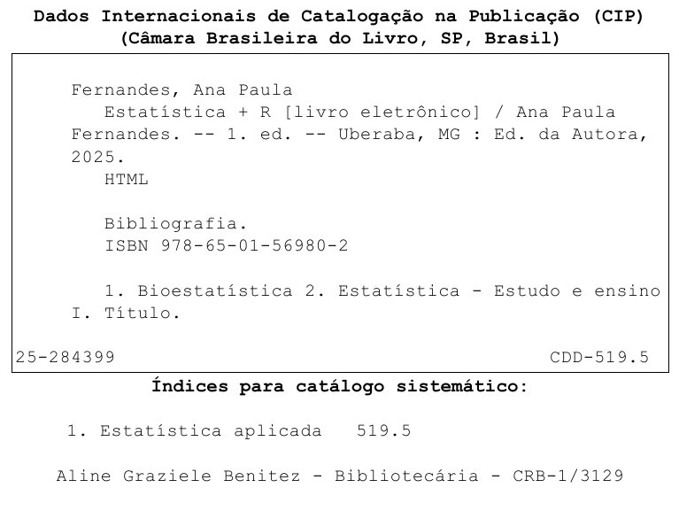</center>

<!--chapter:end:index.Rmd-->

---
output:
  html_document: default
  pdf_document: default
---
# Introdução {#intro}

Ao longo de algum tempo ministrando aulas de estatísticas conclui que estudar estatística com auxílio de recursos computacionais é bem mais eficaz, quero dizer, é mais fácil entender os conceitos téoricos, lidar com recusos visuais (gráficos) e, de fato, transformar o contéudo estudado na disciplina em uma ferramenta para pesquisas científicas, quando se trata de analisar dados.

Ministrando aulas para os cursos da área de saúde, esporte e psicologia sempre ouvi dos discentes que estatística é matemática, e sempre digo que estatística é estatística! É normal alguns discentes não assimilarem, em princípio, a importância da disciplina na grade do seu curso, e realmente, alguns acham até que é assunto que deveria ficar restrito aos curso das exatas. Assim, a primeira tarefa é sempre desconstruir essa ideia.

A estatística é **MULTIDICIPLINAR**, ela está em tudo na verdade... e para dizer uma coisa "bem chique" a estatística é a base da Inteligência Artificial. Advinha quem está por trás dos famosos algortimos das redes sociais? Ou das sugestões de filmes e músicas que aparecem no seu *streamming* favorito? Ou no ranque de busca realzada por meio do *Google*? Ou no *Chat* GTP?

E sendo um pouco mais "acadêmica", dentro do nosso propósito:

Qualquer competição ou treinamento esportivo está recheado de estatística, como medir o desempenho de um time ou atleta? Veja esse exemplo aqui:

> **Velocidade e resistência de velocidade de sprint em atletas de Futebol amador** <http://www.rbff.com.br/index.php/rbff/article/view/866>

Na medicina, estudos epidemiologicos, e claro, da medicina baseada em evidências, tem o suporte da estatística. Veja esse exemplo aqui:

> **Qualidade de Vida Relacionada à Saúde e Satisfação com o Tratamento Hospitalar de Adultos com Câncer: Estudo Observacional** <https://rbc.inca.gov.br/index.php/revista/article/view/3554>

Na psicologia a estatística é a ferramenta utilizada na psicometria. Veja esse exemplo:

> **Escala de Comportamentos Antissociais: construção e estudos psicométricos** <https://periodicos.pucpr.br/psicologiaargumento/article/view/27071>

Basta realizar uma busca com os termos estatística e um campo do seu curso que você se interessa, que você encontrará um artigo científico. E se você não encontrar, comece a escreve sobre o tema!

Quando olhamos os artigos acima, podemos ver que todos eles tem resultados **descritivos** e **inferenciais**. Discutiremos sobre estatística descritiva (de descrever - os dados amostrados para uma dada análise) e inferencial (de inferir - tirar conclusões a partir dos dados amostrados) no próximo tópico.

<center>

```{=html}
<script src="https://unpkg.com/@lottiefiles/lottie-player@latest/dist/lottie-player.js"></script>
```
<lottie-player src="https://assets1.lottiefiles.com/packages/lf20_33asonmr.json"  background="transparent"  speed="1"  style="width: 300px; height: 300px;"  loop  autoplay></lottie-player>

</center>

## Atividade 1

**Busque um artigo do campo de seu interesse que utiliza a estatística.**

1. **Qual é o principal objetivo da pesquisa?**
   - Qual é a questão central que a pesquisa busca responder? Os autores apresentam claramente os objetivos do estudo e o que se espera alcançar com os resultados?

2. **Como a pesquisa foi conduzida?**
   - Quais métodos foram utilizados para coletar os dados? A pesquisa é qualitativa ou quantitativa? Os autores descrevem o procedimento de forma detalhada, incluindo a amostra, os instrumentos de coleta de dados e a análise estatística realizada?

3. **O que é apresentado por meio de tabelas ou gráficos?**
   - Quais informações estão sendo representadas visualmente? Os gráficos e tabelas são claros e bem organizados para facilitar a compreensão dos dados? Como os resultados são interpretados a partir dessas representações?

4. **Faça uma lista de termos relacionados à estatística encontrados no artigo.**
   - Identifique e liste os termos e conceitos estatísticos mencionados no artigo. Isso pode incluir testes de hipótese, modelos estatísticos, variáveis dependentes e independentes, intervalos de confiança, p-valor, etc.


```{=html}
<script src="https://unpkg.com/@lottiefiles/lottie-player@latest/dist/lottie-player.js"></script>
```
<lottie-player src="https://assets6.lottiefiles.com/packages/lf20_LKXG6QRgtE.json"  background="transparent"  speed="1"  style="width: 200px; height: 200px;"  loop  autoplay></lottie-player>

> Periódicos da área da Ciência dos Esportes

-   RBFF - Revista Brasileira de Futsal e Futebol <http://www.rbff.com.br>

-   RBME - Revista Brasileira de Medicina do Esporte <https://www.scielo.br/j/rbme>

-   RBPE - Revista Brasileira de Psicologia do Esporte <http://pepsic.bvsalud.org>

> Periódicos da área de Medicina

-   RBC - Revista Brasileira de Cancerologia <https://rbc.inca.gov.br/index.php/revista>

-   RBCMS - Revista Brasileira de Ciências Médicas e da Saúde <http://www.rbcms.com.br>

-   Revista da Associação Brasileira de Saúde Coletiva <https://cienciaesaudecoletiva.com.br>

> Periódicos da área de Piscologia

-   Psicologia argumento <https://periodicos.pucpr.br/psicologiaargumento>

-   Estudos de psicologia (Campinas) <https://www.scielo.br/j/estpsi/>

-   Psicologia em foco <https://revistas.fw.uri.br/index.php/psicologiaemfoco>

> Ou busque na ferramenta *Mendeley* <https://www.mendeley.com>

# Definições Iniciais

A **Estatística** é uma área fundamental para entender e analisar dados de diversas áreas do conhecimento.

## Estatística Descritiva

### Exemplo 1: **Saúde Mental dos Estudantes**

Suponha que você deseje realizar uma pesquisa na UFTM para avaliar a saúde mental dos estudantes. Os dados coletados provavelmente incluirão informações sobre os níveis de **estresse**, **ansiedade**, **depressão** e **bem-estar geral** dos alunos. Nesse contexto, a **Estatística Descritiva** seria uma ferramenta essencial para organizar esses dados e apresentá-los de maneira clara, objetiva e compreensível.

Utilizando a Estatística Descritiva, você poderia:

1.  **Organizar e estruturar os dados**, criando tabelas que agrupem as respostas dos estudantes de forma sistemática, o que facilitaria a análise dos padrões e a visualização de tendências.
2.  **Calcular medidas de tendência central**, como a **média** dos níveis de estresse ou ansiedade, permitindo que você obtenha uma visão geral dos aspectos mais comuns da saúde mental entre os estudantes.
3.  **Elaborar gráficos**, como **gráficos de barras** ou **diagramas de caixa (boxplot)**, para representar visualmente os dados e facilitar a interpretação. Por exemplo, esses gráficos poderiam mostrar quantos alunos estão em diferentes faixas de intensidade de ansiedade (baixo, moderado ou alto).
4.  **Calcular medidas de dispersão**, como o **desvio padrão**, para avaliar a variabilidade dos dados. Um desvio padrão alto, por exemplo, indicaria que há uma grande diferença entre os níveis de estresse ou ansiedade dos estudantes, o que poderia apontar para a necessidade de abordagens personalizadas em programas de apoio.
5.  **Identificar padrões e correlações** nos dados, como a relação entre o nível de estresse e o número de horas de estudo, ou entre o bem-estar geral e a prática de atividades físicas, ajudando a identificar fatores que influenciam a saúde mental dos estudantes.

Essas análises permitiriam que você compreendesse melhor o panorama da saúde mental dos alunos da UFTM e fornecesse uma base sólida para tomar decisões informadas sobre possíveis ações e programas de apoio psicológico.

### Exemplo 2: **Prática de Atividades Físicas**

Se o objetivo for entender a frequência com que os estudantes da UFTM praticam atividades físicas regularmente, podemos coletar dados específicos, como:

-   **Percentual de alunos que praticam esportes regularmente**: A porcentagem de estudantes que praticam atividades físicas **mais de três vezes por semana**. Este dado oferece uma visão geral sobre a adesão à prática de exercícios e pode ser útil para identificar possíveis áreas de melhoria no incentivo à saúde física.

-   **Distribuição por tipo de atividade física**: Podemos utilizar gráficos como **gráficos de pizza** ou **barras empilhadas** para mostrar a diversidade de atividades praticadas pelos estudantes. Por exemplo, os gráficos poderiam ilustrar a proporção de alunos que praticam **corrida**, **musculação**, **dança**, **futebol**, entre outras atividades, permitindo uma visão clara sobre as preferências esportivas da comunidade acadêmica.

-   **Intensidade da prática de atividades físicas**: Coletar dados sobre a intensidade das atividades (leve, moderada ou intensa) também seria relevante, pois ajudaria a universidade a entender não só a frequência, mas também o impacto potencial dessas atividades na saúde física e mental dos estudantes.

Essas informações não apenas proporcionam um panorama claro sobre o comportamento dos estudantes em relação à saúde física, mas também podem embasar a criação de novos programas e campanhas para incentivar a prática de atividades físicas, promovendo o bem-estar geral da comunidade acadêmica.

## Estatística Inferencial

### Exemplo 1: **Saúde Mental dos Estudantes**

Suponha que você queira avaliar a saúde mental dos estudantes da UFTM e, para isso, tenha realizado uma pesquisa com uma amostra de 200 estudantes. Neste caso, a **Estatística Inferencial** será uma ferramenta essencial para generalizar os resultados dessa amostra para toda a população de estudantes da universidade.

- **Estimativa da média de ansiedade**: Se a média da amostra indicar que os estudantes têm um nível de ansiedade de 7 (em uma escala de 0 a 10), a Estatística Inferencial permitirá que você estime o nível médio de ansiedade de todos os estudantes da UFTM. A partir dessa amostra, podemos calcular um **intervalo de confiança**, que nos dirá com que precisão a média da amostra reflete a média da população inteira. Isso nos dá uma estimativa com uma margem de erro, ajudando a compreender a variabilidade e a precisão do resultado.

- **Testes de hipóteses**: Suponha que você queira comparar os níveis de ansiedade entre estudantes de diferentes cursos. Por exemplo, você deseja saber se os estudantes do curso de Medicina apresentam níveis de ansiedade significativamente mais altos do que os estudantes do curso de Engenharia. A Estatística Inferencial permite realizar um **teste de hipótese**, que nos ajuda a determinar se a diferença observada entre as médias dos dois grupos é **estatisticamente significativa** ou se pode ter ocorrido por acaso. Isso nos permite tomar decisões informadas sobre possíveis relações entre variáveis, com base em dados e não em suposições.

Esses exemplos demonstram como a Estatística Inferencial pode ser usada para tirar conclusões sobre toda a população de estudantes da UFTM, com base em uma amostra representativa. Isso é essencial para planejar intervenções e políticas de apoio à saúde mental de forma mais eficaz.

### Exemplo 2: **Prática de Atividades Físicas**

Suponha que você esteja interessado em saber como os hábitos de atividade física variam entre os cursos da UFTM. A universidade realiza uma pesquisa com uma amostra de 300 estudantes, incluindo alunos de Medicina e de Educação Física. A **Estatística Inferencial** pode ser usada para tirar conclusões sobre toda a população de estudantes com base nessa amostra.

- **Estimar a proporção de estudantes ativos fisicamente**: Se 60% dos estudantes da amostra afirmam praticar atividades físicas regularmente, podemos usar a **probabilidade** para estimar a proporção de todos os estudantes da UFTM que têm esse hábito. A partir desses dados, também é possível calcular um **intervalo de confiança**, indicando com que precisão essa estimativa reflete a realidade da população.

- **Comparação entre cursos**: Podemos realizar um **teste de comparação de proporções** para verificar se a prática de atividades físicas é mais frequente entre estudantes de Educação Física do que entre estudantes de Medicina. Esse teste nos ajudaria a determinar se a diferença observada entre os dois cursos é estatisticamente significativa ou se pode ser explicada por variações aleatórias. 

Essas análises ajudam a universidade a entender os padrões de comportamento relacionados à saúde física entre diferentes grupos acadêmicos e a planejar ações mais específicas para incentivar o bem-estar entre os estudantes.


## Conexão com a Probabilidade

Esses dois tipos de análise estão profundamente conectados com a **Teoria de Probabilidade**, que nos permite estimar as chances de um evento acontecer e tomar decisões com base nesses dados. No caso da UFTM, podemos usar a **probabilidade** para prever, por exemplo, a chance de um estudante desenvolver sintomas de estresse durante o semestre, com base em comportamentos anteriores, como hábitos de estudo e participação em atividades de lazer.

## População x Amostra

### **População**

A **população** é o conjunto completo de indivíduos que queremos estudar. No contexto de uma pesquisa com estudantes da UFTM, a população pode ser definida como **todos os 6.900 estudantes** da instituição, considerando alunos da graduação, cursos técnicos e pós-graduação (dados do DRCA, em dezembro de 2024).

### **Amostra**

Uma **amostra** é um grupo menor selecionado dessa população, que deve ser representativo o suficiente para permitir inferências sobre o todo. Por exemplo, em vez de aplicar um questionário para todos os 6.900 estudantes, podemos selecionar uma **amostra aleatória de 364 estudantes**.

Esse tamanho de amostra é adequado para garantir um **erro máximo de 5%**, com **95% de confiança** nos resultados. Isso significa que, com essa amostra, conseguimos estimar com boa precisão como é a situação da saúde dos estudantes da universidade como um todo.

### **Exemplo aplicado**

Suponha que você queira avaliar o nível de bem-estar emocional dos estudantes da UFTM. Você aplica um questionário padronizado para uma amostra aleatória de **364 estudantes**. A partir das respostas, você calcula que a média de bem-estar emocional, numa escala de 0 a 10, é **6,8**.

Com esse resultado e a ajuda da **estatística inferencial**, você pode estimar com segurança que o nível médio de bem-estar emocional da **população inteira** de estudantes da UFTM está próximo de **6,8**, com uma **margem de erro de 5%**.

Isso significa que, com **95% de confiança**, o **intervalo de confiança** para a média do bem-estar emocional está entre **6,46 e 7,14**. Em outras palavras, se essa pesquisa fosse repetida várias vezes com diferentes amostras aleatórias de 364 estudantes, em 95% das vezes o valor da média real da população estaria dentro desse intervalo.

# Tamanho da Amostra

O cálculo do **tamanho da amostra** é um passo importante em qualquer pesquisa. Ele nos ajuda a determinar quantos participantes precisamos para que os resultados sejam representativos e estatisticamente confiáveis. Embora o cálculo envolva alguns conceitos de **estatística inferencial**, hoje em dia, esse processo pode ser muito mais simples, graças a ferramentas online e até mesmo com o auxílio de **Inteligência Artificial (IA)**.

## Passos básicos para o cálculo do tamanho da amostra

Quando o **objetivo é estimar uma proporção**, o cálculo do tamanho amostral exige algumas informações essenciais:

1. **Tamanho da população**: Neste caso, os estudantes da UFTM, que somam cerca de **6.900**.
2. **Margem de erro**: A precisão com que queremos que nossa estimativa esteja próxima da realidade. Por exemplo, uma margem de erro de **5%** é comum em muitos estudos.
3. **Nível de confiança**: Normalmente, utiliza-se 95%, que indica a probabilidade de que o intervalo de confiança contenha o valor real.

A fórmula para calcular o tamanho da amostra é:

\[
n = \frac{{Z^2 \cdot p \cdot (1 - p)}}{{E^2}}
\]

Onde:

- \(n\) = tamanho da amostra
- \(Z\) = valor da distribuição normal (geralmente 1,96 para 95% de confiança)
- \(p\) = proporção estimada (por exemplo, 0,5 para o pior cenário)
- \(E\) = margem de erro (por exemplo, 0,05 para 5%)

### Exemplo de cálculo simples

Vamos calcular o tamanho da amostra para uma pesquisa na UFTM, onde sabemos que a população tem **6.900 estudantes**, a margem de erro é **5%**, o nível de confiança é **95%**, e vamos supor que queremos estimar uma proporção de **50%** (o pior cenário para garantir maior precisão).

Usando a fórmula, temos:

- \(Z = 1,96\) (para 95% de confiança)
- \(p = 0,5\) (proporção estimada)
- \(E = 0,05\) (margem de erro de 5%)

Substituindo os valores na fórmula, obtemos:

\[
n = \frac{{1,96^2 \cdot 0,5 \cdot (1 - 0,5)}}{{0,05^2}} = 384
\]

Logo, o tamanho da amostra necessário é **384** estudantes para garantir uma margem de erro de 5% com 95% de confiança.

**Observação:** A fórmula apresentada acima é utilizada para o cálculo do tamanho amostral quando se deseja estimar uma proporção, assumindo uma população infinita (ou muito grande). Para situações em que o objetivo é estimar a média populacional, a fórmula adequada é diferente e leva em conta o desvio padrão da variável em vez da proporção. Além disso, se a população for finita, é necessário aplicar o fator de correção amostral.

### Ferramentas para cálculo de amostra

Nosso foco aqui não é ensinar a fazer os cálculos manualmente, mas compreender os conceitos envolvidos. Existem diversas ferramentas online gratuitas que fazem o cálculo automaticamente. Por exemplo:

## Cálculo do Tamanho da Amostra

Para calcular o tamanho da amostra, podemos utilizar diferentes ferramentas, tanto no **R** quanto online. Aqui estão algumas opções:

- **No R**: Para calcular o tamanho da amostra, podemos utilizar o **pacote pwr**, que oferece funções específicas para realizar esses cálculos de forma simples e eficaz. O pacote é ideal para quem precisa calcular o tamanho da amostra para testes de hipóteses, como testes de médias, proporções ou análise de variância, ajustando facilmente os parâmetros conforme as necessidades da pesquisa.

- **Calculadora Amostral Online da USP Bauru**: [Clique aqui para acessar](http://estatistica.bauru.usp.br/calculoamostral/) - Uma ferramenta simples e eficiente para cálculos amostrais.

- **G\*Power**: Um software gratuito que pode ajudar a calcular o tamanho da amostra dependendo do tipo de análise estatística que você irá realizar. [Saiba mais sobre o G*Power](https://www.gpower.hhu.de/en.html).

- **OpenEpi – Sample Size**: [Acesse aqui](https://www.openepi.com/SampleSize/SSMean.htm) - Muito usado na área da saúde, permite calcular amostras para média, proporção, estudos de caso-controle, coorte, entre outros.

## Conclusão

Em resumo, o cálculo do **tamanho da amostra** é um passo essencial para garantir que suas pesquisas sejam precisas e representativas. Embora os cálculos possam parecer complexos, hoje em dia, existem ferramentas poderosas e **Inteligência Artificial** para facilitar esse processo, economizando tempo e esforço na sua pesquisa.


<center>

```{=html}
<script src="https://unpkg.com/@lottiefiles/lottie-player@latest/dist/lottie-player.js"></script>
```
<lottie-player src="https://assets1.lottiefiles.com/packages/lf20_33asonmr.json"  background="transparent"  speed="1"  style="width: 300px; height: 300px;"  loop  autoplay></lottie-player>

</center>

## Atividade 2

**Responda a partir do artigo buscado na atividade 1.**

1. **Os autores discutem o cálculo do tamanho da amostra no estudo?**
   - Você consegue identificar se os autores fornecem uma explicação clara sobre como determinaram o tamanho da amostra na pesquisa? Eles utilizaram alguma fórmula específica ou ferramenta estatística para esse cálculo?

2. **A população da pesquisa foi claramente definida pelos autores?**
   - Os autores descreveram com clareza quem compõe a população da pesquisa (por exemplo, características demográficas, contexto da amostra, entre outros)? A população foi bem delineada para garantir que os resultados sejam representativos?

3. **O tamanho da amostra utilizado no estudo foi adequado?**
   - Com base no cálculo do tamanho de amostra, você acha que a amostra utilizada no estudo foi grande o suficiente para garantir a precisão dos resultados? Ela foi suficientemente representativa da população alvo da pesquisa?

4. **Realize o cálculo do tamanho de amostra para este estudo.**
   - Com as informações fornecidas pelos autores, você pode calcular o tamanho da amostra necessário para o estudo utilizando uma fórmula ou ferramenta de cálculo amostral. Considere aspectos como o nível de confiança, margem de erro e variabilidade dos dados.

5. **Os autores mencionaram se a pesquisa foi aprovada pelo Comitê de Ética?**
   - No artigo, há alguma referência sobre a aprovação ética da pesquisa? Os autores informaram se a pesquisa foi submetida e aprovada por um Comitê de Ética em Pesquisa (CEP)?

6. **Qual é a importância de submeter a pesquisa ao Comitê de Ética?**
   - Por que é essencial que a pesquisa seja submetida a um Comitê de Ética? Quais são as implicações éticas de não realizar essa submissão, especialmente em pesquisas que envolvem seres humanos?


**Importante**

> Conheça o Comitê de Ética em Pesquisa (CEP) da UFTM

<https://www.uftm.edu.br/comitesecomissoes/cep>


# Técnicas de Amostragem

Em pesquisas, uma das etapas mais importantes é o **cálculo amostral**, que determina quantos participantes serão necessários para garantir que os resultados sejam confiáveis. Depois, é preciso escolher uma **técnica de amostragem**, ou seja, como vamos selecionar as pessoas ou unidades que farão parte da pesquisa. Uma parte essencial disso é garantir que o processo de amostragem evite **viés**, que ocorre quando a amostra não representa adequadamente a população.

Existem várias técnicas de amostragem, cada uma com suas características, vantagens e desvantagens.

---

## Amostragem Aleatória Simples

Nesta técnica, cada elemento da população tem a mesma chance de ser selecionado.

> **Exemplo:** Se quisermos estudar a saúde mental dos estudantes da UFTM, podemos utilizar uma lista completa dos alunos e, de maneira aleatória (sorteio), selecionar os estudantes que farão parte da amostra, conforme o número determinado pelo cálculo amostral.

- **Vantagens:** É simples de aplicar e garante que todos têm a mesma chance de ser escolhidos, minimizando o viés.
- **Desvantagens:** Pode ser difícil de implementar se a população for muito grande ou se não tivermos uma lista completa de todos os membros da população. 
- **Como evitar viés:** Garantir que a lista de onde serão sorteados os participantes seja completa e atualizada.

---

## Amostragem Estratificada

Aqui, a população é dividida em grupos ou "estratos" (por exemplo, cursos ou faixas etárias) e, em seguida, amostras são selecionadas dentro de cada estrato.

> **Exemplo:** Suponha que queremos estudar a prática de atividade física entre os estudantes da UFTM. Podemos usar amostragem estratificada, dividindo os alunos por curso (estratos). Dentro de cada curso, selecionamos aleatoriamente um número proporcional de alunos, garantindo que todos os cursos estejam representados de forma adequada na amostra, refletindo a diversidade da universidade.

- **Vantagens:** Melhora a representatividade da amostra, especialmente quando diferentes subgrupos podem ter comportamentos ou características distintas. Ajuda a evitar viés ao garantir que todos os grupos da população estejam representados.
- **Desvantagens:** É necessário conhecer a população e seus estratos de antemão, o que pode ser difícil em alguns casos.
- **Como evitar viés:** A definição dos estratos deve ser precisa e relevante para a pesquisa.

---

## Amostragem Sistemática

Na amostragem sistemática, escolhemos um ponto de partida aleatório e, a partir daí, selecionamos unidades a intervalos regulares de "n" unidades.

> **Exemplo:** Se quisermos estudar a prática de atividade esportiva entre os estudantes da UFTM e temos uma lista de todos os alunos, podemos selecionar a cada 10º aluno da lista para participar da pesquisa.

- **Vantagens:** Fácil de implementar, especialmente em populações grandes, e garante uma distribuição uniforme dos selecionados ao longo da lista.
- **Desvantagens:** Pode ocorrer viés caso haja algum padrão na ordem da lista (por exemplo, se alunos de cursos específicos forem listados consecutivamente, a amostra pode não ser representativa).
- **Como evitar viés:** A lista de seleção deve ser aleatória e não seguir um padrão que favoreça um grupo específico.

---

## Amostragem por Conglomerados

Nessa técnica, a população é dividida em grupos (chamados de conglomerados) e, em seguida, seleciona-se aleatoriamente alguns desses grupos para fazer parte da amostra.

> **Exemplo:** Em vez de selecionar alunos aleatoriamente, selecionar alguns cursos específicos da UFTM e estudar todos os alunos desses cursos. Essa técnica é útil quando a população é muito grande e difícil de acessar como um todo.

- **Vantagens:** Mais fácil de administrar em populações grandes, quando não se tem acesso a uma lista completa de todos os indivíduos.
- **Desvantagens:** Pode não ser tão representativa, pois estamos escolhendo grupos inteiros e não indivíduos aleatórios.
- **Como evitar viés:** Os conglomerados escolhidos devem representar adequadamente a diversidade da população.

---

## Amostragem por Conveniência

Na **amostragem por conveniência**, os participantes são selecionados por serem mais fáceis de acessar pelo pesquisador.

> **Exemplo:** O uso de formulários online, como o Google Forms, é uma forma comum de amostragem por conveniência. O pesquisador compartilha o formulário em redes sociais, grupos de WhatsApp ou por e-mail, e os primeiros que responderem entram para a amostra.

- **Vantagens:** Rápida, prática, econômica e permite coletar dados de muitas pessoas em pouco tempo.
- **Desvantagens:** Forte risco de viés, pois a amostra pode não representar a população como um todo, já que depende de quem tem acesso ao link, internet e interesse em responder.
- **Como evitar viés:** Embora não seja possível eliminar totalmente o viés, recomenda-se divulgar o formulário em diferentes canais e para públicos diversos, incentivando a participação de vários grupos.

**Atenção aos Vieses no Uso de Formulários Online:**

- **Viés de acesso:** Apenas pessoas com acesso à internet podem responder.
- **Viés de auto-seleção:** Aqueles mais motivados ou interessados no tema tendem a participar mais.
- **Viés de distribuição:** Se o link for enviado apenas a determinados grupos, outros podem ser sub-representados.

Portanto, ao usar formulários online, é importante considerar essas limitações e, se possível, adotar estratégias para ampliar o alcance e a diversidade dos respondentes.

---

## Combinando Técnicas na Prática

Na prática, é comum que pesquisadores combinem diferentes técnicas de amostragem para aumentar a representatividade e reduzir o viés da amostra, adaptando o processo às características específicas da população e aos objetivos do estudo.

Por exemplo, pode-se aplicar a **amostragem estratificada** para garantir que todos os subgrupos relevantes (como cursos, faixas etárias ou regiões) estejam proporcionalmente representados na amostra. Em seguida, dentro de cada estrato, pode-se utilizar a **amostragem aleatória simples** para selecionar os participantes de forma justa e imparcial.

Além disso, em situações em que o acesso à população é limitado, pode-se recorrer à combinação de técnicas probabilísticas (como estratificada ou sistemática) com métodos não probabilísticos (como conveniência), sempre buscando estratégias para minimizar possíveis vieses e aumentar a diversidade dos participantes.

Ao combinar métodos, o pesquisador consegue contornar limitações práticas (como listas incompletas ou dificuldades de acesso) e, ao mesmo tempo, assegurar que a amostra reflita com maior fidelidade a diversidade da população, tornando os resultados mais robustos e confiáveis.

---

## Evitar Viés na Amostragem

O **viés de amostragem** ocorre quando certos grupos da população têm mais chance de ser selecionados do que outros, o que pode distorcer os resultados da pesquisa. Para evitar viés, é essencial:

- Garantir que todos os grupos da população tenham uma chance igual ou proporcional de ser selecionados.
- Utilizar técnicas que levem em consideração as características específicas da população.
- Combinar diferentes métodos de amostragem para melhorar a representatividade.

---

## Resumindo

- **Probabilística:** amostragem aleatória simples, sistemática, estratificada, por conglomerados.
- **Não probabilística:** amostragem por conveniência (incluindo Google Forms), intencional, por cotas.

> A escolha da técnica deve considerar os objetivos da pesquisa, os recursos disponíveis e a necessidade de representatividade da amostra.


<!--chapter:end:01-Introducao.Rmd-->

# Ambiente Computacional {#ambiente-computacional}

Existem diversos softwares dedicados à análise estatística, que vão desde planilhas eletrônicas, como o Excel, até programas mais robustos, como o SPSS. Abaixo, listamos algumas das principais ferramentas utilizadas:

## Softwares pagos

- [SPSS (IBM)](https://www.ibm.com/br-pt/spss)
- [Stata](https://www.stata-brasil.com/software/stata.html)
- [SAS](https://www.sas.com/pt_br)
- [JMP](https://www.jmp.com/)
- [Prism](https://software.com.br/p/prism)
- [Minitab](https://osbsoftware.com.br/produto/minitab-statistical-software)
- Microsoft Excel

## Softwares livres

- [Jamovi](https://www.jamovi.org)
- [OpenStat](https://openstat.info)

## Linguagens computacionais

- [R](https://www.r-project.org)
- [Python](https://www.python.org/)

Neste curso, utilizaremos a linguagem **R**, desenvolvida especialmente para análise estatística. Quer entender por que essa escolha? Recomendamos a leitura: [Por que usar R?](https://blog.curso-r.com/posts/2021-07-23-por-que-usar-r/)

## Preparando o Ambiente Computacional

Vamos preparar o ambiente computacional para realizar nossas análises com R.

> Para esclarecer:
> - **R** é uma linguagem de programação (mas não se preocupe, não vamos programar profundamente).
> - **RStudio** é o software onde os códigos R serão executados. É o que chamamos de IDE – *Integrated Development Environment* (Ambiente de Desenvolvimento Integrado).

## Plano A: Instalação do R e RStudio

Nos laboratórios da UFTM, o R e o RStudio já estão instalados. No entanto, sugerimos que você também os instale em seu computador pessoal, pois nem sempre conseguiremos realizar todas as atividades em sala.

Siga estes passos:

1. Instale o R: [https://cran.rstudio.com](https://cran.rstudio.com)
2. Instale o RStudio Desktop: [https://posit.co/download/rstudio-desktop](https://posit.co/download/rstudio-desktop)

> Certifique-se de baixar versões compatíveis com o sistema operacional do seu computador.

Se tudo estiver correto, ao abrir o RStudio, você verá uma tela semelhante a esta:

<center></center>

Caso enfrente dificuldades, siga para o Plano B.

## Plano B: R e RStudio na Nuvem

O Plano B é utilizar o RStudio diretamente na nuvem, sem precisar instalar nada. Essa alternativa é excelente, mas requer uma boa conexão com a internet.

Siga os passos:

1. Acesse: [https://posit.cloud](https://posit.cloud)
2. Faça login (você pode usar sua conta do Google, por exemplo)
3. Após o login, você verá esta tela:

<center></center>

4. Crie um novo projeto clicando em *New Project* e, depois, *New RStudio Project*:

<center>{width=40%}</center>

5. Pronto! A interface do RStudio será carregada na nuvem:

<center></center>

> Vantagem: seus arquivos e análises ficam salvos na nuvem, em um local seguro e acessível de qualquer lugar.

---

Com o ambiente configurado, estaremos prontos para explorar o mundo da estatística com R!

<!--chapter:end:02-Ambiente-Computacional.Rmd-->

# Trabalhando no RStudio {#trabalhando-RStudio}

Seja na versão instalada no seu computador (plano A) ou na nuvem (plano B), conheça melhor as áreas do RStudio:

1. **Console:** local onde serão apresentadas as respostas para códigos executados;

2. **Ambiente de memória (Environment):** é o cérebro do R, onde ficam registrados os objetos que ele reconhece.

3. A área de **Arquivos (Files), Gráficos (Plots), Pacotes (Packages), Ajuda (Help), Visualização (Viewer) e Apresentação (Presentation)**: mostram, respectivamente, os arquivos do diretório onde estão seus arquivos no computador, os gráficos, os pacotes, a ajuda, a janela de visualização e a apresentação.

A figura abaixo identifica cada uma dessas áreas:

<center></center>

Digitaremos os códigos da linguagem R, em um arquivo que chamamos de **script**. Para abrir um arquivo do tipo script R, faça:

1. Acesse a opção **File** no menu principal do RStudio;
2. Escolha a opção **New File**;
3. E depois a opção **R Script**.

<center>{width=40%}</center>

Assim, na tela da IDE RStudio aparecerá uma nova área, que é a área do arquivo script, como mostra a figura.

<center></center>

Observe que o arquivo está sem um nome (**Untitled1**, sem título). Salve o arquivo atribuindo-lhe um nome adequado. Para isso, no menu principal, escolha *File*, depois *Save*.

> Dica: O ideal seria criar um **Projeto**. Veja a opção _File > New Project_.

<!--chapter:end:03-RStudio.Rmd-->

# Primeiros exercícios no R

Nos capítulos  \@ref(ambiente-computacional) e \@ref(trabalhando-RStudio) vimos sobre o ambiente computacional (computador ou nuvem) e identificamos as 4 áreas da tela da interface do RStudio: **console**, **ambiente de memória**, **arquivos, gráficos, etc.** e **script**, assim estamos prontos para escrever alguns códigos e executá-los a partir da área de script.

> **Atenção:** TODOS os cógigos serão digitados no arquivo de script, seguindo uma sequência lógica de passos, ou seja, escreveremos um roteiro (*script*), como se fosse uma receita de bolo, isso é o que o pessoal da computação chama de algoritmo.


## Exemplo 1

* Observe o código escrito na linha 1 do arquivo de script e o botão **Run** (primeira seta verde):

<center>
</center>

* O sequência de caracteres **<-** é o símbolo de atribuição no R.

> Pressionando as teclas ALT e - (menos) simultaneamente cria no script o sinal de atribuição.

* O código significa que criamos um objeto chamado **x** e atribuimos a esse objeto o valor 2.

* No entanto, o R ainda não sabe que o valor de x é igual a 2! 

* Para registrar essa informação na memória do R, devemos executar essa linha.

> Para executar uma linha posicione o cursor na linha, e clique no botão **Run**

<center>{width=40%}
</center>

> Observe sempre o ambiente de memória (bem como o console) quando executar uma linha.

## Exemplo 2

Execute o seguinte cógigo no R.


``` r
idades <- c( 23, 18, 17, 25, 21, 19, 22, 24, 19, 19 )
```

* Esse código significa que foi criado um objeto chamado idade que armazena 10 valores: 23, 18, 17, 25, 21, 19, 22, 24, 19, 19, diferentemente do exemplo 1 em que x armazenava somente o valor 2. 

* Isso foi possível pois usamos a função **c( )**.

* observe que os valores foram colocado dentro dos parênteses da função **c( )**

> Com função **c( )** podemos **combinar** vários valores em um objeto, esse objeto recebe o nome de vetor ou lista.


## Exemplo 3 

Observe nesse código as funções:

* **max( )**

* **min( )**

* **range( )**

* **mean( )**

* **sd( )**


``` r
# criando o vetor idades 
idades <- c( 23, 18, 17, 25, 21, 19, 22, 24, 19, 19 )

# maior valor
# função max( )
max(idades)
```

```
## [1] 25
```

``` r
# menor valor
# função min( )
min(idades)
```

```
## [1] 17
```

``` r
# faixa de valores
# função range( )
range(idades)
```

```
## [1] 17 25
```

``` r
# média (mean)
# função mean( )
mean(idades)
```

```
## [1] 20.7
```

``` r
# desvio padrão (standard deviation)
# função sd() 
sd(idades)
```

```
## [1] 2.710064
```

> Copie o código e cole no seu arquivo script, selecione todo conteúdo (CRTL+A) e execute todo o cógigo de uma única vez.

* Observe que as respostas apareceram no **console**, conforme mostrado na figura abaixo:

<center>{width=40%}
</center>

> O símbolo # é o símbolo de comentário, isso significa que podemos escrever qualquer texto diferente do que o R sabe interpretar, e mesmo executando o código nenhum erro acontece! 

> **IMPORTANTE**: é uma boa prática comentar os trechos de códigos para deixar documentado qual é o objetivo do código.


<!--chapter:end:04-Primeiros-Exercicios.Rmd-->

# Tipos de Variáveis

As variáveis podem ser classificadas de acordo com sua natureza:

## Variáveis Quantitativas
Expressam **quantidade** e podem ser divididas em:

- **Discreta**: Assume valores inteiros (contagem).
  - *Exemplo*: O número de filhos de uma pessoa. Você pode contar 0, 1, 2, 3 filhos, mas não pode ter 2,5 filhos.
  
- **Contínua**: Assume qualquer valor dentro de um intervalo específico (mensuração).
  - *Exemplo*: A altura de uma pessoa, que pode ser 1,70 m, 1,71 m, 1,711 m, e assim por diante, com infinitas possibilidades entre os valores.

## Variáveis Qualitativas
Expressam **qualidade** e são representadas por **categorias** ou **rótulos**. São subdivididas em:

- **Nominal**: Categorias que não podem ser ordenadas.
  - *Exemplo*: O tipo de fruta que você prefere, como maçã, banana, laranja. Não faz sentido ordenar essas categorias de maneira que uma seja "maior" que a outra.
  
- **Ordinal**: Categorias que podem ser ordenadas, com uma graduação entre elas.
  - *Exemplo*: Níveis de satisfação de um serviço, como "satisfeito", "neutro" e "insatisfeito". Aqui, existe uma ordem em que "satisfeito" é maior que "neutro", e "neutro" é maior que "insatisfeito".

Uma aplicação comum das variáveis ordinais é a **Escala Likert**, que é amplamente utilizada em pesquisas de opinião para medir atitudes ou percepções. A escala Likert geralmente apresenta uma série de afirmativas, e o participante deve indicar seu nível de concordância com cada uma delas, com respostas em uma sequência ordenada.

*Exemplo*: Em uma pesquisa de satisfação de clientes, a pergunta poderia ser: "Concordo que a alimentação oferecida pelo hospital foi satisfatória." As opções de resposta poderiam ser:

1. **Discordo totalmente**
2. **Discordo parcialmente**
3. **Neutro**
4. **Concordo parcialmente**
5. **Concordo totalmente**

Essas respostas formam uma escala ordinal, pois a ordem das categorias reflete um aumento no nível de concordância, mas as diferenças entre elas não são necessariamente iguais.

> **Dica**: Veja o vídeo do Prof. Heitor no **Canal Pesquise**: [Assista aqui](https://youtu.be/_oc37Ea_tl8).

## Aplicação das Variáveis em Estatística

A natureza da variável influencia o tipo de procedimento estatístico que será utilizado. Exemplos:

### Estatística Descritiva:
- **Variáveis Qualitativas**: São representadas por sua **frequência absoluta** ou **percentual**.
  - *Exemplo*: Em uma pesquisa de preferência de frutas, pode-se dizer que 40% das pessoas escolheram maçã, 35% escolheram banana, e 25% escolheram laranja.
  
- **Variáveis Quantitativas**: São representadas por **medidas resumo**, como **média** e **desvio padrão**.
  - *Exemplo*: Se você calcular a média de altura de um grupo de pessoas, e o desvio padrão indicar que a altura das pessoas varia em torno de 5 cm da média.

### Estatística Inferencial:
- **Teste Qui-Quadrado**: Usado para verificar se há associação entre as categorias de duas variáveis qualitativas.
  - *Exemplo*: Um teste Qui-Quadrado poderia ser utilizado para verificar se a escolha de fruta (maçã, banana, laranja) tem relação com o sexo (masculino, feminino) dos participantes.

- **Teste de Correlação de Pearson**: Mede a força da correlação linear entre duas variáveis quantitativas.
  - *Exemplo*: O teste de Pearson poderia ser utilizado para verificar se existe uma relação entre a altura e o peso das pessoas. Quanto maior a altura, maior o peso? Esse teste nos diria a força dessa relação.


<center>
<script src="https://unpkg.com/@lottiefiles/lottie-player@latest/dist/lottie-player.js"></script>
<lottie-player src="https://assets1.lottiefiles.com/packages/lf20_33asonmr.json"  background="transparent"  speed="1"  style="width: 300px; height: 300px;"  loop  autoplay></lottie-player>
</center>

## Atividade 3

**Leia o artigo _Estado nutricional, tempo de internação e mortalidade em pacientes submetidos à cirurgia cardíaca em um hospital na cidade de Maceió_**  
Disponível em: [RASBRAN, Revista da Associação Brasileira de Nutrição, 2023](https://www.rasbran.com.br/rasbran/article/view/1724/443)  
Acesse também o portal: [RASBRAN - Revista da Associação Brasileira de Nutrição](https://www.rasbran.com.br/).

### Análise das Tabelas

- **Tabela 1 - Características clínicas dos pacientes submetidos à cirurgia cardíaca**: Esta tabela apresenta as características da amostra analisada na pesquisa. 
  - **Tarefa**: Classifique as variáveis (características) em **qualitativas** e **quantitativas**.
  - **Observação**: Verifique como as variáveis foram resumidas. Elas foram apresentadas em **porcentagens**? Ou foram calculadas medidas de **média** e **desvio padrão**?

- **Tabela 2 - Associação entre estado nutricional, sexo, idade e tempo de internação hospitalar entre os pacientes submetidos à cirurgia cardíaca**  
- **Tabela 3 - Associação entre evolução clínica, sexo, idade, tempo de internação hospitalar e estado nutricional entre os pacientes submetidos à cirurgia cardíaca**: Estas tabelas mostram os resultados de um **teste de hipótese** (parte da estatística inferencial).
  - **Tarefa**: Identifique qual **teste estatístico** foi aplicado.
  - **Objetivo**: Qual é o objetivo deste teste?


<!--chapter:end:05-Tipos-Variaveis.Rmd-->

# Estatística Descritiva

A estatística descritiva permite **resumir, organizar e interpretar** dados de forma clara e objetiva. Para isso, utilizamos **medidas de tendência central**, **medidas de dispersão** e **medidas relativas de variabilidade**.

## Medidas de Tendência Central (ou Posição)

### Média

- **Definição:** Soma de todos os valores dividida pelo número de observações.  
- **Interpretação:** Representa o valor médio ou típico do conjunto de dados.  
- **Como reportar:**  

> A média dos batimentos cardíacos foi de 58,6 bpm, indicando o valor médio da amostra analisada.

### Mediana

- **Definição:** Valor central de um conjunto ordenado de dados.  
- **Interpretação:** Divide o conjunto de dados ao meio, sendo útil quando há valores extremos (outliers).  
- **Como reportar:**  

> A mediana dos batimentos foi de 60,0 bpm, indicando que 50% dos indivíduos apresentaram valores abaixo ou iguais a esse valor.

### Quartis

- **Definição:** Q1 (primeiro quartil) e Q3 (terceiro quartil) representam os valores que dividem os 25% e os 75% inferiores dos dados, respectivamente.  
- **Interpretação:** Ajudam a entender a distribuição dos dados e identificar a dispersão em torno da mediana.  
- **Como reportar:**  

> O primeiro e o terceiro quartis foram 54,0 bpm e 64,0 bpm, respectivamente, revelando que 50% dos batimentos ficaram entre esses dois valores.

### Moda

- **Definição:** Valor mais frequente do conjunto de dados.  
- **Interpretação:** Indica o valor mais comum, embora possa não existir ou haver mais de uma moda.  
- **Como reportar:**  

> A moda foi 62 bpm, valor que ocorreu com maior frequência na amostra.

**Observação importante:**  
- **Média e desvio padrão** são medidas que devem ser usadas juntas, especialmente para dados simétricos (distribuição simétrica) e sem valores extremos.
- **Mediana e quartis** formam outro conjunto de medidas, mais apropriado quando há assimetria ou presença de outliers.

**Sugestão de vídeo:** Canal Pesquise - [Tendência Central](https://youtu.be/ot0aDB-grDY)


## Medidas de Dispersão (ou Variabilidade)

### Amplitude

- **Definição:** Diferença entre o maior e o menor valor.  
- **Interpretação:** Indica o intervalo total em que os dados variam.  
- **Como reportar:**  

> A amplitude foi de 36 bpm, com valores variando de 39 a 75 bpm.

### Variância

- **Definição:** Média dos quadrados das diferenças entre os valores e a média.  
- **Interpretação:** Mede a dispersão, mas sua unidade é o quadrado da unidade original.  
- **Como reportar:**  

> A variância foi de 98,8 bpm², indicando a variabilidade dos batimentos em relação à média.

**Observação:**  
A unidade da variância é expressa ao quadrado da unidade original dos dados (por exemplo, bpm² no caso de batimentos por minuto), o que pode dificultar sua interpretação direta.  
Por isso, costuma-se utilizar o **desvio padrão**, que tem a **mesma unidade dos dados originais** e fornece uma noção mais intuitiva da dispersão dos valores em torno da média.


### Desvio padrão (DP)

- **Definição:** Raiz quadrada da variância.  
- **Interpretação:** Expressa, em média, o quanto os dados se afastam da média.  
- **Como reportar:**  

**Como reportar:**  
O desvio padrão foi de 9,9 bpm, o que indica que, em média, os batimentos cardíacos dos indivíduos da amostra variam aproximadamente 9,9 unidades em relação à média.

### Amplitude interquartil (IQR)

- **Definição:** Diferença entre o terceiro e o primeiro quartis (Q3 - Q1).  
- **Interpretação:** Indica a dispersão dos 50% centrais dos dados.  
- **Como reportar:**  

> A amplitude interquartil foi de 10,0 bpm, mostrando a concentração dos valores médios.

**Sugestão de vídeo:** Canal Pesquise - [Variabilidade](https://youtu.be/sISPcOIcwXs)


## Medida Relativa de Variabilidade

### Coeficiente de Variação (CV)

- **Definição:** Quociente entre o desvio padrão e a média, multiplicado por 100.  
- **Interpretação:** Expressa a variabilidade dos dados em relação à média, permitindo comparar conjuntos com unidades diferentes.  
- **Como reportar:**  

> O coeficiente de variação foi de 16,9%, indicando que os dados são relativamente homogêneos.

**Observação:**  
Um CV inferior a 25% geralmente indica homogeneidade; valores muito altos indicam alta variabilidade.

## Apresentação dos Resultados

Uma maneira eficiente de apresentar estatísticas descritivas é organizar as variáveis em linhas, facilitando a visualização dos principais parâmetros de cada variável estudada. Veja abaixo uma sugestão de tabela para esse formato:

| Variável           | n   | Média ± DP        | Mediana (Q1; Q3)   | Mínimo | Máximo |
|--------------------|-----|-------------------|--------------------|--------|--------|
| Idade (anos)       | 98  | 24,5 ± 4,2        | 24,0 (21,0; 28,0)  | 18     | 35     |
| IMC (kg/m²)        | 98  | 22,3 ± 3,1        | 21,9 (20,3; 23,7)  | 17,0   | 31,5   |
| Pressão Sistólica  | 98  | 118,5 ± 13,0      | 120 (110; 128)     | 90     | 145    |
| Pressão Diastólica | 98  | 76,2 ± 9,1        | 76 (70; 82)        | 60     | 98     |

> Reportar uma medida de tendência central (como média ou mediana) junto com uma medida de dispersão (como desvio padrão, intervalo interquartil ou amplitude) é fundamental porque, isoladamente, a tendência central não fornece informações suficientes sobre o conjunto de dados.


Para variáveis qualitativas, a tabela pode ser organizada assim:

| Variável     | Categoria         | n   | %     |
|:--------------|:-------------------|:-----|:-------|
| Sexo         | Masculino         | 52  | 53,1% |
|              | Feminino          | 46  | 46,9% |
| Tabagismo    | Sim               | 18  | 18,4% |
|              | Não               | 80  | 81,6% |

Essas tabelas permitem uma apresentação clara e objetiva das principais características da amostra analisada.

## Funções no R

Com um vetor `x` contendo os dados, utilize:

| Medida                     | Código R                    |
|----------------------------|-----------------------------|
| Média                      | `mean(x)`                   |
| Mediana                    | `median(x)`                 |
| Primeiro quartil (Q1)      | `quantile(x, 0.25)`         |
| Terceiro quartil (Q3)      | `quantile(x, 0.75)`         |
| Moda                       | `sort(table(x))`            |
| Menor valor                | `min(x)`                    |
| Maior valor                | `max(x)`                    |
| Resumo geral               | `summary(x)`                |
| Amplitude                  | `range(x)`                  |
| Variância                  | `var(x)`                    |
| Desvio padrão              | `sd(x)`                     |
| Amplitude interquartil     | `IQR(x)`                    |
| Coeficiente de variação    | `sd(x)/mean(x)*100`         |


> Calcular é importante, mas interpretar corretamente é essencial. Ao elaborar suas interpretações, descreva o que os números revelam sobre o fenômeno analisado.

<center>
<script src="https://unpkg.com/@lottiefiles/lottie-player@latest/dist/lottie-player.js"></script>
<lottie-player src="https://assets1.lottiefiles.com/packages/lf20_33asonmr.json"  background="transparent"  speed="1"  style="width: 300px; height: 300px;"  loop  autoplay></lottie-player>
</center>
## Atividade 4

**Considere o objeto Batimentos, que é uma amostra de batimentos cardíacos de 20 homens.**


``` r
Batimentos <- c(62, 55, 56, 46, 75, 67, 62, 75, 60, 54, 69, 63, 39, 57, 40, 39, 64, 71, 61, 54)
```

+ Obtenha as seguintes medidas:
   + Menor valor:
   + Maior valor:
   + Média:
   + Mediana:
   + Primeiro quartil:
   + Terceiro quartil:
   + Variância:
   + Desvio padrão:
   + Amplitude interquartil:
   + Coeficiente de varição:
   
+ Escreva sobre o conjunto media e desvio padrão: 

> A média dos dados foi de X (unidade), com um desvio padrão de Y (unidade), indicando que os valores estão, em geral, relativamente próximos/espalhados em torno da média. O desvio padrão reflete a quantidade de variabilidade ou dispersão dos dados em relação à média, e neste caso, a dispersão é baixa/média/alta, dependendo do valor de Y.

+ Escreva sobre conjunto mediana e quartis:

> A mediana foi Z (unidade), e o intervalo interquartil (IQR), que representa a diferença entre o terceiro quartil (Q3) e o primeiro quartil (Q1), foi Q3 - Q1 (unidade). Isso indica que 50% dos dados estão concentrados nesse intervalo.

+ Escreva sobre o coeficiente de variação: 

> O coeficiente de variação (CV) foi calculado como X%, o que reflete a dispersão relativa dos dados em relação à média. Valores mais baixos de CV indicam que os dados estão mais concentrados em torno da média, enquanto valores mais altos indicam uma maior dispersão.

+ Acrescente mais uma amostra com valor de batimento igual a 120, recalcule as medidas acima. Qual conjunto você consideraria mais adequado para resumir sua amostra, na presença desse valor discrepante (_outlier_)? A média (DP) ou mediana (1o.Q ; 3o.Q)? Explique.


<!--chapter:end:06-Estatistica-Descritiva.Rmd-->

# Importando banco de dados

Na prática, os dados que vamos analisar estarão armazenado em um **banco de dados**, um arquivo de banco de dados pode ser de diferentes tipos, por exemplo:

+ Arquivo do tipo Excel (xls ou xlsx)

+ Arquivo de texto separado por vírgulas (csv - _comma-separated values_)


> Existem várias fontes de dados abertas, onde podemos baixar um banco de dados para realizar analises estatísticas, aqui estão algumas delas:

+ DataSus: <https://datasus.saude.gov.br/transferencia-de-arquivos>

+ OMS: <https://www.who.int/data/collections>

+ Kaggle: <https://www.kaggle.com/datasets>


> No link (google drive) existem alguns bancos que podemos usar para compreender como importar um banco de dados para o ambiente do RStudio: <https://drive.google.com/drive/folders/1gyORbBEuKBstfSKULA58TLhawOXaY-st>

## Importando um banco csv

1. Faça _download_ do banco de dados **mcdonald.csv** 
(fonte original: https://www.kaggle.com/datasets/mcdonalds/nutrition-facts)

2. Na área de ambinete de memória, localize **Import Dataset**, ao clicar nessa opção você terá o seguinte:

<center>{width=40%}
</center>

+ Como queremos importar um arquivo csv, a melhor opção é a segunda **From Text (readr)**

+ **_readr_** é uma pacote do R que faz a leitura de arquivo csv (se o pacote ainda não estiver instalado no seu computador, o R fará a instalação, se você concordar!)

3. Clicando na opção **From Text (readr)**, no botão **browser** indidique onde (no seu computador) está localizado o arquivo a ser importado. A seguinte tela será apresentada:

<center>
</center>

+ No quadro **Data Preview**, temos uma "prévia" com os nomes da variáveis, seus tipos computacionais e os primeiros valores que estão armazenados no banco de dados.

+ No quadro **Import Options** temos as opções de importação, fique atento ao **Name** do seu banco de dados, geralmente usamos nomes sem espaços ou caracteres especiais (', ~  ou ç), é até permitido usar alguns desses caracteres especiais, mas evite. 

+ Ainda no quadro **Import Options**, observe que a opção **Open Data Viewer** está marcada, isso significa que ao importar o banco de dados, o arquivo de banco de dados será aberto pelo RStudio. Caso esteja trabalhando com bancos com muitos dados (como os bancos do dataSUS), talvez seja melhor desmarcar essa opção para não sobrecarregar o processamento do seu computador.

+ O quadro **Code Preview** mostra como é a importação (leitura) do banco de dados via código. É interessante copiar esse trecho de código para o arquivo de script.

4. Clique no botão **Import** e observe que no ambiente de memória será criado o objeto do tipo **Data** com o nome do banco de dados que foi importado. 

<center>{width=60%}
</center>

+ Observe que esse objeto do tipo **Data** é diferente dos objetos do tipo **Values** que vimos nos exemplos iniciais.

+ Ao clicar no ícone ao lado do nome do objeto, temos acesso ao nomes e tipos computacionais das variáveis, e ao clicar sobre nome do objeto, o banco será aberto!

## Importando um banco xls

Na área de ambiente de memória, localize **Import Dataset**, ao clicar sobre essa opção, escolha **From Excel...**

<center>{width=40%}
</center>

+ Se for a primeira vez que você estiver importando um arquivo Excel, pode ser necessária a instalação do pacote que fornece a biblioteca que tem a função de leitura de arquivo xls (**readxl**)! O RStudio mostrará um aviso parecido com este: 

<center>{width=40%}
</center>


## Exemplo 1

Como obter a média da variável **Calories** que é uma coluna do objeto **mcdonald**, que por sua vez, é um objeto do tipo **Data**? 


``` r
# Usamos o operador $
# Para calcular a média precisamos informar para função: 
# mean( NOME DO BANCO $ NOME DA COLUNA ): 
mean(mcdonald$Calories)
```

## Exemplo 2

Como armazenar os valores de uma variável (coluna), em um objeto do tipo **Values** e depois calcular a média?


``` r
# Uso o operador <- 
# Criamos o objeto 
caloria <- mcdonald$Calories
# Agora podemos usar o objeto que criamos, por exemplo para calcular a média e o desvio padrão
mean(caloria)
sd(caloria)
```

## Exemplo 3

O que acontece se usamos a função **summary()** para o objeto **mcdonald**, sem usar o operador, isto é sem indicar uma variável?

``` r
# No console será mostrado o resumo de todas as variáveis do banco!
summary(mcdonald)
```

> Essa forma de obter os resultados não é a melhor forma, vamos **instalar um pacote** para obter os resultados em uma tabela bem formatada que podemos copiar e colar diretamente para um editor de texto. 

<center>
<script src="https://unpkg.com/@lottiefiles/lottie-player@latest/dist/lottie-player.js"></script>
<lottie-player src="https://assets8.lottiefiles.com/packages/lf20_ynsr82zq.json"  background="transparent"  speed="2"  style="width: 200px; height: 200px;"  loop  autoplay></lottie-player>
</center>

<!--chapter:end:07-Importando-BD.Rmd-->

# Instalando pacotes

Quando instalamos nosso ambiente computacional R e RStudio, instalamos uma versão básica, onde apenas os recursos básicos do R estão diponíveis, o pacote básico (**base**) do R.

Os pacotes (**packages**) do R são compostos por uma biblioteca (**library**) que é um conjunto de funções. Por exemplo, do pacote **base** usamos as funções min(), max(), mean(), median(), table(), var(), sd(), summary(), etc.

Para ver a lista de funções que compõem a bilbioteca do pacote base, execute o código:

``` r
library(help = "base")
```

Os pacotes são análogos aos aplicativos que instalamos nos nossos celulares, são módulos que agregam funcionalidades específicas. Ao longo das nossas atividades usaremos alguns desses pacotes.

Como nesse momento estamos interessados em otimizar o trabalho para realizar uma análise descritiva dos dados, então vamos instalar um pacote chamado **gtsummary** (<https://www.danieldsjoberg.com/gtsummary/>).

> O pacote **gtsummary** nos fornecerá uma tabela resumo de todo banco de dados, otimizando bastante nosso trabalho de resumir o banco de dados. 

+ IMPORTANTE 1: instalamos um pacote apenas uma vez (como um aplicativo no celular... a gente só refaz a instalação se o app _bugar_!)

+ IMPORTANTE 2: todas vez precisamos carregar o pacote com as funções que queremos usar por meio da função **library()**

Veja o código:


``` r
# comando para instalar o pacote gtsummary
install.packages("gtsummary")

# comando para carregar a biblioteca de funções do gtsummary
library(gtsummary)

# a função que vamos usar para gerar uma tabela que resume os dados é
# tbl_summary
tbl_summary(mcdonald)
```

+ Ao executar **tbl_summary(mcdonald)** a tabela de resultados será mostrada na área de arquivos, gráficos, pacotes... na aba **Viewer**, no quadrante abaixo do ambiente de memória.

+ Essa tabela pode ser copiada e colada para o editor de texto que você utiliza para escrever seus trabalhos, claro essa tabela pode ser melhorada!

+ Observe no rodapé da tabela a seguinte legenda  **n (%); Median (IQR)**, isso significa que para

    + **variáveis qualitativas:** n é a contagem (frequência absoluta) e entre parenteses (%) é mostrado a porcentagem de cada categoria.
  
    + **variveis quantitativas:** Median é a mediana e entre parenteses (IQR - de InterQuantile Range) estão o primeiro e terceiro quartil respectivamente. 

## Exemplo 1
Como mostrar o resultado com a média e desvio padrão?


``` r
# acrescente nos argumentos da função tbl_summary() a opção:
# statistic = list(all_continuous() ~ "{mean} ({sd})"
tbl_summary(
            mcdonald, 
            statistic = list(all_continuous() ~ "{mean} ({sd})")
            )
```

## Exemplo 2
Como selecionar somente algumas variáveis do banco de dados?

``` r
# Precisamos do pacote tidyverse, tire o símbolo de # se precisar instalar!
# install.packages("tidyverse")

# ative tidyverse
library(tidyverse)

# vamos usar a função select() do pacote tidyverse
dadosSelecionados <- select (mcdonald, Cholesterol, Sodium, Carbohydrates)

# faça uma tabela para o objeto dadosSelecionados
tbl_summary(dadosSelecionados)
```

## Exemplo 3
Algumas vezes é mais fácil excluir algumas variáveis, por exemplo queremos todas, menos **Item** e **Serving  Size**	

``` r
# vamos usar a função select() do pacote tidyverse e colocar o sinal de menos (-)
# antes dos nomes das variáveis que queremos excluir
# IMPORTANTE: Serving Size é um nome de variável com espaço 
# então devemos referênciá-la entre aspas: `Serving Size`
dadosSelecionados2 <- select (mcdonald, -Item, -`Serving Size`)

# faça uma tabela para o objeto dadosSelecionados2
tbl_summary(dadosSelecionados2)
```


## Exemplo 4
Como selecinar um conjunto de variáveis que estão em sequência, por exemplo, de **Carbohydrates** a **Cholesterol (% Daily Value)**

``` r
# vamos usar a função select() do pacote tidyverse e colocar o sinal de dois pontos (:)
# entre a primeira variável e a última da sequência 
# IMPORTANTE: Cholesterol (% Daily Value) é um nome de variável com espaço 
# então devemos referênciá-la entre aspas: `Cholesterol (% Daily Value)`
dadosSelecionados3 <- select (mcdonald, Carbohydrates:`Cholesterol (% Daily Value)`)

# faça uma tabela para o objeto dadosSelecionados
tbl_summary(dadosSelecionados3)
```

> Saiba mais sobre o Tidyverse <https://www.tidyverse.org/packages/>

<center>
<script src="https://unpkg.com/@lottiefiles/lottie-player@latest/dist/lottie-player.js"></script>
<lottie-player src="https://assets1.lottiefiles.com/packages/lf20_33asonmr.json"  background="transparent"  speed="1"  style="width: 300px; height: 300px;"  loop  autoplay></lottie-player>
</center>
## Atividade 5

**Escolha outro banco de dados (você pode até criar um banco fictício!), faça uma tabela descritiva dos dados e escreva sobre os dados (um ou dois parágrafos), afinal, o nosso trabalho não é só obter a tabela, é dissertar sobre o que essa tabela revela sobre a amostra em estudo!**


<!--chapter:end:08-Instalando-Pacotes.Rmd-->

# Gráficos

<center>
<script src="https://unpkg.com/@lottiefiles/lottie-player@latest/dist/lottie-player.js"></script>
<lottie-player src="https://assets8.lottiefiles.com/packages/lf20_kgyknvpj.json"  background="transparent"  speed="2"  style="width: 300px; height: 300px;"  loop  autoplay></lottie-player>
</center>

Nesse link <https://r-graph-gallery.com/> está algumas possibilidades de gráficos que podemos fazer usando o R. Para fazer gráficos mais elaborados (aparentemente mais atrativos visualmente) usamos o pacote **GGPlot2** <https://ggplot2.tidyverse.org/>.

Focaremos nossa atenção em dois gráficos específicos para variáveis quantitativas: **Histograma** e **Boxplot**, em nem faremos nada atrativo, usaremos o pacote básico do R que nos fornece as funções **hist()** e **boxplot()**, pois o nosso obtivo para esse momento é simplesmente estudar a importância desses gráficos.

O que a gente levaria um tempinho... é simplesmente assim em código R:


``` r
Batimentos <- c(62, 55, 56, 46, 75, 67, 62, 75, 60, 54, 69, 63, 39, 57, 40, 39, 64, 71, 61, 54, 120)

# Para fazer o Histograma de Batimentos
hist(Batimentos)

# Para fazer o Boxplot de Batimentos
boxplot(Batimentos)
```

Na área de gráficos (**Plots**), abaixo do ambiente de memória, serão mostrados os gráficos:

> Histograma

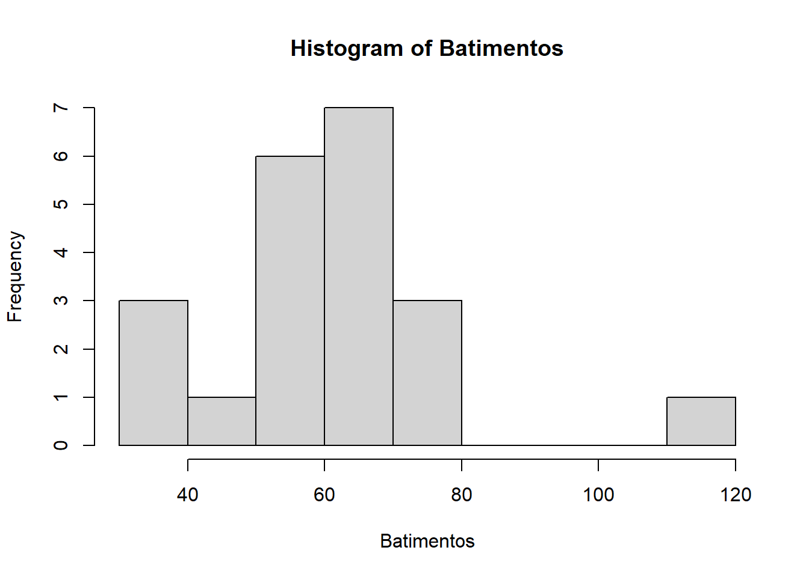


> Boxplot

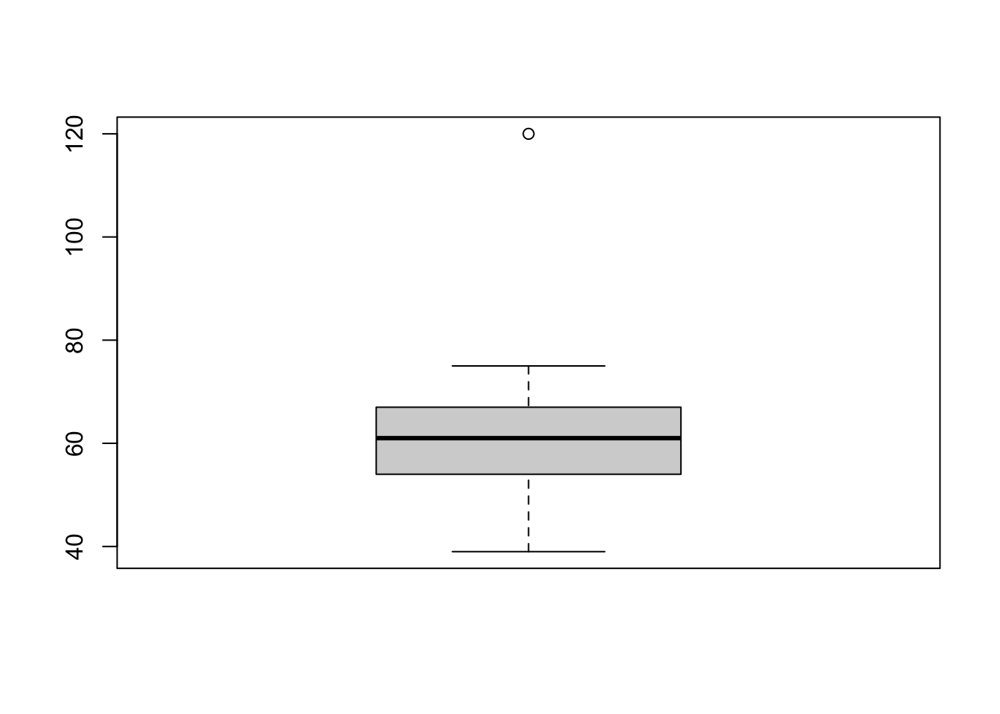

> Observações

+ Os gráficos mostram a informação batimentos de duas formas diferentes, mas elas estão relacionadas!

+ Observe que eixo horizontal do histograma corresponde ao eixo vertical do boxplot

## Histograma

O histograma é um gráfico que usado para variáveis quantitativas contínua.

O histograma pode nos dar uma noção do tipo de **distribuição de probabibilidade** que os dados seguem.

A ideia desse gráfico é agrupar os dados em  **classes** (cada barra do histograma é uma classe) e no eixo vertical tem-se a contagem (frequência) de quantos valores foram alocados em cada classe.

Para fazer a **leitura do histograma**:

  + Identifique as classes no "eixo x" 
  
  + Identifique quantos elementos tem em cada classe no "eixo y"
 
Acredito que nesse exemplo, é fácil verificar:

  + A segunda classe: 40 - 50 batimentos, que tem 1 elemento (verifique no objeto Batimentos)
  
  + A terceira classe: 50 - 60 batimentos, que tem 6 elementos  
  
  + Então, a **aplitude das classes** é igual a 10. Logo, a primeira classe é de 30 - 40. 
  
  + As classes 80 - 90; 90 - 100 e 100 - 110 não tiveram ocorrências!
  
  + A classe 110-120 possui 1 elemento, que é aquele valor discrepante em relação aos demais valores.


Se não for fácil identificar as classes (eixo x) você pode usar o comando abaixo: 


``` r
# Para obter as "quebras" de cada classe 
hist(Batimentos)$breaks
```

Se não for fácil identificar as frequencias (eixo y) você pode usar o comando abaixo:  

``` r
# Para obter a frequência em cada classe
hist(Batimentos)$count
```

De fato, o que estamos lendo por meio do histograma é o que chamamos de **tabela de frequência**: 

|   Classe  | Frequência |
|:---------:|:----------:|
|  30 - 40  |      3     |
|  40 - 50  |      1     |
|  50 - 60  |      6     |
|  60 - 70  |      7     |
|  70 - 80  |      3     |
|  80 - 90  |      0     |
|  90 - 100 |      0     |
| 100 - 110 |      0     |
| 110 - 120 |      1     |
|$\sum n$  |     21     |

  + Por meio do histograma ou da tabela podemos concluir que a classe modal (moda) é a classe de 60 - 70 batimentos;
  
  + A frequência foi apresentada em termos absolutos mais pode ser transformada em frequência percentual.
  
  + Quando estamos aprendendo a fazer um histograma manualmente, primeiro construímos essa tabela de frenquência, e para construí-la é necessário calcular o número ótimo de classes, umas das regras mais usada é a Regra Sturges (essa é opção padrão do R).

Podemos usar o pacote básico R para melhorar a aparência desse gráfico.

``` r
hisBat <- hist(Batimentos,
               main = "Histograma",
               xlab = "Batimentos cardíacos",
               sub = "por classes",
               ylab = "Frequência absoluta",
               xlim = c(20, 120),
               ylim = c(0, 8),
               col = "lightgreen")
text(hisBat$mids, hisBat$counts, labels=hisBat$counts, adj = c(0.5,-0.5))

# adicionar linha para indicar a média
abline(v = mean(Batimentos),                      
       col = "red",
       lwd = 3)
```

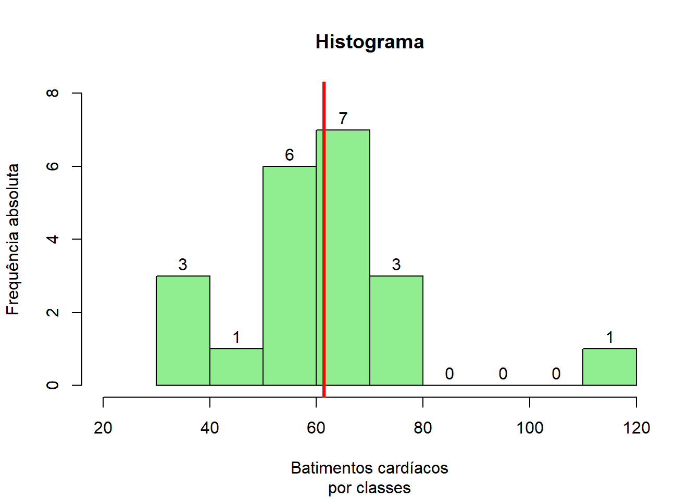

## Boxplot

Boxplot ou diagrama de caixa, é um gráfico que mostra as medidas: menor valor, primeiro quartil, mediana, terceiro quartil e máximo valor.

+ Valores discrepantes (_outliers_) são detectados pelo boxplot. Veja a figura:

<center>{width=50%}
</center>

Essa figura foi retirada do site da Prof. Fernanda https://fernandafperes.com.br/blog/interpretacao-boxplot/ (uma exelente referência para estudar estatística!)

> Geralmente eles são representados na vertical, mas também é comum a representação na horizontal.


``` r
# Para fazer o Boxplot de Batimentos na horizontal
boxplot(Batimentos, horizontal = TRUE)
```

> É uma forma de comparar dois grupos em relação a uma medida, por exemplo os batimentos cardiacos de grupo de homens e de mulheres

``` r
# Geração de amostras simuladas
set.seed(1)
BatimentosMulheres <- rnorm(30, 70, 3)
BatimentosHomens <- rnorm(30, 75, 8)
# Boxplot para os dois grupos Homens e Mulheres 
boxplot(BatimentosHomens, BatimentosMulheres)
```


> O boxplot também pode nos informar se uma distribuição de probabilidade é simétrica ou não. Analise os gráficos abaixo, veja a conexão entre histograma e boxplot.

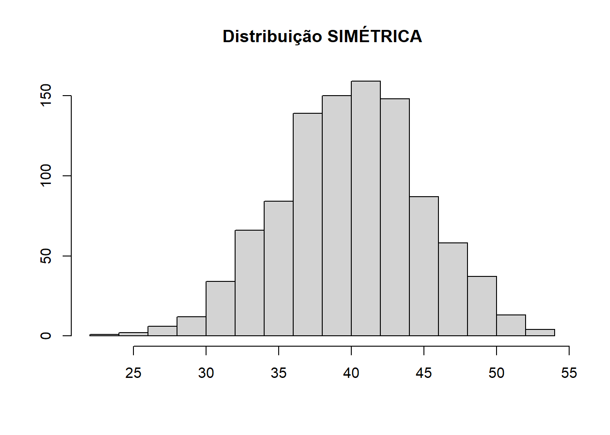


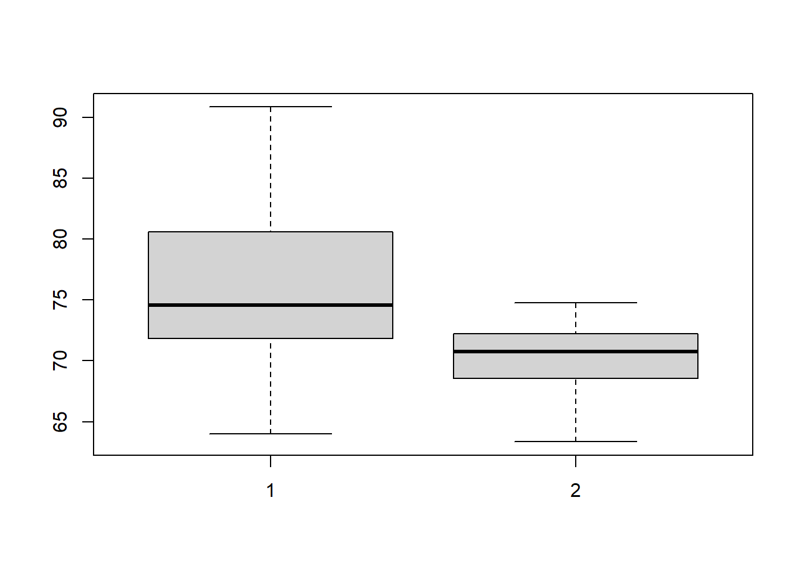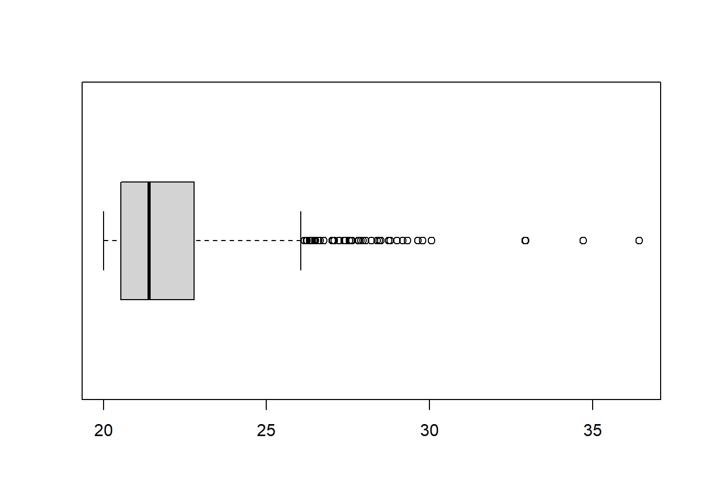

```
##    Min. 1st Qu.  Median    Mean 3rd Qu.    Max. 
##   20.00   20.54   21.40   22.01   22.78   36.42
```

<center>
<script src="https://unpkg.com/@lottiefiles/lottie-player@latest/dist/lottie-player.js"></script>
<lottie-player src="https://assets1.lottiefiles.com/packages/lf20_33asonmr.json"  background="transparent"  speed="1"  style="width: 300px; height: 300px;"  loop  autoplay></lottie-player>
</center>
## Atividade 6

**Para o banco de dados escolhido na atividade 5, faça gráficos como o histograma e boxplot, além disso, pesquise outras formas de fazer gráficos no R.**

# Pacote `ggplot` 

O `ggplot2` é um dos pacotes mais populares do R para a criação de gráficos estatísticos sofisticados e visualmente atraentes. Baseado no conceito da "Gramática dos Gráficos", o `ggplot2` permite construir gráficos de maneira flexível e modular, combinando camadas (layers) de dados, geometrias, escalas e temas.

## Principais Vantagens

- Produz gráficos de alta qualidade e personalizáveis.
- Permite adicionar camadas de informação facilmente.
- Suporta uma variedade de tipos de gráficos.


## Exemplos de Gráficos Simples e Bonitos com ggplot2

Antes de começar, certifique-se de instalar e carregar o pacote:

```r
install.packages("ggplot2")
library(ggplot2)
```

Para ilustrar alguns gráficos utilizando o `ggplot2`, empregaremos o conjunto de dados *iris*, que já está disponível nativamente no R.

O *iris* é um dos bancos de dados mais clássicos e utilizados em estatística e aprendizado de máquina, trazendo informações sobre 150 flores de três espécies diferentes, com quatro variáveis quantitativas (comprimento e largura das sépalas e pétalas). Ele é amplamente utilizado para exemplos de análise exploratória de dados, classificação e visualização de padrões.

Além do iris, o R oferece outros conjuntos de dados nativos bastante úteis para exercícios e demonstrações em diversas áreas, como *mtcars* (carros), *ToothGrowth* (crescimento de dentes em cobaias), *sleep* (efeito de medicamentos no sono), *airquality* (qualidade do ar em Nova Iorque) e *CO2* (absorção de CO2 em plantas).

### Gráfico de Dispersão (Scatterplot)


``` r
library(ggplot2)
# Exemplo com o dataset iris
ggplot(iris, aes(x = Sepal.Length, y = Sepal.Width, color = Species)) +
  geom_point(size = 3, alpha = 0.7) +
  theme_minimal() +
  labs(title = "Gráfico de Dispersão: iris",
       x = "Comprimento da Sépala",
       y = "Largura da Sépala")
```

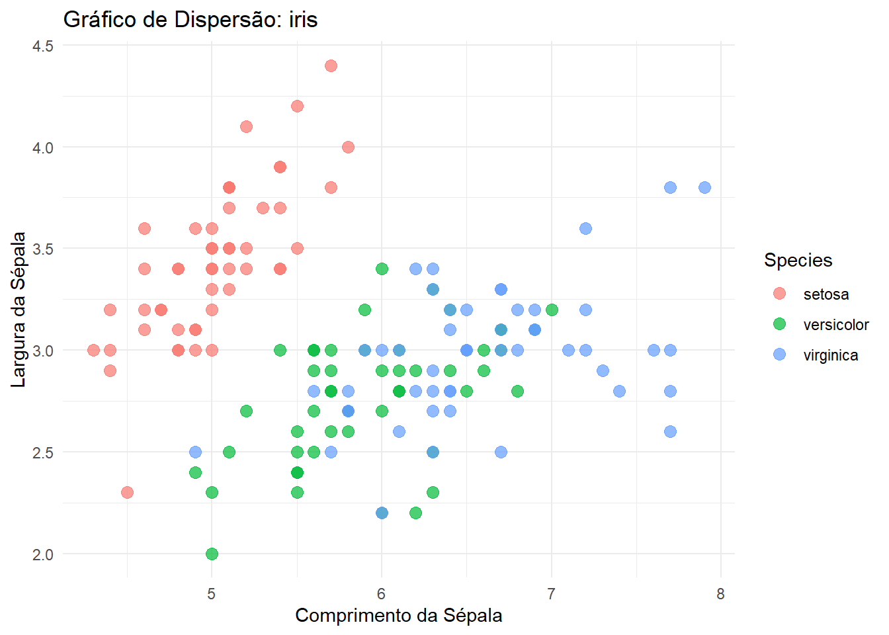

### Gráfico de Barras


``` r
# Contagem das espécies no dataset iris
ggplot(iris, aes(x = Species, fill = Species)) +
  geom_bar() +
  theme_classic() +
  labs(title = "Gráfico de Barras: Contagem de Espécies",
       x = "Espécie",
       y = "Contagem")
```

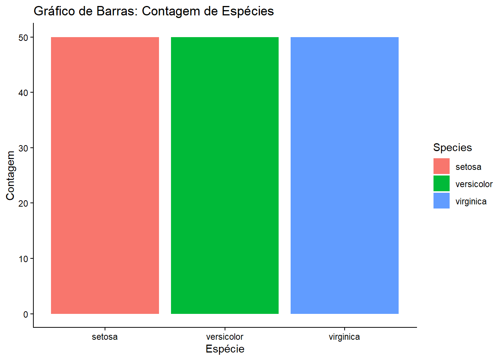

### Histograma


``` r
# Distribuição do comprimento da sépala
ggplot(iris, aes(x = Sepal.Length, fill = Species)) +
  geom_histogram(binwidth = 0.3, color = "white", alpha = 0.7, position = "identity") +
  theme_light() +
  labs(title = "Histograma: Comprimento da Sépala",
       x = "Comprimento da Sépala",
       y = "Frequência")
```

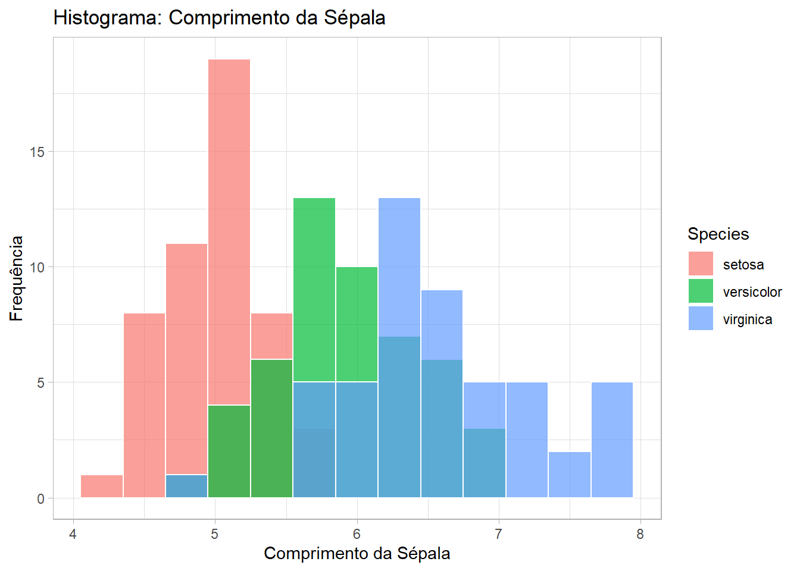

### Boxplot


``` r
# Distribuição do comprimento da pétala por espécie
ggplot(iris, aes(x = Species, y = Petal.Length, fill = Species)) +
  geom_boxplot(alpha = 0.7) +
  theme_bw() +
  labs(title = "Boxplot: Comprimento da Pétala por Espécie",
       x = "Espécie",
       y = "Comprimento da Pétala")
```

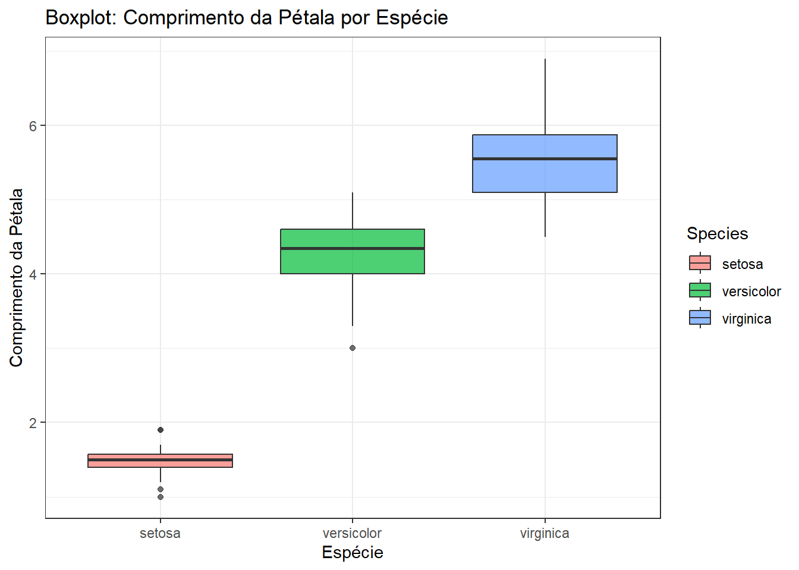


O `ggplot2` oferece diversas opções de personalização, como cores, temas e anotações, permitindo criar gráficos bonitos e informativos para diferentes finalidades.


## Exemplos de Bancos de Dados do R

| Banco de Dados    | Pacote      | Área/Descrição                                               |
|:-------------------|:-------------|:--------------------------------------------------------------|
| iris              | datasets    | Botânica, estatística, aprendizado de máquina (flores)       |
| mtcars            | datasets    | Automóveis, regressão, análise multivariada                  |
| airquality        | datasets    | Qualidade do ar, saúde ambiental                             |
| ToothGrowth       | datasets    | Farmacologia, saúde, crescimento de dentes                   |
| sleep             | datasets    | Psicologia, farmacologia, estudo do sono                     |
| ChickWeight       | datasets    | Nutrição, crescimento animal                                 |
| USArrests         | datasets    | Sociologia, estatísticas criminais dos EUA                   |
| CO2               | datasets    | Biologia, fisiologia vegetal                                 |
| BOD               | datasets    | Biologia, demanda bioquímica de oxigênio                     |
| Boston            | MASS        | Imobiliário, regressão, análise multivariada                 |
| lung              | survival    | Medicina, análise de sobrevivência (dados de câncer de pulmão)|
| bfi               | psych       | Psicologia, personalidade (Big Five Inventory)               |
| NHANES            | NHANES      | Saúde pública, epidemiologia (pesquisa nacional dos EUA)     |
| titanic           | titanic     | Sobrevivência, estatística, aprendizado de máquina           |
| worldcup          | faraway     | Esportes (Copa do Mundo de Futebol)                          |

**Nota:**  
Os bancos do pacote `datasets` já vêm instalados por padrão no R. Outros, como `MASS`, `psych`, `NHANES`, `survival`, `titanic` e `faraway`, podem ser instalados via `install.packages("nome_do_pacote")`.  
Verifique sempre a documentação do pacote para acessar o nome correto dos bancos de dados e exemplos de uso.

<!--chapter:end:09-Graficos.Rmd-->

# Distribuição de Probabilidade

Uma distribuição de probabilidade é um modelo matemático que descreve a relação entre os valores possíveis de uma variável e as probabilidades de ocorrência desses valores. Essencialmente, ela nos permite prever a probabilidade de eventos com base em um conjunto de dados.

Entre as distribuições mais comuns, destacam-se:

- Distribuição Normal (ou Gaussiana)
- Distribuição Binomial
- Distribuição Poisson
- Distribuição Exponencial
- Distribuição Uniforme
- Distribuição Qui-quadrado
- Distribuição t-Student
- Distribuição Gama, entre outras.

Cada tipo de distribuição possui características próprias e é aplicada em diferentes contextos. A distribuição normal é uma das mais amplamente utilizadas, especialmente para modelar fenômenos naturais e sociais, como a altura de indivíduos ou o tempo de vida de produtos.

> **Propriedades Gerais das Distribuições de Probabilidade**

- **Área total sob a curva é igual a 1:** Isso significa que a soma de todas as probabilidades possíveis de ocorrência dos eventos é igual a 100%.
- **A área sob a curva representa a probabilidade de um evento.** Por exemplo, a probabilidade de um evento ocorrer entre dois valores quaisquer pode ser calculada pela área sob a curva entre esses dois pontos.

## Distribuição Normal

A distribuição normal é uma das mais conhecidas na estatística. Ela modela fenômenos que seguem um comportamento simétrico em torno de uma média. A distribuição normal tem várias aplicações, desde a análise de medidas biológicas (como a pressão arterial) até a previsão de fenômenos econômicos (como o preço das ações).

> **A distribuição normal é definida por dois parâmetros principais:**

- **Média (μ):** Representa o valor central da distribuição.
- **Desvio Padrão (σ):** Mede a dispersão dos dados em relação à média.

> **Características da Distribuição Normal**

- **Forma de sino:** A distribuição normal tem a forma de um sino simétrico, com a maior concentração de dados perto da média.
- **Simetria:** A distribuição é simétrica em relação à média.
- **Média, Mediana e Moda:** Para uma distribuição normal, a média, mediana e moda são "iguais" e localizam-se no centro da distribuição.

> **Teoricamente o comportamento da Distribuição Normal é dado por:**

<center>

{width="80%"}

</center>

Onde:

-   A média está representada por $\mu$
-   O devio padrão está representado por $\sigma$

> **Regra empirica 68% - 95% - 99,7%**
Se os dados seguem uma distribuição normal, é possível fazer afirmações sobre a concentração dos dados em torno da média, conforme a regra empírica:

- *68%* dos dados estão no intervalo de uma vez o desvio padrão (μ ± 1σ).
- *95%* dos dados estão no intervalo de duas vezes o desvio padrão (μ ± 2σ).
- *99,7%* dos dados estão no intervalo de três vezes o desvio padrão (μ ± 3σ).

**Importante:** Dados fora do intervalo de μ ± 3σ são considerados raros.

> Exemplo de distribuição Normal, com dados simulados usado a função rnorm().


``` r
# semente de geração de números aleatórios 
set.seed(1)

# Será simulada uma amostra com a seguinte característica:
# 1000 valores
# média ~ 70
# desvio padrão ~ 3
# A função rnorm() gera números randômicos com comportamento de uma distribuição Normal 
BatimentosMulheres <- rnorm(1000, 70, 3)

# Arrendodamento com nenhuma casa depois da vírugula
BatimentosMulheres <- round(BatimentosMulheres,0)

# histograma
hist(BatimentosMulheres)
```


``` r
# Classes e frequencias do histograma
hist(BatimentosMulheres)$breaks
```

```
##  [1] 60 62 64 66 68 70 72 74 76 78 80 82
```

``` r
hist(BatimentosMulheres)$count
```

```
##  [1]   8  35  85 177 264 227 128  57  17   1   1
```

``` r
# histograma e curva de densidade (da Dist. Normal)
hist(BatimentosMulheres, prob = TRUE)
lines(density(BatimentosMulheres), col = 4, lwd = 2)

# idicação da média
abline(v = mean(BatimentosMulheres), col = 2, lwd = 3)
```

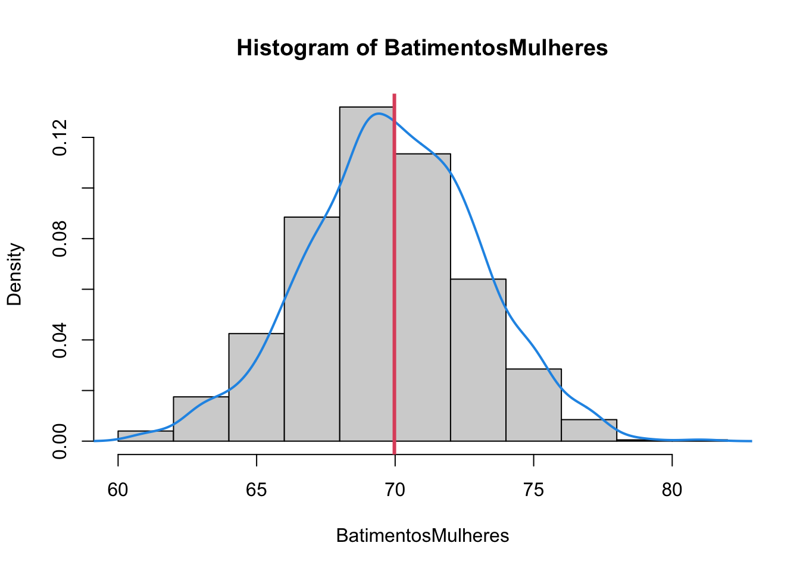

``` r
# medidas resumo
summary(BatimentosMulheres)
```

```
##    Min. 1st Qu.  Median    Mean 3rd Qu.    Max. 
##   61.00   68.00   70.00   69.97   72.00   81.00
```

``` r
sort(table(BatimentosMulheres), decreasing = T)
```

```
## BatimentosMulheres
##  69  70  71  72  68  67  73  66  74  75  65  64  63  76  77  61  62  78  79  81 
## 138 126 116 111  95  82  82  56  46  41  29  18  17  16  15   4   4   2   1   1
```

``` r
sd(BatimentosMulheres)
```

```
## [1] 3.10594
```

``` r
# CV em %
sd(BatimentosMulheres)/mean(BatimentosMulheres)*100
```

```
## [1] 4.438833
```

> As funções **pnorm()** e **dnorm()** são usadas para calcular a probabilidade de um evento que segue uma distribuição, a qual conhecemos a média e o desvio padrão.

**Exemplo:** Sabendo que os batimentos cardíacos de mulheres de 18 a 65 anos tem média de 70bmp e desvio padrão igual a 3bmp.

Calcule as probabilidades:

-   de uma mulher ter batimentos inferior a 70bmp, ou seja, $P(x<70)$:


``` r
# pnorm(): Calcula a probabilidade acumulada até um valor específico. Ou seja, retorna a probabilidade de que uma variável aleatória, que segue uma distribuição normal, seja menor ou igual a um determinado valor.

# observação: a resposta é 0.5 pois a média 70.
pnorm(70, 70, 3)
```

```
## [1] 0.5
```

-   de uma mulher ter batimentos superior a 70bmp, ou seja, $P(x>70)$:


``` r
# observação: 1 é o valor da área total
# a pnorm() fornece a área á esquerda
1 - pnorm(70, 70, 3)
```

```
## [1] 0.5
```

-   de uma mulher ter batimentos igual a 70bmp, ou seja, $P(x=70)$:


``` r
# dnorm(): Calcula a densidade de probabilidade de um valor específico em uma distribuição normal. Em outras palavras, ela retorna o valor da função densidade de probabilidade no ponto especificado.
dnorm(70, 70, 3)
```

```
## [1] 0.1329808
```

-   de uma mulher ter batimentos entre 67 e 73bmp $P(67 < x < 73)$:


``` r
# Observe que estamos testando a regra empírica (68%)
pnorm(73, 70, 3) - pnorm(67, 70, 3)
```

```
## [1] 0.6826895
```

-   de uma mulher ter batimentos entre 67 e 73bmp $P(64 < x < 76)$:


``` r
# Observe que estamos testando a regra empírica (95%)
pnorm(76, 70, 3) - pnorm(64, 70, 3)
```

```
## [1] 0.9544997
```

-   de uma mulher ter batimentos entre 61 e 79bmp $P(61 < x < 79)$:


``` r
# Observe que estamos testando a regra empírica (99,7%)
pnorm(79, 70, 3) - pnorm(61, 70, 3)
```

```
## [1] 0.9973002
```

-   de uma mulher ter batimentos maior que 90bmp $P(x > 90)$:


``` r
# Um evento raro
1 - pnorm(90, 70, 3)
```

```
## [1] 1.308398e-11
```

-   de uma mulher ter batimentos menor que 65bmp $P(x < 65)$:


``` r
pnorm(65, 70, 3)
```

```
## [1] 0.04779035
```

## Gráfico QQ

Uma maneira comum de verificar a normalidade de uma distribuição é utilizando o gráfico QQ. Ele compara os quantis de uma amostra com os quantis de uma distribuição normal padrão, e é muito útil para identificar se os dados seguem uma distribuição normal.

> **Distribuição Normal Padrão**

A distribuição normal padrão tem duas características importantes:

- Média (μ) igual a 0
- Desvio padrão (σ) igual a 1


> **Cálculo do Escore Z**

Qualquer distribuição normal pode ser transformada na distribuição normal padrão utilizando o escore Z. O **escore Z** é calculado pela fórmula:

\[
z = \frac{(x - \mu)}{\sigma}
\]

Onde:

- \(x\) é o valor da observação.
- \(\mu\) é a média da distribuição.
- \(\sigma\) é o desvio padrão da distribuição.

O gráfico QQ realiza exatamente o que a fórmula do escore Z descreve: ele transforma os dados da amostra para a distribuição normal padrão (média 0 e desvio padrão 1) e então compara esses valores transformados com os quantis da distribuição normal teórica. Se os pontos formarem uma linha reta, isso sugere que os dados seguem uma distribuição normal.

Veja um exemplo no R para uma Distribuição Normal Padrão: 


``` r
set.seed(1)
# rnorm(10000, 0, 1): normal padrão média 0, dp=1
# ou simplesmente rnorm(10000)
NormalPadrao <- rnorm(10000)
hist(NormalPadrao, probability = T)
lines(density(NormalPadrao), col = 4, lwd = 2)
axis(side = 1, at = seq(-3, 3, by = 1), labels = seq(-3, 3, by = 1))
abline(v = mean(NormalPadrao), col = 2, lwd = 3)
```

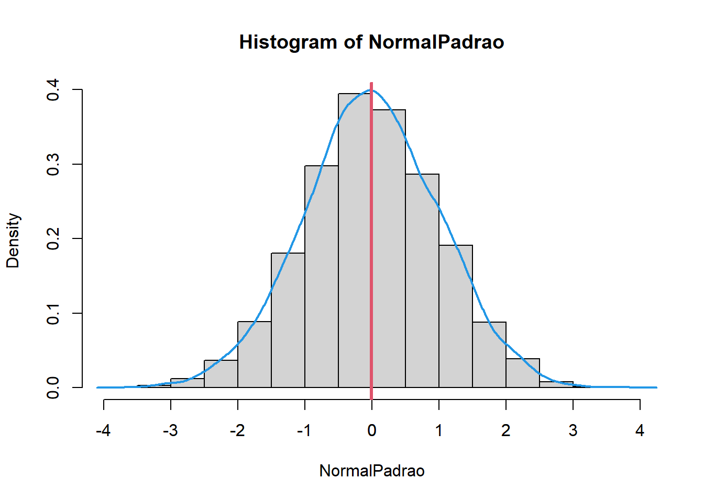

No gráfico QQ, os quantis da amostra são comparados com os quantis da distribuição normal padrão. Se a amostra segue uma distribuição normal, os pontos no gráfico QQ devem se alinhar aproximadamente a uma linha reta.

Se os pontos se afastam dessa linha reta de forma sistemática, isso indica que os dados não seguem uma distribuição normal. O tipo de desvio pode dar pistas sobre a natureza dessa não-normalidade (por exemplo, se os pontos se curvam para cima ou para baixo, pode indicar assimetria ou caudas pesadas).


> Distrbuição normal é usada para dados contínuos!


``` r
# Gráfico QQ
set.seed(1)
BatimentosMulheres <- rnorm(1000, 70, 3)
qqnorm(BatimentosMulheres)
qqline(BatimentosMulheres, col="red")
```

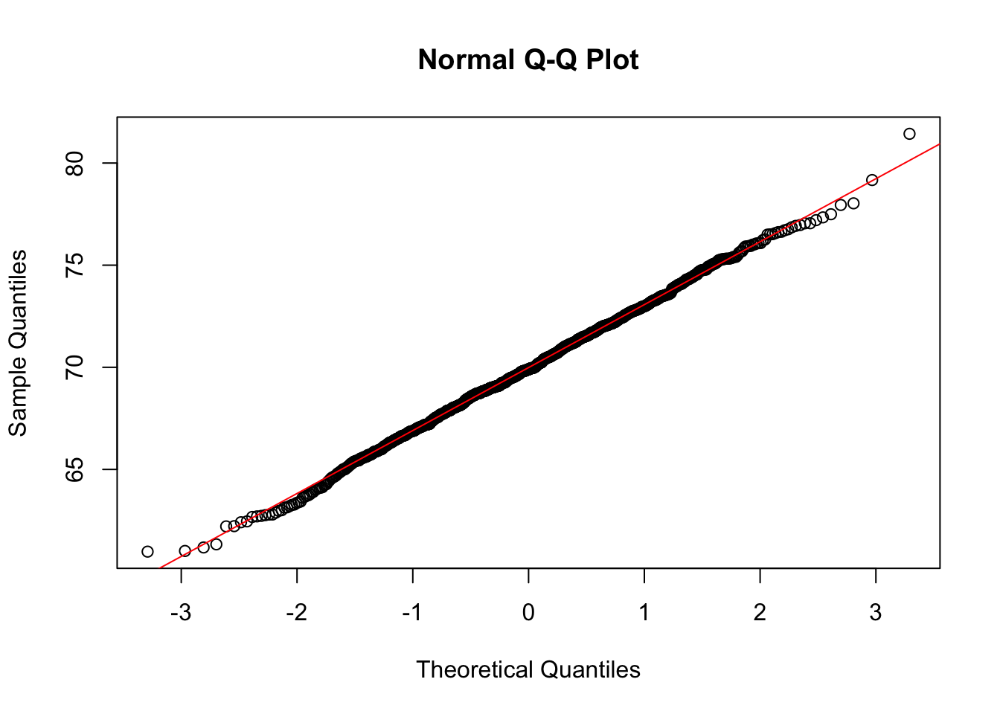

``` r
# Faça o arredondamento
BatimentosMulheresR <- round(BatimentosMulheres,0)
qqnorm(BatimentosMulheresR)
qqline(BatimentosMulheresR)
```

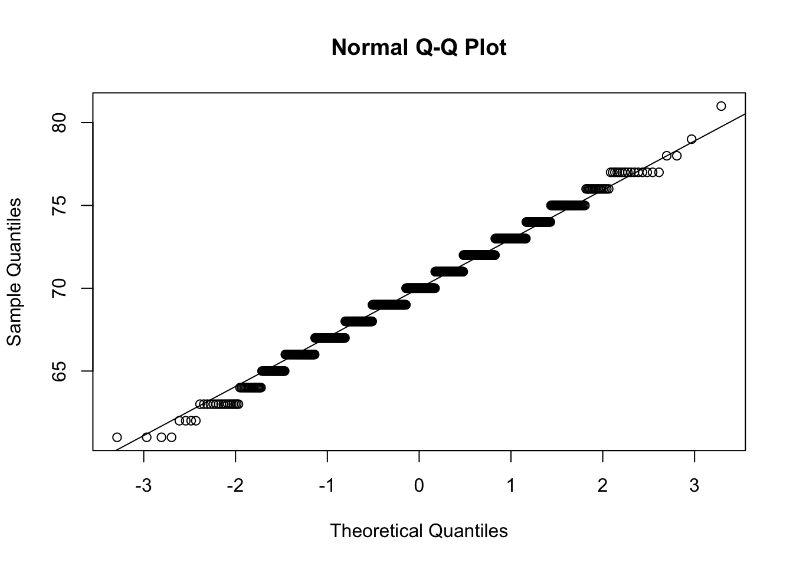

> A distribuição Normal é uma distribuição para modelar variáveis **CONTÍNUAS**!

## Atividade 7

**Utilizando o banco de dados escolhido para as atividades 5 e 6, gere gráficos QQ para as variáveis quantitativas. Em seguida, avalie visualmente se essas variáveis seguem uma distribuição normal.**

<!--chapter:end:10-DistribuicaoNormal.Rmd-->

# Exemplos de distribuições


<center>
<script src="https://unpkg.com/@dotlottie/player-component@2.7.12/dist/dotlottie-player.mjs" type="module"></script>
<dotlottie-player src="https://lottie.host/74a90344-947f-476a-a118-7d9d5c6cd810/z76UXstist.lottie" background="transparent" speed="1" style="width: 300px; height: 300px" loop autoplay></dotlottie-player>
</center>

## Distribuições Discretas

### Binomial

Modela o número de sucessos em n tentativas com probabilidade `p`.


``` r
n <- 10
p <- 0.5
x <- 0:n
y <- dbinom(x, size = n, prob = p)

ggplot(data.frame(x, y), aes(x, y)) +
  geom_bar(stat = "identity", fill = "steelblue") +
  labs(title = "Distribuição Binomial (n = 10, p = 0.5)", x = "Número de Sucessos", y = "Probabilidade")
```

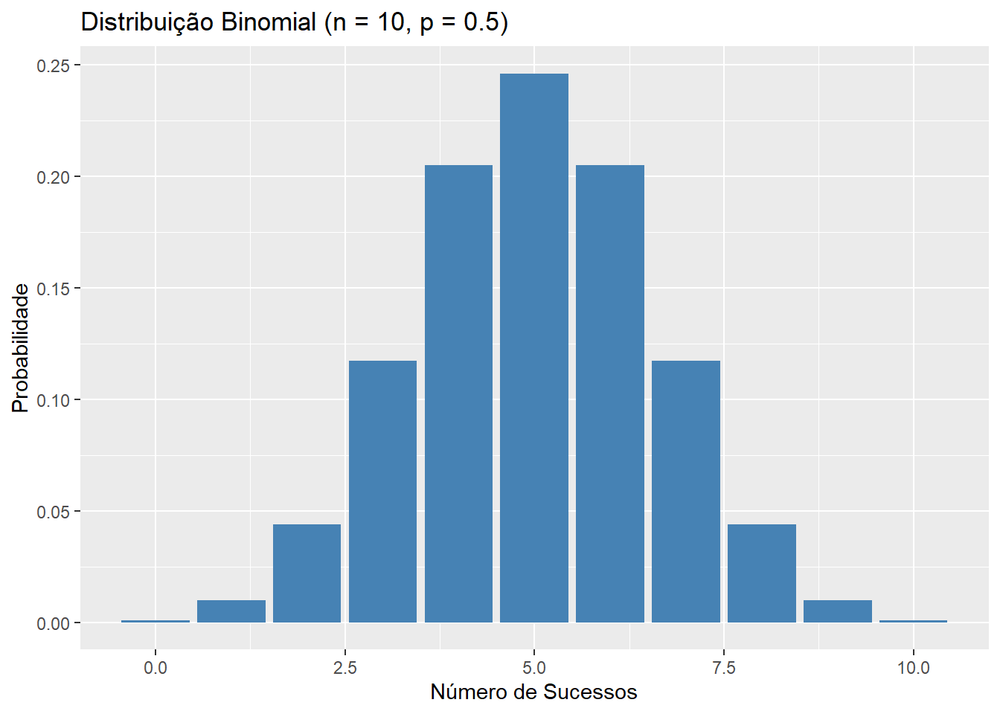

### Poisson

Modela o número de eventos raros num intervalo fixo.


``` r
lambda <- 3
x <- 0:15
y <- dpois(x, lambda)

ggplot(data.frame(x, y), aes(x, y)) +
  geom_bar(stat = "identity", fill = "darkorange") +
  labs(title = "Distribuição de Poisson", x = "Número de Eventos", y = "Probabilidade")
```

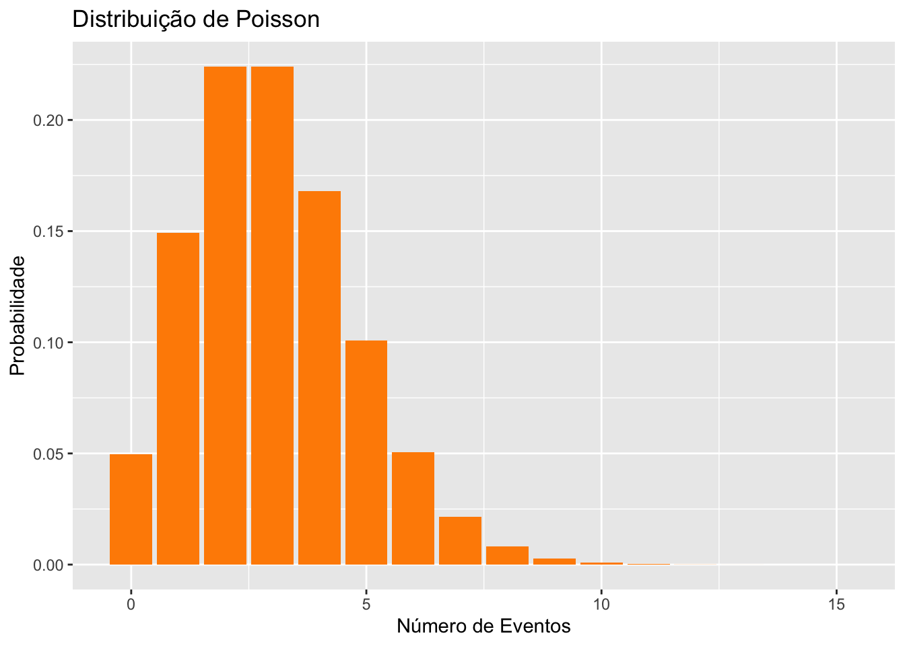

### Geométrica

Modela o número de falhas antes do primeiro sucesso.


``` r
p <- 0.3
x <- 0:10
y <- dgeom(x, prob = p)

ggplot(data.frame(x, y), aes(x, y)) +
  geom_bar(stat = "identity", fill = "purple") +
  labs(title = "Distribuição Geométrica (p = 0.3)", x = "Tentativas até o 1º Sucesso", y = "Probabilidade")
```

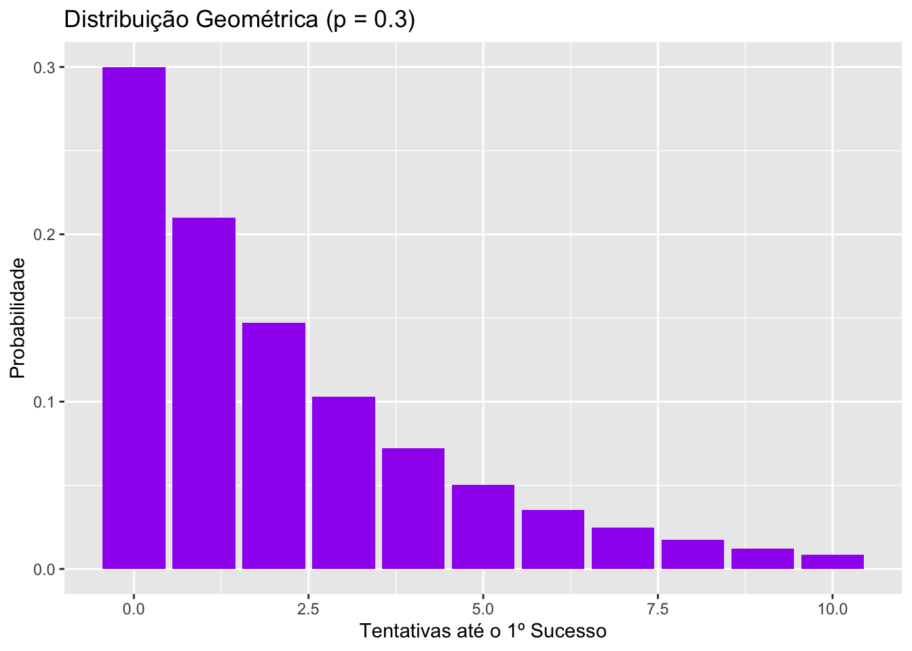

## Distribuições Contínuas

### Normal

Modela fenômenos naturais e erros de medida.


``` r
x <- seq(-4, 4, length.out = 100)
y <- dnorm(x)

ggplot(data.frame(x, y), aes(x, y)) +
  geom_line(color = "darkgreen", linewidth = 1.2) +
  labs(title = "Distribuição Normal (média = 0, sd = 1)", x = "x", y = "Densidade")
```

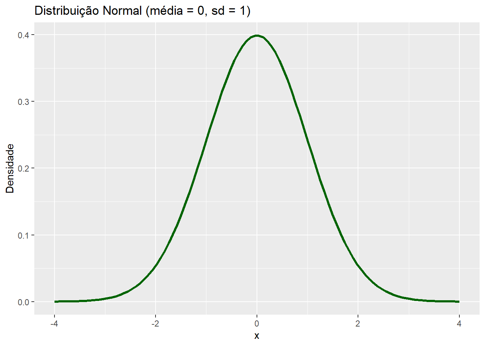

### Exponencial

Tempo até um evento ocorrer.


``` r
lambda <- 1
x <- seq(0, 5, length.out = 100)
y <- dexp(x, rate = lambda)

ggplot(data.frame(x, y), aes(x, y)) +
  geom_line(color = "firebrick", size = 1.2) +
  labs(title = "Distribuição Exponencial", x = "Tempo", y = "Densidade")
```

```
## Warning: Using `size` aesthetic for lines was deprecated in ggplot2 3.4.0.
## ℹ Please use `linewidth` instead.
## This warning is displayed once every 8 hours.
## Call `lifecycle::last_lifecycle_warnings()` to see where this warning
## was generated.
```

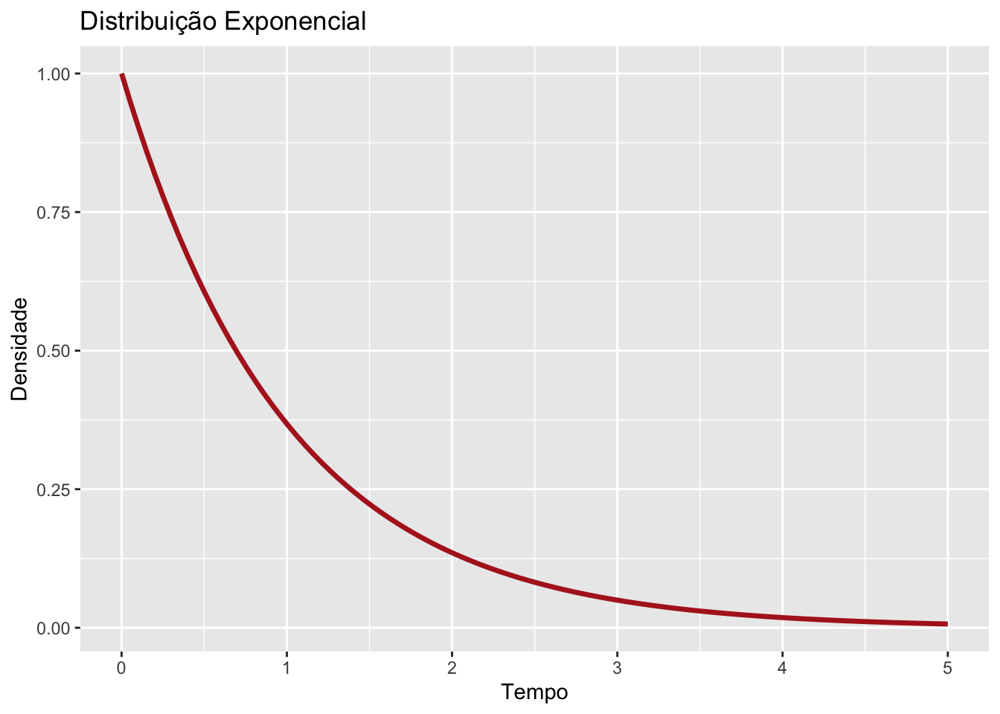

### Uniforme Contínua

Todos os valores têm a mesma chance.


``` r
x <- seq(0, 1, length.out = 100)
y <- dunif(x, min = 0, max = 1)

ggplot(data.frame(x, y), aes(x, y)) +
  geom_line(color = "goldenrod", size = 1.2) +
  labs(title = "Distribuição Uniforme Contínua (0 a 1)", x = "x", y = "Densidade")
```

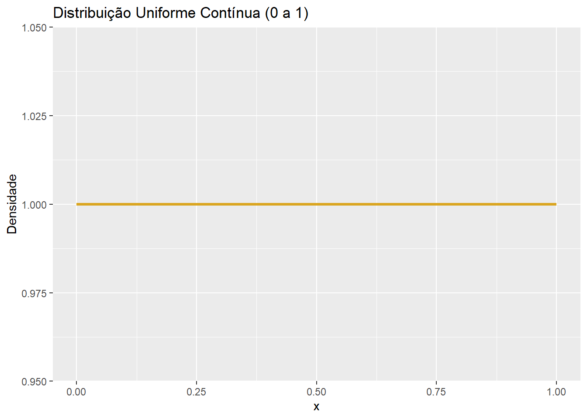

### t de Student

Usada em testes com amostras pequenas.


``` r
x <- seq(-4, 4, length.out = 100)
y <- dt(x, df = 5)

ggplot(data.frame(x, y), aes(x, y)) +
  geom_line(color = "navy", size = 1.2) +
  labs(title = "Distribuição t de Student (df = 5)", x = "x", y = "Densidade")
```

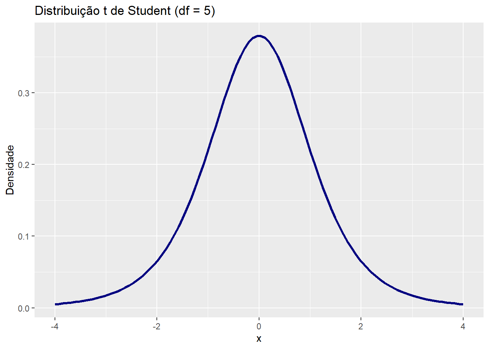

### Qui-Quadrado (χ²)

Usada para testes de aderência e independência.


``` r
x <- seq(0, 20, length.out = 100)
y <- dchisq(x, df = 5)

ggplot(data.frame(x, y), aes(x, y)) +
  geom_line(color = "tomato", size = 1.2) +
  labs(title = "Distribuição Qui-quadrado (df = 5)", x = "x", y = "Densidade")
```

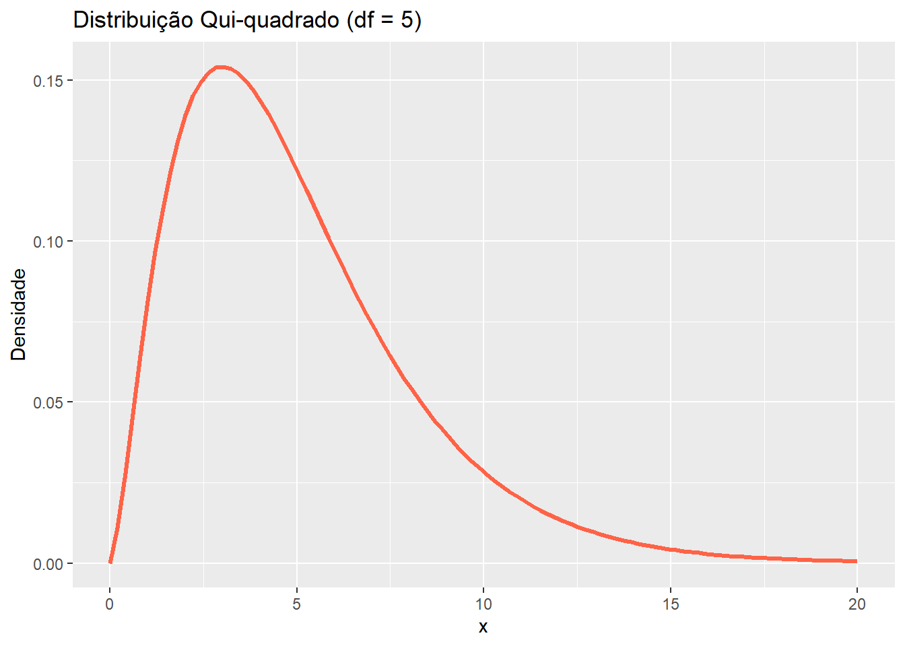

### F de Fisher

Usada em ANOVA para comparar variâncias.


``` r
x <- seq(0, 5, length.out = 100)
y <- df(x, df1 = 5, df2 = 10)

ggplot(data.frame(x, y), aes(x, y)) +
  geom_line(color = "darkviolet", size = 1.2) +
  labs(title = "Distribuição F de Fisher (df1 = 5, df2 = 10)", x = "x", y = "Densidade")
```

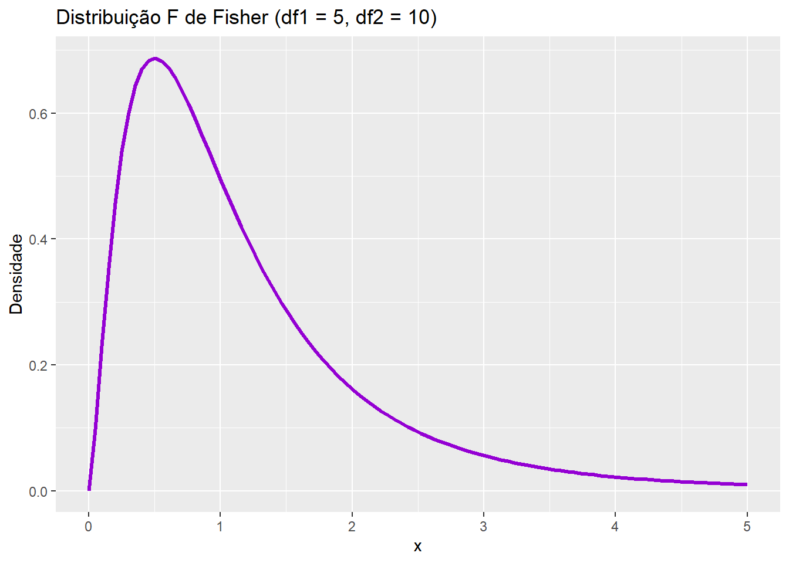

> Cada distribuição tem uma aplicação específica conforme o tipo de variável (discreta ou contínua), o contexto do problema e as suposições do modelo. Entender suas formas e usos ajuda na escolha correta da análise estatística.

<!--chapter:end:11-Distribuicoes-Probabilidade.Rmd-->

# Normal ou Não?

<center>
<script src="https://unpkg.com/@dotlottie/player-component@2.7.12/dist/dotlottie-player.mjs" type="module"></script>
<dotlottie-player src="https://lottie.host/32368ff6-8150-40df-a981-abe61d0c919f/Uobp2rITzh.lottie" background="transparent" speed="1" style="width: 300px; height: 300px" loop autoplay></dotlottie-player>
</center>

Antes de avançarmos para a aplicação dos testes estatísticos, é importante avaliarmos se os dados seguem ou não uma distribuição normal. Essa verificação inicial é muito importante porque muitos testes paramétricos, como o teste t e a ANOVA, partem da suposição de normalidade dos dados. Compreender esse aspecto permite escolher os métodos estatísticos mais adequados, aumentando a confiabilidade dos resultados e evitando interpretações equivocadas que poderiam comprometer a análise.

Esta seção apresenta uma análise visual da normalidade dos dados por meio de gráficos QQ (Quantil-Quantil), com a comparação de três cenários distintos: dados que seguem uma distribuição normal, dados que levantam dúvidas quanto à normalidade e dados que claramente não seguem essa distribuição.

- Dados normalmente distribuídos
- Dados que geram dúvida quanto à normalidade
- Dados que claramente não seguem distribuição normal

## Dados que seguem distribuição normal


``` r
set.seed(10)
dados_normais <- rnorm(500, mean = 0, sd = 1)

hist(dados_normais, main = "Histograma - Distribuição Normal", col = "lightblue")
```

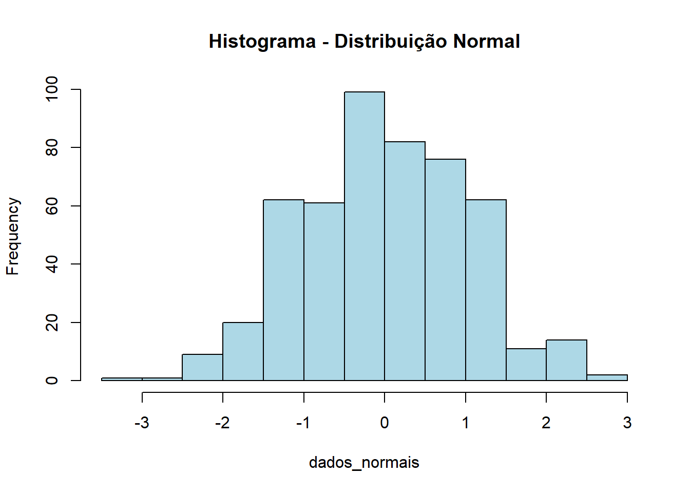

``` r
boxplot(dados_normais, main = "Boxplot - Distribuição Normal")
```

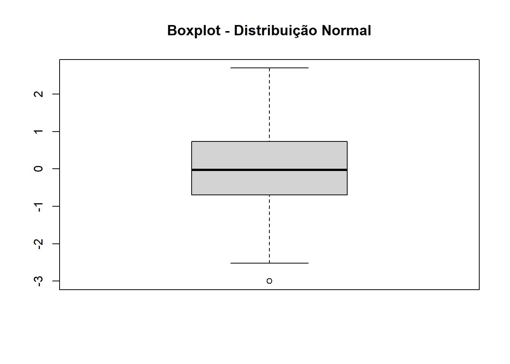

``` r
qqnorm(dados_normais, main = "QQ Plot - Distribuição Normal")
qqline(dados_normais, col = "blue", lwd = 2)
```

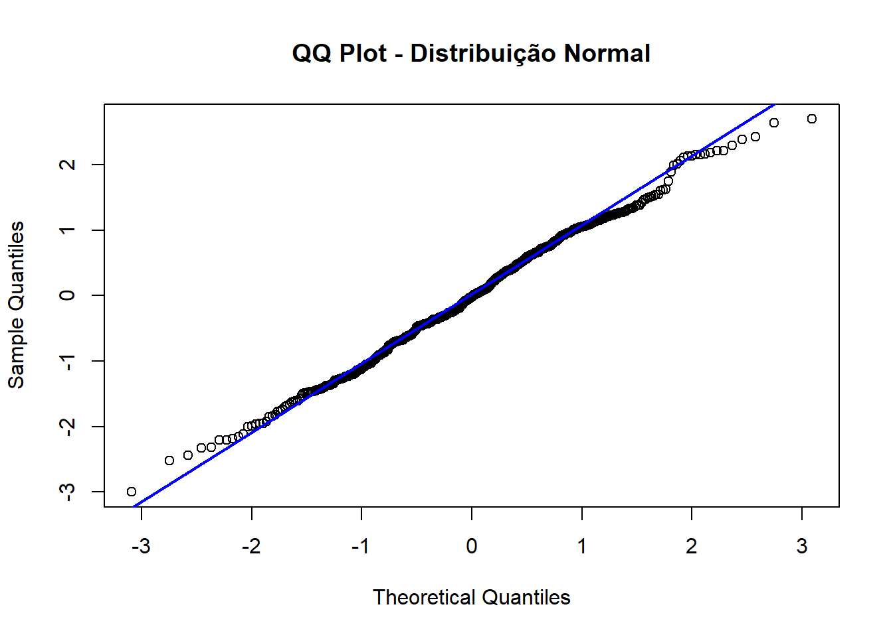

*Observação:* Os pontos seguem de perto a linha, indicando que os dados são normalmente distribuídos.

## Dados que geram dúvida


``` r
set.seed(20)
dados_mistos <- c(rnorm(250, 0, 1), rnorm(250, 2, 1))

hist(dados_mistos, main = "Histograma - Mistura de Normais", col = "lightgreen")
```

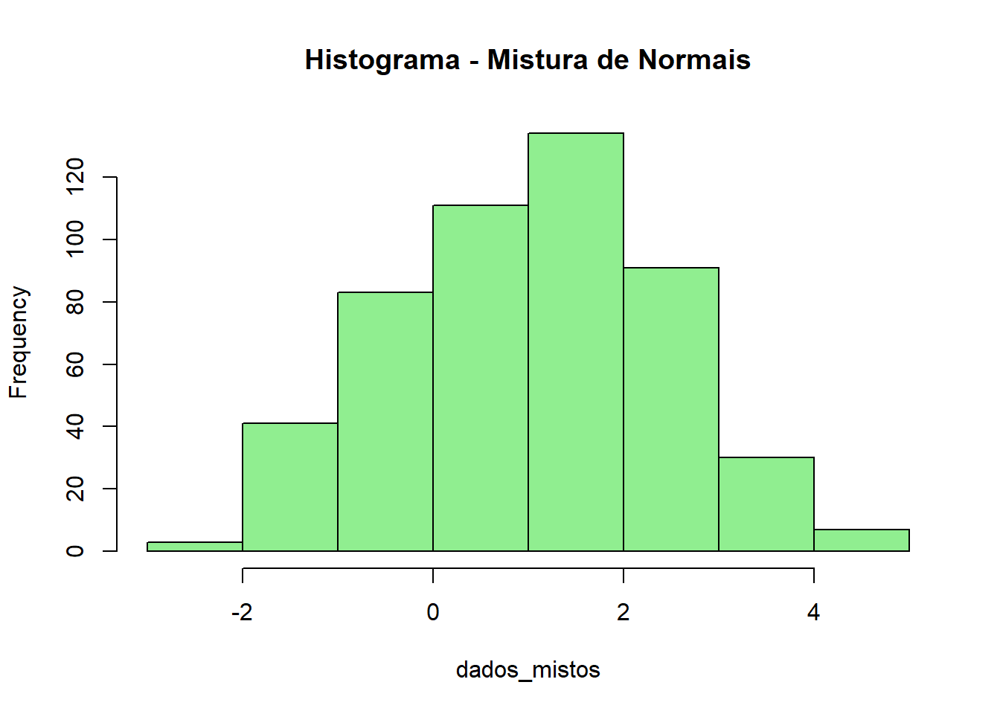

``` r
boxplot(dados_mistos, main = "Boxplot - Mistura de Normais")
```

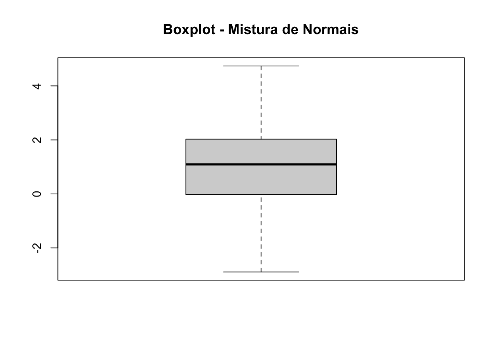

``` r
qqnorm(dados_mistos, main = "QQ Plot - Mistura de Normais")
qqline(dados_mistos, col = "orange", lwd = 2)
```

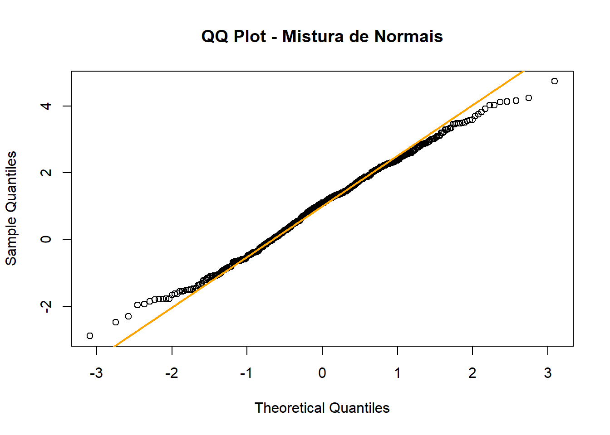

*Observação:* As caudas do gráfico QQ começam a se afastar da linha, o que pode gerar dúvida sobre a normalidade.


## Dados que não seguem distribuição normal


``` r
set.seed(30)
dados_chi <- rchisq(500, df = 3)

hist(dados_chi, main = "Histograma - Distribuição Qui-quadrado", col = "lightpink")
```

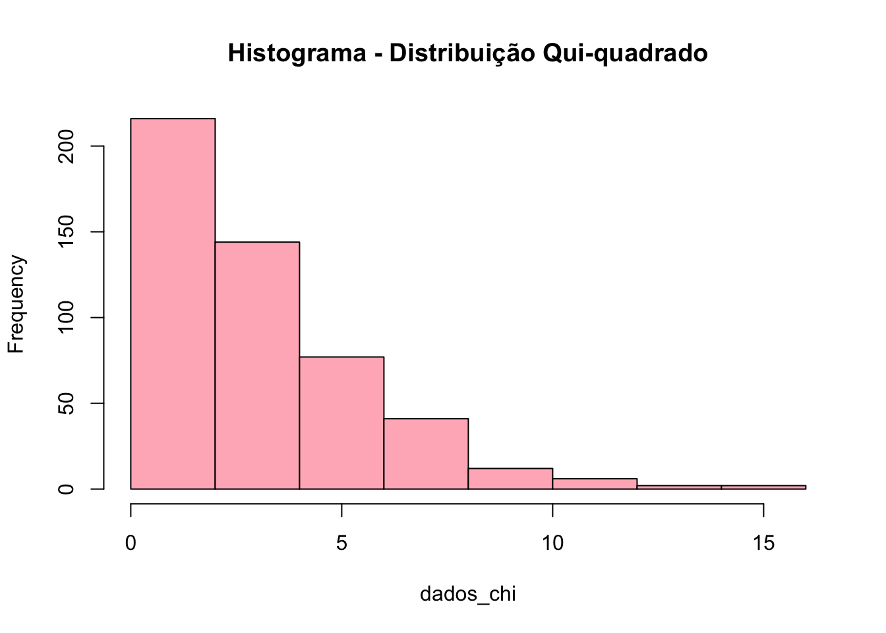

``` r
boxplot(dados_chi, main = "Boxplot - Qui-quadrado")
```

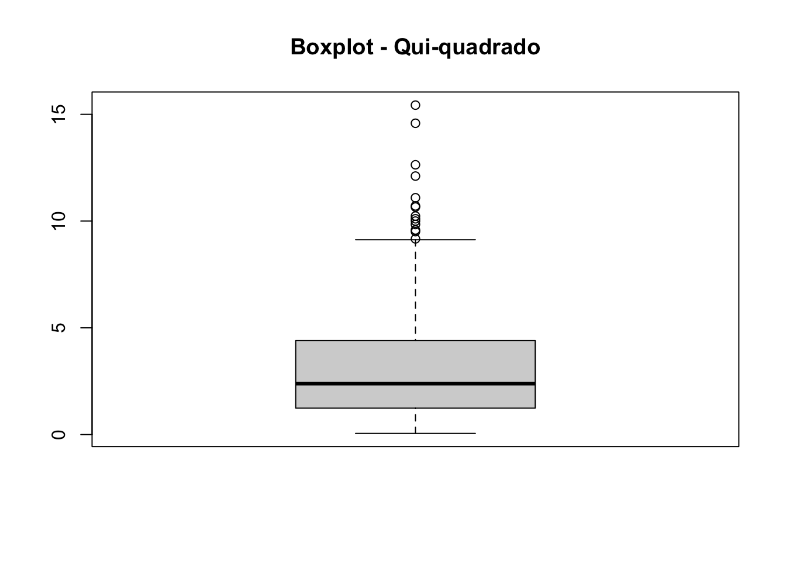

``` r
qqnorm(dados_chi, main = "QQ Plot - Qui-quadrado")
qqline(dados_chi, col = "red", lwd = 2)
```

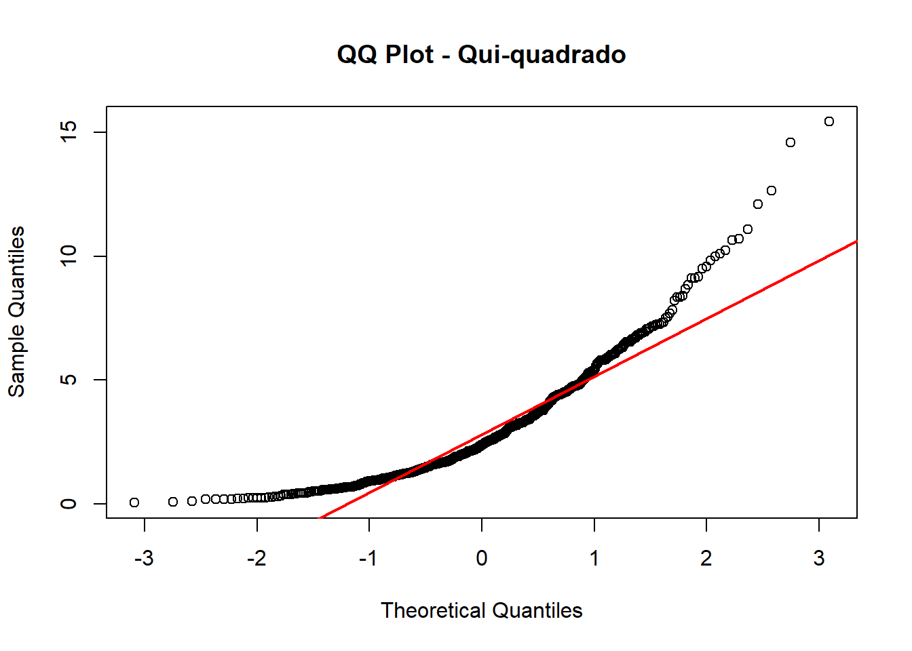

*Observação:* A forte curvatura do gráfico QQ indica clara violação da normalidade (assimetria à direita).

## Dados com forte concentração de repetição de valor (não seguem distribuição normal)


``` r
set.seed(42)
dados_repetidos <- c(rep(18, 5), rep(23, 10), rep(26,7)) 

# Histograma
hist(dados_repetidos, main = "Histograma - Dados Repetidos", col = "lightblue", xlab = "Valor", ylab = "Frequência")
```

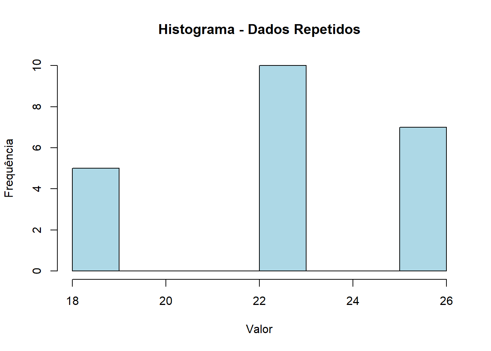

``` r
# Boxplot
boxplot(dados_repetidos, main = "Boxplot - Dados Repetidos", col = "lightgreen")
```

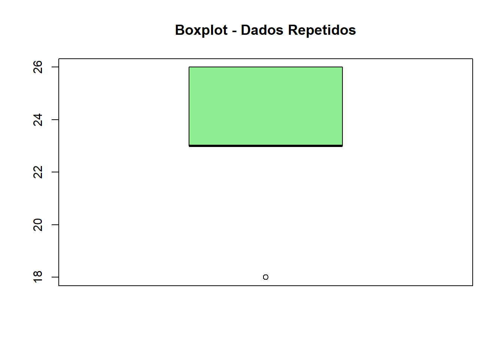

``` r
# QQ Plot
qqnorm(dados_repetidos, main = "QQ Plot - Dados Repetidos")
qqline(dados_repetidos, col = "red", lwd = 2)
```

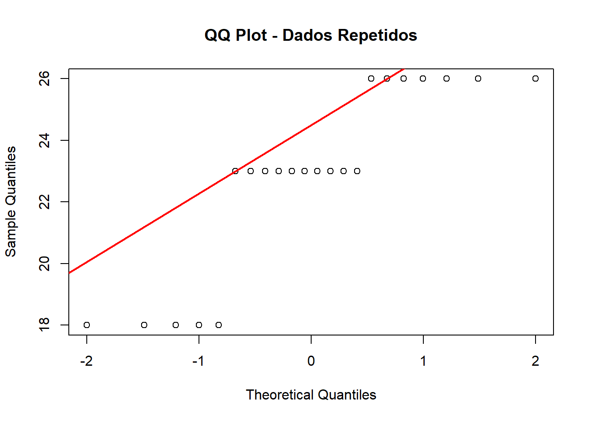

> O gráfico QQ é uma ferramenta visual poderosa para avaliar se um conjunto de dados segue uma distribuição normal. Em conjunto com histogramas e boxplots, permite identificar desvios, outliers e assimetrias de maneira clara.

<!--chapter:end:12-diagnostico-normalidade.Rmd-->

# Estatística Inferencial

A **estatística inferencial** é uma área essencial da estatística que permite fazer generalizações sobre uma população com base em dados coletados de uma amostra. Um passo fundamental nesse processo é o **cálculo amostral**, que determina o tamanho ideal da amostra para garantir a validade dos resultados, e esse cálculo depende diretamente do **tipo de teste estatístico** que será utilizado, pois diferentes testes exigem diferentes parâmetros, como variabilidade, efeito esperado e poder do teste. 

Ao conduzir uma análise inferencial, formulam-se **hipóteses**: a **hipótese nula (H₀)**, que representa a ausência de efeito ou diferença, e a **hipótese alternativa (H₁)**, que sugere a existência de um efeito ou diferença. Define-se também um **nível de significância (α)**, geralmente 0,05 (5%), que representa a probabilidade de rejeitar H₀ quando ela é verdadeira (**erro tipo I**). O **valor-p**, calculado a partir dos dados, indica a probabilidade de obter um resultado tão extremo quanto o observado, supondo que H₀ seja verdadeira. Com base na comparação entre o valor-p e o nível de significância, aplica-se o **critério de decisão**: se o valor-p for menor que α, rejeita-se H₀, o que indica **evidências estatísticas suficientes para apoiar a hipótese alternativa**.


## Etapas de um Teste Estatístico

Para realizar qualquer **teste estatístico**, seguimos uma sequência básica de passos:

1. **Escrevemos as hipóteses do teste**, começando com a **hipótese nula (H₀)**, que geralmente afirma que não há efeito ou diferença, e a **hipótese alternativa (H₁)**, que propõe o contrário.

2. **Definimos o nível de significância (α)**, que é a margem de erro aceitável. Esse valor, geralmente 0,05 (ou 5%), já foi considerado no **cálculo do tamanho da amostra**, garantindo que os resultados tenham confiabilidade.

3. **Utilizamos um recurso computacional**, como um software estatístico, para calcular o **valor-p**, que mostra a probabilidade de observarmos os dados coletados caso a hipótese nula seja verdadeira.

5. **Comparamos o valor-p com o nível de significância**. Se o valor-p for menor que α, **rejeitamos a hipótese nula**. Caso contrário, não rejeitamos.

6. Por fim, **chegamos à conclusão do teste**, que nos diz se há ou não **evidência estatística** suficiente para apoiar a hipótese alternativa.


## Erros Tipo I e Tipo II

Em um **teste estatístico**, tomamos uma decisão com base nos dados coletados de uma amostra: **rejeitar** ou **não rejeitar a hipótese nula (H₀)**. Por isso, é fundamental realizar um **cálculo amostral adequado**, selecionar cuidadosamente a **técnica de amostragem** e estar atento às possíveis **fontes de vieses**, garantindo que a amostra seja representativa e que os resultados do teste sejam confiáveis.

Entretanto, essa decisão envolve **riscos de erro**, que são inerentes ao processo justamente porque estamos baseando nossas conclusões em uma amostra e não na população inteira. Esses erros se dividem em dois tipos:

- **Erro Tipo I (α) – Falso Positivo**  
  Ocorre quando **rejeitamos H₀ mesmo ela sendo verdadeira**.  
  É como afirmar que existe um efeito quando, na verdade, não existe.  
 
  > Exemplo na medicina: concluir que um novo medicamento reduz a pressão arterial quando ele não tem efeito real, o que pode levar à aprovação de um tratamento ineficaz.  
  
  > Exemplo no esporte: afirmar que um programa de treinamento melhora o desempenho dos atletas quando ele não traz benefício real, gerando investimentos desnecessários.  
  
  > Exemplo na psicologia: dizer que uma terapia cognitivo-comportamental reduz a ansiedade, mesmo sem efeito comprovado, gerando falsas expectativas nos pacientes.  
 
  Essa é a chance de um **falso positivo**, e o **nível de significância α** (geralmente 0,05) representa a probabilidade de cometer esse erro.

- **Erro Tipo II (β) – Falso Negativo**  
  Ocorre quando **não rejeitamos H₀ mesmo ela sendo falsa**.  
  É como deixar passar um efeito real sem detectá-lo.  
  
  > Exemplo na medicina: não identificar que o medicamento é eficaz, rejeitando seu uso quando ele realmente funciona.  
  
  > Exemplo no esporte: não perceber a melhora no desempenho causada pelo programa de treinamento, deixando de adotá-lo e prejudicando os atletas.  
  
  > Exemplo na psicologia: não detectar que a terapia é eficaz para reduzir a ansiedade, levando à rejeição de um tratamento que poderia beneficiar os pacientes.  
  
  Isso é um **falso negativo**, e **β** é a probabilidade de cometer esse erro.

## Poder do Teste Estatístico

- O **poder do teste** é a probabilidade de **detectar um efeito real quando ele realmente existe**, ou seja, **rejeitar H₀ quando H₀ é falsa**.  
- O poder é calculado como:  
  **Poder = 1 - β**

Um teste com **alto poder** (geralmente desejado acima de 80%) tem menos chance de cometer erro tipo II, o que significa maior capacidade de detectar diferenças reais quando elas existem. O poder depende do **tamanho da amostra**, do **nível de significância**, da **variabilidade dos dados** e da **magnitude do efeito** que se deseja identificar.


## Tabela: Erros, Decisões e Poder do Teste

| Situação Real       | Decisão: Rejeitar H₀            | Decisão: Não Rejeitar H₀          |
|:-------------------:|:------------------------------:|:--------------------------------:|
| H₀ é verdadeira     | Erro Tipo I (*α*)    | Decisão correta                  |
| H₀ é falsa          | Decisão correta (*poder*)                | Erro Tipo II (*β*)    |


- **Poder do teste:** Probabilidade de rejeitar H₀ quando H₀ é falsa (ou seja, evitar o erro tipo II).


## Tamanho do Efeito

### O que é o Tamanho do Efeito?

O **tamanho do efeito** é uma medida que indica **o quanto uma diferença ou relação observada nos dados é relevante na prática**. 

Enquanto o **valor-p** nos informa se um resultado é estatisticamente significativo (ou seja, se é improvável que tenha ocorrido por acaso), o tamanho do efeito **complementa essa análise mostrando a magnitude real do efeito observado**.


### Exemplos para Entender Melhor

> Imagine que um novo remédio reduza a pressão arterial em média em **1 mmHg** comparado ao tratamento padrão.  
  Com uma amostra muito grande, essa pequena diferença pode ser estatisticamente significativa (*valor-p* < 0,05), mas **clinicamente irrelevante**. O tamanho do efeito, neste caso, mostra que, apesar do resultado ser significativo, **o impacto prático é muito pequeno**.

> Suponha um estudo que compara dois métodos de treinamento de força e encontra uma diferença média de **0,5 kg** no aumento de carga máxima entre os grupos após 8 semanas.  
  Com uma amostra grande, essa diferença pode ser estatisticamente significativa, mas **na prática, esse ganho é muito pequeno** para justificar a troca de método. O tamanho do efeito indica que, embora exista diferença detectada, **ela tem pouco impacto real no desempenho atlético**.

> Considere uma pesquisa que compara níveis de ansiedade entre terapia online e presencial, com diferença média de **1 ponto** (em escala de 0 a 100).  
  Mesmo que essa diferença seja estatisticamente significativa, **não representa uma mudança clinicamente relevante** no estado emocional dos pacientes. O tamanho do efeito ajuda a perceber que a diferença entre as modalidades pode ser mínima na prática.


## Medidas Comuns de Tamanho do Efeito

A escolha da medida depende do tipo de teste e das variáveis analisadas.

### d de Cohen (teste t)

Usado para comparar médias entre dois grupos, mede a diferença em unidades de desvio padrão.

| Valor do d | Interpretação       |
|:------------|:---------------------|
| ≈ 0.2      | Efeito pequeno      |
| ≈ 0.5      | Efeito médio        |
| ≥ 0.8      | Efeito grande       |

### C de Cramer, para tabela 2x2 (teste qui-quadrado)

Mede a associação entre variáveis categóricas (varia de 0 a 1).

| Valor de C | Interpretação       |
|:------------|:---------------------|
| ≈ 0.1      | Associação fraca    |
| ≈ 0.3      | Associação moderada |
| ≥ 0.5      | Associação forte    |

### Coeficiente de Correlação de Pearson (r)

Mede a força da relação linear entre duas variáveis quantitativas.

| Valor de r   | Interpretação          |
|:--------------|:------------------------|
| ≈ 0.1        | Correlação fraca       |
| ≈ 0.3        | Correlação moderada    |
| ≥ 0.5        | Correlação forte       |
| 0            | Nenhuma correlação     |
| ±1           | Correlação perfeita    |


## Por que o Tamanho do Efeito é Importante?

Um resultado estatisticamente significativo **nem sempre indica relevância prática**. O tamanho do efeito responde à pergunta: **"Esse resultado faz diferença no mundo real?"**

## Testes

Nas próximas seções, abordaremos os testes de **comparação entre grupos** com base em uma variável quantitativa, os testes de **associação entre variáveis categóricas** nominais, e os testes de **correlação**, que podem envolver variáveis quantitativas ou qualitativas ordinais. Essa abordagem visa facilitar a compreensão e a interpretação dos resultados estatísticos em variados contextos, ressaltando sempre a importância de avaliar a relevância prática dos achados para uma tomada de decisão mais informada.


<!--chapter:end:13-Estatística-Inferencial.Rmd-->

# Testes de Comparação entre Grupos

Os testes de comparação são usados para verificar se existem diferenças significativas entre grupos em relação a uma variável quantitativa. Essas comparações podem variar conforme a relação entre os grupos, o número de grupos e o tipo de dado.

## Comparações Pareadas (Dependentes)

Quando os grupos comparados são relacionados ou “ligados” de alguma forma, dizemos que a comparação é **pareada** ou entre grupos **dependentes**. Isso acontece, por exemplo, quando medimos a mesma amostra em dois momentos diferentes — antes e depois de uma intervenção — ou quando comparamos pares de indivíduos relacionados, como gêmeos.

**Exemplos:**

> Avaliar a pressão arterial dos pacientes antes e depois de um tratamento.

> Medir a força muscular dos atletas antes e após um programa de treinamento.

> Aplicar um teste de ansiedade em pacientes antes e depois de uma terapia.

## Comparações Não-Pareadas (Independentes)

As comparações são **não-pareadas** ou entre grupos **independentes** quando os grupos não têm relação entre si, ou seja, os participantes de um grupo não pertencem ao outro. Cada observação é independente das outras.

**Exemplos:**

> Comparar a pressão arterial entre pacientes que receberam medicamento e pacientes que receberam placebo.

> Comparar a velocidade média de corrida entre dois times diferentes.

> Comparar níveis de estresse entre grupos que fizeram terapia presencial e terapia online.

## Número de Grupos na Comparação

A comparação pode ser feita entre **dois grupos** ou **mais de dois grupos**:

- **Dois grupos:** Por exemplo, comparar o desempenho entre dois métodos de ensino.
- **Mais de dois grupos:** Por exemplo, comparar o efeito de três diferentes dietas no peso corporal.

## Testes Paramétricos e Não Paramétricos

Para escolher o teste estatístico adequado, é importante considerar as características dos dados:

- **Testes Paramétricos:**  
  Utilizados quando os dados seguem certas condições, como distribuição normal e variância homogênea, permitindo uma análise mais precisa.

- **Testes Não Paramétricos:**  
  Indicados quando os dados não atendem às condições dos testes paramétricos, como em distribuições assimétricas ou dados ordinais, oferecendo uma alternativa robusta para comparação.


# Comparação entre dois grupos

O fluxograma abaixo apresenta a sequência de etapas para a escolha do teste estatístico mais adequado na comparação entre dois grupos, considerando o tipo de comparação entre os dois grupos (pareada ou não pareada) e a verificação da normalidade dos dados.


```{=html}
<div class="grViz html-widget html-fill-item" id="htmlwidget-30e4409849e39179307f" style="width:672px;height:480px;"></div>
<script type="application/json" data-for="htmlwidget-30e4409849e39179307f">{"x":{"diagram":"\ndigraph fluxo_teste {\n  graph [layout = dot, rankdir = TB, bgcolor = white]\n\n  node [shape = box, style = solid, fontname = \"Arial\"]\n  grupos2      [label = \"2 grupos\"]\n  pareados     [label = \"Pareados\"]\n  naopareados  [label = \"Não Pareados\"]\n  norm_p       [label = \"Normalidade?\"]\n  p_sim        [label = \"Teste t\"]\n  p_nao        [label = \"Teste Wilcoxon\"]\n  norm_np      [label = \"Normalidade?\"]\n  variancia    [label = \"Teste de variância\"]\n  t_indep      [label = \"Teste t\"]\n  wmw_indep    [label = \"Teste Wilcoxon\"]\n\n  # Círculos para Sim/Não\n  sim1         [label = \"Sim\", shape = circle, width = 0.2, style = solid]\n  nao1         [label = \"Não\", shape = circle, width = 0.2, style = solid]\n  sim2         [label = \"Sim\", shape = circle, width = 0.2, style = solid]\n  nao2         [label = \"Não\", shape = circle, width = 0.2, style = solid]\n\n  grupos2      -> pareados\n  grupos2      -> naopareados\n\n  pareados     -> norm_p\n  norm_p       -> sim1\n  norm_p       -> nao1\n  sim1         -> p_sim\n  nao1         -> p_nao\n\n  naopareados  -> norm_np\n  norm_np      -> sim2\n  norm_np      -> nao2\n  sim2         -> variancia\n  variancia    -> t_indep\n  nao2         -> wmw_indep\n}\n","config":{"engine":"dot","options":null}},"evals":[],"jsHooks":[]}</script>
```

Exemplos didáticos para comparação entre dois grupos são mostrados a seguir. 

## Teste t pareado

O teste t (pareado ou não pareado) é um teste **paramétrico**, por isso, antes de aplicar o teste, recomenda-se verificar a normalidade dos dados.

O teste t pareado avalia se há diferença entre as médias de dois conjuntos dependentes (ex: antes e depois em um mesmo grupo).

**Hipóteses:**

> H₀: A média antes é igual à média depois (não há efeito).

> H₁: A média antes é diferente da média depois (há efeito).


``` r
# Simulando dados: pressão antes e depois
set.seed(123)
antes <- rnorm(20, mean=120, sd=10)
depois <- antes + rnorm(20, mean=-5, sd=8) # espera-se uma redução média de 5

# Teste t pareado
t.test(antes, depois, paired = TRUE)
```

```
## 
## 	Paired t-test
## 
## data:  antes and depois
## t = 3.644, df = 19, p-value = 0.001726
## alternative hypothesis: true mean difference is not equal to 0
## 95 percent confidence interval:
##  2.302671 8.517443
## sample estimates:
## mean difference 
##        5.410057
```

No R, fazer o teste t pareado é muito fácil. Você só precisa usar uma linha: `t.test(antes, depois, paired = TRUE)`.  

Basta colocar os seus dois conjuntos de dados (por exemplo, as medidas antes e depois) e escrever **`paired = TRUE`** para avisar ao R que os dados são do mesmo grupo em dois momentos.  

Assim, o R faz todo o cálculo para você!

Ao realizar o teste t pareado no R, a saída apresenta várias informações importantes:

- **t**: Este é o valor do teste t calculado a partir dos dados. Ele indica o quanto a diferença média observada entre os grupos se afasta do que seria esperado se não houvesse diferença real.
- **df**: Significa "degrees of freedom" (graus de liberdade), que neste caso é igual ao número de pares menos 1 (aqui, 19).
- **p-value**: É a probabilidade de observarmos uma diferença igual ou maior que a encontrada, caso a hipótese nula (de que não há diferença) seja verdadeira. Um p-valor pequeno (por exemplo, menor que 0,05) indica que a diferença é estatisticamente significativa.
- **alternative hypothesis**: Mostra qual hipótese alternativa está sendo testada – neste caso, que a diferença média entre "antes" e "depois" é diferente de zero.
- **95 percent confidence interval**: Indica o intervalo de valores no qual a verdadeira diferença média está com 95% de confiança. Aqui, podemos dizer que a diferença média entre os grupos está provavelmente entre 2,30 e 8,52.
- **mean difference**: É a diferença média observada nos dados, neste exemplo, aproximadamente 5,41.

**Resumo:**  

O resultado sugere que há uma diferença significativa entre "antes" e "depois" (p = 0,0017), com a diferença média estimada em 5,41 unidades e um intervalo de confiança que não inclui zero.

> **Observação**: Se p é maior que 0,05, não rejeitamos H₀, nesse caso a conclusão seria que não há evidência de diferença significativa.


## Wilcoxon pareado

O teste de Wilcoxon para amostras pareadas é a alternativa não paramétrica ao teste t pareado, sendo utilizado quando os dados não seguem uma distribuição normal.

**Hipóteses:**

> H₀: As distribuições dos pares são iguais (não há diferença entre antes e depois).

> H₁: As distribuições dos pares são diferentes (há diferença entre antes e depois).

Formalmente, o teste verifica se a **distribuição das diferenças entre os pares** é simétrica em torno de zero. Quando essa condição de simetria é atendida, podemos interpretar o teste como uma comparação das **medianas** das duas situações (por exemplo, antes e depois).

**Hipóteses:**

> H₀: A mediana das diferenças entre os pares é igual a zero (não há diferença entre antes e depois).

> H₁: A mediana das diferenças entre os pares é diferente de zero (há diferença entre antes e depois).

*Observação: Esta formulação das hipóteses em termos de mediana é válida quando as diferenças apresentam distribuição simétrica.*


``` r
wilcox.test(antes, depois, paired = TRUE)
```

```
## 
## 	Wilcoxon signed rank exact test
## 
## data:  antes and depois
## V = 179, p-value = 0.004221
## alternative hypothesis: true location shift is not equal to 0
```

Ao fazer o teste de Wilcoxon pareado no R, a resposta traz as seguintes informações:

- **V**: É o valor da estatística do teste de Wilcoxon, calculado a partir das diferenças entre os pares. Não precisamos interpretar esse número diretamente; ele serve para o cálculo do p-valor.
- **p-value**: É a chance de observarmos uma diferença igual ou maior que a encontrada, caso não exista diferença real entre os grupos. Se o p-valor for menor que 0,05, dizemos que há diferença significativa entre "antes" e "depois".
- **alternative hypothesis**: Mostra qual hipótese alternativa foi testada. Nesse caso, que a posição central (mediana) dos dois momentos não é igual.


No R, por padrão, a função `wilcox.test()` não mostra o intervalo de confiança para a mediana das diferenças.
No entanto, você pode pedir para calcular o intervalo de confiança usando o argumento **`conf.int = TRUE`**:


``` r
wilcox.test(antes, depois, paired = TRUE, conf.int = TRUE)
```

```
## 
## 	Wilcoxon signed rank exact test
## 
## data:  antes and depois
## V = 179, p-value = 0.004221
## alternative hypothesis: true location shift is not equal to 0
## 95 percent confidence interval:
##  2.291397 8.680443
## sample estimates:
## (pseudo)median 
##       5.545154
```

Observações sobre o intervalo de confiança do teste de Wilcoxon

**95 percent confidence interval:**  
  O intervalo de confiança de 95% vai de 2,29 até 8,68. Isso significa que, com 95% de confiança, a verdadeira mediana da diferença entre "antes" e "depois" está entre esses valores.  
  Como esse intervalo **não inclui o zero**, temos mais uma indicação de que existe diferença significativa entre os dois momentos.

**(pseudo)median:**  
  O valor de 5,55 indica a mediana das diferenças observadas nos dados.  
  É chamado de “pseudo-median” porque, no teste de Wilcoxon, esse valor é uma estimativa robusta do deslocamento central entre os pares.
 
  O termo “pseudo-median” aparece no teste de Wilcoxon porque, nesse teste, a maneira de calcular a “mediana” é um pouco diferente da mediana comum.

**Mediana comum:** É o valor do meio quando colocamos todos os números em ordem.

**Pseudo-median:** No teste de Wilcoxon, em vez de pegar só o valor do meio, o cálculo usa todos os pares possíveis de diferenças entre os grupos. Ele faz uma média especial desses valores do meio. Por isso, chama-se “pseudo” (uma “falsa” ou “quase” mediana).

  
## Teste t não pareado

Se você olhar no fluxograma apresentado no início do capítulo, você verá que antes de executar o teste t para amostras não pareadas, é necessário executar o teste de variância.

### Teste de variância

**É um pré-requisito para o teste t não pareado** Verifica se as variâncias de dois grupos não pareados podem ser consideradas iguais ou não. 

**Hipóteses:**

> H₀: As variâncias dos dois grupos são iguais.

> H₁: As variâncias dos dois grupos são diferentes.

**Interpretação:**  

Se p < 0,05, rejeitamos H₀ e concluímos que as variâncias são diferentes

> No teste t acrescentado o argumento `var.equal=FALSE` ou `var.equal=F`.

Se p > 0,05, consideramos as variâncias iguais.

> No teste t acrescentado o argumento `var.equal=TRUE` ou `var.equal=T`

**Importante:**  

O argumento **`var.equal`** dentro de **`t.test()`** define qual versão do teste será utilizada: se `var.equal = TRUE`, o teste assume variâncias iguais; se `var.equal = FALSE`, é usada a correção de Welch, que não assume homogeneidade. A escolha incorreta desse parâmetro pode comprometer a validade do p-valor obtido, afetando a conclusão do teste.

**Explicação didática**

Imagine que você quer comparar as médias de duas turmas. A Turma A tem poucos alunos e notas parecidas; a Turma B tem muitos alunos, mas as notas variam bastante.

Se você comparar as médias assumindo que ambas têm a mesma variação, o resultado pode ser injusto.

A correção de Welch resolve isso: ela ajusta o cálculo do teste para considerar que as turmas são diferentes — olhando para a variação e o tamanho de cada grupo separadamente. Assim, o teste fica mais confiável quando os grupos são desiguais.

---

O teste t para amostras não pareadas compara médias de dois grupos independentes.

**Hipóteses:**

> H₀: A média do grupo A é igual à média do grupo B.

> H₁: As médias dos grupos são diferentes.


``` r
# Simulando dados
set.seed(456)
grupoA <- rnorm(30, mean=50, sd=7)
grupoB <- rnorm(30, mean=55, sd=7)

# Teste de variância (pré-requisito do t independente)
var.test(grupoA, grupoB)
```

```
## 
## 	F test to compare two variances
## 
## data:  grupoA and grupoB
## F = 1.8842, num df = 29, denom df = 29, p-value = 0.09347
## alternative hypothesis: true ratio of variances is not equal to 1
## 95 percent confidence interval:
##  0.896797 3.958627
## sample estimates:
## ratio of variances 
##           1.884167
```

``` r
# Teste t independente
t.test(grupoA, grupoB, var.equal = TRUE)
```

```
## 
## 	Two Sample t-test
## 
## data:  grupoA and grupoB
## t = -2.4453, df = 58, p-value = 0.01753
## alternative hypothesis: true difference in means is not equal to 0
## 95 percent confidence interval:
##  -8.1306016 -0.8110054
## sample estimates:
## mean of x mean of y 
##   51.6222   56.0930
```

**Descrição dos resultados do teste F para comparação de variâncias**

- **F = 1.8842**: Este é o valor da estatística F, que compara as duas variâncias. Ele é calculado dividindo a variância do grupo com maior variância pela variância do outro grupo.
- **num df = 29, denom df = 29**: Esses são os graus de liberdade, relacionados ao tamanho de cada grupo (n - 1), neste caso ambos com 30 participantes.
- **p-value = 0.09347**: Este é o valor de significância. Ele mostra a probabilidade de observarmos uma diferença entre as variâncias tão grande quanto a encontrada, caso as variâncias dos grupos fossem realmente iguais. Como o p-valor é maior que 0,05, não podemos dizer que as variâncias são diferentes de forma significativa.
- **alternative hypothesis: true ratio of variances is not equal to 1**: Isso mostra que o teste está verificando se as variâncias são diferentes (não iguais).
- **95 percent confidence interval: 0.896797 a 3.958627**: Com 95% de confiança, o verdadeiro valor da razão entre as variâncias está entre aproximadamente 0,90 e 3,96. Como esse intervalo inclui o valor 1, não há diferença significativa entre as variâncias.
- **ratio of variances = 1.884167**: Esse é o valor observado da razão entre as variâncias dos dois grupos. O grupo com maior variância tem uma variância cerca de 1,88 vezes maior que o outro grupo.

**Resumo:**  
O teste F mostrou que não há diferença estatisticamente significativa entre as variâncias dos grupos A e B, pois o p-valor é maior que 0,05 e o intervalo de confiança inclui o valor 1.


**Descrição dos resultados do teste t para duas amostras não pareadas**

- **t = -2.4453**: Este é o valor da estatística t, que indica o quanto as médias dos grupos A e B diferem em relação à variação dos dados.
- **df = 58**: São os graus de liberdade do teste, relacionados ao tamanho das amostras.
- **p-value = 0.01753**: O p-valor representa a probabilidade de encontrar uma diferença igual ou maior que a observada entre as médias, caso realmente não haja diferença entre os grupos. Como o p-valor é menor que 0,05, podemos considerar que há diferença estatisticamente significativa entre as médias de grupoA e grupoB.
- **alternative hypothesis: true difference in means is not equal to 0**: O teste verifica se existe diferença entre as médias dos dois grupos (hipótese alternativa de diferença).
- **95 percent confidence interval: -8.13 a -0.81**: Com 95% de confiança, a diferença real entre as médias está entre -8,13 e -0,81. Como esse intervalo não inclui o zero, reforça a indicação de diferença significativa.
- **mean of x (grupoA): 51.62**  
  **mean of y (grupoB): 56.09**  
  As médias dos grupos mostram que o grupo B teve, em média, um valor maior que o grupo A.

**Resumo:**  
O teste t indicou que existe uma diferença estatisticamente significativa entre as médias dos grupos A e B. O grupo B apresentou média maior que o grupo A, e essa diferença dificilmente ocorreu ao acaso.


## Wilcoxon não pareado

O teste é também conhecido como Wilcoxon-Mann-Whitney. É a alternativa não paramétrica ao t independente para comparar dois grupos independentes.

**Hipóteses:**

> H₀: As distribuições dos grupos são iguais.

> H₁: As distribuições dos grupos são diferentes.


``` r
wilcox.test(grupoA, grupoB)
```

```
## 
## 	Wilcoxon rank sum exact test
## 
## data:  grupoA and grupoB
## W = 316, p-value = 0.04789
## alternative hypothesis: true location shift is not equal to 0
```

**Descrição dos resultados do teste de Wilcoxon para duas amostras não pareadas**

- **W = 316**: Este é o valor da estatística de Wilcoxon, que representa a soma dos postos atribuídos aos valores dos grupos ao comparar suas distribuições.
- **p-value = 0.04789**: O valor de p indica a probabilidade de observar uma diferença igual ou maior entre os grupos, caso não exista diferença real. Como é menor que 0,05, isso sugere que há diferença estatisticamente significativa entre os grupos A e B.
- **alternative hypothesis: true location shift is not equal to 0**: O teste está avaliando se há diferença (deslocamento) entre as localizações centrais dos dois grupos (medianas diferentes).

**Resumo:**  
O teste de Wilcoxon mostrou que há uma diferença estatisticamente significativa nas distribuições dos grupos A e B, indicando que eles provavelmente apresentam medianas diferentes.


## Teste bilateral vs. teste unilateral

### O que são?

- **Teste bilateral (bicaudal ou two-sided):**
  - Verifica se há diferença **em qualquer direção** entre os grupos ou condições.
  - Exemplo: "Será que a média do grupo A é **diferente** da média do grupo B?" (pode ser maior ou menor).

- **Teste unilateral (caudal ou one-sided):**
  - Verifica se há diferença **em uma direção específica**.
  - Exemplo: "Será que a média do grupo A é **maior** que a média do grupo B?" ou "Será que é **menor**?".

---

### Formulação das hipóteses

- **Teste bilateral:**
  - Hipótese nula (\(H_0\)): não há diferença (\(\mu_A = \mu_B\))
  - Hipótese alternativa (\(H_1\)): há diferença (\(\mu_A \neq \mu_B\))

- **Teste unilateral (maior):**
  - Hipótese nula (\(H_0\)): \(\mu_A \leq \mu_B\)
  - Hipótese alternativa (\(H_1\)): \(\mu_A > \mu_B\)

- **Teste unilateral (menor):**
  - Hipótese nula (\(H_0\)): \(\mu_A \geq \mu_B\)
  - Hipótese alternativa (\(H_1\)): \(\mu_A < \mu_B\)

---

### Influência no cálculo do p-valor

- **Teste bilateral:**  
  O p-valor representa a probabilidade de encontrar um resultado tão extremo quanto o observado **em ambas as direções** (para mais ou para menos).  
  É mais rigoroso, pois considera desvios para cima e para baixo.

- **Teste unilateral:**  
  O p-valor considera apenas **uma direção** (maior ou menor).  
  Geralmente, o p-valor do teste unilateral é a metade do bilateral, para o mesmo dado e direção, tornando o teste **mais sensível** a detectar diferenças naquela direção, mas exige justificativa teórica para ser usado.

---

### O que muda nas funções `t.test()` e `wilcox.test()`

Nas duas funções, você controla o tipo de teste pelo argumento `alternative`:

- **Teste bilateral (padrão):**
  - `alternative = "two.sided"`

- **Teste unilateral (maior):**
  - `alternative = "greater"`

- **Teste unilateral (menor):**
  - `alternative = "less"`

**Exemplo:**
```r
# Teste t bilateral (padrão)
t.test(x, y, alternative = "two.sided")

# Teste t unilateral (x maior que y)
t.test(x, y, alternative = "greater")

# Teste de Wilcoxon unilateral (x menor que y)
wilcox.test(x, y, alternative = "less")
```

Ou seja:
- **O argumento `alternative` define se o teste é bilateral ou unilateral.**
- Isso altera a formulação das hipóteses, o cálculo do p-valor e a interpretação do resultado.


## Exercício 1 

**Comparação da velocidade dos Pokémons verdes e amarelos**

1. **Baixe o banco de dados**  
   Use o banco de dados: [Pokemon.csv](https://drive.google.com/drive/folders/1gyORbBEuKBstfSKULA58TLhawOXaY-st)  
   Importe o arquivo **Pokemon.csv** para o RStudio.


2. **Pergunta do exercício**  
   Teste se existe diferença significativa entre a velocidade (**speed**) dos Pokémons verdes (**green**) e amarelos (**yellow**).


3. **Formulação das hipóteses de acordo com os testes**
   
   > Hipótese nula (\(H_0\)): 
  
   > Hipótese alternativa (\(H_1\)): 


4. **Nível de significância**  
   Considere \(\alpha = 0,05\).
   
   
5. **Passos para executar o teste adequado**
   
   a) Separe os dados dos Pokémons de cor verde e de cor amarela.  
   b) Verifique a normalidade dos dados de velocidade de cada grupo (gráfico QQ).  
   c) Escolha o teste mais apropriado:
      - Se as duas amostras seguirem distibuição Normal → teste de variância → teste t
      - Se uma das amostras não seguir distibuição Normal → teste de Wilcoxon
   d) Execute o teste, compare o p-valor com \(\alpha\) e conclua
   
   
6. **Conclusão**  
   - Se \(p\)-valor < 0,05: rejeite a hipótese nula e conclua que há diferença significativa nas velocidades.
   - Se \(p\)-valor ≥ 0,05: não rejeite a hipótese nula e conclua que não há diferença significativa nas velocidades.

**Resposta** [Posit.cloud](https://posit.cloud/content/10470490)

## Exercício 2 

Considere a tabela de resultados publicados no artigo [Resposta da Pressão Arterial ao Esforço em Adolescentes: Influência do Sobrepeso e Obesidade](https://www.google.com/search?q=teste+t+medicina+artigo+&sca_esv=e5b91424496cf486&ei=2bREaLDDNsnX5OUPnpW78Ac&ved=0ahUKEwjwk8eEpuCNAxXJK7kGHZ7KDn4Q4dUDCBA&uact=5&oq=teste+t+medicina+artigo+&gs_lp=Egxnd3Mtd2l6LXNlcnAiGHRlc3RlIHQgbWVkaWNpbmEgYXJ0aWdvIDIHECEYoAEYCjIHECEYoAEYCjIFECEYnwVIlhdQrQlY4BVwAngBkAEAmAG6AaABrwmqAQMwLji4AQPIAQD4AQGYAgqgAt8JwgIKEAAYsAMY1gQYR8ICBRAhGKABwgIIEAAYCBgNGB7CAgUQABjvBcICCBAAGIAEGKIEmAMAiAYBkAYIkgcDMi44oAflIrIHAzAuOLgH1gnCBwUwLjcuM8gHHA&sclient=gws-wiz-serp#:~:text=Resposta%20da%20Press%C3%A3o,br%20%E2%80%BA%20abc):

| Grupo                  | GSO Meninas (n = 24) | GE Meninas (n = 24) | p        |
|------------------------|:--------------------:|:-------------------:|:--------:|
| **Idade** (anos)       | 12,1 ± 1,3           | 12,0 ± 1,5          | 0,86     |
| **Peso** (kg)          | 59,3 ± 12,9          | 38,8 ± 9,3**         | <0,0001  |
| **Estatura** (m)       | 1,53 ± 0,09          | 1,46 ± 0,10*         | 0,02     |
| **IMC** (kg/m²)        | 25,2 ± 3,8           | 17,9 ± 2,3**         | <0,0001  |
| **RT/S** (mm)          | 0,85 ± 0,19          | 1,43 ± 0,40**        | <0,0001  |
| **PAS repouso** (mmHg) | 114 ± 12             | 108 ± 10             | 0,07     |
| **PAD repouso** (mmHg) | 66 ± 6               | 67 ± 8               | 0,51     |
| **PAM repouso** (mmHg) | 82 ± 7               | 81 ± 8               | 0,67     |
| **FC** (bpm)           | 84 ± 10              | 87 ± 9               | 0,34     |

*Teste t-Student para amostras independentes; *p ≤ 0,05; **p ≤ 0,01.  
Diferenças entre médias do grupo de sobrepeso e obesos vs eutróficos.

IMC - índice de massa corporal (peso/estatura²); 

RT/S - relação tríceps/subescapular;  

PAS - pressão arterial sistólica; 

PAD - pressão arterial diastólica; 

PAM - pressão arterial média; 

FC - frequência cardíaca média.*


**Contexto:**  
A tabela acima apresenta características antropométricas e hemodinâmicas de meninas do grupo de sobrepeso/obesidade (GSO) e do grupo eutrófico (GE). Os autores utilizaram o teste t de Student para amostras independentes.

**Pergunta:**  
Escolha uma variável da tabela e formule as hipóteses nula e alternativa para a comparação entre os grupos GSO e GE. Depois, descreva a conclusão dos autores com base no valor de p apresentado na tabela.

---

**Exemplo de resposta:**

**Variável escolhida:** Peso (kg)

**Hipóteses:**

- Hipótese nula (H₀):  
  As médias de peso (kg) dos grupos GSO e GE são iguais.  

- Hipótese alternativa (H₁):  
  As médias de peso (kg) dos grupos GSO e GE são diferentes.  

**Nível de significância:** α = 0,05

**Valor de p na tabela:** p < 0,0001

**Conclusão:**  
Como o valor de p é menor que 0,05, rejeita-se a hipótese nula. Portanto, os autores concluem que existe diferença estatisticamente significativa entre as médias de peso dos grupos GSO e GE, sendo o peso significativamente maior no grupo GSO.

**Você pensou nisso?** 
O peso é a variável intrínseca à comparação, pois define os grupos.

---

## Exercício 3 

O artigo [Sintomas de estresse pré-competitivo em atletas adolescentes de handebol](https://www.scielo.br/j/rbce/a/WkdgtTdkykSVHJ9rGYGh7Lx/?format=pdf&lang=pt) utilizou como instrumento a Lista de Sintomas de Estresse Pré-competitivo Infanto-juvenil (LSSPCI), uma escala do tipo Likert (De Rose Jr., 1998). A LSSPCI contém 31 sintomas, para os quais cada atleta responde em uma escala de 1 (nunca) a 5 (sempre) sobre a frequência com que cada situação ocorreu nas 24 horas anteriores à competição. Os escores dos sintomas são somados para cada atleta, resultando em um escore total de estresse. Analise os resultados da Tabela 1 do artigo:  

**Tabela 1. Médias, desvios-padrão, valores p da diferença de médias e mediana dos sintomas de estresse medidos pela LSSPCI em atletas adolescentes de handebol, segundo o sexo (n = 97)** 

| Sintomas de estresse – LSSPCI                         | Meninos  | Meninas  | Valor pᵃ |
|------------------------------------------------------|:----------------------------:|:----------------------------:|:--------:|
| Meu coração bate mais rápido que o normal            | 2,2 ± 1,0 (2,0)              | 2,5 ± 0,9 (2,5)              | 0,1      |
| Suo bastante                                         | 2,5 ± 1,2 (2,0)              | 2,4 ± 1,3 (2,0)              | 0,4      |
| Fico agitado (a)                                     | 3,0 ± 0,9 (3,0)              | 3,2 ± 1,3 (3,0)              | 0,5      |
| Fico preocupado (a) com críticas das pessoas         | 2,9 ± 1,5 (3,0)              | 2,6 ± 1,4 (2,0)              | 0,2      |
| Sinto muita vontade de fazer xixi                    | 2,0 ± 1,3 (1,0)              | 2,0 ± 1,2 (2,0)              | 0,7      |
| Fico preocupado (a) com meus adversários             | 2,7 ± 1,2 (3,0)              | 2,9 ± 1,4 (3,0)              | 0,5      |
| Bebo muita água                                      | 2,5 ± 1,2 (3,0)              | 2,9 ± 1,5 (3,0)              | 0,3      |
| Roo (como) as unhas                                 | 2,5 ± 1,9 (2,0)              | 2,1 ± 1,5 (1,0)              | 0,2      |
| Fico empolgado (a)                                   | 3,5 ± 1,3 (4,0)              | 3,6 ± 1,5 (4,0)              | 0,6      |
| Fico aflito (a)                                      | 2,3 ± 1,7 (2,0)              | 2,8 ± 1,3 (3,0)              | 0,1      |
| Tenho medo de competir mal                           | 2,6 ± 1,4 (3,0)              | 2,9 ± 1,4 (3,0)              | 0,4      |
| Demoro muito para dormir                             | 2,8 ± 2,4 (3,0)              | 2,3 ± 2,0 (2,0)              | 0,05     |
| Tenho dúvidas sobre minha capacidade de competir     | 2,4 ± 1,8 (2,0)              | 2,4 ± 1,2 (2,0)              | 0,7      |
| Sonho com a competição                             |  2,4 ± 1,2 (2,0)          | 1,9 ± 1,3 (1,0)        | 0,04 |
| Fico nervoso (a)                                     | 3,1 ± 1,6 (3,0)              | 3,3 ± 1,2 (3,0)              | 0,6      |
| Fico preocupado (a) com o resultado da competição    | 3,1 ± 1,4 (3,0)              | 3,7 ± 1,4 (4,0)              | 0,1      |
| Minha boca fica seca                                 | 2,4 ± 1,3 (2,0)              | 2,3 ± 1,4 (2,0)              | 0,6      |
| Sinto muito cansaço no fim do treino                 | 2,6 ± 1,3 (2,0)              | 2,7 ± 1,3 (2,0)              | 0,9      |
| A presença de meus pais na competição me preocupa    | 3,1 ± 1,7 (2,0)              | 2,6 ± 1,6 (2,0)              | 0,1      |
| Falo muito sobre a competição                        | 3,0 ± 1,5 (3,0)              | 3,2 ± 1,3 (3,0)              | 0,6      |
| Tenho medo de perder                                 | 2,9 ± 1,4 (3,0)              | 3,1 ± 1,4 (3,0)              | 0,4      |
| Fico impaciente                                      | 2,4 ± 1,1 (2,0)              | 2,6 ± 1,3 (2,5)              | 0,5      |
| Não penso em outra coisa a não ser na competição     | 2,2 ± 1,2 (2,0)              | 2,7 ± 1,4 (2,0)              | 0,2      |
| Não vejo a hora de competir                          | 3,2 ± 1,4 (3,0)              | 3,3 ± 1,4 (3,0)              | 0,7      |
| Fico emocionado (a)                                  | 1,8 ± 1,3 (1,0)              | 2,3 ± 1,3 (2,0)              | 0,1      |
| Fico ansioso (a)                                     | 3,6 ± 1,2 (3,0)              | 3,4 ± 1,5 (4,0)              | 0,7      |
| No dia da competição acordo mais cedo do que o normal| 3,1 ± 1,7 (3,0)              | 3,0 ± 1,6 (3,0)              | 0,8      |
| Tenho medo de decepcionar as pessoas                 | 2,7 ± 1,4 (3,0)              | 3,0 ± 1,5 (3,0)              | 0,3      |
| Sinto-me mais responsável                            | 3,1 ± 1,3 (3,0)              | 2,7 ± 1,3 (3,0)              | 0,2      |
| Sinto que as pessoas exigem muito de mim             | 2,5 ± 1,4 (2,0)              | 2,4 ± 1,4 (2,0)              | 0,8      |
| Tenho medo de cometer erros na competição            | 3,4 ± 1,4 (3,0)              | 3,6 ± 1,3 (4,0)              | 0,4      |

Média ± DP (mediana); ᵃ Teste de Wilcoxon não pareado; p < 0,05.

**Com base na Tabela 1, qual sintoma de estresse apresentou diferença estatisticamente significativa entre meninos e meninas segundo o teste de Wilcoxon? Explique como interpretar esse resultado considerando o contexto da escala LSSPCI.**

## Exercício 4

O artigo [Qualidade de vida de estudantes de Psicologia](https://pepsic.bvsalud.org/pdf/psicoinfo/v16n16/v16n16a07.pdf) avaliou a qualidade de vida de acadêmicos de psicologia e correlacionou-a com fatores sociodemográficos. Participaram 310 alunos de psicologia que responderam a um questionário sociodemográfico e ao The Medical Outcomes Study 36-item Short-Form Health Survey (SF-36) para avaliar a qualidade de vida. Veja os resultados do teste t na Tabela 2: 

**Tabela 2: Comparação entre gêneros nas dimensões de qualidade de vida**

| Dimensões             | Variável   | Média   | DP     | t    | p-valor |
|-----------------------|:------------:|:---------:|:---------:|:------:|:---------:|
| Capacidade funcional  | Masculino  | 89,74   | 14,49   | 2,44 | 0,119   |
|                       | Feminino   | 86,95   | 11,6    |      |         |
| Aspectos físicos      | Masculino  | 79,74   | 25,84   | 0,76 | 0,383   |
|                       | Feminino   | 75,82   | 31,84   |      |         |
| Dor                   | Masculino  | 74,93   | 22,05   | 4,33 | 0,038   |
|                       | Feminino   | 68,26   | 22,00   |      |         |
| Estado geral de saúde | Masculino  | 75,21   | 20,36   | 1,15 | 0,284   |
|                       | Feminino   | 72,32   | 17,67   |      |         |
| Vitalidade            | Masculino  | 61,38   | 22,47   | 1,50 | 0,222   |
|                       | Feminino   | 57,92   | 18,57   |      |         |
| Aspectos sociais      | Masculino  | 71,34   | 27,61   | 0,06 | 0,804   |
|                       | Feminino   | 70,43   | 24,31   |      |         |
| Aspecto emocional     | Masculino  | 63,16   | 40,67   | 0,38 | 0,536   |
|                       | Feminino   | 59,51   | 39,85   |      |         |
| Saúde mental          | Masculino  | 70,55   | 19,97   | 3,05 | 0,082   |
|                       | Feminino   | 65,7    | 18,80   |      |         |

**Com base na Tabela 2, em qual dimensão da qualidade de vida foi observada diferença estatisticamente significativa entre estudantes do sexo masculino e feminino? O que esse resultado sugere sobre a experiência dos alunos nesses grupos?**

<!--chapter:end:14-Testes-Comparacao.Rmd-->

# Cálculo amostral no R

O cálculo do tamanho da amostra é fundamental para garantir a validade estatística de um estudo. No R, esse cálculo pode ser realizado de forma prática utilizando diversos pacotes.

## Principais Pacotes para Cálculo Amostral

- **pwr**: Utilizado para análise de poder estatístico e cálculo do tamanho da amostra para diferentes testes (t-test, ANOVA, correlação, etc.).
- **epiDisplay**: Oferece funções para cálculos amostrais em estudos epidemiológicos.
- **epiR**: Bastante utilizado em epidemiologia, com funções para diferentes desenhos de estudo.
- **samplesize**: Possui métodos para cálculo de tamanho amostral em diferentes contextos.

## Exemplo de cálculo amostral para teste t

```r
# Instale o pacote se necessário
# install.packages("pwr")
library(pwr)

# Cálculo do tamanho da amostra para detectar um efeito de tamanho médio (d = 0.5)
# com poder de 80% e nível de significância de 5%
pwr.t.test(d = 0.5, power = 0.8, sig.level = 0.05, type = "two.sample")
```
O uso de funções e pacotes específicos no R torna o cálculo amostral mais acessível, permitindo maior precisão no planejamento de estudos. Sempre leve em conta os parâmetros do seu estudo, como efeito esperado, variância, poder e nível de significância.


No exemplo os seguintes parâmetros foram utilizados:

- **d = 0.5**  
  *Tamanho do efeito (Effect size)*: Representa a magnitude da diferença que se espera detectar entre as médias dos grupos, em unidades de desvio padrão. Quanto maior o efeito, mais fácil é detectá-lo com uma amostra menor.  
  - O tamanho do efeito pode ser estimado a partir de dados prévios, estudos semelhantes ou com base em uma suposição informada.  
  - Categorias comuns: pequeno (~0,2), médio (~0,5) e grande (~0,8).

- **power = 0.8**  
  *Poder estatístico (Power)*: É a probabilidade de detectar uma diferença real quando ela de fato existe (ou seja, de rejeitar corretamente a hipótese nula se ela for falsa).  
  - Poder = 1 - β, onde β é a probabilidade de erro tipo II (falso negativo).  
  - O valor padrão mais utilizado é 0,80 (ou 80%).

- **sig.level = 0.05**  
  *Nível de significância (α)*: É a probabilidade de rejeitar a hipótese nula quando ela é verdadeira (erro tipo I, falso positivo).  
  - O valor padrão é 0,05 (ou 5%), indicando que aceitamos até 5% de chance de um falso positivo.

- **type = "two.sample"**  
  Indica que estamos comparando dois grupos independentes (teste t para duas amostras).

**Interpretação dos Resultados**

Ao rodar o comando acima, o R retorna o tamanho mínimo de amostra necessário **em cada grupo** para que seja possível detectar uma diferença de tamanho de efeito `d = 0.5` com 80% de poder e 5% de nível de significância, usando um teste t para duas amostras.

Por exemplo, o resultado pode ser algo assim:

```
     Two-sample t test power calculation 

              n = 63.76561
              d = 0.5
      sig.level = 0.05
          power = 0.8
    alternative = two.sided

NOTE: n is number in *each* group
```

**Explicação:**

- *n ≈ 64*: Você precisaria de pelo menos **64 participantes em cada grupo** para ter 80% de chance de detectar uma diferença de tamanho médio (0,5 desvios padrão) entre os grupos, com risco de 5% de um falso positivo.

**Considerações**

- O tamanho da amostra depende diretamente do tamanho do efeito esperado, do poder estatístico desejado e do nível de significância escolhido.
- Quanto maior o efeito esperado, menor precisa ser a amostra.
- Quanto maior o poder ou menor o nível de significância, maior será o tamanho da amostra necessária.
- Use dados prévios, literatura ou cálculos exploratórios para definir o tamanho do efeito.

## O que é o d de Cohen?

O d de Cohen é uma **medida padronizada** do tamanho do efeito para comparar a diferença entre duas médias, levando em conta a variabilidade dos dados. Ele é muito utilizado para quantificar o quão grande é a diferença entre dois grupos em termos de desvios padrão.

---

### Fórmula Geral para Dados Não Pareados (Amostras Independentes)

\[
d = \frac{\bar{X}_1 - \bar{X}_2}{s_p}
\]

Onde:

- \(\bar{X}_1\) = média do grupo 1  
- \(\bar{X}_2\) = média do grupo 2  
- \(s_p\) = desvio padrão combinado (pooled) dos dois grupos

**Como calcular o desvio padrão combinado**

\[
s_p = \sqrt{ \frac{(n_1-1)s_1^2 + (n_2-1)s_2^2}{n_1 + n_2 - 2} }
\]

Onde:

- \(n_1\), \(n_2\) = tamanhos das amostras dos grupos 1 e 2  
- \(s_1\), \(s_2\) = desvios padrão dos grupos 1 e 2

#### Exemplo prático em R

Suponha:

- Grupo 1: média = 10, desvio padrão = 2, n = 30  
- Grupo 2: média = 8, desvio padrão = 2.5, n = 35


``` r
media1 <- 10
media2 <- 8
sd1 <- 2
sd2 <- 2.5
n1 <- 30
n2 <- 35

# Desvio padrão combinado
sp <- sqrt( ((n1-1)*sd1^2 + (n2-1)*sd2^2) / (n1 + n2 - 2) )

# d de Cohen para dados não pareados
d_np <- (media1 - media2) / sp
d_np
```

```
## [1] 0.8758557
```


### Fórmula para Dados Pareados (Amostras Dependentes)

Quando os dados são pareados (por exemplo, antes e depois para o mesmo grupo de indivíduos), o cálculo do d de Cohen é diferente:

\[
d = \frac{\bar{d}}{s_d}
\]

Onde:

- \(\bar{d}\) = média das diferenças entre os pares  
- \(s_d\) = desvio padrão das diferenças

#### Exemplo prático em R

Suponha que temos as diferenças entre as medições de 5 sujeitos: -0,5; 0; 0,6; 1,2 e 1,7.


``` r
diferencas <- c(-0.5, 0.0, 0.6, 1.2, 1.7)

media_dif <- mean(diferencas)
sd_dif <- sd(diferencas)

# d de Cohen para dados pareados
d_p <- media_dif / sd_dif
d_p
```

```
## [1] 0.6771992
```

**Valores típicos para d de Cohen:**

- **0.2**: efeito pequeno  
- **0.5**: efeito médio  
- **0.8**: efeito grande  

Assim, quanto maior o valor de d, maior a diferença entre os grupos em relação à variabilidade dos dados.


Pense no **d de Cohen** como uma régua que compara a diferença entre as médias de dois grupos, levando em conta o quanto os dados variam dentro desses grupos.

- Se d é pequeno, significa que a diferença entre as médias dos grupos é pequena em relação à “bagunça” (variação) dos dados – ou seja, os grupos são parecidos.
- Se d é grande, significa que a diferença entre as médias é grande em comparação com a variação dos dados – ou seja, os grupos são bem diferentes.

Um valor alto de d indica que os grupos são realmente diferentes entre si, enquanto um valor baixo mostra que eles são muito parecidos, considerando o quanto os dados “dispersam” dentro de cada grupo.

## Exemplos práticos

A seguir, apresento exemplos práticos para Medicina, Psicologia e Educação Física.

### Medicina: Comparação de dois tratamentos para dor

**Cenário:**  
Um estudo clínico quer comparar dois medicamentos para dor crônica.  

- Tamanho do efeito esperado (Cohen's d): 0.2 (pequeno)  
- Poder desejado: 0.80  
- Nível de significância: 0.05


``` r
library(pwr)
# Calculando o tamanho da amostra necessária para cada grupo
pwr.t.test(d = 0.2, power = 0.8, sig.level = 0.05, type = "two.sample")
```

```
## 
##      Two-sample t test power calculation 
## 
##               n = 393.4057
##               d = 0.2
##       sig.level = 0.05
##           power = 0.8
##     alternative = two.sided
## 
## NOTE: n is number in *each* group
```

Tamanho da amostra: 394 em cada grupo

### Psicologia: Intervenção para redução de ansiedade

**Cenário:**  
Um psicólogo quer testar se uma nova terapia reduz a ansiedade em relação ao tratamento padrão.  

- Tamanho do efeito esperado (Cohen's d): 0.6 (médio/grande)  
- Poder desejado: 0.80  
- Nível de significância: 0.05


``` r
library(pwr)
# Calculando o tamanho da amostra necessária para cada grupo
pwr.t.test(d = 0.6, power = 0.8, sig.level = 0.05, type = "two.sample")
```

```
## 
##      Two-sample t test power calculation 
## 
##               n = 44.58577
##               d = 0.6
##       sig.level = 0.05
##           power = 0.8
##     alternative = two.sided
## 
## NOTE: n is number in *each* group
```

Tamanho da amostra: 45 em cada grupo

### Educação Física: Efeito de um programa de treinamento na performance de corrida

**Cenário:**  
Um preparador físico quer comparar a performance de alunos submetidos a dois programas de treinamento diferentes.  

- Tamanho do efeito esperado (Cohen's d): 0.8 (grande)  
- Poder desejado: 0.80
- Nível de significância: 0.05


``` r
library(pwr)
# Calculando o tamanho da amostra necessária para cada grupo
pwr.t.test(d = 0.8, power = 0.8, sig.level = 0.05, type = "two.sample")
```

```
## 
##      Two-sample t test power calculation 
## 
##               n = 25.52458
##               d = 0.8
##       sig.level = 0.05
##           power = 0.8
##     alternative = two.sided
## 
## NOTE: n is number in *each* group
```
Tamanho da amostra: 26 em cada grupo

- O resultado de cada função indica o **número mínimo de participantes em cada grupo** para atingir o **poder estatístico** desejado.


## Como calcular o poder do teste quando você já tem o tamanho da amostra

O pacote `pwr` do R não serve apenas para calcular o tamanho da amostra necessário. Ele também permite **descobrir o poder do teste** caso você já saiba quantos participantes terá em cada grupo.

### Exemplo 

Suponha que você fez um estudo com **26 participantes em cada grupo** e espera encontrar um **tamanho de efeito grande (d = 0.8)**. O nível de significância que você escolheu é o padrão, **0,05**. Você quer saber: *com essa amostra, qual é o poder do meu teste*?

Você pode usar:


``` r
pwr.t.test(n = 26, d = 0.8, power = NULL, sig.level = 0.05, type = "two.sample")
```

```
## 
##      Two-sample t test power calculation 
## 
##               n = 26
##               d = 0.8
##       sig.level = 0.05
##           power = 0.8074866
##     alternative = two.sided
## 
## NOTE: n is number in *each* group
```

**Explicação dos parâmetros**

- `n = 20`: tamanho da amostra em cada grupo já definido.
- `d = 0.8`: tamanho do efeito (Cohen’s d), aqui considerado grande.
- `sig.level = 0.05`: nível de significância (chance máxima de um falso positivo).
- `type = "two.sample"`: teste t para dois grupos independentes.
- `power = NULL`: ao deixar o parâmetro `power` em NULL, você está dizendo ao R para calcular **qual é o poder do teste** com esses valores.

Nesse caso o poder do teste é de 70%.

**O que acontece nesse cálculo?**

O R resolve a equação para o poder estatístico usando os valores que você forneceu. Ou seja, ele vai informar a **probabilidade de detectar uma diferença real (de tamanho d = 0.8) entre os grupos, com 26 participantes em cada grupo**, considerando o nível de significância especificado.

**Por que isso é útil?**

- Se o poder calculado for **menor que 0,80** (80%), pode ser interessante aumentar a amostra para garantir maior chance de detectar diferenças reais.
- Se o poder já for **maior que 0,80**, seu estudo tem boa sensibilidade para o efeito esperado.

**Resumindo**

- Você pode usar `pwr.t.test` para calcular o poder do teste, **bastando informar `n` e deixar `power = NULL`**.
- Isso é útil para analisar experimentos já realizados ou planejar com base em restrições de amostra.


## Cálculo do Tamanho da Amostra para Testes t Pareado e Wilcoxon

Além do teste t para amostras independentes, você pode calcular o tamanho da amostra para outras situações, como o teste t pareado e os testes não paramétricos de Wilcoxon (para amostras pareadas ou não pareadas). Para os testes não paramétricos, recomenda-se aumentar o tamanho da amostra em 15% em relação ao cálculo do teste t correspondente.


### Teste t Pareado

**Cenário:**  
Você quer testar se uma intervenção reduz o nível de estresse dos mesmos participantes antes e depois do tratamento.  

- Tamanho do efeito esperado (d de Cohen): 0.5  
- Poder desejado: 0.80  
- Nível de significância: 0.05


``` r
library(pwr)
# Tamanho da amostra para teste t pareado
pwr.t.test(d = 0.5, power = 0.8, sig.level = 0.05, type = "paired")
```

```
## 
##      Paired t test power calculation 
## 
##               n = 33.36713
##               d = 0.5
##       sig.level = 0.05
##           power = 0.8
##     alternative = two.sided
## 
## NOTE: n is number of *pairs*
```

Observe o argumento **type = "paired"** indicando que o cálculo é para amostras pareadas.

### Teste de Wilcoxon para Amostras Não Pareadas

**Cenário:**  
Você deseja comparar dois grupos de pacientes com dados não normalmente distribuídos. 

- Tamanho do efeito esperado (d de Cohen): 0.5  
- Poder desejado: 0.80  
- Nível de significância: 0.05


``` r
library(pwr)
# Tamanho da amostra para teste t de duas amostras
pwr.t.test(d = 0.5, power = 0.8, sig.level = 0.05, type = "two.sample")
```

```
## 
##      Two-sample t test power calculation 
## 
##               n = 63.76561
##               d = 0.5
##       sig.level = 0.05
##           power = 0.8
##     alternative = two.sided
## 
## NOTE: n is number in *each* group
```

``` r
# Acrescentar 15% para o teste de Wilcoxon
63.76 * 1.15
```

```
## [1] 73.324
```

Acrescentando 15% ao cálculo amostral realizado com o `pwr.t.test`, são necessárias 74 amostras. Os testes não paramétricos, como o teste de Wilcoxon, geralmente apresentam menor poder estatístico em comparação aos testes paramétricos. Para compensar essa diferença e obter um poder semelhante ao dos testes paramétricos, recomenda-se aumentar o tamanho da amostra em cerca de 15%. Assim, o teste não paramétrico passa a ter uma chance semelhante de detectar um efeito real, caso ele exista.

### Teste de Wilcoxon Pareado

**Cenário:**  
Você avalia o desempenho dos mesmos alunos antes e depois de um programa de treinamento, com dados não normalmente distribuídos.  

- Tamanho do efeito esperado (d de Cohen): 0.5  
- Poder desejado: 0.80  
- Nível de significância: 0.05


``` r
library(pwr)
# Tamanho da amostra para teste t pareado
pwr.t.test(d = 0.5, power = 0.8, sig.level = 0.05, type = "paired")
```

```
## 
##      Paired t test power calculation 
## 
##               n = 33.36713
##               d = 0.5
##       sig.level = 0.05
##           power = 0.8
##     alternative = two.sided
## 
## NOTE: n is number of *pairs*
```

``` r
# Acrescentar 15% para o teste de Wilcoxon
34 * 1.15
```

```
## [1] 39.1
```
Acrescentando 15% ao cálculo amostral realizado com o `pwr.t.test`, são necessárias aproximadamente 40 amostras.

<!--chapter:end:15-Calculo-amostral-R.Rmd-->

# Memes de Estatística: p-valor

O p-valor é um dos conceitos mais populares (e polêmicos) da estatística. A seguir, veja alguns memes famosos sobre p-valor, acompanhados de interpretações e tradução para o português.

Memes ajudam a ilustrar de forma divertida como o p-valor é frequentemente mal interpretado ou supervalorizado. Rejeitar H0 não é tudo: pense criticamente sobre seus resultados!

## Quando você encontra um p-valor baixo e sabe que deve rejeitar H0


**Tradução:**  
Quando você encontra um p-valor baixo e sabe que deve rejeitar a hipótese nula.

**Interpretação:**  
O meme brinca com o entusiasmo de muitos pesquisadores ao encontrar um p-valor baixo (menor que 0,05), pois sabem que isso permite rejeitar a hipótese nula (H0). No entanto, é importante lembrar que rejeitar H0 não garante que o resultado seja relevante do ponto de vista prático ou científico. O p-valor indica o quanto os resultados observados seriam inesperados caso a hipótese nula fosse verdadeira, mas não informa o tamanho ou a relevância prática dessa diferença encontrada.

---

## Homem-Aranha apontando

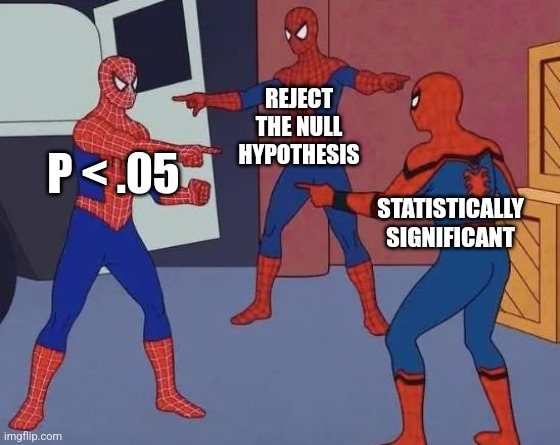

**Tradução:**  
P < 0,05  
Rejeitar a hipótese nula  
Estatisticamente significativo

**Interpretação:**  
Esse meme mostra como as pessoas frequentemente confundem ou usam como sinônimos as expressões "p < 0,05", "rejeitar a hipótese nula" e "significância estatística". Na prática, são conceitos relacionados, mas não exatamente iguais: um p-valor menor que o nível de significância leva à rejeição de H0, o que é chamado de resultado estatisticamente significativo. Mas lembre-se: um resultado pode ser estatisticamente significativo e, mesmo assim, não ter importância prática no mundo real.

---

## Namorado distraído

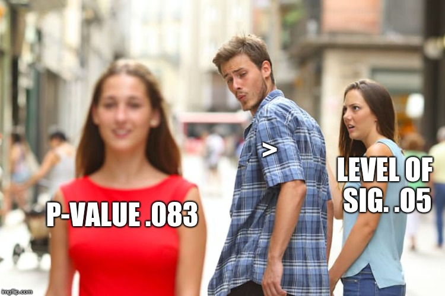

**Tradução:**  
p-valor 0,083  
>  
Nível de significância 0,05

**Interpretação:**  
O pesquisador está andando tranquilamente com sua fiel companheira, o nível de significância 0,05, mas não resiste e joga aquele olhar para o p-valor 0,083 que acabou de passar. Mesmo sabendo que, tecnicamente, 0,083 é “maior” do que 0,05 e não deveria chamar tanta atenção, ele fica tentado a inventar desculpas para dar uma chance àquele resultado quase-significativo: “ah, mas foi quase!”, “quem nunca, né?”. No fundo, esse é o típico caso do pesquisador que se empolga com resultados que chegaram perto do valor de corte, tentando transformar um “quase” em uma grande descoberta. Mas é importante lembrar: resultado quase significativo ainda não é significativo!

---

## Willy Wonka e o p-valor menor que 0,05

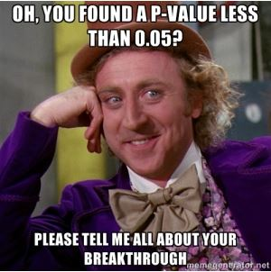

**Tradução:**  
Ah, você encontrou um p-valor menor que 0,05?  
Por favor, me conte tudo sobre sua grande descoberta.

**Interpretação:**  
Willy Wonka ironiza a empolgação de quem encontra um p-valor abaixo de 0,05, sugerindo que nem sempre isso significa uma grande descoberta. O meme alerta para a importância de interpretar o p-valor no contexto do estudo, considerando tamanho de efeito, relevância prática e outros fatores além da simples significância estatística. O próprio Wonka pediria: “me convença de que seu resultado importa de verdade!”

---

## Cantada Nerd


**Tradução**:  
Ei, garota, seu p deve ser maior que 0,05, porque eu falho em te rejeitar.

**Interpretação**:  
Esse meme faz uma brincadeira romântica usando a linguagem estatística: em vez de rejeitar a hipótese nula, a pessoa está dizendo que não consegue rejeitar a garota, assim como um p-valor acima de 0,05 geralmente significa que não rejeitamos H0. É o clássico “não posso te rejeitar, cientificamente falando”! Uma piada para conquistar corações e estatísticos ao mesmo tempo.

---

## P-valor não é tudo

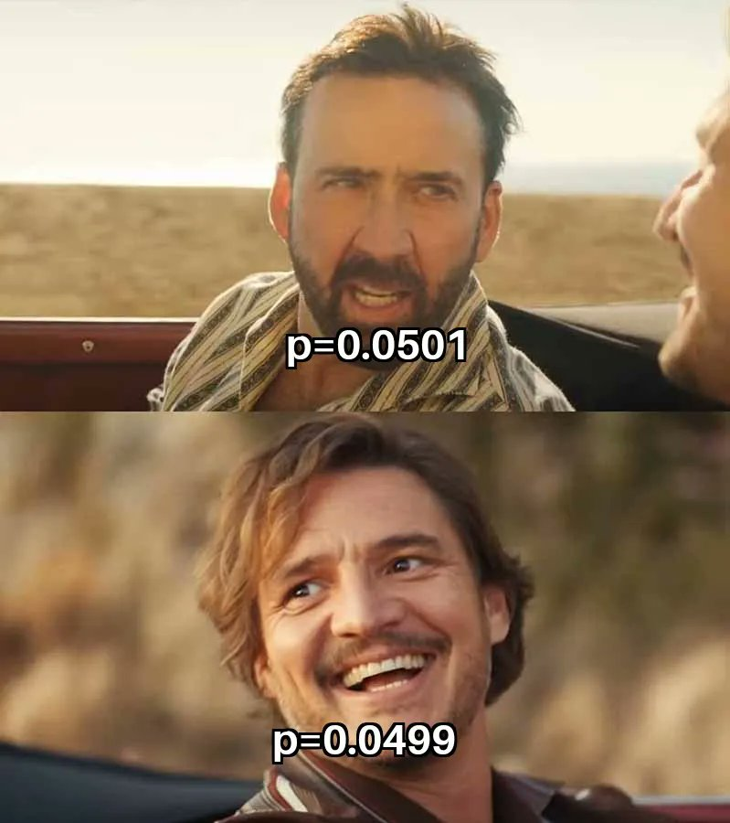

**Tradução:**  
Cena de duas pessoas no carro, uma com expressão de frustração ao ouvir "p-values", enquanto a outra está alegre ou satisfeita.

**Interpretação:**  
A graça do meme está justamente no contraste entre frustração e alegria: enquanto uma pessoa demonstra cansaço ou desapontamento ao ouvir sobre p-values de novo, a outra parece satisfeita só com isso. O meme brinca com as diferentes expectativas na análise estatística, há quem se contente apenas com a significância estatística (p < 0,05), enquanto outros esperam uma análise completa, considerando também o tamanho do efeito, intervalos de confiança, e a real relevância dos achados. É um lembrete de que estatística vai além do p-value!

---

## Coitado do tamanho do efeito

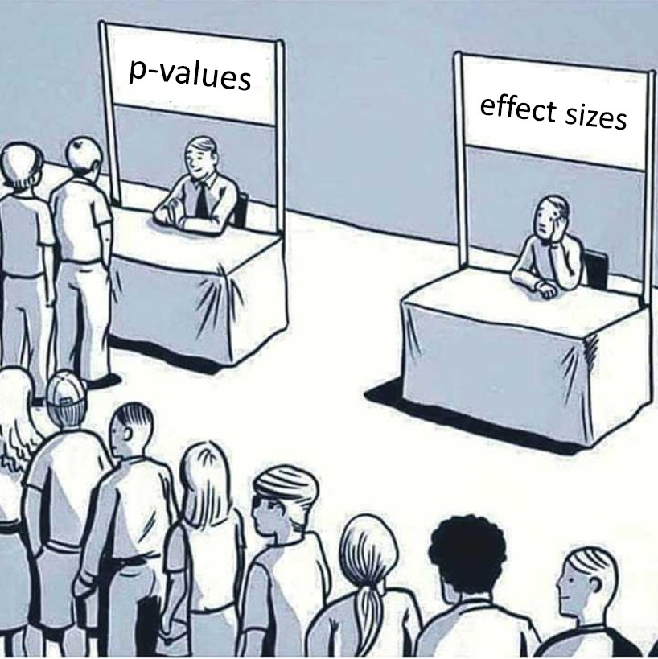

**Tradução:**  
À esquerda, uma fila enorme se forma na barraca "p-values". À direita, a barraca "effect sizes" está vazia, quase ouvindo grilos.

**Interpretação:**  
Este meme é o retrato da triste (e hilária) realidade dos artigos científicos: todo mundo corre para saber se o valor de p é menor que 0,05, como se fosse a última coca-cola do deserto. Já o tamanho do efeito, que realmente diz se o resultado é relevante, é solenemente ignorado. Moral estatística: enquanto os p-values lotam (mesmo que tragam resultados irrelevantes), o effect size fica sozinho no canto, esperando alguém notar sua real importância. Quem entende estatística sabe: tamanho do efeito merece atenção!

---

## Senhora estatística

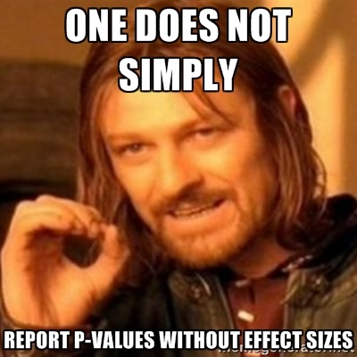

**Tradução:**  
Em cima: "ONE DOES NOT SIMPLY" ("SIMPLESMENTE NÃO SE...")
Embaixo: "REPORT P-VALUES WITHOUT EFFECT SIZES" ("RELATA P-VALORES SEM TAMANHOS DE EFEITO")

**Interpretação:**  
Esse meme faz referência ao clássico da cultura pop (Senhor dos Aneis) para lembrar que estatística não é terra sem lei: não basta encontrar um p < 0,05 e sair comemorando. Relatar apenas o valor de p é igual a contar só metade da fofoca: falta o contexto! O tamanho do efeito é quem diz se a diferença é daquelas que mudam a vida ou se é só uma diferença microscópica e irrelevante. Em outras palavras, estatística de verdade combina significado estatístico (p-value) com significado prático (effect size). Não faça estatística “pela metade”!

---

## Pobi do gatinho

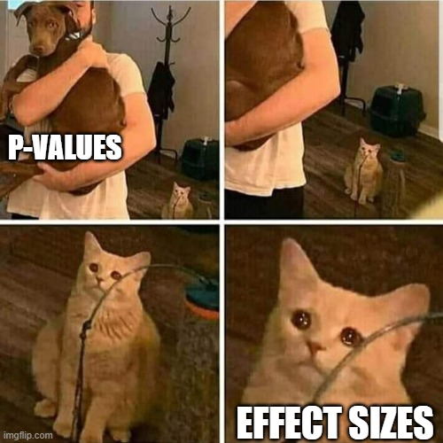

**Tradução:**  
Primeira cena: Pessoa abraça um cachorro chamado “P-VALUES”. Atrás, um gato (effect sizes) observa, excluído.  
Demais cenas: Close no gato “effect sizes”, visivelmente triste, segurando um brinquedo, ignorado.

**Interpretação:**  
O meme mostra o drama dos tamanhos de efeito: sempre deixados de lado, enquanto os p-values recebem todo o carinho e atenção. É como se o cachorro (p-value) ganhasse petiscos só por latir, enquanto o gato (effect size), que realmente entrega o conteúdo, só observa de longe. Estatisticamente, é como celebrar um resultado significativo sem saber se ele realmente importa no mundo real. O gato chora, e o revisor do artigo também!

---

Esses memes ilustram, com bom humor, que o p-valor sozinho não conta toda a história. Um resultado estatisticamente significativo não garante relevância prática. O tamanho do efeito é fundamental para avaliar se uma diferença observada tem impacto real, e não apenas estatístico. Ao analisar dados, valorize tanto o p-valor quanto o tamanho do efeito para conclusões mais robustas e informativas.

<!--chapter:end:16-Memes.Rmd-->

# Pacotes `pwr`, `rstatix` e `effsize`

Nesse capítulo, abordaremos como calcular tamanho de amostra, poder estatístico e tamanho do efeito em diferentes testes estatísticos usando os pacotes `pwr`, `rstatix` e `effsize`. O foco será nos testes t (pareado e não pareado) e Wilcoxon (pareado e não pareado), com exemplos práticos e orientações sobre interpretação dos resultados.

> **Importante:** Antes de começar, certifique-se de instalar o pacote `pwr`, `rstatix` e `effsize`:
```r
install.packages(c("pwr", "rstatix", "effsize"))
```

## Cálculos de tamanho de amostra, poder e efeito com o pacote `pwr`

O pacote `pwr` permite calcular:

- **Tamanho de amostra** necessário para detectar um determinado efeito;
- **Poder estatístico** de um teste para amostras de tamanho fixo;
- **Menor tamanho de efeito** que pode ser detectado para um dado poder e amostra.

### Exercício 1: Tamanho da amostra para teste t não pareado

Calcule o tamanho da amostra necessário para detectar um efeito moderado (d = 0.5), com poder de 0.8 e nível de significância de 0.05, em um teste t bilateral para duas amostras independentes.


``` r
library(pwr)
# Tamanho da amostra para teste t não pareado
pwr.t.test(d = 0.5, power = 0.8, sig.level = 0.05, type = "two.sample")
```

```
## 
##      Two-sample t test power calculation 
## 
##               n = 63.76561
##               d = 0.5
##       sig.level = 0.05
##           power = 0.8
##     alternative = two.sided
## 
## NOTE: n is number in *each* group
```

---

### Exercício 2: Poder do teste t não pareado para n fixo

Se você dispõe de 26 observações em cada grupo, qual é o poder do teste para detectar um efeito de 0.5, com sig.level = 0.05?


``` r
# Poder do teste t não pareado para n = 26 por grupo
pwr.t.test(n = 26, d = 0.5, sig.level = 0.05, type = "two.sample")
```

```
## 
##      Two-sample t test power calculation 
## 
##               n = 26
##               d = 0.5
##       sig.level = 0.05
##           power = 0.4240344
##     alternative = two.sided
## 
## NOTE: n is number in *each* group
```

---

### Exercício 3: Menor efeito detectável no teste t não pareado

Com 26 observações por grupo, poder de 0.8 e sig.level de 0.05, qual o menor tamanho de efeito detectável?


``` r
# Tamanho do efeito detectável
pwr.t.test(n = 26, power = 0.8, sig.level = 0.05, type = "two.sample")
```

```
## 
##      Two-sample t test power calculation 
## 
##               n = 26
##               d = 0.7923522
##       sig.level = 0.05
##           power = 0.8
##     alternative = two.sided
## 
## NOTE: n is number in *each* group
```

---

### Exercício 4: Repita para outros testes

#### a) Teste t pareado


``` r
# Tamanho da amostra para teste t pareado
pwr.t.test(d = 0.5, power = 0.8, sig.level = 0.05, type = "paired")
```

```
## 
##      Paired t test power calculation 
## 
##               n = 33.36713
##               d = 0.5
##       sig.level = 0.05
##           power = 0.8
##     alternative = two.sided
## 
## NOTE: n is number of *pairs*
```

``` r
# Poder para n = 26 pares
pwr.t.test(n = 26, d = 0.5, sig.level = 0.05, type = "paired")
```

```
## 
##      Paired t test power calculation 
## 
##               n = 26
##               d = 0.5
##       sig.level = 0.05
##           power = 0.6881801
##     alternative = two.sided
## 
## NOTE: n is number of *pairs*
```

``` r
# Tamanho do efeito detectável
pwr.t.test(n = 26, power = 0.8, sig.level = 0.05, type = "paired")
```

```
## 
##      Paired t test power calculation 
## 
##               n = 26
##               d = 0.5717051
##       sig.level = 0.05
##           power = 0.8
##     alternative = two.sided
## 
## NOTE: n is number of *pairs*
```

#### b) Wilcoxon não pareado


``` r
# Tamanho da amostra para Wilcoxon não pareado (aproximação pelo teste t)
pwr.t.test(d = 0.5, power = 0.8, sig.level = 0.05, type = "two.sample")
```

```
## 
##      Two-sample t test power calculation 
## 
##               n = 63.76561
##               d = 0.5
##       sig.level = 0.05
##           power = 0.8
##     alternative = two.sided
## 
## NOTE: n is number in *each* group
```

> **Dica:** O pacote `pwr` não possui funções específicas para testes não-paramétricos como Wilcoxon. Por isso, costuma-se usar o cálculo para teste t como aproximação, aumentando o tamanho da amostra em cerca de 15% (multiplique o valor obtido por 1,15), já que testes não-paramétricos geralmente requerem amostras maiores para o mesmo poder estatístico.


``` r
# Recalculando o tamanho da amostra
63.76561*1.15
```

```
## [1] 73.33045
```

> O *tamanho do efeito para o teste de Wilcoxon* pode ser aproximado *por d × 0,86*, sendo d o tamanho do efeito de Cohen, desde que as distribuições dos grupos sejam aproximadamente normais e com variâncias semelhantes (Lehmann, 2006; Noether, 1987).


``` r
# Poder da amostra para Wilcoxon não pareado (aproximação pelo teste t)
pwr.t.test(n = 26, d = 0.5*0.86, sig.level = 0.05, type = "two.sample")
```

```
## 
##      Two-sample t test power calculation 
## 
##               n = 26
##               d = 0.43
##       sig.level = 0.05
##           power = 0.3304646
##     alternative = two.sided
## 
## NOTE: n is number in *each* group
```

#### c) Wilcoxon pareado


``` r
# Tamanho da amostra para Wilcoxon pareado (aproximação pelo teste t pareado)
pwr.t.test(d = 0.5, power = 0.8, sig.level = 0.05, type = "paired")
```

```
## 
##      Paired t test power calculation 
## 
##               n = 33.36713
##               d = 0.5
##       sig.level = 0.05
##           power = 0.8
##     alternative = two.sided
## 
## NOTE: n is number of *pairs*
```


``` r
# Poder da amostra para Wilcoxon não pareado (aproximação pelo teste t)
pwr.t.test(n = 26, d = 0.5*0.86, sig.level = 0.05, type = "two.sample")
```

```
## 
##      Two-sample t test power calculation 
## 
##               n = 26
##               d = 0.43
##       sig.level = 0.05
##           power = 0.3304646
##     alternative = two.sided
## 
## NOTE: n is number in *each* group
```

> **Atenção:** O **d de Cohen** foi criado para testes paramétricos, como o teste t. Para testes não paramétricos (Wilcoxon), utilize medidas específicas, pois a interpretação do d não se aplica ao contexto de ranks.

---

### Argumentos principais da função `pwr.t.test()`

A função `pwr.t.test()` possui os seguintes argumentos principais:

- `n`: tamanho da amostra em cada grupo (ou número de pares, para teste pareado)
- `d`: tamanho do efeito (diferença padronizada entre grupos)
- `power`: poder estatístico desejado
- `sig.level`: nível de significância (geralmente 0.05)
- `type`: tipo de teste t: `"two.sample"`, `"paired"` ou `"one.sample"`

> **Dica:** Deixe como `NULL` o parâmetro que você deseja calcular.
> - Para calcular o tamanho do efeito: `d = NULL`
> - Para calcular o poder: `power = NULL`
> - Para calcular o tamanho da amostra: `n = NULL`

**Exemplo para calcular o tamanho do efeito:**
```r
pwr.t.test(n = 26, d = NULL, power = 0.8, sig.level = 0.05, type = "two.sample")
```
Neste exemplo, o argumento `d` é o valor a ser calculado.

---

### Grupos Desbalanceados: usando `pwr.t2n.test()`

Quando os grupos têm tamanhos diferentes, use `pwr.t2n.test()` para calcular o poder.


``` r
# Exemplo: grupo 1 com 95, grupo 2 com 30 observações
library(pwr)
pwr.t2n.test(n1 = 95, n2 = 30, d = 0.5, sig.level = 0.05)
```

```
## 
##      t test power calculation 
## 
##              n1 = 95
##              n2 = 30
##               d = 0.5
##       sig.level = 0.05
##           power = 0.6586749
##     alternative = two.sided
```

- **n1**: tamanho do primeiro grupo
- **n2**: tamanho do segundo grupo

**Atenção:** Grupos desbalanceados podem comprometer o poder do teste, aumentar a variância e dificultar a interpretação dos resultados. Sempre que possível, busque amostras equilibradas.

---

## Tamanho do efeito em testes de Wilcoxon

O tamanho do efeito complementa a análise estatística, indicando a magnitude da diferença entre grupos. Para testes paramétricos (como o t), usa-se o **d de Cohen**. Para testes não paramétricos (Wilcoxon), utilize medidas apropriadas, como **r de Wilcoxon** e **Delta de Cliff**.

### Por que NÃO usar d de Cohen no Wilcoxon?

- O d de Cohen pressupõe distribuição normal e comparação direta de médias/desvios.
- O Wilcoxon compara **ranks**, não médias.
- Aplicar o d de Cohen em dados de Wilcoxon pode gerar interpretações erradas.

### Medidas recomendadas para Wilcoxon:

- **r de Wilcoxon:** Calculado com o pacote `rstatix`.
- **Cliff’s Delta:** Disponível no pacote `effsize`.

---

#### r de Wilcoxon (Wilcoxon rank-sum, não pareado)


``` r
library(rstatix)
library(readr)

# Importe o banco de dados Pokemon
Pokemon <- read_csv("Pokemon.csv")

# Subconjunto com Pokémons verdes ou amarelos
dados_filtrados <- subset(Pokemon, Color %in% c("Green", "Yellow"))

# Verifique os dados após o filtro
print(table(dados_filtrados$Color))
```

```
## 
##  Green Yellow 
##     79     64
```

``` r
# Boxplot
boxplot(dados_filtrados$Speed ~ dados_filtrados$Color)
```

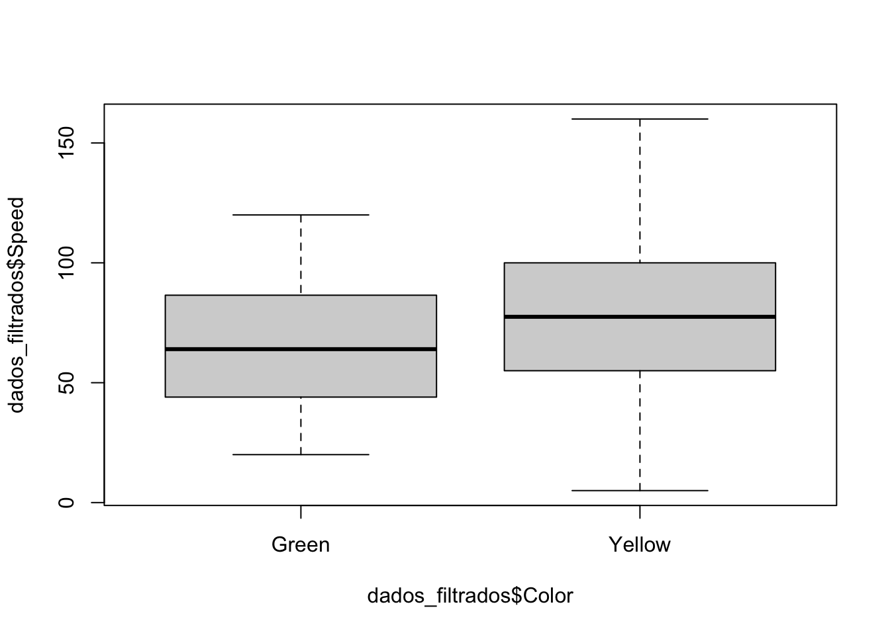

``` r
# Teste de Wilcoxon não pareado
wilcox.test(dados_filtrados$Speed ~ dados_filtrados$Color)
```

```
## 
## 	Wilcoxon rank sum test with continuity correction
## 
## data:  dados_filtrados$Speed by dados_filtrados$Color
## W = 1920.5, p-value = 0.01363
## alternative hypothesis: true location shift is not equal to 0
```

``` r
# Tamanho do efeito r de Wilcoxon para Green vs Yellow
wilcox_effsize(dados_filtrados, Speed ~ Color)
```

```
## # A tibble: 1 × 7
##   .y.   group1 group2 effsize    n1    n2 magnitude
## * <chr> <chr>  <chr>    <dbl> <int> <int> <ord>    
## 1 Speed Green  Yellow   0.206    79    64 small
```

``` r
levels(dados_filtrados$Color)
```

```
## NULL
```

A tabela apresentada é resultado da função `wilcox_effsize()` do pacote `rstatix` e resume o tamanho do efeito (r de Wilcoxon) para a comparação entre dois grupos ("Green" e "Yellow") em relação à variável "Speed". Veja como interpretar cada coluna:

- **.y.**: variável de interesse analisada, neste caso, "Speed" (velocidade dos Pokémons).
- **group1**: primeiro grupo comparado ("Green").
- **group2**: segundo grupo comparado ("Yellow").
- **effsize**: valor ABSOLUTO do tamanho de efeito calculado, aqui 0.206.  
- O resultado apresentado na coluna `effsize` é sempre positivo, independentemente da ordem dos grupos definidos na variável categórica.
- **n1**: número de observações no grupo 1 (79 Pokémons verdes).
- **n2**: número de observações no grupo 2 (64 Pokémons amarelos).
- **magnitude**: classificação qualitativa do tamanho de efeito ("small", ou seja, efeito pequeno).

**Interpretação:**  
A diferença de velocidade entre Pokémons verdes e amarelos é estatisticamente significativa (W = 1920.5, p-value = 0.01363), porém de **pequena magnitude** (r = 0.206). Isso indica que, embora exista uma diferença, ela é discreta do ponto de vista prático.


> No caso de teste pareado, acrescente o argumento `paired = TRUE`:
> ```r
> wilcox_effsize(dados, antes ~ depois, paired = TRUE)
> ```

---

#### Delta de Cliff


``` r
library(effsize)

# Calcule o Delta de Cliff
cliff.delta(dados_filtrados$Speed ~ dados_filtrados$Color)
```

```
## 
## Cliff's Delta
## 
## delta estimate: -0.2403085 (small)
## 95 percent confidence interval:
##       lower       upper 
## -0.41405995 -0.04966082
```

O **Delta de Cliff** estimado foi de **-0,24**, classificado como efeito **pequeno** ("small"). O intervalo de confiança de 95% vai de aproximadamente **-0,41** a **-0,05**, indicando que, com alta confiança, o efeito verdadeiro é negativo e pequeno.

- **Sinal negativo:** Indica que o grupo "Yellow" tende a apresentar velocidades maiores do que o grupo "Green". Ou seja, ao comparar aleatoriamente um Pokémon amarelo com um verde, é mais provável que o amarelo tenha uma velocidade superior.
- **Magnitude pequena:** O valor absoluto de -0,24 mostra que a diferença entre os grupos existe, mas é de pouca relevância prática.
- **Intervalo de confiança não inclui zero:** Como o intervalo vai de -0,41 a -0,05, podemos afirmar que existe uma diferença real entre os grupos, embora seja pequena.
- **Interpretação prática:** Apesar de haver uma diferença estatística, ela não é marcante. É importante avaliar se essa diferença tem relevância biológica ou prática no contexto do seu estudo.

O Delta de Cliff indica que Pokémons amarelos tendem a ser um pouco mais rápidos do que os verdes, mas a diferença é pequena do ponto de vista prático.


### Comparação entre o r de Wilcoxon e o Delta de Cliff

Quando realizamos testes não paramétricos para comparar grupos, como o teste de Wilcoxon (Mann-Whitney ou Wilcoxon pareado), é importante complementar o resultado do teste com uma medida de tamanho de efeito. As duas opções mais comuns são o **r de Wilcoxon** e o **Delta de Cliff**. Veja a seguir uma comparação entre elas:

### r de Wilcoxon

- **Definição:** Mede a magnitude da diferença entre grupos com base nos postos (ranks) dos dados. O cálculo é semelhante ao coeficiente de correlação de Pearson, mas aplicado a dados não paramétricos.
- **Variação dos valores:** O r de Wilcoxon varia de -1 a 1.
  - Valores próximos de 0 indicam pouca diferença entre grupos.
  - Valores próximos de -1 ou 1 indicam diferenças muito grandes.
  - O sinal indica a direção da diferença.

**Qualificação dos valores**, segundo Cohen (1988):

| Valor absoluto de $r$ | Interpretação    |
|:---------------------|:----------------|
| aproximadamente 0,10                | Pequeno         |
| aproximadamente 0,30                | Moderado        |
| maior ou igual 0,50                | Grande          |

**Exemplos:**

- **Efeito pequeno:**  
  Se o valor absoluto de r estiver próximo de **0,10**, a diferença entre os grupos é pequena.  
  _(Exemplo: |r| = 0,10 → efeito pequeno)_

- **Efeito moderado:**  
  Se o valor absoluto de r estiver próximo de **0,30**, a diferença entre os grupos é moderada.  
  _(Exemplo: |r| = 0,30 → efeito moderado)_

- **Efeito grande:**  
  Se o valor absoluto de r for igual ou superior a **0,50**, a diferença é grande.  
  _(Exemplo: |r| = 0,55 → efeito grande)_


### Delta de Cliff ($\delta$) 

- **Definição:** Mede a probabilidade de um valor de um grupo ser maior do que de outro grupo, subtraída da probabilidade contrária. É totalmente não paramétrico e não depende de distribuição, sendo adequado para variáveis ordinais ou dados assimétricos.
- **Variação dos valores:** O Delta de Cliff varia de -1 a 1.
    - Valor 0: não há diferença entre os grupos.
    - Valor positivo: o grupo 1 tende a ter valores maiores que o grupo 2.
    - Valor negativo: o grupo 2 tende a ter valores maiores que o grupo 1.
- **Como interpretar os valores do Delta de Cliff?**  
  O **Delta de Cliff** mostra o tamanho da diferença entre dois grupos. O mais comum é considerar o valor absoluto de $\delta$ (ou seja, ignorar se é positivo ou negativo e olhar só para o tamanho do número).

**Classificação da magnitude do efeito**, segundo Romano et al. (2006)

| Valor absoluto de $\delta$ | Interpretação    |
|:--------------------------|:----------------|
| menor que 0.147                    | Desprezível     |
| de 0.147 e menor que 0.33             | Pequeno         |
| de 0.33 e menor que 0.474             | Médio           |
| maior ou igual a 0.474                    | Grande          |

**Exemplos:**

- **Efeito desprezível:**  
  Se o valor absoluto do delta for menor que **0,147**, a diferença entre os grupos é desprezível.  
  _(Exemplo: |$\delta$| = 0,10 → efeito desprezível)_

- **Efeito pequeno:**  
  Se o valor absoluto do delta for igual ou maior que **0,147** e menor que **0,33**, a diferença é pequena.  
  _(Exemplo: |$\delta$| = 0,20 → efeito pequeno)_

- **Efeito médio:**  
  Se o valor absoluto do delta for igual ou maior que **0,33** e menor que **0,474**, a diferença é média.  
  _(Exemplo: |$\delta$| = 0,40 → efeito médio)_

- **Efeito grande:**  
  Se o valor absoluto do delta for igual ou maior que **0,474**, a diferença é grande.  
  _(Exemplo: |$\delta$| = 0,50 → efeito grande)_

**Resumindo:**  
Quanto mais próximo de zero, menor a diferença. Quanto mais próximo de 1 (ou -1), maior a diferença entre os grupos.

> **Dica:** Sempre use o valor absoluto, ou seja, olhe apenas para o tamanho do número, sem se preocupar se ele é positivo ou negativo.


### Qual é melhor usar?

- **Ambos** são válidos e amplamente aceitos para dados não paramétricos.
- O **r de Wilcoxon** é intuitivo se você já está acostumado com o coeficiente de correlação, e é facilmente interpretável em contextos onde se deseja uma analogia ao r de Pearson.
- O **Delta de Cliff** é mais robusto em situações com muitos empates, diferentes tamanhos de grupo ou dados ordinais, e fornece uma interpretação mais direta da diferença de probabilidades entre grupos.
- **Recomendação prática:**  
  - Para estudos com dados ordenados, amostras desbalanceadas ou muitos empates, o Delta de Cliff pode ser preferido.
  - Se você busca uma medida análoga ao r de Pearson para facilitar comparações, use o r de Wilcoxon.
  - Em muitos casos, apresentar ambos os valores enriquece a interpretação dos resultados.

Não existe uma medida "melhor" de forma absoluta; a escolha depende do contexto do estudo e das características dos dados. Ambas são úteis para interpretar a relevância prática das diferenças identificadas em testes não paramétricos.


> **Nota:** Para a comparação entre os grupos *Green* e *Yellow* na variável *Speed*, o tamanho de efeito calculado pelo **r de Wilcoxon** foi **0,206** (efeito pequeno), enquanto o **delta de Cliff** foi **-0,240** (efeito pequeno, IC 95%: -0,414 a -0,050). É esperado que os valores numéricos dessas métricas diferem, pois são baseados em cálculos estatísticos distintos, mas ambos apontam para uma diferença de pequena magnitude entre os grupos.

No entanto, é importante destacar que, neste caso, o valor negativo do delta de Cliff está condizente com o observado no boxplot: o grupo *Yellow* tende a apresentar valores de *Speed* ligeiramente maiores que o grupo *Green*, o que é evidenciado pela direção negativa do delta. 

Esse alinhamento entre o resultado numérico do delta de Cliff e a visualização gráfica reforça a importância de sempre analisar os dados de forma complementar, utilizando tanto medidas estatísticas quanto representações visuais (como boxplots). A visualização gráfica pode revelar padrões, tendências e assimetrias que enriquecem a interpretação do tamanho de efeito e facilitam a comunicação dos resultados.

<!--chapter:end:17-Exercicios-pwr.Rmd-->

# Teste de Normalidade

Antes de aplicar muitos testes estatísticos, é importante verificar se os dados seguem uma distribuição normal (ou "distribuição gaussiana"). Essa etapa é fundamental porque vários testes paramétricos (como o teste t de Student e a ANOVA) assumem a normalidade dos dados. Quando essa condição não é atendida, a escolha do teste estatístico pode mudar para opções não paramétricas.

## Hipóteses nos Testes de Normalidade

Todo teste de normalidade avalia as seguintes hipóteses:

- **Hipótese Nula (H₀):** Os dados seguem uma distribuição normal.
- **Hipótese Alternativa (H₁):** Os dados **não** seguem uma distribuição normal.

- Se o valor de p for menor que 0,05: **Rejeitamos** a hipótese nula.
 
- Se o valor de p for maior ou igual 0,05: **Não rejeitamos** a hipótese nula. 

## Principais Testes de Normalidade

Abaixo estão os testes de normalidade mais conhecidos, quando são mais recomendados e os pacotes em R:

| Teste             | Quando Usar                                      | Pacote no R    |
|-------------------|--------------------------------------------------|----------------|
| **Shapiro-Wilk**  | Amostras pequenas e médias (n < 50 até ~ 2000)   | `stats`        |
| **Kolmogorov-Smirnov (K-S)** | Amostras maiores; pode comparar duas distribuições, mas menos potente para normalidade | `stats`        |
| **Lilliefors**    | Versão do K-S ajustado para média e desvio amostrais | `nortest`      |
| **Anderson-Darling** | Mais sensível nas caudas da distribuição; recomendado para médias e grandes amostras | `nortest`      |
| **Jarque-Bera**   | Teste baseado em assimetria (skewness) e curtose (kurtosis); comum em econometria | `tseries`      |
| **D’Agostino-Pearson** | Avalia assimetria e curtose em conjunto; recomendado para médias e grandes amostras | `moments`      |

### Dicas de Uso

- Para **amostras pequenas** (n < 50): prefira o **Shapiro-Wilk** (função `shapiro.test()` do pacote base `stats`).
- Para **amostras médias a grandes**: considere **Anderson-Darling** (`ad.test()` do pacote `nortest`) ou **D’Agostino-Pearson** (`agostino.test()` do pacote `moments`).
- O **Kolmogorov-Smirnov** (`ks.test()`) é mais geral, mas menos recomendado quando a média e desvio padrão são estimados dos próprios dados.
- O **Lilliefors** (`lillie.test()` do pacote `nortest`) é uma boa alternativa ao K-S para dados amostrais.
- Para análises em econometria ou séries temporais, o **Jarque-Bera** (`jarque.bera.test()` do pacote `tseries`) é bastante utilizado.

### Exemplo Prático em R


``` r
#install.packages("nortest")
#install.packages("moments")

# Importe o banco de dados Pokemon
library(readr)
Pokemon <- read_csv("Pokemon.csv")

# Veja o QQ
qqnorm(Pokemon$Speed)
qqline(Pokemon$Speed)
```

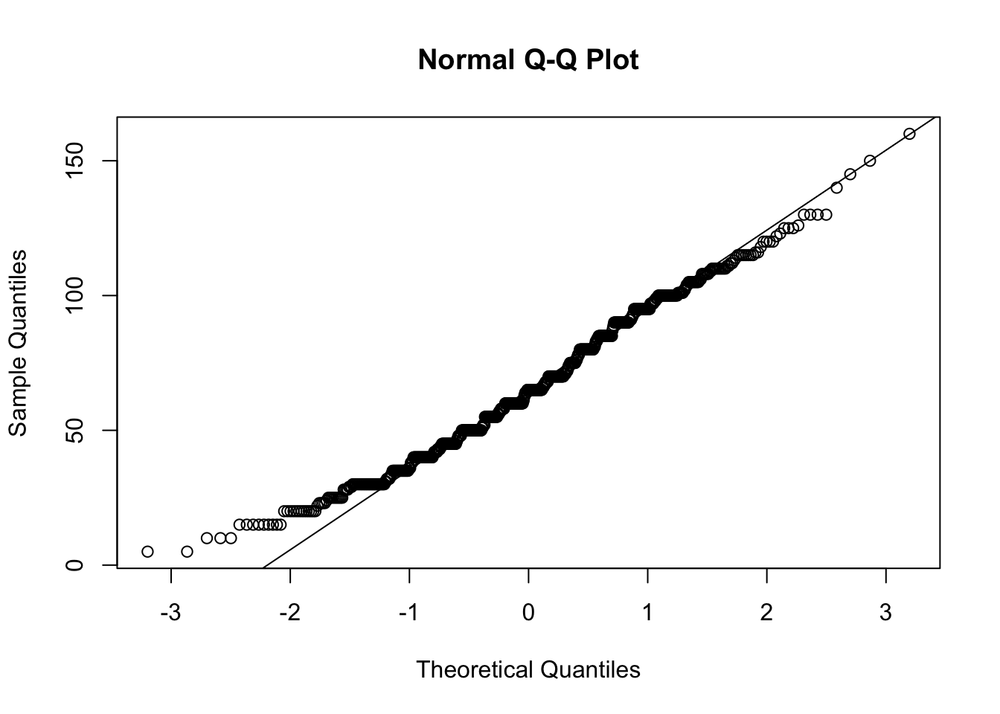

``` r
# Shapiro-Wilk
shapiro.test(Pokemon$Speed)
```

```
## 
## 	Shapiro-Wilk normality test
## 
## data:  Pokemon$Speed
## W = 0.98574, p-value = 1.757e-06
```

``` r
# Anderson-Darling
library(nortest)
ad.test(Pokemon$Speed)
```

```
## 
## 	Anderson-Darling normality test
## 
## data:  Pokemon$Speed
## A = 3.0665, p-value = 1.064e-07
```

``` r
# Lilliefors
lillie.test(Pokemon$Speed)
```

```
## 
## 	Lilliefors (Kolmogorov-Smirnov) normality test
## 
## data:  Pokemon$Speed
## D = 0.06446, p-value = 1.662e-07
```

``` r
# D'Agostino
library(moments)
agostino.test(Pokemon$Speed)
```

```
## 
## 	D'Agostino skewness test
## 
## data:  Pokemon$Speed
## skew = 0.27799, z = 3.02335, p-value = 0.0025
## alternative hypothesis: data have a skewness
```

**Resumo**

- Sempre comece analisando a normalidade dos seus dados.
- Escolha o teste de acordo com o tamanho da amostra e o objetivo da análise.
- **Use gráficos (histograma, boxplot e principalmente o QQ) junto com testes estatísticos para uma análise mais completa.**

> **Importante:** Testes de normalidade são sensíveis ao tamanho da amostra. Em amostras muito grandes, pequenas desvios podem resultar em p-valores baixos; em amostras pequenas, a potência dos testes é baixa.


## Assimetria e Curtose: O que são e por que são importantes?

Quando analisamos dados, é importante entender não só a média e o desvio padrão, mas também o **formato da distribuição** dos valores. Duas medidas ajudam muito nisso: **assimetria** e **curtose**. Vamos entender cada uma de forma simples:

---

### O que é Assimetria (Skewness)?

A **assimetria** mostra se os dados estão “puxados” para algum lado, ou seja, se a distribuição tem uma cauda maior para a direita ou para a esquerda.

- **Assimetria zero:** Os dados estão distribuídos de forma equilibrada ao redor da média (exemplo: distribuição normal perfeita).
- **Assimetria positiva (à direita):** A cauda é mais longa à direita, ou seja, há mais valores extremos acima da média.
- **Assimetria negativa (à esquerda):** A cauda é mais longa à esquerda, há mais valores extremos abaixo da média.

**Por que isso importa?**  
A distribuição Normal é um exemplo de distribuição simétrica.

### O que é Curtose (Kurtosis)?

A **curtose** indica o quanto a distribuição é “pontuda” ou “achatada” em relação à Distribuição Normal.

- **Curtose alta (leptocúrtica):** Distribuição muito “pontuda”, com muitas observações próximas da média, mas também mais valores extremos (outliers).
- **Curtose baixa (platicúrtica):** Distribuição mais achatada, com menos valores extremos.
- **Curtose média (mesocúrtica):** Parecida com a distribuição normal.

**Por que isso importa?**  
A presença de muita curtose (valores muito altos ou baixos) pode indicar que há mais outliers do que o esperado, o que também pode afetar os resultados de testes estatísticos.

- **Assimetria:** mostra se a distribuição “pende” para um lado.
- **Curtose:** mostra se a distribuição é “pontuda” e cheia de extremos, ou mais “achatada”.

Essas duas medidas ajudam a entender melhor o comportamento dos seus dados e garantem que você escolha os testes estatísticos mais adequados para a sua análise!

<!--chapter:end:18-testedenormalidade.Rmd-->

# Comparação de mais de dois grupos

Assim como na comparação entre dois grupos, ao desejarmos comparar mais de dois grupos em uma análise estatística, é fundamental selecionar o teste mais adequado de acordo com as características dos dados. Os testes podem ser **paramétricos** ou **não paramétricos**, e a escolha correta depende da verificação prévia de alguns pressupostos, como normalidade, homogeneidade de variâncias e independência das observações.

## Revisando as hipóteses da comparação entre dois grupos

- **Paramétrico (Teste t)**
  - **Não pareado (t de Student):**
    - H₀: As médias dos dois grupos são iguais (μ₁ = μ₂)
    - H₁: As médias dos dois grupos são diferentes (μ₁ ≠ μ₂)
  - **Pareado (t pareado):**
    - H₀: A média das diferenças entre os pares é igual a zero (μ_d = 0)
    - H₁: A média das diferenças entre os pares é diferente de zero (μ_d ≠ 0)

- **Não paramétrico**
  - **Não pareado (Mann-Whitney/Wilcoxon rank-sum):**
    - H₀: As distribuições dos dois grupos são iguais
    - H₁: As distribuições dos dois grupos são diferentes
  - **Pareado (Wilcoxon signed-rank):**
    - H₀: A distribuição das diferenças entre os pares é simétrica em torno de zero
    - H₁: A distribuição das diferenças entre os pares não é simétrica em torno de zero
  
Na comparação entre **dois grupos**, tanto nos testes paramétricos quanto nos não paramétricos, a hipótese nula (H₀) geralmente afirma que as médias (ou distribuições) dos dois grupos são iguais, enquanto a hipótese alternativa (H₁) aponta que elas são diferentes. Ou seja, o teste busca identificar uma diferença específica entre os dois grupos analisados.

## Hipóteses para a comparação entre mais de dois grupos

- **Paramétrico (ANOVA)**
  - **Não pareado (ANOVA one-way):**
    - H₀: As médias dos grupos são todas iguais (μ₁ = μ₂ = ... = μ_k)
    - H₁: Pelo menos uma média de grupo é diferente das outras
  - **Pareado (ANOVA de medidas repetidas):**
    - H₀: As médias dos tratamentos (ou condições) são iguais
    - H₁: Pelo menos uma média de tratamento é diferente das outras

- **Não paramétrico**
  - **Não pareado (Kruskal-Wallis):**
    - H₀: As distribuições dos grupos são todas iguais
    - H₁: Pelo menos uma distribuição de grupo é diferente das outras
  - **Pareado (Friedman):**
    - H₀: As distribuições dos tratamentos (ou condições) são todas iguais
    - H₁: Pelo menos uma distribuição de tratamento é diferente das outras
    
Na comparação entre **mais de dois grupos** (por exemplo, usando ANOVA ou Kruskal-Wallis), a hipótese nula (H₀) é que **todas** as médias (ou distribuições) dos grupos são iguais. Por outro lado, a hipótese alternativa (H₁) não especifica qual grupo é diferente, mas sim que **pelo menos um dos grupos se difere dos demais**. Ou seja, a rejeição da hipótese nula indica que existe pelo menos uma diferença, mas não revela imediatamente entre quais grupos essa diferença ocorre.

> **Atenção:** É importante notar que, no contexto de mais de dois grupos, a hipótese alternativa não identifica quais grupos são diferentes, apenas aponta que existe pelo menos uma diferença.

## Testes Paramétricos

- **Não Pareados:**  O teste mais utilizado é a **ANOVA de uma via**, que compara as médias de três ou mais grupos independentes.
- **Pareados:** Utiliza-se a **ANOVA para medidas repetidas** quando as medições são feitas nos mesmos indivíduos em diferentes condições ou tempos.

### Pré-requisitos para ANOVA (dados pareados ou não)

1. **Normalidade dos resíduos:** Os resíduos do modelo devem seguir uma distribuição normal.
2. **Homogeneidade de variâncias:** As variâncias dos grupos devem ser semelhantes.
3. **Esfericidade** (apenas para medidas repetidas): A variância das diferenças entre todas as combinações de pares de grupos deve ser semelhante.
4. **Independência das observações:** Para grupos independentes.

Se algum desses pré-requisitos não for atendido, é recomendado utilizar testes não paramétricos.

## Testes Não Paramétricos

- **Não Pareados:** O teste de **Kruskal-Wallis** é utilizado para comparar mais de dois grupos independentes.
- **Pareados:** O teste de **Friedman** é usado para comparar três ou mais grupos pareados.


## ANOVA de uma via no R

A seguir, apresentamos um exemplo de ANOVA de uma via e do teste de Kruskal-Wallis, incluindo a verificação dos pré-requisitos.

### Simulação de Dados


``` r
set.seed(123)
grupo <- factor(rep(c("A", "B", "C"), each = 10))
valor <- c(rnorm(10, mean = 5, sd = 1),
           rnorm(10, mean = 6, sd = 1),
           rnorm(10, mean = 7, sd = 1))
dados <- data.frame(grupo, valor)
```

### Visualização dos Dados


``` r
boxplot(valor ~ grupo, data = dados, main = "Boxplot dos Grupos", ylab = "Valor")
```

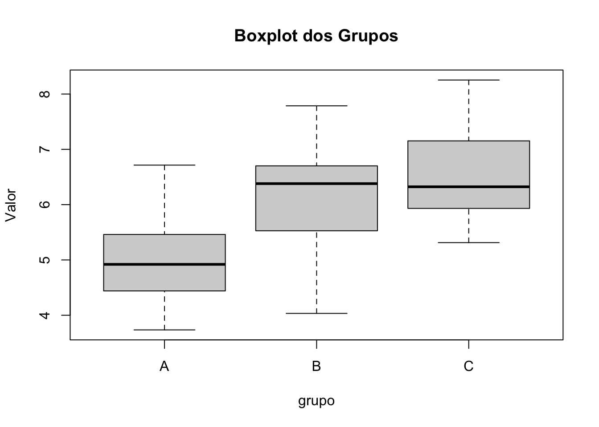

### Verificação dos Pré-requisitos para ANOVA

#### Normalidade dos resíduos


``` r
modelo_aov <- aov(valor ~ grupo, data = dados)
residuos <- residuals(modelo_aov)

shapiro.test(residuos)
```

```
## 
## 	Shapiro-Wilk normality test
## 
## data:  residuos
## W = 0.96213, p-value = 0.3507
```

``` r
qqnorm(residuos)
qqline(residuos)
```

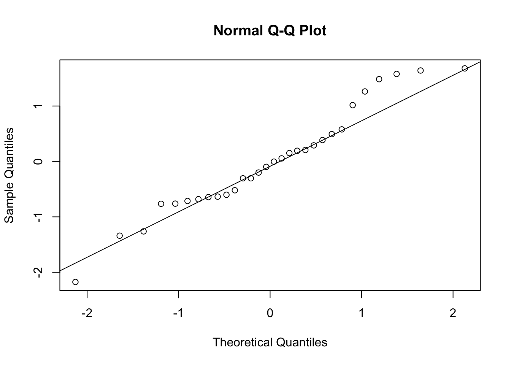

- A função `aov` no R é utilizada para realizar **análise de variância (ANOVA)**.

- **modelo_aov <- aov(valor ~ grupo, data = dados)**  
  Esta linha ajusta um modelo de ANOVA de uma via, avaliando se a média da variável `valor` difere entre os diferentes níveis do fator `grupo`, usando os dados do data frame `dados`.

- **residuos <- residuals(modelo_aov)**  
  Esta linha extrai os resíduos do modelo ajustado, ou seja, as diferenças entre os valores observados e os valores previstos pelo modelo. A análise dos resíduos é fundamental para verificar os pressupostos da ANOVA, como a normalidade.
  
> Neste exemplo, tanto o teste de normalidade quanto a inspeção visual do gráfico QQ sugerem que os resíduos seguem uma distribuição normal.

#### Homogeneidade de variâncias


``` r
# Instale 'car' se necessário: install.packages("car")
library(car)
leveneTest(valor ~ grupo, data = dados)
```

```
## Levene's Test for Homogeneity of Variance (center = median)
##       Df F value Pr(>F)
## group  2   5e-04 0.9995
##       27
```

- O *teste de Levene* avalia a homogeneidade das variâncias entre os grupos, que é um dos pré-requisitos para a ANOVA.

- **Valor de p (Pr(>F)) = 0.9995:** O valor de p é muito maior que 0,05, indicando que **não há evidências para rejeitar a hipótese nula de igualdade das variâncias**.

> Nesse exemplo, as variâncias dos grupos podem ser consideradas homogêneas. Portanto, o pré-requisito de homogeneidade de variâncias para a ANOVA foi atendido.

### ANOVA de Uma Via


``` r
summary(modelo_aov)
```

```
##             Df Sum Sq Mean Sq F value  Pr(>F)   
## grupo        2  12.24   6.122   6.435 0.00518 **
## Residuals   27  25.68   0.951                   
## ---
## Signif. codes:  0 '***' 0.001 '**' 0.01 '*' 0.05 '.' 0.1 ' ' 1
```

- **Valor de p (Pr(>F)) = 0.00518:** O valor de p é menor que 0,05, indicando que existem diferenças estatisticamente significativas entre as médias dos grupos analisados.

- Rejeita-se a hipótese nula de igualdade das médias. Isso significa que pelo menos um dos grupos difere significativamente dos demais. Recomenda-se realizar *testes post hoc (por exemplo, Tukey)* para identificar quais grupos apresentam diferenças entre si.

#### Teste Post Hoc (se ANOVA for significativa)


``` r
TukeyHSD(modelo_aov)
```

```
##   Tukey multiple comparisons of means
##     95% family-wise confidence level
## 
## Fit: aov(formula = valor ~ grupo, data = dados)
## 
## $grupo
##          diff         lwr      upr     p adj
## B-A 1.1339963  0.05254072 2.215452 0.0384525
## C-A 1.5008155  0.41935988 2.582271 0.0052283
## C-B 0.3668192 -0.71463643 1.448275 0.6812485
```

O teste de Tukey compara as médias dos grupos dois a dois, após a ANOVA indicar diferença significativa entre eles. Os resultados mostram as diferenças entre as médias dos grupos (`diff`), os limites inferior (`lwr`) e superior (`upr`) do intervalo de confiança de 95%, e o valor de p ajustado (`p adj`).

**Resultados:**

- **B vs A:**  
  Diferença = 1.13; IC 95% = [0.05, 2.22]; p = 0.038  
  → O grupo B tem média significativamente maior que o grupo A.

- **C vs A:**  
  Diferença = 1.50; IC 95% = [0.42, 2.58]; p = 0.005  
  → O grupo C tem média significativamente maior que o grupo A.

- **C vs B:**  
  Diferença = 0.37; IC 95% = [-0.71, 1.45]; p = 0.681  
  → Não há diferença significativa entre os grupos C e B.

> Os grupos B e C apresentam médias significativamente maiores do que o grupo A. Não foi observada diferença significativa entre os grupos B e C.

## Kruskal-Wallis no R

Se os pré-requisitos da ANOVA não forem atendidos, utilize o Kruskal-Wallis:


``` r
kruskal.test(valor ~ grupo, data = dados)
```

```
## 
## 	Kruskal-Wallis rank sum test
## 
## data:  valor by grupo
## Kruskal-Wallis chi-squared = 8.1858, df = 2, p-value = 0.01669
```

- **Valor de p (p-value) = 0.01669:** O valor de p é menor que 0,05, indicando que há diferença estatisticamente significativa entre pelo menos dois dos grupos analisados.

- Rejeita-se a hipótese nula de que as distribuições dos grupos são todas iguais. Ou seja, pelo menos um dos grupos apresenta distribuição diferente dos demais. Para identificar especificamente quais grupos diferem entre si, é recomendada a realização de testes post hoc apropriados (por exemplo, Dunn ou pairwise Wilcoxon com ajuste para múltiplas comparações).
  
### Teste Post Hoc para Kruskal-Wallis


``` r
# Instale PMCMRplus se necessário: install.packages("PMCMRplus")
library(PMCMRplus)
kwAllPairsDunnTest(valor ~ grupo, data = dados)
```

```
##   A     B    
## B 0.058 -    
## C 0.021 0.611
```

O teste de Dunn é um teste pós-hoc não-paramétrico, utilizado após o teste de Kruskal-Wallis para identificar quais pares de grupos diferem significativamente entre si.

Os _p-valores_ apresentados pelo teste compara todos os pares possíveis entre os grupos (neste exemplo: A, B e C):

- **A vs. B**: p = 0.058
- **A vs. C**: p = 0.021
- **B vs. C**: p = 0.611

> Portanto, os resultados sugerem que apenas os grupos A e C, para a variável analisada, são estatisticamente diferentes entre si.

## Por que não é indicado comparar os grupos dois a dois diretamente?

Quando se tem mais de dois grupos, pode parecer tentador realizar múltiplos testes de comparação entre pares de grupos (por exemplo, vários testes t para todos os pares possíveis). No entanto, esse procedimento **não é recomendado**, pois aumenta significativamente o risco de cometer um **erro do tipo I** (falso positivo).

Cada teste realizado tem uma determinada probabilidade de indicar uma diferença por acaso (erro tipo I), geralmente 5% se α = 0,05. Ao fazer muitos testes independentes, a probabilidade de encontrar pelo menos um resultado "significativo" apenas por acaso aumenta. Esse fenômeno é chamado de **inflacionamento da taxa de erro tipo I**.

Por isso, para comparação de mais de dois grupos, utiliza-se primeiro um teste global (como ANOVA ou Kruskal-Wallis). Se o resultado for significativo, aí sim são realizados testes post hoc, que já incluem correções para múltiplas comparações (como o teste de Tukey), controlando o risco de erro tipo I.


## ANOVA para Dados Repetidos no R

Vamos analisar o desempenho de 6 alunos em 3 provas diferentes (Prova 1, Prova 2 e Prova 3). Cada aluno fez todas as provas, ou seja, temos medidas repetidas!

### Gerar dados simulados


``` r
set.seed(123)
n <- 20
dados <- data.frame(
  aluno = factor(1:n),
  prova1 = round(rnorm(n, mean = 7, sd = 1), 1),
  prova2 = round(rnorm(n, mean = 7.5, sd = 1), 1),
  prova3 = round(rnorm(n, mean = 8, sd = 1), 1)
)
head(dados)
```

```
##   aluno prova1 prova2 prova3
## 1     1    6.4    6.4    7.3
## 2     2    6.8    7.3    7.8
## 3     3    8.6    6.5    6.7
## 4     4    7.1    6.8   10.2
## 5     5    7.1    6.9    9.2
## 6     6    8.7    5.8    6.9
```

### Converter para formato longo


``` r
library(tidyr)
dados_long <- pivot_longer(
  dados,
  cols = c("prova1", "prova2", "prova3"),
  names_to = "prova",
  values_to = "nota"
)
head(dados_long)
```

```
## # A tibble: 6 × 3
##   aluno prova   nota
##   <fct> <chr>  <dbl>
## 1 1     prova1   6.4
## 2 1     prova2   6.4
## 3 1     prova3   7.3
## 4 2     prova1   6.8
## 5 2     prova2   7.3
## 6 2     prova3   7.8
```

> Transformar os dados para o formato longo é fundamental para análises de medidas repetidas porque permite que o R identifique corretamente as repetições de cada aluno ao longo das diferentes provas. Sem isso, não é possível fazer ANOVA de medidas repetidas de forma adequada!

### Visualização (opcional)


``` r
library(ggplot2)
library(RColorBrewer)

# Use uma paleta de cores apropriada para até 20 alunos
cores <- colorRampPalette(brewer.pal(9, "Set1"))(20)

ggplot(dados_long, aes(x = prova, y = nota, group = aluno, color = aluno)) +
  geom_line(alpha = 0.7, size = 1) +
  geom_point(size = 2) +
  labs(x = "Avaliações", y = "Pontuação") +
  scale_color_manual(values = cores) +
  labs(title = "Notas dos Alunos nas Três Provas", color = "Aluno") +
  theme_minimal() +
  theme(legend.position = "right")
```

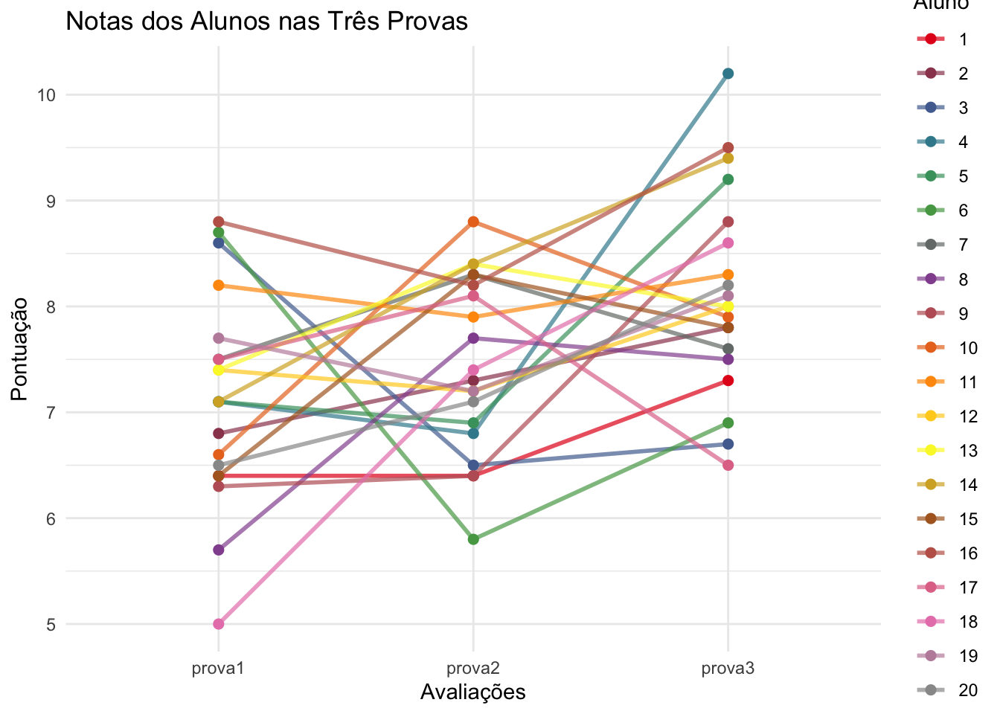


### Teste de normalidade das diferenças (pré-requisito)


``` r
dif12 <- dados$prova1 - dados$prova2
dif13 <- dados$prova1 - dados$prova3
dif23 <- dados$prova2 - dados$prova3

qqnorm(dif12)
qqline(dif12)
```

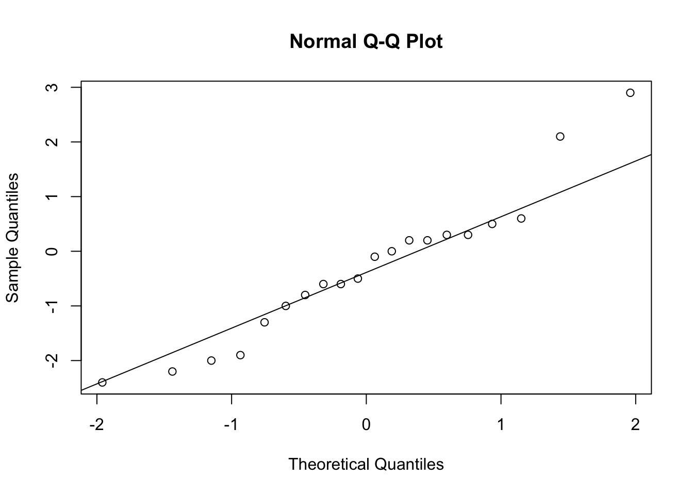

``` r
shapiro.test(dif12)
```

```
## 
## 	Shapiro-Wilk normality test
## 
## data:  dif12
## W = 0.94596, p-value = 0.3099
```

``` r
qqnorm(dif13)
qqline(dif13)
```


``` r
shapiro.test(dif13)
```

```
## 
## 	Shapiro-Wilk normality test
## 
## data:  dif13
## W = 0.96929, p-value = 0.7398
```

``` r
qqnorm(dif23)
qqline(dif23)
```

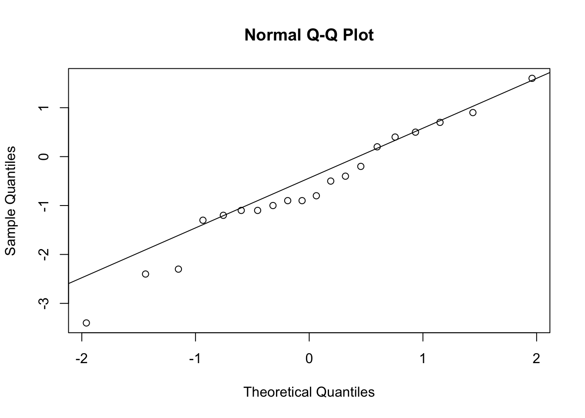

``` r
shapiro.test(dif23)
```

```
## 
## 	Shapiro-Wilk normality test
## 
## data:  dif23
## W = 0.97175, p-value = 0.7914
```

> As diferenças seguem distribuição normal.

### ANOVA de medidas repetidas com afex (testa e corrige esfericidade)

A função `aov_ez()`, do pacote `afex` realiza toda a ANOVA de medidas repetidas de forma prática e automática.


``` r
# Instale se necessário: install.packages("afex")
library(afex)
modelo_afex <- aov_ez(
  id = "aluno",
  dv = "nota",
  within = "prova",
  data = dados_long
)
modelo_afex
```

```
## Anova Table (Type 3 tests)
## 
## Response: nota
##   Effect          df  MSE       F  ges p.value
## 1  prova 1.91, 36.27 0.94 5.53 ** .168    .009
## ---
## Signif. codes:  0 '***' 0.001 '**' 0.01 '*' 0.05 '+' 0.1 ' ' 1
## 
## Sphericity correction method: GG
```

- **Effect**: O fator analisado (`prova`), ou seja, se as notas variam entre as provas.
- **df**: Graus de liberdade. Note que aparecem valores decimais (1.91, 36.27) porque foi aplicada a correção de Greenhouse-Geisser (GG), devido à violação da esfericidade.
- **MSE**: Erro quadrático médio.
- **F**: Estatística F da ANOVA.
- **ges**: Generalized Eta Squared, uma medida de tamanho de efeito.
- **p.value**: Valor de p associado ao teste F. Neste caso, p = 0.009 indica que há diferença significativa entre as médias das provas (p < 0.05).
- **Observação sobre esfericidade:** A linha `Sphericity correction method: GG` informa que o pressuposto de esfericidade foi violado (teste de Mauchly p < 0.05) e, por isso, os graus de liberdade e o valor de p foram corrigidos automaticamente pelo método de Greenhouse-Geisser.

> A análise de variância (ANOVA) mostrou que o fator "prova" teve um efeito significativo sobre as notas (F(1.91, 36.27) = 5.53, p = 0.009, ges = 0.168), indicando que as médias das notas diferem entre as provas.

### Pós-hoc: Comparações múltiplas entre as provas


``` r
# Instale se necessário: install.packages("emmeans")
library(emmeans)
emm <- emmeans(modelo_afex, ~ prova)
pairs(emm, adjust = "bonferroni") # ou "holm", "sidak", etc.
```

```
##  contrast        estimate    SE df t.ratio p.value
##  prova1 - prova2   -0.315 0.300 19  -1.050  0.9212
##  prova1 - prova3   -0.975 0.326 19  -2.993  0.0225
##  prova2 - prova3   -0.660 0.269 19  -2.455  0.0717
## 
## P value adjustment: bonferroni method for 3 tests
```

- **prova1 vs prova2:** Não há diferença significativa (p = 0.9212).
- **prova1 vs prova3:** Diferença significativa (p = 0.0225). As médias dessas provas são estatisticamente diferentes.
- **prova2 vs prova3:** Não há diferença significativa (p = 0.0717).

> A análise revelou que existe diferença significativa nas notas entre as provas. Especificamente, a única diferença significativa foi entre as provas 1 e 3, indicando que as médias dessas avaliações diferem estatisticamente. Entre as demais provas, não foram observadas diferenças significativas após o ajuste de Bonferroni.

 
## Teste de Friedman


``` r
# O teste de Friedman compara as três provas considerando a repetição por aluno
friedman.test(as.matrix(dados[, c("prova1", "prova2", "prova3")]))
```

```
## 
## 	Friedman rank sum test
## 
## data:  as.matrix(dados[, c("prova1", "prova2", "prova3")])
## Friedman chi-squared = 10.101, df = 2, p-value = 0.006405
```

### Pós-teste: Comparações Múltiplas (Wilcoxon pareado)


``` r
pairwise.wilcox.test(
  dados_long$nota,
  dados_long$prova,
  paired = TRUE,
  p.adjust.method = "bonferroni"
)
```

```
## 
## 	Pairwise comparisons using Wilcoxon signed rank test with continuity correction 
## 
## data:  dados_long$nota and dados_long$prova 
## 
##        prova1 prova2
## prova2 0.729  -     
## prova3 0.033  0.087 
## 
## P value adjustment method: bonferroni
```

Após o teste de Friedman indicar que há diferença nas notas das provas, fazemos um pós-teste para descobrir entre quais provas há diferença.

- Apenas **entre Prova 1 e Prova 3 existe diferença significativa** (0.033 < 0.05).
- Entre Prova 1 e 2, e entre Prova 2 e 3, não há diferença significativa (valores maiores que 0.05).

<!--chapter:end:19-Comparacao-mais-de-2grupos.Rmd-->

# Correlação entre variáveis

A correlação é uma forma de medir o grau de relação entre duas variáveis. Quando duas variáveis estão correlacionadas, significa que podemos esperar que, ao mudar uma delas, a outra também sofra alguma alteração. Se ambas aumentam juntas, dizemos que a correlação é positiva; se uma aumenta enquanto a outra diminui, a correlação é negativa.

É importante destacar que a correlação indica apenas que as variáveis variam juntas, mas não prova que uma causa a mudança na outra. Outros fatores podem estar influenciando essa relação, ou pode ser apenas uma coincidência. Por isso, correlação mostra como as variáveis estão relacionadas, mas não estabelece uma relação de causa e efeito.


> Na medicina, um exemplo clássico é investigar a correlação entre o índice de massa corporal (IMC) e a pressão arterial sistólica. Pesquisadores podem avaliar se pessoas com IMC mais elevado tendem a ter pressão arterial mais alta, o que ajuda a entender riscos cardiovasculares.

> Na psicologia, pode-se analisar a correlação entre a pontuação em uma escala de ansiedade (por exemplo, a pontuação total em um questionário) e o número de horas de sono por noite. Essa relação ajuda a compreender como o sono influencia o nível de ansiedade.

> Na educação física, um exemplo é estudar a correlação entre o tempo gasto em atividade física semanal (em horas) e a porcentagem de gordura corporal. Isso auxilia na avaliação do impacto do exercício sobre a composição corporal.

## Tipos de Variáveis
Para analisar correlação, usamos variáveis numéricas (quantitativas ou qualitativas ordinais).

## Diagrama de Dispersão
O diagrama de dispersão é um gráfico que permite visualizar a relação entre duas variáveis. A seguir, exemplos de diferentes padrões de correlação:

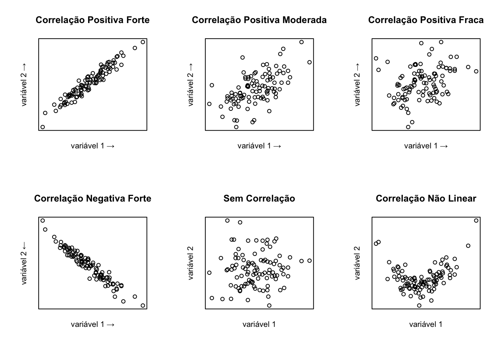

Para criar um gráfico de dispersão no R, você pode usar a função `plot()`. Os argumentos básicos que você deve fornecer entre os parênteses são:

- "x": um vetor numérico com os valores do eixo x (variável independente).
- "y": um vetor numérico com os valores do eixo y (variável dependente).

> Ou seja, algo como: `plot(x,y)`  

## Coeficientes de Correlação

Existem diferentes métodos para medir a correlação entre variáveis, cada um adequado a tipos específicos de dados e relações. Os três tipos mais comuns são: a **correlação de Pearson**, que avalia a relação linear entre variáveis numéricas contínuas; a **correlação de Spearman**, que mede associações monotônicas usando postos, sendo indicada para dados ordinais ou quando a relação não é estritamente linear; e a **correlação de Kendall**, também baseada em postos, que é especialmente útil em amostras pequenas ou com muitos empates nos dados. Conhecer essas diferenças é fundamental para escolher o método mais apropriado em cada situação.

### Coeficiente de Correlação de Pearson

O coeficiente de correlação de **Pearson** ($r$) é utilizado quando se deseja avaliar a relação linear entre duas variáveis quantitativas contínuas. Ele pressupõe que os dados de ambas as variáveis seguem uma **distribuição normal** (ou aproximadamente normal) e que a relação entre elas é linear, ou seja, uma linha reta pode descrever bem o padrão dos dados em um gráfico de dispersão. É sensível a outliers.

### Coeficiente de Correlação de Spearman

O coeficiente de **Spearman** ($\rho$) avalia a força e a direção da associação entre duas variáveis com base em seus **ranks** (postos) em vez dos valores originais. Ele é indicado quando a relação entre as variáveis é **monotônica**, ou seja, conforme uma variável aumenta, a outra também aumenta ou diminui, mas não necessariamente de maneira linear. O Spearman é apropriado para dados que não seguem a normalidade ou para situações em que a relação não pode ser descrita por uma linha reta. Além disso, é menos sensível a outliers do que o Pearson.


### Coeficiente de Correlação de Kendall

O coeficiente de **Kendall** ($\tau$) também se baseia nos postos dos dados, sendo utilizado para medir a força da associação entre duas variáveis. É especialmente útil em situações com **pequenas amostras** ou quando há muitos **empates** nos valores dos dados (valores iguais). Assim como o Spearman, o Kendall não exige normalidade dos dados e é apropriado para relações monotônicas. Em geral, o tau de Kendall é visto como mais robusto em amostras pequenas ou com muitos empates.

### Interpretação dos Coeficientes

O valor a correlação varia de -1 (correlação negativa perfeita) a +1 (correlação positiva perfeita), sendo 0 a ausência de correlação linear. 

| Faixa de valores     | Interpretação    |
|:-------------------------:|:-------------:|
| 0,00 – 0,10          | Desprezível      |
| 0,10 – 0,30          | Fraca            |
| 0,30 – 0,50          | Moderada         |
| 0,50 – 0,70          | Forte            |
| 0,70 – 1,00          | Muito forte      |

### Exemplo no R

Vamos supor que temos os dados de 18 alunos: a quantidade de aulas frequentadas (de um total de 20) e suas notas finais na disciplina de Estatística (de 0 a 10).


``` r
# Vetor de presenças (número de aulas frequentadas)
presencas <- c(20, 18, 17, 19, 15, 16, 20, 18, 17, 19, 14, 15, 12, 16, 20, 13, 17, 18)

# Vetor de notas finais em Estatística
notas <- c(9.8, 9.0, 8.5, 9.5, 7.0, 7.5, 10.0, 8.7, 8.0, 9.2, 6.5, 7.2, 5.0, 7.8, 9.7, 6.0, 8.2, 8.8)
```


``` r
# Para calcular o r de Pearson
cor(presencas, notas, method = "pearson")
```

```
## [1] 0.992563
```

``` r
# Para calcular o rho de Spearman
cor(presencas, notas, method = "spearman")
```

```
## [1] 0.9922299
```

``` r
# Para calular o tau de Kendall
cor(presencas, notas, method = "kendall")
```

```
## [1] 0.9599837
```

``` r
# Dica: dá para abreviar o nome de cada método
# Para calcular o r de Pearson
cor(presencas, notas, method = "p")
```

```
## [1] 0.992563
```

``` r
# Para calcular o rho de Spearman
cor(presencas, notas, method = "s")
```

```
## [1] 0.9922299
```

``` r
#para calular o tau de Kendall
cor(presencas, notas, method = "k")
```

```
## [1] 0.9599837
```

## Testes de Correlação

### Pearson
- H0: $r = 0$ (não há correlação linear entre as variáveis "x" e "y")
- H1: $r \neq 0$ (existe correlação)

``` r
cor.test(presencas, notas, method = "pearson")
```

```
## 
## 	Pearson's product-moment correlation
## 
## data:  presencas and notas
## t = 32.615, df = 16, p-value = 4.597e-16
## alternative hypothesis: true correlation is not equal to 0
## 95 percent confidence interval:
##  0.9796700 0.9972906
## sample estimates:
##      cor 
## 0.992563
```

O teste de correlação de Pearson realizado entre as variáveis `presencas` e `notas` apresentou os seguintes resultados:

- **t = 32.615**:  
  Este é o valor do teste t calculado, que indica uma diferença extremamente significativa entre a correlação observada e a hipótese nula (correlação igual a zero). Quanto maior o valor de t, maior a evidência contra a hipótese nula.

- **df = 16**:  
  Refere-se aos graus de liberdade do teste, calculados por (n - 2), onde n é o número de pares de dados analisados. Neste caso, indica que havia 18 observações.

- **p-value = 4.597e-16**:  
  O valor-p extremamente baixo mostra que a probabilidade de obter uma correlação tão forte por acaso é praticamente nula. Portanto, a correlação é estatisticamente significativa.

- **alternative hypothesis: true correlation is not equal to 0**:  
  A hipótese alternativa testada é de que existe alguma correlação (positiva ou negativa) diferente de zero entre as variáveis.

- **95 percent confidence interval: 0.9796700 a 0.9972906**:  
  O intervalo de confiança indica que, com 95% de certeza, o valor real da correlação populacional entre `presencas` e `notas` está entre aproximadamente 0,98 e 0,997. Isso é considerado uma correlação extremamente forte.

- **sample estimates: cor = 0.992563**:  
  O coeficiente de correlação de Pearson ($r$) observado foi de 0,99, indicando uma relação positiva, muito forte e praticamente perfeita: quanto maior o número de presenças, maior tende a ser a nota.

**Resumo:**  
Os resultados mostram uma associação positiva fortíssima e estatisticamente significativa entre presenças e notas, sugerindo que alunos que frequentam mais tendem a obter notas mais altas.

### Spearman
- H0: $\rho = 0$ (não há correlação entre as variáveis "x" e "y")
- H1: $\rho \neq 0$ (existe correlação)

``` r
cor.test(presencas, notas, method = "spearman")
```

```
## 
## 	Spearman's rank correlation rho
## 
## data:  presencas and notas
## S = 7.5293, p-value = 6.52e-16
## alternative hypothesis: true rho is not equal to 0
## sample estimates:
##       rho 
## 0.9922299
```

O teste de correlação de Spearman realizado entre as variáveis `presencas` e `notas` apresentou os seguintes resultados:

- **S = 7.5293**:  
  Este é o valor da estatística de teste S, usada no cálculo da correlação de Spearman. Ele reflete as diferenças nas posições (ranks) entre as duas variáveis analisadas.

- **p-value = 6.52e-16**:  
  O valor-p extremamente baixo indica que a probabilidade de observar uma correlação tão alta por acaso, caso não exista correlação real, é praticamente nula. Portanto, a correlação encontrada é estatisticamente significativa.

- **alternative hypothesis: true rho is not equal to 0**:  
  A hipótese alternativa do teste é de que o coeficiente de Spearman ($\rho$) é diferente de zero, ou seja, existe uma associação monotônica entre as variáveis.

- **sample estimates: rho = 0.9922299**:  
  O coeficiente de correlação de Spearman observado foi de 0,99, indicando uma relação positiva, extremamente forte, entre `presencas` e `notas`. Isso significa que, à medida que o número de presenças aumenta, as notas tendem a aumentar de forma consistente, mesmo que a relação não seja perfeitamente linear.

**Resumo:**  
Os resultados demonstram uma associação positiva e muito forte entre presenças e notas, estatisticamente significativa. Isso sugere que alunos com mais presenças tendem a obter notas mais altas, mesmo considerando possíveis variações não lineares na relação entre as variáveis.

### Kendall
- H0: $\tau = 0$ (não há correlação entre as variáveis "x" e "y")
- H1: $\tau \neq 0$ (existe correlação)

``` r
cor.test(presencas, notas, method = "kendall")
```

```
## 
## 	Kendall's rank correlation tau
## 
## data:  presencas and notas
## z = 5.3952, p-value = 6.844e-08
## alternative hypothesis: true tau is not equal to 0
## sample estimates:
##       tau 
## 0.9599837
```

O teste de correlação de Kendall realizado entre as variáveis `presencas` e `notas` apresentou os seguintes resultados:

- **z = 5.3952**:  
  Este é o valor da estatística z calculado para o teste de Kendall. Valores de z elevados indicam forte evidência contra a hipótese nula de ausência de associação entre as variáveis.

- **p-value = 6.844e-08**:  
  O valor-p extremamente baixo indica que a probabilidade de obter uma correlação tão alta por acaso é praticamente nula. Portanto, a associação observada entre as variáveis é estatisticamente significativa.

- **alternative hypothesis: true tau is not equal to 0**:  
  A hipótese alternativa do teste é de que o coeficiente de Kendall ($\tau$) é diferente de zero, ou seja, existe uma associação monotônica entre as variáveis.

- **sample estimates: tau = 0.9599837**:  
  O coeficiente de correlação de Kendall ($\tau$) encontrado foi de 0,96, indicando uma associação positiva, muito forte, entre `presencas` e `notas`. Isso significa que, à medida que o número de presenças aumenta, as notas também tendem a aumentar de forma consistente, mesmo considerando possíveis empates (valores iguais) entre as observações.

**Resumo:**  
Os resultados mostram uma associação positiva e extremamente forte entre presenças e notas, estatisticamente significativa. Isso sugere que alunos com mais presenças tendem a obter notas mais altas, mesmo considerando a ordem dos dados e possíveis empates nas avaliações.

## Tamanho do Efeito (Effect Size)

Em estudos de correlação, o **tamanho do efeito** é representado pelo valor absoluto do coeficiente de correlação (por exemplo, Pearson, Spearman ou Kendall). Isso significa que consideramos apenas a intensidade da relação entre as variáveis, independentemente de ser positiva ou negativa.

Por exemplo, tanto um coeficiente de +0,65 quanto de -0,65 indicam um tamanho de efeito de 0,65. Quanto mais próximo de 1 (ou -1), mais forte é a correlação; quanto mais próximo de 0, mais fraca.

## Cálculo do Tamanho da Amostra e Poder Estatístico

### Exemplo com `pwr`
Calcular o tamanho da amostra necessário para detectar uma correlação de 0,4 com poder de 80% e α = 0,05:


``` r
library(pwr)
pwr.r.test(r = 0.4, power = 0.8, sig.level = 0.05, alternative = "two.sided")
```

```
## 
##      approximate correlation power calculation (arctangh transformation) 
## 
##               n = 45.91614
##               r = 0.4
##       sig.level = 0.05
##           power = 0.8
##     alternative = two.sided
```

### Verificar o poder para uma amostra de tamanho 30:


``` r
pwr.r.test(n = 30, r = 0.4, sig.level = 0.05, alternative = "two.sided")
```

```
## 
##      approximate correlation power calculation (arctangh transformation) 
## 
##               n = 30
##               r = 0.4
##       sig.level = 0.05
##           power = 0.6075135
##     alternative = two.sided
```

## Outros recursos 


Para explorar um pouco mais o estudo de correlação, vamos usar o banco de dados `iris`, que já vem instalado por padrão no R.

O dataset `iris` é um conjunto de dados clássico em estatística e aprendizado de máquina (*machine learning*). Ele contém 150 observações de flores de íris de três espécies diferentes: *setosa*, *versicolor* e *virginica*. As variáveis numéricas são:

- **Sepal.Length:** comprimento da sépala (em centímetros), a sépala é a parte externa da flor, que protege os botões florais.

- **Sepal.Width:** largura da sépala (em centímetros).

- **Petal.Length:** comprimento da pétala (em centímetros), as pétalas são as partes geralmente coloridas da flor.

- **Petal.Width:** largura da pétala (em centímetros).

Estas medidas são úteis para estudar relações entre características morfológicas das flores.

### Visualização com `pairs()`

A função `pairs()` mostra uma matriz de gráficos de dispersão, útil para observar visualmente correlações entre todas as variáveis numéricas.


``` r
pairs(iris[, 1:4])
```


A função `pairs` no R gera uma matriz de gráficos de dispersão mostrando a relação entre todas as variáveis numéricas de um conjunto de dados. Cada gráfico da matriz compara duas variáveis diferentes:

- Cada linha e cada coluna representam uma variável.
- Os gráficos mostram como cada variável se relaciona com as outras: por exemplo, a relação entre Sepal.Length e Petal.Length.
- Quando os pontos formam uma linha inclinada, isso indica uma correlação (positiva ou negativa) entre as variáveis.
- Se os pontos estão espalhados, sem padrão, indica pouca ou nenhuma relação.
- A diagonal mostra o nome de cada variável.

Assim, ao olhar para a matriz, você consegue visualizar rapidamente quais variáveis têm relação entre si e qual é o tipo dessa relação (mais forte, mais fraca, positiva ou negativa).

### Matriz de Correlação com `cor()`

A função `cor()` calcula a matriz de correlação entre variáveis numéricas. A seguir, uma matriz com correlação de Pearson:


``` r
# use o método adequado method = "pearson";  method = "spearman" ou method = "kendall"
cor(iris[, 1:4], method = "pearson")
```

```
##              Sepal.Length Sepal.Width Petal.Length Petal.Width
## Sepal.Length    1.0000000  -0.1175698    0.8717538   0.8179411
## Sepal.Width    -0.1175698   1.0000000   -0.4284401  -0.3661259
## Petal.Length    0.8717538  -0.4284401    1.0000000   0.9628654
## Petal.Width     0.8179411  -0.3661259    0.9628654   1.0000000
```

A matriz de correlação é uma tabela que mostra os coeficientes de correlação entre todas as combinações possíveis de variáveis numéricas em um conjunto de dados. Cada valor da matriz indica o grau de associação linear entre um par de variáveis. A diagonal principal sempre apresenta o valor 1, pois cada variável é perfeitamente correlacionada com ela mesma. Assim, a matriz de correlação permite identificar rapidamente quais variáveis estão mais relacionadas entre si, facilitando a análise exploratória dos dados. Observe que essa matriz é simétrica


### Matriz Visual com `GGally::ggcorr()`

O `ggcorr()` do pacote `GGally` mostra graficamente os coeficientes de correlação, com intensidade e direção representadas por cor.


``` r
# Instale os pacotes se necessário:
# install.packages("GGally")
# install.packages("ggplot2")

# Matriz de correlação tipo heatmap com valores destacados
ggcorr(
  data = iris[, 1:4],
  method = c("everything", "pearson"), # calcula todas as correlações de Pearson
  label = TRUE,             # mostra os coeficientes nas células
  label_round = 2,          # arredonda os valores para 2 casas decimais
  label_size = 5,           # tamanho do texto dos coeficientes
  hjust = 0.5,              # centraliza os rótulos nas células
  layout.exp = 2,           # expande o tamanho das células
  low = "#D73027",          # cor para correlação negativa forte
  mid = "white",            # cor para correlação nula
  high = "#3366CC"          # cor para correlação positiva forte
) +
  ggtitle("Matriz de Correlação de Pearson - iris (Heatmap)") +
  theme_minimal(base_size = 14) + # visual minimalista e tamanho de fonte maior
  theme(
    plot.title = element_text(hjust = 0.5, face = "bold"), # centraliza e destaca o título
    axis.text.x = element_text(angle = 45, vjust = 1, hjust = 1) # gira rótulos do eixo x para melhor leitura
  )
```

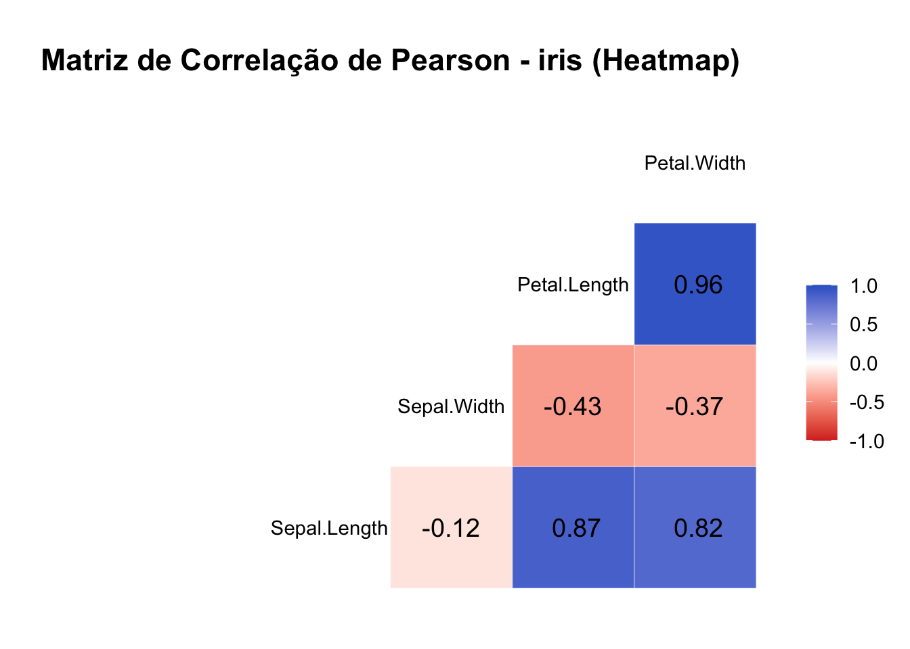

A função `ggpairs()` combina histogramas, correlações e gráficos de dispersão em uma visualização integrada.

Este comando cria uma matriz de gráficos que facilita visualizar a distribuição e a relação entre as variáveis numéricas do conjunto. É muito útil para identificar padrões, tendências, outliers e possíveis correlações antes de uma análise estatística mais aprofundada.

- **Considerando todos os dados:**

``` r
GGally::ggpairs(iris, columns = 1:4)
```

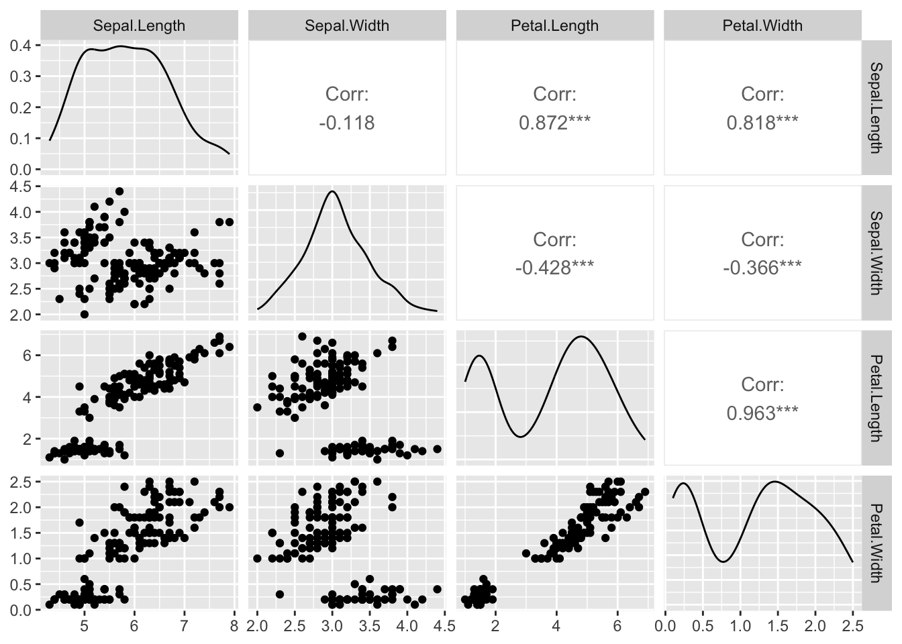

- **Considerando as categorias de especies (variável Species)**

``` r
GGally::ggpairs(iris, columns = 1:4, aes(color = Species))
```

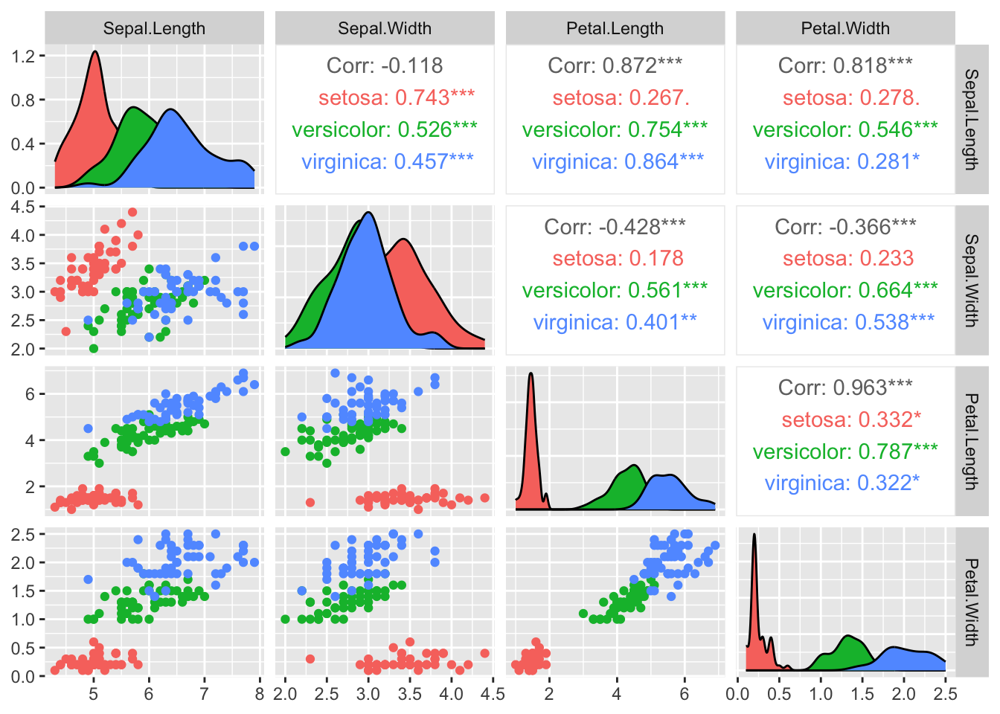

**O que a figura mostra?**

Esta figura é uma **matriz de gráficos de pares** (pairs) das variáveis numéricas do conjunto de dados, nesse caso, `Sepal.Length`, `Sepal.Width`, `Petal.Length` e `Petal.Width`.

- **Diagonal principal**: exibe a distribuição de cada variável individualmente, usando histogramas ou curvas de densidade. Quando os dados estão divididos por categoria (como diferentes espécies no exemplo do iris), cada cor representa uma categoria distinta, permitindo visualizar e comparar facilmente como os valores da variável se distribuem em cada grupo.

- **Abaixo da diagonal**: mostra gráficos de dispersão, permitindo observar visualmente as relações entre os pares de variáveis para cada espécie.

- **Acima da diagonal**: apresenta os **coeficientes de correlação** para cada par de variáveis:
  - O valor principal (exemplo: Corr: 0.872***) corresponde à correlação considerando todas as espécies juntas.
  - Abaixo, aparecem as correlações **por espécie**:
    - setosa (vermelho)
    - versicolor (verde)
    - virginica (azul)
  - Os valores são coloridos conforme a espécie correspondente.

- **Sobre os asteriscos**: os asteriscos após os valores de correlação indicam o **nível de significância estatística** do coeficiente calculado, ou seja, quão provável é que a correlação observada seja diferente de zero apenas pelo acaso. A convenção usual é:

- `*` : p < 0,05 
- `**` : p < 0,01 
- `***` : p < 0,001
- Sem asteriscos: correlação **não** significativa

<!--chapter:end:20-Correlacao.Rmd-->

# Regressão

A **regressão** é uma técnica estatística usada para estudar a relação entre uma variável de interesse (chamada de variável dependente ou resposta) e uma ou mais variáveis que podem influenciá-la (chamadas de variáveis independentes ou preditoras). O objetivo principal é **prever** ou **explicar** o comportamento da variável resposta a partir das informações das variáveis preditoras.

**Regressão Linear Simples:**  
É o tipo mais básico de regressão, analisando a relação entre duas variáveis: uma resposta (por exemplo, peso) e uma preditora (por exemplo, altura). A relação é representada por uma linha reta:  
\[
\text{Resposta} = a + b \times \text{Preditora}
\]  
Exemplo: Prever o peso de uma pessoa a partir de sua altura. O modelo estima qual seria o peso esperado para cada altura.

**Regressão Linear Múltipla:**  
Quando queremos analisar o efeito de duas ou mais variáveis preditoras sobre a variável resposta, usamos a regressão linear múltipla. A equação fica:  
\[
\text{Resposta} = a + b_1 \times \text{Preditora}_1 + b_2 \times \text{Preditora}_2 + \ldots
\]  
Exemplo: Prever o preço de uma casa considerando área, número de quartos e localização.

**Regressão Logística:**  
É usada quando a resposta é categórica, por exemplo: sim/não, doente/sadio, aprovado/reprovado. Em vez de prever um número, ela estima a probabilidade de um determinado evento ocorrer. Exemplo: Prever a chance de um paciente ter uma certa doença com base em exames. O resultado é sempre um valor entre 0 e 1 (uma probabilidade).

**Outros Modelos de Regressão:**  
Além dos modelos acima, existem outros tipos de regressão para diferentes situações, como:  
- Regressão de Poisson: para contagem de eventos (exemplo: número de acidentes por mês);
- Regressão de Prais-Winsten: utilizada em séries temporais, especialmente quando os dados têm dependência ao longo do tempo (como dados econômicos mensais);
- Regressão polinomial: ajusta curvas em vez de retas, para relações não-lineares;
- Regressão robusta, Ridge, Lasso: abordam problemas específicos como dados com valores extremos ou quando há muitas variáveis preditoras.

Em resumo, a regressão é uma ferramenta poderosa e versátil, útil em diferentes áreas como saúde, economia, educação e ciências sociais. Ela nos ajuda a compreender relações, prever resultados e tomar decisões baseadas em dados, mesmo sem precisar de conhecimentos avançados em matemática.

## Regressão Linear Simples 

A correlação responde à pergunta: **"Existe relação linear? Qual a força e o sentido dessa relação?"**

A **regressão linear simples** vai além: além de indicar se existe relação, ela fornece uma equação que **quantifica e permite prever** uma variável a partir da outra.  
A equação tem a forma:

\[
Y = a + bX
\]

onde:
- **Y**: variável resposta (dependente)
- **X**: variável explicativa (independente)
- **a**: intercepto (valor esperado de Y quando X = 0)
- **b**: inclinação (quanto Y varia, em média, a cada unidade de X)

A regressão responde à pergunta: **"Como prever Y a partir de X?"**

É comum estudar primeiro a correlação, pois ela mostra se vale a pena tentar ajustar um modelo de regressão linear.


### Regressão Linear Simples no R

Como exemplo, vamos estudar a relação entre a **frequência cardíaca** (x, em batimentos por minuto - bpm) e o **comprimento do intervalo QT** (y, em milissegundos) de um eletrocardiograma (ECG). O intervalo QT representa o tempo que o coração leva para se despolarizar e repolarizar, sendo um importante marcador clínico.

Vamos considerar a seguinte amostra: 


``` r
# Frequência cardíaca (bpm)
x <- c(60,75,62,68,84,97,66,65,86,78,93,75,88)
# Intervalo QT (ms)
y <- c(403,363,381,367,341,317,401,384,342,377,329,377,349)
```

Vamos, primeiro, verificar o comportamento das variáveis pelo gráfio de dispersão:


``` r
plot(x, y, 
     xlab = "Frequência Cardíaca (bpm)", 
     ylab = "Intervalo QT (ms)", 
     pch = 19, col = "blue")
grid()
```

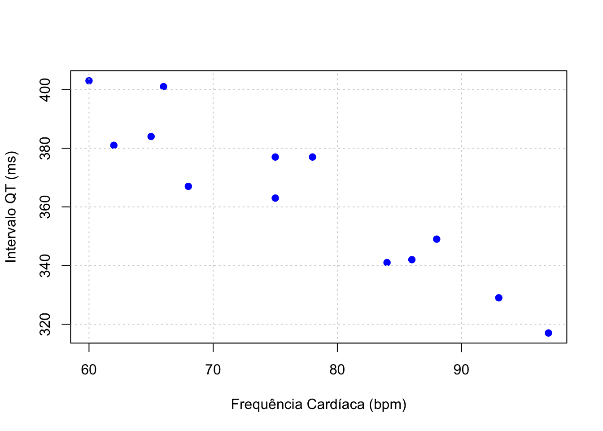

O teste de correlação nos fornece:


``` r
# antes, verifique a normalidade das variáveis 
cor.test(x, y) # Teste estatístico da correlação
```

```
## 
## 	Pearson's product-moment correlation
## 
## data:  x and y
## t = -8.2944, df = 11, p-value = 4.625e-06
## alternative hypothesis: true correlation is not equal to 0
## 95 percent confidence interval:
##  -0.9787673 -0.7730054
## sample estimates:
##        cor 
## -0.9285203
```

- **Coeficiente de correlação (r):** -0,93
- **Valor de t:** -8,29
- **Graus de liberdade (df):** 11
- **Valor-p:** 0,0000046
- **Intervalo de confiança (95%):** de -0,98 a -0,77

O que isso significa?

- **Força e direção:** O coeficiente de correlação de Pearson (**r = -0,93**) indica uma **correlação negativa muito forte** entre as variáveis x e y. Isso significa que, à medida que uma variável aumenta, a outra tende a diminuir de forma bastante consistente.
- **Significância estatística:** O valor-p (**p < 0,001**) mostra que essa correlação é **estatisticamente significativa**. Ou seja, é extremamente improvável que essa relação forte e negativa tenha ocorrido por acaso.
- **Intervalo de confiança:** O intervalo de -0,98 a -0,77 indica que, com 95% de confiança, a verdadeira correlação na população está dentro desse intervalo — sempre indicando uma relação negativa forte.
- **Hipótese nula:** Como o valor-p é muito pequeno, rejeitamos a hipótese nula de que não existe correlação linear entre x e y.

Como há uma correlação linear forte e significativa, **faz sentido estudar um modelo de regressão linear** para quantificar e prever a relação entre essas variáveis.


Para ajustarmos um modelo onde o intervalo QT é explicado pela frequência cardíaca no R, usamos a função `lm()`, onde lm significa *linear model*.


``` r
regressao <- lm(y ~ x)
regressao
```

```
## 
## Call:
## lm(formula = y ~ x)
## 
## Coefficients:
## (Intercept)            x  
##     520.668       -2.044
```
O modelo ajustado de regressão linear simples foi:

\[
\text{Intervalo QT} = 520,67 - 2,04 \times \text{Frequência Cardíaca}
\]

**Interpretação dos coeficientes:**

- **Intercepto (520,67):**  
  Este valor representa a estimativa do intervalo QT (em milissegundos) quando a frequência cardíaca (x) é zero. Embora uma frequência cardíaca de zero não faça sentido fisiológico, o intercepto é necessário para construir a reta de regressão e serve como referência matemática.

- **Inclinação (-2,04):**  
  Esse coeficiente indica que, para cada aumento de 1 batimento por minuto (bpm) na frequência cardíaca, o intervalo QT diminui, em média, cerca de 2,04 milissegundos.  
  Ou seja, existe uma relação negativa: quanto maior a frequência cardíaca, menor tende a ser o intervalo QT.

O resumo da regressão é obtido a partir da função `summary()`


``` r
summary(regressao)
```

```
## 
## Call:
## lm(formula = y ~ x)
## 
## Residuals:
##     Min      1Q  Median      3Q     Max 
## -14.689  -5.418  -2.900   8.188  15.750 
## 
## Coefficients:
##             Estimate Std. Error t value Pr(>|t|)    
## (Intercept) 520.6683    19.1158  27.238 1.90e-11 ***
## x            -2.0438     0.2464  -8.294 4.63e-06 ***
## ---
## Signif. codes:  0 '***' 0.001 '**' 0.01 '*' 0.05 '.' 0.1 ' ' 1
## 
## Residual standard error: 10.38 on 11 degrees of freedom
## Multiple R-squared:  0.8622,	Adjusted R-squared:  0.8496 
## F-statistic:  68.8 on 1 and 11 DF,  p-value: 4.625e-06
```

- **Valor-p para ambos os coeficientes (p < 0,001):** Os dois coeficientes são  significativos, ou seja, existe evidência estatística muito forte de que ambos são diferentes de zero.

- **R² (Multiple R-squared): 0,86:** Aproximadamente 86% da variação do intervalo QT é explicada pela frequência cardíaca. É um valor alto, indicando que o modelo ajusta bem os dados.
- **R² Ajustado (0,85):** Leva em conta o número de variáveis e tamanho da amostra, e também é alto.
- **Erro padrão residual (Residual standard error: 10,38):** Mede o desvio médio dos pontos em relação à reta ajustada (quanto menor, melhor).

- **Resíduos:** Representam a diferença entre os valores observados e os previstos pelo modelo. Os valores mínimos e máximos indicam a dispersão dos erros.

- **F-statistic: 68,8, p-value: 4,6e-06:** Teste global do modelo, confirma que a relação encontrada é altamente significativa.

O modelo de regressão linear simples mostra que existe uma **forte relação linear negativa** e estatisticamente significativa entre a frequência cardíaca e o intervalo QT: quanto maior a frequência cardíaca, menor tende a ser o intervalo QT. O modelo explica a maior parte da variação dos dados, sendo útil para previsões e interpretações clínicas dessa relação.

O intervalos de confiança para os coeficientes da reta é dado por: 


``` r
confint(regressao)
```

```
##                  2.5 %     97.5 %
## (Intercept) 478.594702 562.741896
## x            -2.586164  -1.501475
```

- **Intercepto (a):**  
  O intervalo de confiança de 95% para o intercepto vai de **478,59** a **562,74**. Isso significa que, com 95% de confiança, o verdadeiro valor do intercepto está dentro desse intervalo. O intercepto representa o valor estimado do intervalo QT quando a frequência cardíaca é zero (valor teórico/matemático).

- **Inclinação (b):**  
  O intervalo de confiança de 95% para a inclinação vai de **-2,59** a **-1,50**. Como o intervalo é totalmente negativo, reforça que a relação entre frequência cardíaca e intervalo QT é negativa: a cada aumento de 1 bpm na frequência cardíaca, o intervalo QT diminui, em média, entre 1,50 e 2,59 ms.
  

**Limitações e Cuidados na Regressão Linear**

Apesar do modelo indicar uma associação significativa, é importante considerar algumas limitações e pontos de atenção:

- **Extrapolação:** O modelo é válido apenas para a faixa de dados observados. Prever valores de QT para frequências cardíacas muito fora do intervalo observado pode gerar resultados sem sentido.
- **Suposições do modelo:**  
  - **Linearidade:** A relação entre as variáveis deve ser aproximadamente linear.
  - **Normalidade dos resíduos:** Os resíduos (erros) devem ser aproximadamente distribuídos normalmente.
  - **Homoscedasticidade:** A variância dos resíduos deve ser constante ao longo dos valores previstos.
  - **Independência:** As observações devem ser independentes entre si.
  Recomenda-se sempre checar essas suposições usando gráficos de resíduos e testes estatísticos.
- **Possíveis valores extremos (outliers):** Valores muito diferentes dos demais podem influenciar fortemente o ajuste, distorcendo os resultados.
- **Correlação não implica causalidade:** A regressão mostra associação, mas não garante que uma variável causa a outra.

### O que deve ser checado ao ajustar uma regressão linear?

- **Gráfico de resíduos:** Para avaliar linearidade, homoscedasticidade e detectar outliers.
- **Histograma/QQ-plot dos resíduos:** Para verificar a normalidade dos resíduos.
- **Verificar influências:** Avaliar se algum ponto influencia demais o resultado (diagnóstico de outliers/influência).
- **Intervalos de confiança:** Analisar a precisão das estimativas dos parâmetros.
- **R² e R² ajustado:** Avaliar o quanto do comportamento da variável resposta é explicado pelo modelo.

## Regressão Linear Múltipla

Depois de entender a regressão linear simples, é fácil expandir para a **regressão linear múltipla**, onde podemos incluir mais de uma variável preditora para explicar a variável resposta. No nosso exemplo, além da **frequência cardíaca (x)**, vamos acrescentar a **idade dos indivíduos (z)**, que também pode influenciar o intervalo QT do eletrocardiograma (y).

Vamos supor os seguintes valores de idade para os mesmos indivíduos:


``` r
# Frequência cardíaca (bpm)
x <- c(60,75,62,68,84,97,66,65,86,78,93,75,88)
# Intervalo QT (ms)
y <- c(403,363,381,367,341,317,401,384,342,377,329,377,349)
# Idade (anos) - exemplo hipotético
z <- c(25,40,30,22,53,60,28,27,50,35,59,41,55)
```

Vamos ajustar agora um modelo que considera tanto a frequência cardíaca quanto a idade como preditoras do intervalo QT:

- O modelo ajustado tem a forma:
  \[
  \text{QT} = a + b_1 \times \text{Frequência Cardíaca (x)} + b_2 \times \text{Idade (z)}
  \]


``` r
regressao_multipla <- lm(y ~ x + z)
summary(regressao_multipla)
```

```
## 
## Call:
## lm(formula = y ~ x + z)
## 
## Residuals:
##     Min      1Q  Median      3Q     Max 
## -16.055  -5.737  -2.952   8.566  15.082 
## 
## Coefficients:
##             Estimate Std. Error t value Pr(>|t|)    
## (Intercept) 514.3929    37.2473  13.810 7.72e-08 ***
## x            -1.8827     0.8466  -2.224   0.0504 .  
## z            -0.1505     0.7534  -0.200   0.8457    
## ---
## Signif. codes:  0 '***' 0.001 '**' 0.01 '*' 0.05 '.' 0.1 ' ' 1
## 
## Residual standard error: 10.87 on 10 degrees of freedom
## Multiple R-squared:  0.8627,	Adjusted R-squared:  0.8352 
## F-statistic: 31.42 on 2 and 10 DF,  p-value: 4.88e-05
```

**Modelo ajustado:**  
\[
\text{QT} = 514,39 - 1,88 \times \text{Frequência Cardíaca (x)} - 0,15 \times \text{Idade (z)}
\]

- **Intercepto (514,39):**  
  Valor estimado do QT quando frequência cardíaca e idade são zero (valor teórico, apenas referência matemática).

- **Frequência Cardíaca (x):**  
  O coeficiente é -1,88, ou seja, para cada aumento de 1 bpm, o QT diminui em média 1,88 ms, mantendo a idade constante.  
  O valor-p (0,0504) é limítrofe, indicando que a influência da frequência cardíaca sobre o QT **ainda é significativa**, mas no limite do nível de significância tradicional (5%).

- **Idade (z):**  
  O coeficiente é -0,15, ou seja, para cada aumento de 1 ano de idade, o QT diminui, em média, 0,15 ms, mantendo a frequência cardíaca constante.  
  No entanto, o valor-p (0,8457) mostra que essa associação **não é estatisticamente significativa** — ou seja, não há evidência de que a idade tenha efeito relevante sobre o QT neste conjunto de dados.

> Qualidade do ajuste

- **R² (0,86):**  
  Aproximadamente 86% da variação do QT é explicada pelo modelo com as duas variáveis preditoras, indicando bom ajuste.
- **R² ajustado (0,83):**  
  Leva em conta o número de variáveis, também indicando bom ajuste.
- **Erro padrão residual (10,87):**  
  Média dos desvios dos pontos em relação à reta ajustada, semelhante ao modelo simples.

> Análise dos resíduos

- A distribuição dos resíduos sugere que o modelo está adequado, mas sempre é recomendado visualizar os gráficos de resíduos para avaliar possíveis violações das suposições.

> Teste F

- **F-statistic: 31,42, p-value: 4,88e-05:**  
  O modelo como um todo é altamente significativo, ou seja, pelo menos uma das variáveis preditoras está relacionada ao QT.

> Conclusão

- O modelo de **regressão múltipla** mostra que, **mantendo a idade constante**, a frequência cardíaca segue sendo um preditor importante e significativo para o intervalo QT.
- A idade, por outro lado, **não contribuiu de forma significativa** para explicar o QT nesse exemplo.
- O ajuste da regressão múltipla no R é simples e a interpretação amplia a compreensão das relações entre várias variáveis e a resposta.  
- **Importante:** Sempre verifique as suposições do modelo e a significância de cada preditor.

## No R é fácil

A sintaxe para ajustar a regressão múltipla é muito parecida com a da simples, basta acrescentar as variáveis ao modelo:

```r
lm(y ~ x + z, data = dados)
```
Se quiser incluir ainda mais variáveis, basta adicioná-las na fórmula, separadas por `+`.

> Visualização dos resíduos

É importante, como sempre, checar os resíduos para garantir que as suposições do modelo continuam válidas:


``` r
plot(regressao_multipla)
```

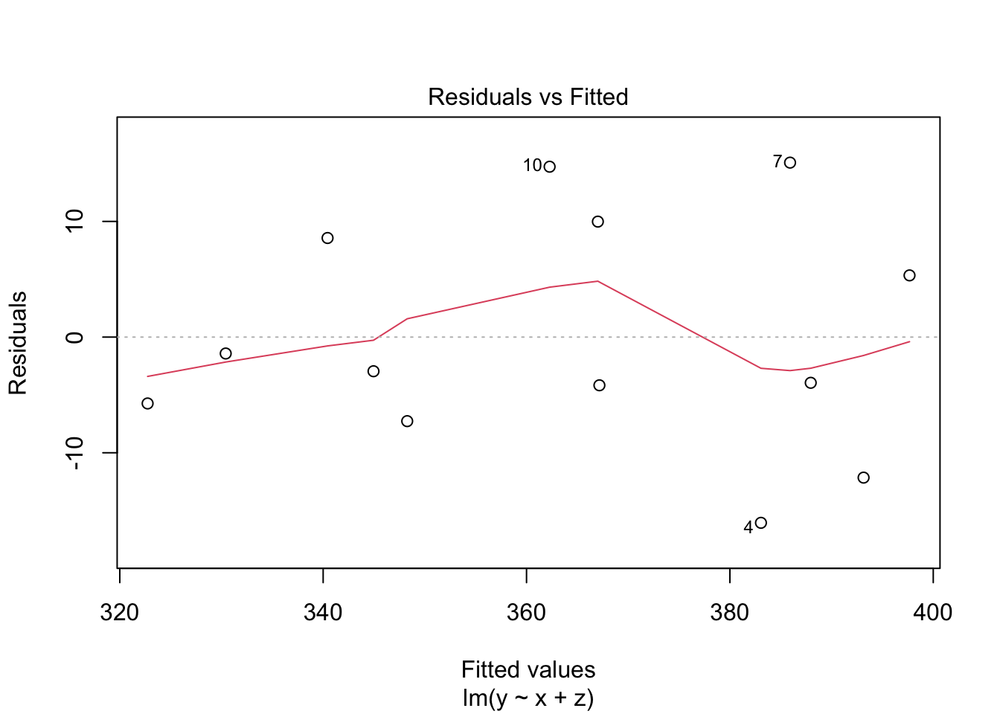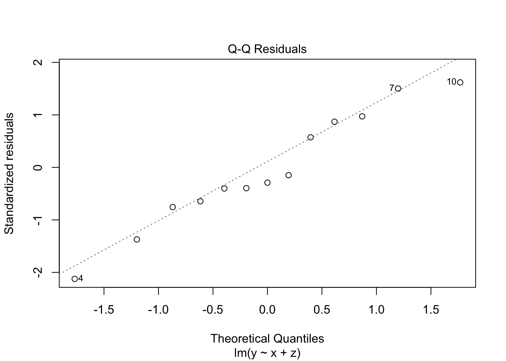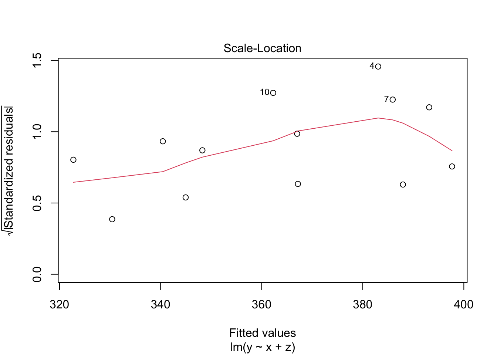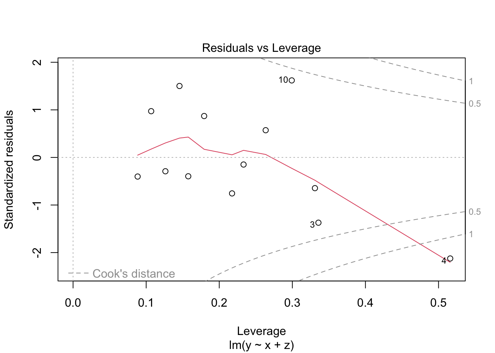

> Resíduos vs Valores Ajustados

- **Objetivo:** Avaliar linearidade e homocedasticidade (variância constante dos resíduos).
- **Interpretação:** Os resíduos estão distribuídos de forma aproximadamente aleatória ao redor de zero, sem padrões claros. Isso sugere que a relação linear é adequada e que a variância dos resíduos é razoavelmente constante. Não há grandes evidências de problemas de ajuste, ainda que um ou outro ponto se afaste mais do centro (possíveis outliers).

> Q-Q Plot dos Resíduos

- **Objetivo:** Verificar se os resíduos seguem uma distribuição normal (suposição importante para testes de hipóteses na regressão).
- **Interpretação:** Os pontos seguem bem a linha reta, indicando que a normalidade dos resíduos é atendida na maior parte dos casos. Pequenos desvios nas extremidades são toleráveis, especialmente com amostras pequenas, como neste exemplo.

> Scale-Location (Homocedasticidade)

- **Objetivo:** Avaliar se a variância dos resíduos é constante para todos os valores ajustados (homocedasticidade).
- **Interpretação:** Os pontos estão relativamente dispersos de forma homogênea ao longo do eixo dos valores ajustados, sem formar um funil ou padrão crescente/decrescente marcante. Isso reforça que a suposição de homocedasticidade está sendo atendida.

> Resíduos Padronizados vs Leverage

- **Objetivo:** Identificar pontos com alto potencial de influência no modelo (outliers ou observações influentes).
- **Interpretação:** A maioria dos pontos está dentro dos limites aceitáveis de leverage e resíduos. Apenas um ou dois pontos apresentam valores de leverage mais altos, mas sem exceder drasticamente os limites de distância de Cook. Isso sugere que não há observações extremamente influentes comprometendo o modelo.

Os diagnósticos gráficos indicam que:
- **As suposições do modelo de regressão múltipla estão razoavelmente bem atendidas:** linearidade, normalidade dos resíduos, homocedasticidade e ausência de pontos influentes extremos.
- **O modelo é adequado para os dados analisados**, com apenas leves indícios de possíveis outliers, mas sem comprometer as conclusões.

## Exercício

O exercício "nutrientes em cereais matinais" foi retirado do livro Estatística Básica de Larson & Farber. 

A *U.S. Food and Drug Administration* (FDA) exige a rotulagem nutricional para a maioria dos alimentos. Sob os regulamentos da FDA, os produtores são obrigados a listar as quantidades de certos nutrientes em seus alimentos, tais como: calorias, açúcar, gordura e carboidratos. Essa informação nutricional é exibida em uma tabela na embalagem do alimento.

A Tabela mostra o teor nutricional para uma xícara de 21 cereais matinais diferentes.

*C* = calorias  
*S* = açúcar em gramas  
*F* = gordura em gramas  
*R* = carboidratos em gramas  

| C   | S  | F   | R  |
|-----:|:----:|:-----:|:----|
| 100 | 12 | 0.5 | 25 |
| 130 | 11 | 1.5 | 29 |
| 110 | 10 | 1.0 | 29 |
| 130 | 15 | 2.0 | 31 |
| 130 | 13 | 1.5 | 29 |
| 120 |  3 | 0.5 | 26 |
| 100 |  2 | 0.0 | 24 |
| 120 |  0 | 0.0 | 29 |
| 150 | 16 | 1.5 | 31 |
| 110 |  4 | 0.0 | 25 |
| 110 | 12 | 1.0 | 23 |
| 160 | 15 | 1.5 | 35 |
| 150 | 12 | 2.0 | 36 |
| 150 | 15 | 1.5 | 29 |
| 110 | 15 | 0.0 | 29 |
| 190 | 13 | 1.5 | 45 |
| 100 |  3 | 0.0 | 23 |
| 120 |  4 | 0.5 | 23 |
| 120 | 11 | 1.5 | 28 |
| 120 | 11 | 1.0 | 29 |
| 130 |  5 | 0.5 | 29 |


**1.** Use o R para obter um diagrama de dispersão dos seguintes pares \((x, y)\) no conjunto de dados.

(a) (Calorias, açúcar.)  
(b) (Calorias, gordura.)  
(c) (Calorias, carboidratos.)  
(d) (Açúcar, gordura.)  
(e) (Açúcar, carboidratos.)  
(f) (Gordura, carboidratos.)


**2.** Dos diagramas de dispersão no Exercício 1, quais pares de variáveis parecem ter uma correlação linear forte?


**3.** Use o R para encontrar o coeficiente de correlação para cada par de variáveis no Exercício 1. Qual tem a correlação linear mais forte?


**4.** Use tecnologia para encontrar a equação de uma reta de regressão para os seguintes pares de variáveis.

(a) (Calorias, açúcar.)  
(b) (Calorias, carboidratos.)


**5.** Use os resultados do Exercício 4 para prever o seguinte:

(a) O teor de açúcar de uma xícara de cereal que tem 120 calorias.  
(b) O teor de carboidrato de uma xícara de cereal que tem 120 calorias.


**6.** Use tecnologia para encontrar as equações de regressão múltipla dos seguintes modelos:

(a) \( C = b + m_1S + m_2F + m_3R \)  
(b) \( C = b + m_1S + m_2R \)


**7.** Use as equações do Exercício 6 para prever as calorias em 1 xícara de cereal que tem 7 gramas de açúcar; 0,5 grama de gordura e 31 gramas de carboidratos.

<!--chapter:end:21-Regressao.Rmd-->


# Associação entre variáveis

Testes de associação são usados para verificar se existe uma relação estatisticamente significativa entre duas variáveis categóricas. A escolha do teste depende do tipo de variável e do tamanho da amostra.

A aplicação desses testes é fundamental em diversas áreas do conhecimento. 

## Tipos de Variáveis Envolvidas

Os testes de associação são aplicados principalmente a **variáveis qualitativas nominais**, como:

- Sexo (Masculino, Feminino)
- Presença de Doença (Sim, Não)

## Tabela de Contingência

Uma **tabela de contingência** é uma ferramenta estatística utilizada para organizar e analisar a relação entre duas (ou mais) variáveis categóricas. Ela apresenta a distribuição conjunta das frequências observadas de cada combinação possível dos níveis das variáveis, facilitando a identificação de possíveis associações entre elas.

**Exemplo:**

Considere uma pesquisa em que se investiga a associação entre sexo e presença de uma determinada doença em uma amostra de pessoas:

|              | Doença: Sim | Doença: Não | Total |
|--------------|:-------------:|:-------------:|:-------:|
| Masculino    |      8      |      7      |  15   |
| Feminino     |      5      |     10      |  15   |
| **Total**    |     13      |     17      |  30   |

Cada célula da tabela mostra o número de pessoas de cada sexo que têm ou não têm a doença, permitindo analisar se existe associação entre essas variáveis.

### Cálculo das Frequências Esperadas

As **frequências esperadas** são valores teóricos que indicam quantas ocorrências seriam esperadas em cada célula de uma tabela de contingência caso não houvesse associação entre as variáveis (ou seja, se fossem independentes). Elas são fundamentais para a realização do teste qui-quadrado de independência.

**Como calcular?**

Para cada célula da tabela de contigência (frequências observadas), usamos a seguinte conta:

\[
\text{Frequência Esperada} = \frac{\text{Total da Linha} \times \text{Total da Coluna}}{\text{Total Geral}}
\]


- O “Total da Linha” é o total de pessoas daquela linha (por exemplo, todos os homens).

- O “Total da Coluna” é o total de pessoas daquela coluna (por exemplo, todos que têm a doença).

- O “Total Geral” é o total de pessoas da tabela toda.


**Da tabela de contigência do exemplo anterior, podemos efetuar os cálculos**

1. **Masculino, Doença: Sim**
   \[
   \frac{15 \times 13}{30} = \frac{195}{30} = 6,5
   \]

2. **Masculino, Doença: Não**
   \[
   \frac{15 \times 17}{30} = \frac{255}{30} = 8,5
   \]

3. **Feminino, Doença: Sim**
   \[
   \frac{15 \times 13}{30} = 6,5
   \]

4. **Feminino, Doença: Não**
   \[
   \frac{15 \times 17}{30} = 8,5
   \]

Então, nesse caso a tabela de frequências esperadas é dada por:

|              | Doença: Sim | Doença: Não | Total da linha |
|--------------|:-------------:|:-------------:|:---------------:|
| Masculino    |     6,5     |     8,5     |      15       |
| Feminino     |     6,5     |     8,5     |      15       |
| **Total da coluna** |   13       |    17       |      30       |

A tabela acima mostra as frequências que seriam esperadas em cada célula caso não existisse associação entre sexo e presença de doença.

A essência dos testes de associação é comparar a tabela de frequências observadas (com os dados reais coletados) com a tabela de frequências esperadas (calculada considerando que não exista relação entre as variáveis, ou seja, que sejam independentes). A tabela observada mostra quantas vezes cada combinação de categorias realmente aconteceu, enquanto a tabela esperada mostra quantas vezes cada combinação seria esperada ao acaso. O teste avalia se as diferenças entre o que foi observado e o que seria esperado são grandes o suficiente para indicar uma associação entre as variáveis. Portanto, a comparação entre essas duas tabelas está no centro da análise para determinar se existe ou não uma relação significativa entre as variáveis estudadas.

Na prática, todos esses cálculos acontecem nos bastidores, pois utilizamos ferramentas computacionais que realizam automaticamente tanto o cálculo das frequências esperadas quanto a comparação com os valores observados. Assim, normalmente não precisamos calcular manualmente cada valor esperado ou montar todas as tabelas. No entanto, é fundamental compreender o conceito central dos testes de associação: eles servem para comparar o que foi realmente observado com o que seria esperado caso não houvesse relação entre as variáveis, ajudando a identificar se existe ou não uma associação significativa entre elas.


## Principais Testes de Associação

É importante destacar que existem diversos métodos estatísticos para analisar a associação entre variáveis categóricas, dependendo do tipo de dados e da estrutura da tabela de contingência.

Além dos tradicionais teste qui-quadrado e teste exato de Fisher, há outros métodos que podem ser aplicados conforme a situação:  
- O **teste G** (ou teste da razão de verossimilhança) é uma alternativa ao qui-quadrado, baseado em outra abordagem matemática, mas com objetivo semelhante.  
- O **teste de McNemar** é indicado para tabelas 2x2 com dados pareados, como em estudos antes e depois.  
- O **teste de Mantel-Haenszel** avalia a associação entre variáveis, controlando possíveis fatores de confusão por meio da estratificação, sendo muito usado em estudos epidemiológicos.  
- O **teste de tendência linear de Cochran-Armitage** é recomendado quando as categorias possuem uma ordem natural e se deseja avaliar a existência de tendência linear entre elas.  
- Existem ainda o **teste de concordância Kappa de Cohen**, que mede o grau de concordância entre avaliadores, e o **teste exato de Barnard**, alternativa ao teste de Fisher em tabelas 2x2.

A escolha do teste adequado depende do tamanho da amostra, da distribuição dos dados, do tipo de variável (nominal ou ordinal), da estrutura dos dados (independentes ou pareados) e do objetivo da análise.


### Exemplos 

**Exemplo na Medicina:**  

Investigar se há associação entre o sexo do paciente (masculino/feminino) e a presença de hipertensão (sim/não).  

- **Variáveis:** Sexo (masculino, feminino) e hipertensão (sim, não)  

- **Aplicação:** Monta-se uma tabela de contingência 2x2 e aplica-se o teste de associação para verificar se a proporção de hipertensos difere entre os sexos.


**Exemplos na Psicologia**

Verificar se existe associação entre tipo de terapia utilizada (cognitivo-comportamental, psicanalítica, humanista) e desfecho do tratamento (melhorou/não melhorou) em pacientes.  

- **Variáveis:** Tipo de terapia (três categorias) e desfecho (melhorou, não melhorou)  

- **Aplicação:** Monta-se uma tabela de contingência 3x2 e aplica-se o teste associação para analisar se o tipo de terapia está associado ao desfecho.


**Exemplo na Educação Física** 

Analisar se há associação entre a participação em atividades extracurriculares (sim/não) e o nível de aptidão física (baixo/médio/alto) em estudantes do ensino médio.  

- **Variáveis:** Participação em atividades (sim, não) e aptidão física (baixo, médio, alto)  

- **Aplicação:** Cria-se uma tabela de contingência 2x3 e utiliza-se o teste de associação para verificar se a aptidão física difere conforme a participação em atividades extracurriculares.


### Teste Qui-Quadrado

O teste **qui-quadrado** ($\chi^2$) é um dos métodos mais utilizados para avaliar se existe associação entre duas variáveis categóricas. Ele funciona comparando as frequências observadas nas células de uma tabela de contingência com as frequências que seriam esperadas caso não houvesse relação entre as variáveis.

- **Hipótese nula ($H_0$):** Não existe associação entre as variáveis “x” e “y”, ou seja, elas são independentes.
- **Hipótese alternativa ($H_1$):** Existe associação entre as variáveis.

**Principais requisitos:**

- A amostra deve ser aleatória.

- Pelo menos 80% das células da tabela devem ter frequência esperada igual ou superior a 5.

- Nenhuma célula deve ter frequência esperada igual a zero.

> **Observação:** Nenhuma célula deve ter frequência esperada igual a zero porque, no teste qui-quadrado, a fórmula envolve dividir pela frequência esperada. Se algum valor esperado for zero, não é possível fazer a divisão, pois divisão por zero é indefinida. Além disso, uma frequência esperada igual a zero indica que, teoricamente, aquela combinação de categorias não deveria ocorrer nunca, o que torna os cálculos e os resultados do teste estatístico inválidos ou sem sentido. Por isso, é importante garantir que todas as células tenham valores esperados maiores que zero para que o teste seja matematicamente correto e confiável.

O teste qui-quadrado pode ser aplicado em tabelas maiores que 2x2.

### Teste Exato de Fisher

O **teste exato de Fisher** é recomendado quando os tamanhos das amostras são pequenos ou quando as frequências esperadas em alguma célula da tabela são menores que 5, situação em que o teste qui-quadrado pode não ser confiável.

- **Hipótese nula ($H_0$):** Não existe associação entre as variáveis “x” e “y”, ou seja, elas são independentes.
- **Hipótese alternativa ($H_1$):** Existe associação entre as variáveis.

- É mais conservador do que o qui-quadrado, pois calcula a probabilidade exata de ocorrência das frequências observadas.

- Tradicionalmente, é utilizado para tabelas 2x2 (dois grupos e duas categorias), mas pode ser estendido a tabelas maiores com recursos computacionais.

- Não depende das condições de frequência esperada mínima.

### Exemplo no R

Vamos analisar se há associação entre sexo (Masculino/Feminino) e presença de doença (Sim/Não) com os seguintes dados, da tabela de contingência que foi mencionada anteriormente:

|              | Doença: Sim | Doença: Não |  
|--------------|:-----------:|:-----------:|  
| Masculino    |      8      |      7      |  
| Feminino     |      5      |     10      |  


Essa tabela pode ser repassada diretamente para o R:


``` r
# Crie a matriz de dados
tabela <- matrix(c(8, 7,       # observe o uso de matrix() e c()
                   5, 10),     # observe os parentes  
                 nrow = 2,     # numero de linhas 
                 byrow = TRUE) # você está informando por linhas (by row)
                 
# é opcional, mas ficará mais claro que se você nomear 
# as linhas (row) e colunas (col) da sua tabela
colnames(tabela) <- c("Doença: Sim", "Doença: Não")
rownames(tabela) <- c("Masculino", "Feminino")

# Veja como ficou a tabela
tabela
```

```
##           Doença: Sim Doença: Não
## Masculino           8           7
## Feminino            5          10
```

Para fazer o teste Qui-quadrado no R usamos `chisq.test()`:


``` r
# Aplicando o teste qui-quadrado
resultado <- chisq.test(tabela)

# Veja o resultado
resultado
```

```
## 
## 	Pearson's Chi-squared test with Yates' continuity correction
## 
## data:  tabela
## X-squared = 0.54299, df = 1, p-value = 0.4612
```

O resultado apresentado refere-se ao teste qui-quadrado de Pearson com a correção de continuidade de Yates, usada para tabelas 2x2:

A **correção de continuidade de Yates** é um ajuste aplicado ao teste qui-quadrado em tabelas 2x2 para evitar superestimação da significância estatística, especialmente em amostras pequenas. Ela consiste em diminuir a diferença entre os valores observados e esperados antes de calcular o qui-quadrado, tornando o teste mais conservador.

- **X-squared**: Valor do qui-quadrado calculado $\chi^2 = 0,543$.  
- **df**: Graus de liberdade (1), determinado pelo número de linhas e colunas da tabela.  O cálculo é feito pela fórmula:  
  **df = (número de linhas – 1) × (número de colunas – 1)**.  
  No exemplo, temos 2 linhas e 2 colunas: (2–1) × (2–1) = 1.
- **p-value**: Valor de p (0,4612)

Como o valor de p é 0,4612 (maior do que o nível de significância de 0,05), **não há evidências suficientes para rejeitar a hipótese nula**. Portanto, não foi encontrada associação estatisticamente significativa entre sexo e presença de doença nessa amostra.


E, caso queira vizualizar as tabelas de valores observados e esperados basta fazer o seguinte: 


``` r
# Exibir os valores observados
resultado$observed
```

```
##           Doença: Sim Doença: Não
## Masculino           8           7
## Feminino            5          10
```

``` r
# Exibir os valores esperados
resultado$expected
```

```
##           Doença: Sim Doença: Não
## Masculino         6.5         8.5
## Feminino          6.5         8.5
```

> **Observação:** Se alguma frequência esperada for menor que 5, o R emitirá um alerta. Nesses casos, considere usar o teste exato de Fisher:
>
> ```r
> fisher.test(tabela)
> ```

Por, exemplos se substituirmos o 7 por 1, teremos

```
##           Doença: Sim Doença: Não
## Masculino           8           1
## Feminino            5          10
```

```
## Warning in chisq.test(tabela2): Chi-squared approximation may be incorrect
```

```
## 
## 	Pearson's Chi-squared test with Yates' continuity correction
## 
## data:  tabela2
## X-squared = 4.9343, df = 1, p-value = 0.02633
```

```
## 
## 	Fisher's Exact Test for Count Data
## 
## data:  tabela2
## p-value = 0.01306
## alternative hypothesis: true odds ratio is not equal to 1
## 95 percent confidence interval:
##    1.30156 774.69430
## sample estimates:
## odds ratio 
##   14.06912
```
- **p-value = 0.01306:** O valor de p é menor que 0,05, indicando que existe uma associação estatisticamente significativa entre as duas variáveis analisadas. Isso significa que a chance de observarmos essa diferença (ou uma diferença maior) apenas por acaso é de aproximadamente 1,3%.

- **Odds ratio = 14.07:** A razão de chances estimada é 14 vezes maior em um grupo do que no outro, sugerindo uma associação forte entre as categorias das variáveis.

- **Intervalo de confiança (1,30 a 774,69):** O intervalo de confiança de 95% mostra que a razão de chances verdadeira, na população, pode variar de cerca de 1,3 até 774,7. Como esse intervalo não inclui o valor 1, reforça-se a evidência de associação.

### Observação sobre tabelas de contingência em artigos científicos

Quando lemos um artigo que apresenta uma **tabela de contingência** (por exemplo, uma tabela cruzando sexo e presença de doença), estamos vendo exatamente a amostra utilizada pelo autor, com a distribuição real dos indivíduos nos diferentes grupos. Isso é diferente do que ocorre em testes de comparação de médias (como t-teste) ou correlação, onde geralmente temos acesso apenas a medidas-resumo (como média, desvio-padrão, coeficiente de correlação), e não aos dados individuais.

Nesse sentido, **ter a tabela de contingência é praticamente o mesmo que ter os dados brutos** dos autores, pois conhecemos exatamente a quantidade de participantes em cada combinação de categorias. Isso possibilita que qualquer leitor possa refazer os cálculos dos testes estatísticos (como o qui-quadrado ou Fisher) e, inclusive, explorar outras análises categóricas de interesse.

Em resumo, a tabela de contingência oferece um grau de transparência e reprodutibilidade muito maior do que apenas apresentar medidas-resumo, pois expõe toda a estrutura dos dados da amostra analisada.


## Tamanho do Efeito: Medidas de Associação

Ao realizar testes de independência como o Qui-Quadrado ou o teste exato de Fisher para tabelas de contingência, é importante não apenas analisar o p-valor, mas também quantificar o tamanho do efeito, ou seja, a força da associação entre as variáveis categóricas.

A seguir são mostradas as principais medidas de tamanho de efeito. 

### V de Cramer

- **Descrição**: mede a intensidade da associação entre duas variáveis categóricas. Varia de 0 (nenhuma associação) a 1 (associação perfeita).
- **Uso**: Indicado para tabelas de contingência de qualquer dimensão.

**Fórmula:**
\[
V = \sqrt{\frac{\chi^2}{n(k-1)}}
\]

- \(\chi^2\) = valor do teste Qui-Quadrado

- \(n\) = total de observações

- \(k\) = menor número entre linhas ou colunas

**No R:**

``` r
library(rcompanion)
cramerV(tabela)
```

```
## Cramer V 
##   0.2018
```
ou

``` r
library(DescTools)
CramerV(tabela)
```

```
## [1] 0.2018018
```

###  Phi de Pearson $(\phi)$

- **Descrição**: Medida de associação para tabelas 2x2. Varia de 0 a 1.
- **Uso**: Exclusivo para tabelas 2x2.

**Fórmula:**
\[
\phi = \sqrt{\frac{\chi^2}{n}}
\]

**No R:**

``` r
library(DescTools)
Phi(tabela)
```

```
## [1] 0.2018018
```

Interpretação dos valores:

- **V de Cramer**:
  - Pequeno: ~ 0,1
  - Moderado: ~ 0,3
  - Forte: ~ 0,5 ou mais

- **Phi**: Interpretação semelhante ao V de Cramer para 2x2.

No exemplo, o valor obtido para o **V de Cramer** ou **Phi** foi de **0,20**. De acordo com os critérios usuais para essa medida, valores em torno de 0,1 indicam associação pequena, valores próximos de 0,3 associação moderada e valores a partir de 0,5 associação forte entre as variáveis analisadas.

Além disso, como o teste estatístico realizado (por exemplo, Qui-Quadrado ou Fisher) indicou que **não há associação significativa** entre as variáveis (p>0,05), o resultado do V de Cramer reforça essa conclusão. Um valor de 0,20 sugere uma associação fraca, e como não há significância estatística, não se pode afirmar que exista uma relação relevante entre as variáveis na população estudada.

### Odds Ratio (Razão de Chances)

- **Descrição**: O Odds Ratio (OR) mede a força da associação entre dois eventos em tabelas 2x2, comparando as chances (odds) de um evento ocorrer em dois grupos diferentes. Ele indica se a ocorrência do evento em um grupo é mais, menos ou igualmente provável em relação ao outro grupo.

- **Uso**: Teste de Fisher e tabelas 2x2.

Considere a estrutura da tabela 2x2:

|                   | Evento Presente | Evento Ausente |
|-------------------|:-----------------:|:---------------:|
| **Grupo 1**       | a               | b             |
| **Grupo 2**       | c               | d             |

Então odds ratio (OR), pode ser facilmente calculado: 

\[
OR = \frac{a \times d}{b \times c}
\]

Onde:

- **a** = número de casos com o evento presente no Grupo 1  
- **b** = número de casos com o evento ausente no Grupo 1  
- **c** = número de casos com o evento presente no Grupo 2  
- **d** = número de casos com o evento ausente no Grupo 2  

A interpretação do OR é a seguinte:

- **OR = 1:**  
  Não há diferença entre os grupos. O evento tem a mesma chance de acontecer no Grupo 1 e no Grupo 2.  
  **Exemplo:** Se o OR for 1, os dois grupos têm risco igual para o evento.

- **OR > 1:**  
  O evento é mais provável no **Grupo 1** do que no Grupo 2.  
  **Exemplo:** Se o OR for 2, o Grupo 1 tem o dobro de chance do evento comparado ao Grupo 2.

- **OR < 1:**  
  O evento é menos provável no **Grupo 1** do que no Grupo 2.  
  **Exemplo:** Se o OR for 0,5, o Grupo 1 tem metade da chance do evento comparado ao Grupo 2.

  
**No R:**

``` r
fisher.test(tabela)$estimate
```

```
## odds ratio 
##    2.22194
```


O **odds ratio (OR)** calculado foi de **2,22**.

- O OR compara as chances de ocorrência da doença entre os grupos "Masculino" e "Feminino".

- **OR = 2,22** indica que as chances de um indivíduo do sexo masculino ter a doença são aproximadamente **2,2 vezes maiores** do que as chances de um indivíduo do sexo feminino.

- Em outras palavras, a doença é mais provável entre os homens do que entre as mulheres neste conjunto de dados.


Ou usando o pacote `epitools`:

``` r
# install.packages("epitools")
library(epitools)
oddsratio(tabela)
```

```
## $data
##           Doença: Sim Doença: Não Total
## Masculino           8           7    15
## Feminino            5          10    15
## Total              13          17    30
## 
## $measure
##                         NA
## odds ratio with 95% C.I. estimate    lower    upper
##                Masculino 1.000000       NA       NA
##                Feminino  2.203004 0.498955 10.60706
## 
## $p.value
##            NA
## two-sided   midp.exact fisher.exact chi.square
##   Masculino         NA           NA         NA
##   Feminino   0.3007786    0.4621374  0.2690235
## 
## $correction
## [1] FALSE
## 
## attr(,"method")
## [1] "median-unbiased estimate & mid-p exact CI"
```


- O odds ratio (OR) indica que as chances de "Doença: Sim" são cerca de 2,2 vezes maiores no grupo **Masculino** em relação ao grupo **Feminino**.

- O intervalo de confiança (IC) de 95% para o OR do grupo Feminino é de 0,50 a 10,61, o que inclui o valor 1. Isso sugere que esta diferença **não é estatisticamente significativa**.

- Valores de p

| Grupo     | midp.exact | fisher.exact | chi.square |
|-----------|:------------:|:--------------:|:------------:|
| Feminino  |  0,3008    |   0,4621     |  0,2690    |

- Todos os valores de p são **maiores do que 0,05**, indicando que não há associação estatisticamente significativa entre sexo e presença de doença nesta amostra.

- O uso da função `oddsratio()` do pacote `epitools` mostrou um OR de 2,2 para o grupo masculino, mas essa diferença (entre os grupos feminino e masculino) não é estatisticamente significativa. Isso significa que, com base nesses dados, não se pode concluir que há uma associação real entre sexo e presença de doença.

## Cálculo do Poder Estatístico

O poder estatístico pode ser estimado usando o pacote `pwr`, útil para calcular tamanho de efeito ou tamanho de amostra necessário.


``` r
# Exemplo para efeito 0,2, alfa = 0.05 e N = 30 (OBSERVE o N em MAIÚSCULO, tamanho da amostra)
pwr.chisq.test(w = 0.2, df = 1, N = 30, sig.level = 0.05)
```

```
## 
##      Chi squared power calculation 
## 
##               w = 0.2
##               N = 30
##              df = 1
##       sig.level = 0.05
##           power = 0.1947752
## 
## NOTE: N is the number of observations
```

- **w (tamanho do efeito):**
  - Representa o tamanho do efeito, w é igual ao V de Cramer

- **df (graus de liberdade):**
  - Indica o número de graus de liberdade do teste.
  - Em uma tabela de contingência, é calculado como:  
    (número de linhas – 1) × (número de colunas – 1)
  - Exemplo: Para uma tabela 2x2, df = (2-1) × (2-1) = 1

Com uma amostra de 30 indivíduos, tentando detectar um efeito pequeno (w = 0,2) em um teste do qui-quadrado com 1 grau de liberdade e nível de significância de 5%, o poder do teste é de apenas cerca de **19,5%**.

Isso significa que, se realmente existir uma associação do tamanho especificado entre as variáveis, o teste só terá cerca de 19,5% de chance de detectar essa associação (ou seja, rejeitar a hipótese nula corretamente).

**Em geral, recomenda-se um poder estatístico de pelo menos 80%** (0,8) para que o teste tenha boa chance de detectar uma associação real. Portanto, **com essa configuração, o teste está subdimensionado (pouco poder)** para detectar efeitos pequenos.

<!--chapter:end:22-Associacao.Rmd-->


# Referências {-}


<script src="https://unpkg.com/@lottiefiles/lottie-player@latest/dist/lottie-player.js"></script>
<lottie-player src="https://assets8.lottiefiles.com/private_files/lf30_rklapo5f.json"  background="transparent"  speed="1"  style="width: 300px; height: 300px;"  loop  autoplay></lottie-player>


- **Cohen, J. (1988).** Statistical Power Analysis for the Behavioral Sciences (2nd ed.). Lawrence Erlbaum Associates.

- **Field, A. (2013).** Discovering Statistics Using IBM SPSS Statistics (4th ed.). Sage.

- **Romano, J., Kromrey, J. D., Coraggio, J., & Skowronek, J. (2006).** Appropriate statistics for ordinal level data: Should we really be using t-test and Cohen’s d for evaluating group differences on the NSSE and other surveys? *Annual Meeting of the Florida Association of Institutional Research*, Jacksonville, FL, USA.

- **Cliff, N. (1993).** Dominance statistics: Ordinal analyses to answer ordinal questions. *Psychological Bulletin, 114*(3), 494-509. https://doi.org/10.1037/0033-2909.114.3.494

<!--chapter:end:23-Referencias.Rmd-->

